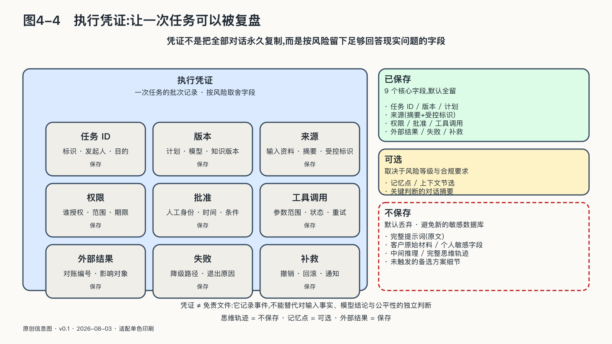

## 运行循环：看见过程，也要核验结果

传统监控擅长回答服务是否在线、延迟多高、错误码有多少。Agent即使所有接口都返回成功，也可能完成了错误任务，使用了错误资料，或把正确结果发给错误的人。

运行观测必须沿完整任务展开。OpenTelemetry的生成式AI语义约定已经开始统一模型调用、Token、Agent跨度和工具执行等字段，使不同组件的轨迹有机会被连接起来。相关规范仍在演进，而且完整提示、工具参数和返回值可能包含高度敏感内容；“能够记录”不等于“应该永久保存”。[^p1-otel-genai]

一份可用的执行凭证至少连接以下事实：任务由谁发起，目的是什么；使用哪个Agent、模型、提示、知识与工具版本；输入来自哪里；获得什么权限；哪些地方发生重试、降级或人工批准；改变了哪些外部状态；最终结果是否由外部系统确认。

执行凭证不等于保存完整思维轨迹。模型生成的内部推理既可能包含敏感内容，也未必是对真实因果的可靠说明。更稳妥的记录对象是可核验事实：受控资料标识与版本、工具调用范围和结果状态、策略决定、批准身份与时间、外部动作的业务编号、失败与补偿。

观测还必须通向行动。重要告警需要负责人、响应时限和可执行措施。如果发现工具调用量异常，却没人能够暂停；如果看见重复付款，却只能给Agent增加一句提醒，日志只是事故直播。

运行循环应至少呈现五种能力：

- 看得见：任务、身份、来源、组件版本、工具与外部状态能够关联。
- 管得住：数据、资金、时间、工具和委托深度按风险受限，高风险动作穿过独立规则或人工检查。
- 停得下：能取消任务、撤回凭证、暂停单个工具，把系统降到只读或转由人工接管。
- 退得回：关键状态有快照，重复调用尽量幂等，系统版本能够回退，已经发生的业务后果有补偿路径。
- 说得清：争议发生时，组织能够基于当时的任务、依据和批准说明发生了什么，而不是让模型事后生成一段看似合理的解释。

接口返回“退款成功”，不代表客户已经收到钱；模型说“任务完成”，也不等于任务契约已经满足。AgenticOps必须把轨迹继续延伸到现实结果。
