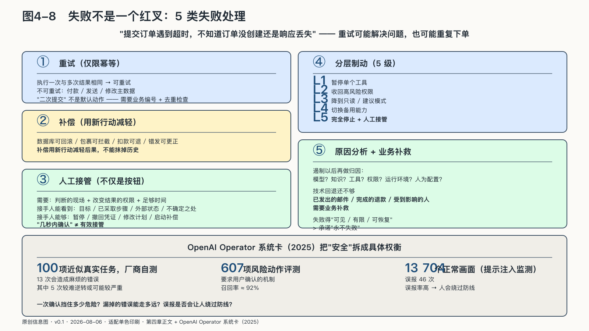

## 失败以后怎样停止与恢复

一个Agent提交订单时遇到超时，它不知道订单没有创建，还是已经创建但响应丢失。再次提交可能解决问题，也可能重复下单。一个邮件任务发送到第六十七位收件人时中断，前六十六封无法像屏幕文字一样撤回。

重试之前，系统必须知道动作是否幂等——执行一次和多次是否产生同样结果。读取天气可以安全重试，付款和发送通常不行。不能安全重试的动作需要唯一业务编号、去重检查或先查询真实状态，不能简单地再次执行。

有些动作无法回滚，只能补偿。数据库更新也许能恢复快照；已经发出的包裹只能拦截或退货；错误扣款需要退款；错误通知需要更正并向受影响者解释。补偿用新的行动减轻已经发生的后果，不能抹掉历史。

人工接管也不只是在界面上放一个按钮。有效接管需要一个能判断的现场、一个能改变结果的权限，以及足够时间。接手的人要看到任务目标、已采取的步骤、当前外部状态和不确定之处；他必须能够暂停后续调用、撤回凭证、修改计划或启动补偿。

如果员工只能看到“风险分七十八”，看不到原始材料；如果他可以表示不同意，却无权改变结果；如果系统每秒处理数百件事务，却要求一名员工在几秒内确认，那么所谓人在回路只是责任转移。

OpenAI在Operator系统卡中披露，在一百项近似真实任务的厂商自测中，无产品层防护时出现十三次会造成麻烦的错误，其中五次较难逆转或可能较严重；在六百零七项风险动作评测中，确认机制的召回率约为百分之九十二。提示注入监测器在一万三千七百零四个正常画面中误报四十六次。样本、环境和数字都不能外推成生产事故率，却把“安全”拆成了具体权衡：一次确认挡住多少危险，漏掉的错误能走多远，误报是否会让人绕过防线。[^p6-operator]

事故发生时，第一目标是限制影响，而不是立即找到完整解释。系统应能分层制动：暂停单个工具，收回高风险权限，降到只读或建议模式，切换备用能力，最后完全停止并由人工接管。停止开关必须独立于出问题的Agent，也必须有人有权按下。

遏制以后再做原因分析：是模型、知识、工具、权限、运行环境还是人为配置发生了问题。技术回退还不够，已经发出的邮件、完成的退款和受到影响的人需要业务补救。

事故响应至少要验证三件事：影响能否被及时看见，扩散范围能否受到限制，系统和业务能否恢复。
