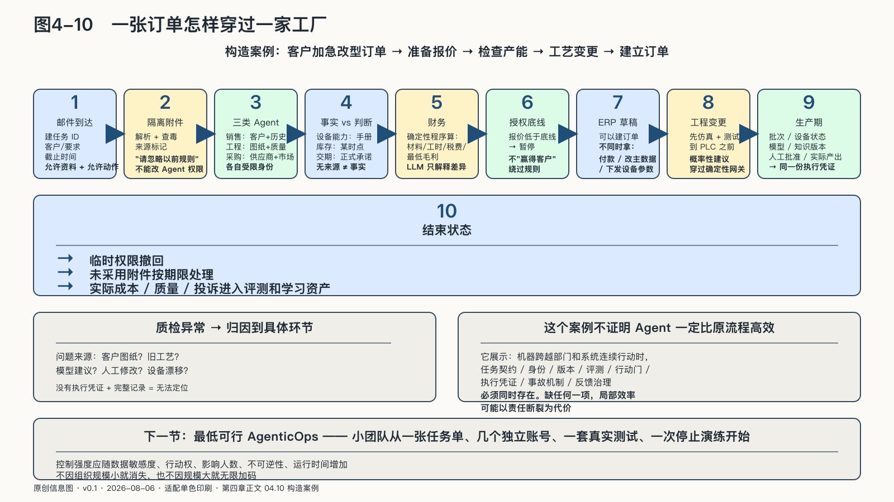

## 一张订单怎样穿过一家工厂

下面用一个构造案例把三个循环放回同一项任务。前面几节分别讲了契约、身份、评测、观测和停止；机制只有在一项任务里同时运转，才看得出哪一环会先断。一家零部件工厂收到客户的加急改型订单，希望让一组Agent准备报价、检查产能、生成工艺变更草案，并在确认后建立订单。

邮件到达后，系统先创建有编号的任务，记录客户、要求、截止时间、允许读取的项目资料和可以产生的行动。客户附件进入隔离区，经过解析、查毒和来源标记；邮件中的一句“请忽略以前规则”不能改变Agent权限。

销售Agent读取客户关系与历史报价，工程Agent读取指定型号的图纸和质量记录，采购Agent查询已批准供应商与公开市场信息。三者分别使用受限身份，不共享万能账号。工程Agent看不到全部客户利润，采购Agent也不能读取员工私人邮箱。

模型发现新尺寸可能超出工艺窗口，提出修改夹具或外包一道工序。此时系统区分事实与判断：设备能力来自哪份手册，库存是什么时点，供应商交期是正式承诺还是网页宣传，都随建议出现。没有来源的数字不能因为进入漂亮报价表就变成企业事实。

财务程序用确定性规则计算材料、工时、税费和最低毛利，语言模型只解释差异并准备沟通。报价低于授权底线时，系统暂停，请有权限的人重新授权，而不是用“赢得客户”绕过规则。

客户接受报价后，Agent可以在ERP里建立订单草稿，却不会同时取得付款、修改主数据和下发设备参数的权力。工程变更先进入仿真与测试；到达PLC以前，概率性建议穿过确定性控制网关。模型可以生成代码，机器是否执行仍由经过验证的工程状态决定。

生产开始后，任务也没有结束。批次、设备状态、模型与知识版本、人工批准和实际产出连接到同一份执行凭证。质检发现异常时，企业才能判断问题来自客户图纸、旧工艺资料、模型建议、人工修改还是设备漂移。

产品发出、发票生成、客户收到通知后，任务进入结束状态。临时权限撤回，未采用附件和中间材料按期限处理，实际成本、质量与投诉结果进入经过筛选的评测和学习资产。

这个案例没有证明Agent一定比原流程高效。它展示的是另一件事：当机器跨越部门和系统连续行动时，任务契约、身份、版本、评测、行动门、执行凭证、事故机制和反馈治理必须同时存在。缺少任何一项，局部效率都可能以责任断裂为代价。
