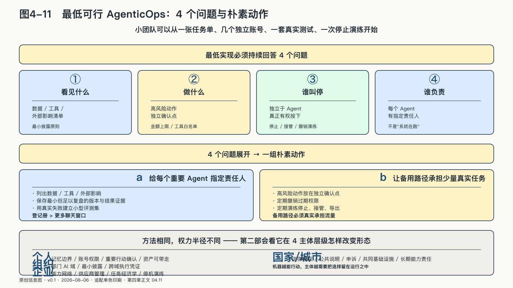

## 最低可行AgenticOps

AgenticOps不要求每个人都建设复杂平台。一个小团队甚至可以从一张任务单、几个独立账号、一套真实测试和一次停止演练开始。

最低实现必须持续回答四个问题：

> 它可以看见什么？它可以做什么？谁能够叫停？出了问题谁负责？

把四个问题展开，可以先给每个重要Agent指定责任人，列出它会接触的数据、工具和外部影响，再把高风险动作放到独立确认点。运行中只保存足以复盘的版本与结果证据，用真实失败建立小型评测集。备用路径要承担少量日常任务，过期权限定期撤销，停止、接管和导出也要实际演练。

规模扩大以后，再逐步加入统一登记、自动发布门、动态授权、全链路遥测、事故响应和资产治理。控制强度应随数据敏感度、行动权、影响人数、不可逆性和运行时间增加，不因组织规模小就消失，也不因组织规模大就无限加码。

AgenticOps与AI主权承担不同工作。六种主权能力用来检验结果；AgenticOps把这些检验放进每天发生的任务：选择与组合进入能力路由，替换与迁移进入版本和资产接口，审计进入执行凭证，演进进入评测与学习循环。

它也不是所有AI治理的总称。只做离线统计、没有工具调用和持续任务的模型，主要依靠传统数据与模型治理；系统取得任务状态、外部工具、持续身份和现实行动权以后，AgenticOps才成为核心。

这套方法也有自己走偏的样子。最常见的两种：一种是把AgenticOps做成只有大企业买得起的治理软件——登记、审批、遥测、审计层层叠加，小团队被挡在合规门槛之外，方法反而成了集中化的帮手，与主权想保护的方向正好相反。另一种是把它做成审批文书：任务契约写进抽屉，发布门变成签字，停止开关存在但没人演练，出事后翻出来的是一套完备而从未运行的制度。判断一套AgenticOps是真是假，不看文档厚度，只看一件事——上一次停止演练是什么时候，谁在几秒内按下了停止。

方法到这里已经齐了：任务怎样划定边界，身份怎样跟着行动走，失败怎样被停止和补偿，经验怎样回流成资产。但方法先用在谁身上？一个几百人的企业可以慢慢建设控制面，一个人的工作流却可能今晚就被某次账号变更打断。主权要从最近的一层开始——先回到每个人的书桌前。这是下一章要回答的。
