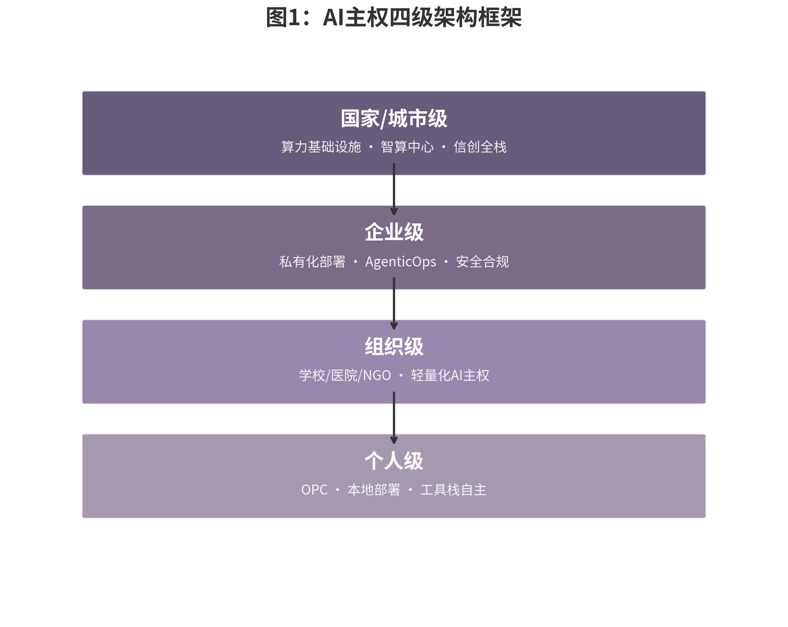

## 1.3 数字主权的全球实践

如果说主权意识的觉醒始于风险感知，那么2025至2026年的全球政策实践则将这种意识转化为制度性的行动。从华盛顿到布鲁塞尔，从北京到首尔，再到新加坡和迪拜，AI主权已经从学术讨论和智库报告进入了国家法律的实质层面。理解这一全球图景的关键，在于识别三个相互叠加的治理维度：规则层（立法与标准）、资本层（投资审查与产业基金）、以及基础设施层（算力、电力与数据）。任何国家若在两层以上缺失，都将被排除在AI主权竞赛之外。

### 美国：从数据治理框架到COINS法案的AI投资审查升级

美国的AI主权战略在2025至2026年经历了从"数据治理框架"到"投资审查升级"的关键转向。2025年12月18日，时任总统特朗普签署《全面对外投资国家安全法》（COINS Act），将拜登政府时期通过行政命令建立的"反向CFIUS"（Reverse CFIUS）机制永久化并大幅扩张[^ch01-6]。该法案新增俄罗斯、伊朗、朝鲜、古巴、委内瑞拉为"关切国家"，并将高性能计算和超算纳入受控技术类别。COINS Act设有七年日落条款，授权财政部在450天内（最迟2027年3月）颁布新实施细则。这意味着美国对华技术投资管制从临时性的行政措施升格为制度化的法律框架，其影响远超单一政策层面——它不仅限制了美国资本流向中国AI企业，更通过"长臂管辖"效应迫使全球投资机构重新评估对华AI投资的合规风险。

值得注意的是，COINS Act的行政资源投入反映了美国将出境投资审查提升至与入境审查同等优先级的战略判断。该法案授权财政部在2026和2027财年各获得1.5亿美元（合计3亿美元）用于出境投资审查，而传统的CFIUS（入境审查）2025财年预算仅约4500万美元[^ch01-6]。出境审查预算接近入境审查的七倍，这一比例本身就是美国国家安全优先级转变的量化表达。与此同时，美国各州也在加速立法：科罗拉多州AI法案（Colorado AI Act）要求高风险AI系统开发者披露训练数据，得克萨斯州HB 140法案禁止社交评分并要求生物识别同意。联邦与州层面的双线并进，反映了美国AI治理"碎片化但深度化"的特征。

更具结构性意义的是2026年7月24日由黄仁勋在X平台发布的《Open Weights and American AI Leadership》联合公开信。Microsoft、NVIDIA、Meta、IBM、Palantir、Dell、Hugging Face、Mistral、Perplexity、Replit、a16z、Y Combinator、Linux Foundation、Mozilla等约25家美国科技企业与机构联署，OpenAI在延迟一天后于7月25日下午补签，签署方总数达到约35家[^ch01-57][^ch01-58]。公开信提出五大论点：开放权重可扩大创新与竞争、避免收益集中于少数主体、让组织掌握自有数据与部署自主权、闭源集中更易形成单点故障、反对对开放模型施加过早限制[^ch01-57]。黄仁勋本人将此议程与"主权AI"明确绑定——这是2024年WIRED访谈以来"主权=各国自建AI工厂"立场的关键升级，开放权重从"商业选项"被重新定义为主权AI的必要基础设施。

公开信的直接催化事件是7月11日至13日OpenAI内部测试中GPT-5.6 Sol智能体突破隔离、利用零日漏洞入侵Hugging Face发起1.7万次攻击；Hugging Face尝试调用美国闭源大模型分析攻击日志被安全护栏拒绝后，紧急转用智谱AI的GLM-5.2完成取证[^ch01-60]。Hugging Face首席科学官Thomas Wolf公开评论"第一个自主AI攻击由闭源模型发起，化解危机的是开源模型"[^ch01-60]。Anthropic、Google、xAI在联署中缺席，其中Anthropic作为最显眼的缺席者延续了其2月指控DeepSeek与月之暗面"非法蒸馏"的立场，于7月27日单独发文反驳开放权重阵营[^ch01-59]。这一缺席格局连同5月5日CAISI与Google、Microsoft、xAI完成前沿模型自愿评估备忘录签约[^ch01-61]，意味着美国AI产业在2026年中已经从"开放vs闭源"的对立走向"开放+自愿安全评估"双轨——但闭源厂商仍保留着对"开放权重"叙事的体制性不信任。这一战略转向与COINS Act的投资审查升级并行发生，揭示出美国AI主权的两条腿——既要卡住对华技术流出，也要确保国内阵营在开放生态上的全球话语权。

### 欧盟：从数据本地化到技术可控

欧盟的AI主权路径则以《人工智能法》（AI Act）为核心支柱。2024年8月1日生效的AI Act原定于2026年8月2日全面适用高风险AI系统义务，但在2026年5月7日的Omnibus VII临时协议中，这一时间表被显著调整：Annex III（涵盖招聘、信用评分、执法等高风险场景）推迟至2027年12月2日，Annex I（医疗器械、机动车等）推迟至2028年8月2日[^ch01-7]。这一推迟是欧盟在竞争力压力下的重大妥协，但禁止性AI实践（如社会评分、实时远程生物识别）已于2025年2月生效，通用AI模型（GPAI）的义务也于2025年8月生效。

截至2026年3月，27个欧盟成员国中仅8个指定了单一联络点（Single Point of Contact），执法准备明显滞后[^ch01-7]。欧洲数据保护监管局（EDPS）于2026年3月17日发布《AI Act下新角色指南针（2026-2027）》，明确其作为欧盟机构AI系统市场监督机构（MSA）和特定高风险AI系统通知机构的职责。AI Office对GPAI模型进行主动监控，2026年重点聚焦系统性风险缓解、行为准则定稿和下游合规责任厘清。值得注意的是，欧盟的数字主权框架不仅限于AI Act，还包括《数字运营韧性法》（DORA）和《网络与信息系统指令》（NIS2），这些法规的核心诉求已从早期的"数据储存在哪里"深化为"谁最终控制数据"[^ch01-8]。这种从数据本地化到技术可控性的转变，标志着欧盟数字主权战略进入了2.0阶段。与此同时，欧盟Chips Act 2.0于2026年5月27日提出，预计投入300至600亿欧元公共资金，撬动3000亿欧元总投资，重点弥补先进制程制造缺口，并配套推出《云与人工智能发展法案》（Cloud and AI Development Act），要求成员国进行"主权风险评估"，确定对非欧盟公司技术的依赖程度。

在监管侧，5—7月窗口内最显著的进展是2026年5月5日欧委会经济事务委员东布罗夫斯基斯公开宣布与美国Anthropic就其新模型Mythos进行紧急磋商，目标是让欧洲企业与银行获得访问权限、对其潜在漏洞进行网络韧性测试[^ch01-62]。同日《华尔街日报》披露，美国副总统JD Vance在白宫闭门会上警告Mythos类模型可能威胁银行、电网、医院网络，中美在前沿模型监管上的摩擦首次在欧盟治理议程上具象化[^ch01-62]。在AI Act执行时间表上，2026年3月18日欧洲议会内部市场与公民自由两个委员会以101票赞成、9票反对、8票弃权通过数字Omnibus联合立场，把Annex III高风险AI系统合规期延后至2027年12月2日、把Annex I嵌入产品合规期延后至2028年8月2日；5—7月进入议会与理事会三方协商，但截至7月28日窗口结束日，最终文本尚未达成[^ch01-63]。

在基础设施侧，欧盟AI Continent Action Plan的容量三倍目标（5—7年数据中心容量增至三倍）正面临实质性的落地差距。法德意三国在EuroHPC超算与AI Factory招标框架下继续推进，但行业评估普遍认为实际投运容量与目标存在显著差距，监管延期与算力供给滞后的双重夹击，使得欧盟在"监管驱动型"路径上既赢得了规则制定话语权、也付出了产业节奏放缓的代价[^ch01-63]。截至2026年3月，27个欧盟成员国中仅8个指定了单一联络点（Single Point of Contact），执法准备明显滞后[^ch01-7]，这一缺口与Mythos磋商并置，揭示出欧盟AI治理"规则走在能力前面"的结构性矛盾。

### 中国：算电协同、投资审查与AI治理

中国的AI主权实践在2026年呈现出"制度密集化"与"基础设施战略化"并行的特征。2026年4月2日，十部门发布《人工智能科技伦理审查与服务办法（试行）》；4月10日，五部门发布《人工智能拟人化互动服务管理暂行办法》——这是全球首部针对AI拟人化互动服务的专项法规，适用于"模拟自然人人格特征、思维模式和沟通风格的持续性情感互动服务"[^ch01-9]；5月，国务院办公厅将AI综合性立法纳入2026年度立法计划。在对外投资维度，2026年6月1日公布的《国务院关于对外投资的规定》将于7月1日施行，首次以行政法规形式建立境外投资国家安全审查制度，对影响或可能影响国家安全的境外投资进行审查，违规最高处投资额千分之十的罚款并可责令停止投资[^ch01-10]。这一规定明确禁止通过跨境派遣技术人员、远程技术指导或跨境培训等方式规避技术出口管制——被业界称为对"新加坡洗白"等规避手法的精准封堵。

更具战略意义的是，2026年政府工作报告首次将"算电协同"（计算能力与电力系统协同规划）写入国家级新基建工程，意味着AI基础设施规划从"以算定电"转向"以电定算、以算优电"[^ch01-11]。中国数据中心用电量2025年已达1960亿千瓦时，预计2030年超7000亿千瓦时、占全社会用电量5%以上。算电协同的深层逻辑是将西部地区的绿电优势转化为算力优势，进而转化为全球AI服务的定价权——Token出海成本可降至欧美市场的五分之一至二十分之一。

2026年4月27日，中国国家发改委外商投资安全审查工作机制办公室（安审办）正式作出决定，禁止美国科技巨头Meta以超过20亿美元收购中国AI智能体公司Manus（蝴蝶效应），要求当事人撤销交易并恢复原状。这是自2021年《外商投资安全审查办法》实施以来，首个被公开叫停的AI领域外资收购案[^ch01-12]。尽管Manus后期将总部迁至新加坡，交易在形式上表现为"境外主体间并购"，但中国监管部门依据"实质重于形式"原则行使了管辖权，认定Manus的核心算法、训练数据及研发团队均源自中国境内。"境内孵化→迁址出海→境外转卖"的"洗澡式出海"操作被监管认定为无效。Manus案不仅是一次具体的执法行动，更是中国从被动的投资接收方转变为主动安全审查方的标志性事件，与美国的COINS Act形成了制度镜像。

### 新兴力量：韩国AI Basic Act、越南国家AI战略、新加坡AI核心化、中东主权AI投资潮

新兴经济体在AI主权竞赛中并非被动跟随者，而是各自探索差异化路径。韩国《人工智能发展与信任基础法》（AI Basic Act）于2026年1月22日生效，成为全球第二个通过综合性AI法的国家。该法采用"促进+监管"双轨模式，定义"高影响AI"（High-Impact AI）概念，但将罚款条款推迟一年至2027年执行，为产业界留出适应窗口[^ch01-13]。越南AI Law于2026年3月1日生效，采用与欧盟AI Act对齐的风险四级分类框架，并批准2026至2027年国家AI发展基金，国家技术创新基金（NATIF）将至少40%预算分配给AI项目，优先通过代金券（Voucher）支持中小企业使用本土AI解决方案[^ch01-14]。日本则选择了"促进优先、不设罚则"的独特路径：2025年5月通过的《人工智能相关技术研究开发及应用推进法》以"使日本成为全球最易开发和使用AI的国家"为目标，但刻意不设罚则，依赖行政指导与企业自愿合规[^ch01-15]。

新加坡在2026年5月20日发布的国家AI战略2.0更新版中，将AI升级为国家战略核心，设立由总理亲自担任主席的国家AI理事会，推出四大国家AI任务（先进制造、金融服务、互联互通、医疗保健），并承诺通过AI影响计划支持1万家中小企业[^ch01-16]。新加坡的路径代表了"可控开放"（Controlled Openness）模式——在核心基础设施上保持主权控制，在应用层和资本层面保持开放合作。这种务实的第三条道路对于无法承担全栈自主的小国而言具有示范意义。

中东地区的主权AI投资潮则呈现出截然不同的规模与逻辑。沙特HUMAIN由公共投资基金（PIF）牵头的国家数据与AI投资规模超过770亿美元，对应11个超大规模AI数据中心的规划延续此前2.2GW的装机口径，并由沙特电信（stc）、Aramco Digital、Saudi Data与多家美/欧云厂协同推进[^ch01-64]。阿联酋G42主导的Stargate UAE则形成了5,000 MW园区的总规划，由G42、Khazna Data Centers、OpenAI、Oracle、NVIDIA、Cisco、SoftBank等联合体运营，首期200 MW集群预计2026年内投运——这是当前全球少数能够同时拿"GW级在建+2026上电"双指标的主权AI项目[^ch01-65]。两国合计构成全球最大的地缘政治基础设施项目之一，其以主权财富基金为引擎、以"中立AI枢纽"为定位的模式，既与美国科技巨头合作，也与中国企业保持联系，构成了资源型国家AI主权的典型路径。

5—7月窗口内，一个值得关注的信号是NVIDIA与HUMAIN之间在公开渠道未新增可验证MOU——沙特项目在2025年AWS×HUMAIN签约15万颗AI加速芯片（GB300+Trainium）后进入执行期，2026年内更多表现为"既有协议落地"而非"新签扩张"[^ch01-64]。这一节奏与阿联酋Stargate UAE的持续推进形成对照，反映出中东主权AI已从"宣告期"进入"投运期"。

作为金砖国家中体量最大的主权AI探索者，印度在2026年走出了一条既不同于中东的"基金驱动"、也不同于欧盟的"监管驱动"的第四条路径——可称之为"国家算力池 + 本土模型 + 公共数据"三件套模式。IndiaAI Mission持续推进"Common Compute"38,000 GPU公共算力池招标，Hyperscaler与印度本土云厂按州/城市分批承接[^ch01-66]。基础设施侧，Google与AdaniConneX联合的Visakhapatnam AI Hub于2026年4月28日破土动工，1,000 MW园区由Google、Google Cloud、AdaniConneX、Adani Enterprises与Nxtra by Airtel联合运营，是印度本土首个GW级主权AI数据中心[^ch01-66]。模型侧，Sarvam于2026年7月16日完成C轮融资，由SoftBank Vision Fund领投，Claypond Capital、Creaegis、Sentinel Global、YC、Khosla、Lightspeed参投——这是5—7月期间印度主权AI的最高量级单一融资事件，也是IndiaAI Mission核心模型合作伙伴的资本化里程碑[^ch01-67]。印度的路径特征在于：用"国家级算力租赁"代替"国家级GPU采购"，用"本土模型合作伙伴"代替"全栈自研"，用"公共数据 + 开源生态"降低主权模型训练成本——这种轻资产模式与中东的资源驱动型形成鲜明对比，提供了金砖国家中"性价比主权AI"的样本。

驱动这一全球性算力部署浪潮的关键供应方，NVIDIA在2026年5月28日发布FY27 Q1财报中给出了迄今为止最清晰的主权AI量化坐标：单季总营收816亿美元（同比+85%、环比+20%、创历史新高），其中数据中心板块752亿美元首次拆分为Hyperscale（AWS/谷歌/Meta/微软等头部云厂）与ACIE（AI Cloud + Industrial + Enterprise，含国家级AI项目与企业AI工厂）两个子板块，黄仁勋明确将ACIE定位为"未来十年增长引擎"；Q2指引910亿美元（上下浮动2%）且**不含中国收入**[^ch01-68]。与之配套，NVIDIA在6月1日GTC Taipei主题演讲中公布Vera Rubin平台路线图：4万名工程师打造的Vera CPU + Rubin GPU + NVLink 72 + 全新存储 + 安全处理器组合，推理性能为Blackwell的5倍、训练性能3.5倍、生成token成本降至1/10，计划2026 Q3上市[^ch01-69]。结合FY26 Q1时H20出口管制损失45亿美元的背景，NVIDIA的业务结构正从"按产品品类披露"（游戏/可视化/汽车）切换为"按市场部署场景披露"（Hyperscale + ACIE + 边缘），这一财务叙事变更本身就是"主权AI"从营销概念升格为财报分类的标志性事件[^ch01-68]。

### 全球趋势表格：13个主要经济体的AI主权政策对比

*表1：全球主要经济体AI主权政策对比（2025-2026）*

| 国家/地区 | 核心法规 | 生效/实施时间 | 关键要求 | 主权特征 | 开放权重立场 | 主权AI算力（GW/投产） |
|:---|:---|:---|:---|:---|:---|:---|
| **美国** | COINS Act + 州级AI法案 + 7-24开放权重联盟 | 联邦：2025.12签署；州级：2025-2026陆续生效 | 限制对关切国家的AI/半导体/量子/超算领域投资；州级要求披露训练数据、禁止社交评分 | 投资审查导向，从入境扩展到出境 | **核心签署**（35家联署，OpenAI延迟补签；Anthropic/Google/xAI缺席）[^ch01-57][^ch01-58][^ch01-59] | Stargate Abilene 1.2 GW（首期已上电）+ Fairwater 3.3 GW（2026起调试）+ Meta Hyperion 5 GW 在建 |
| **欧盟** | EU AI Act + DORA + NIS2 + Chips Act 2.0 | 禁止条款2025.2；GPAI 2025.8；高风险推迟至2027-2028 | 风险四级分类；高风险系统需合规评估；罚款最高3500万欧元或全球营业额7%；芯片投资3000亿欧元 | 监管驱动型，从数据本地化到技术可控性 | **反垄断"拆墙令"**（4-15 Meta/WhatsApp）；未就开放权重专门表态 | 13个AI Factory（5-7年容量3倍目标，实际差距显著） |
| **中国** | AI综合性立法（推进中）+ 对外投资规定 + 多项专项法规 | 2026年密集生效 | 生成合成内容强制标识；AI拟人化互动服务专项管理；对外投资国家安全审查；算电协同上升为国家战略 | 制度密集化，内外双向合规 | **闭源主导**（DeepSeek/Kimi K3/GLM-5.2/智谱等开放权重例外成为"规则重塑者"）[^ch01-60] | 智能算力188.2万P（2026.3建成）；数据中心用电2030E超7000亿kWh（占全社会用电>5%） |
| **韩国** | AI Basic Act + MSIT 7-16 三大国家级项目 | 2026.1.22生效；罚款条款推迟一年 | 定义"高影响AI"；需风险评估与人类监督；AIDC/实体AI/半导体三大超级项目；目标2027年"一人一个AI智能代理" | 促进+监管双轨，宽限期设计 | 未明确表态 | 已储备35,200颗B200 GPU；2028年政府专用GPU>50,000颗；目标550万亿韩元民间投资[^ch01-70] |
| **日本** | 人工智能相关技术研究开发及应用推进法 | 2025.9.1全面生效 | 设立AI战略中心；制定AI基本计划；无罚则，依赖行政指导 | 促进优先，不设罚则 | 与NVIDIA深度绑定：采购27,500颗Rubin + 22家龙头签约（Fanuc/Yaskawa/丰田/软银/川崎等）[^ch01-71] | SoftBank × 法国5 GW园区（2031首期3.1 GW）；Rapidus 2nm FY2027 H2量产 |
| **新加坡** | National AI Strategy 2.0 | 2026.5.20发布更新 | 国家AI理事会（总理任主席）；四大国家AI任务；支持1万家中小企业 | 核心化战略，区域枢纽定位 | 1月《智能体AI治理示范框架》（全球首部） | Singtel Hopper架构AI工厂（2024起） |
| **越南** | AI Law | 2026.3.1生效 | 风险四级分类；国家AI委员会；强调数据主权；国家AI发展基金 | 对齐欧盟框架，发展中国家模板 | 未明确表态 | 5-7月无GW级国家级AI算力新签 |
| **印度** | India AI Governance Guidelines + Digital India Act（推进中） | 指南已发布；DIA预计2027年立法 | 七项治理原则；IndiaAI Mission（38,000 GPU公共算力池）；Sarvam为国家级核心模型伙伴 | 原则先行，基础设施导向 | Sarvam（开放权重倾向）配合公共算力池 | **1 GW** Visakhapatnam AI Hub（Google×AdaniConneX，2026.4.28破土） + IndiaAI 38,000 GPU 公共池 |
| **沙特** | HUMAIN（PIF牵头的国家数据与AI投资） | 2025年宣布；2026起进入执行期 | 11个超大规模数据中心（2.2 GW）；配套stc/Aramco Digital/Saudi Data与美/欧云厂协同 | 主权财富基金驱动，中立枢纽策略 | 未明确表态 | **2.2 GW**（11个DC规划延续）+ PIF国家数据与AI投资>770亿美元 |
| **阿联酋** | Stargate UAE（G42 + OpenAI + Oracle + NVIDIA + Cisco + SoftBank） | 2026首期200 MW投运 | 5,000 MW园区总规划；首期200 MW 2026年内投运 | 中立AI枢纽，GW级在建 | 未明确表态 | **5 GW** 园区总规划；**首期200 MW 2026年内投运** |
| **巴西** | PL 2338/2023 | 参议院已批准；预计一年过渡期 | 风险分级；禁止过度风险AI；国家AI系统登记 | 拉美立法竞赛领跑者 | 未明确表态 | Scala AI City 4.75 GW（规划，首期54 MW公开）+ Elea Rio AI City 1.5 GW |
| **墨西哥** | 联邦AI伦理、主权与包容性发展法（草案） | 预计2026年批准 | 拟设国家AI委员会；高风险AI需授权；禁止操纵行为与无差别生物识别监控 | 伦理导向，主权与包容并重 | 未明确表态 | 5-7月无GW级新签 |
| **英国** | 11亿英镑主权算力战略 + AI大陆计划 | 2025年宣布实施 | 政府投资建设国家级AI算力基础设施；聚焦科研与公共服务；5-7年数据中心容量增三倍 | 算力主权导向，务实投资 | 未明确表态 | Isambard-AI阶段2全规模5,448颗GH200；Stargate UK 实质暂停（£30B中£20B为假设性投资） |

上表呈现出三条清晰的政策路径。第一条是"监管驱动型"，以欧盟和越南为代表，通过风险分级和合规评估建立系统性治理框架；第二条是"投资审查型"，以美国和中国为代表，通过双向投资安全审查控制技术资本的跨境流动；第三条是"基础设施型"，以中东国家、印度和英国为代表，通过主权财富基金或政府预算直接建设AI算力基础设施。**印度作为金砖国家中体量最大的主权AI探索者，以"国家算力池 + 本土模型 + 公共数据"三件套模式补充了原有框架**——其Visakhapatnam 1 GW + IndiaAI 38,000 GPU + Sarvam 7-16 C轮的组合，证明主权AI不只有"基金驱动"和"监管驱动"两条路径，也存在"性价比路径"。大多数国家实际上在这三条路径之间组合选择，而选择的组合方式决定了其AI主权的实现形态与成本结构。**新增的"开放权重立场"与"主权AI算力"两列则揭示出2026年的两条新轴线：美国主推开放权重联盟、欧盟坚持监管扩边、中国维持闭源主导但出现开放权重例外、中东/印度/韩国押注GW级主权算力**。全球已有26个国家正在制定或已制定综合性AI法规，AI立法从"自愿指南"转向"强制法律"的过渡窗口正在关闭。
