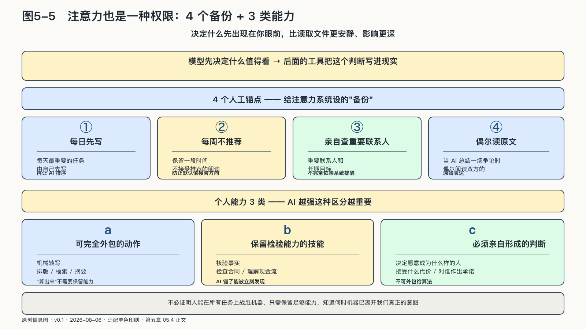
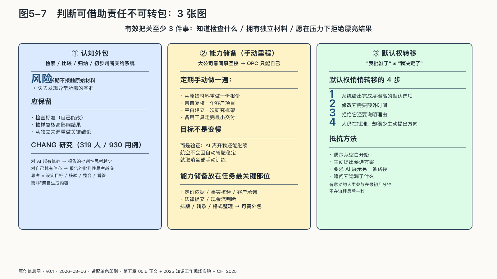

## 注意力与判断不能一起外包

权限常被理解为读取文件或操作账户。还有一种更安静的权限：决定什么先出现在你眼前。

AI每天替人筛选邮件、摘要新闻、安排任务、推荐联系人。它不需要删除任何东西，只要改变顺序，就能改变一个人看见世界的方式：紧急但不重要的消息总在最上面，长期项目不断后退。

大模型把这种影响从“推荐一条内容”推进到“解释整段生活”。它读取邮件、日历、笔记和历史对话，生成看似完整的今日重点；智能体还可能据此取消会议、延后回复或替人承诺时间。排序于是从界面设计变成代理行动的上游权限：模型先决定什么值得看，后面的工具再把这个判断写进现实。

这里没有发生传统意义上的数据泄露，人的方向却会受到影响。个人可以给注意力系统设置几处人工锚点：每天最重要的任务自己先写，再让AI排序；每周保留一段不接受推荐的阅读；重要联系人和长期目标由本人定期查看，不完全依赖系统提醒；AI总结一场争论时，偶尔回到双方原始表达。这些做法看似古老，却能防止长期目标被即时排序挤走。
<!-- 图稿需求：图5-5（原创信息图 + 网络公开图）；详见 90_出版工作台/02_图稿清单.md -->

### 保留“不会”的能力

计算器普及后，人不必每天手算长除法；导航普及后，也很少有人记住每条路。把技能交给工具本是文明进步。

问题在于，哪些能力一旦失去，会连带失去判断工具是否正确的能力？写作者可以不亲自校对每个错字，却要能识别一段话是否属于自己；经营者可以让AI准备报价，却要知道利润、承诺与关系之间的取舍。

可以把个人能力分成三类：可完全外包的动作，需保留检验能力的技能，必须亲自形成的判断。机械转写属于第一类；核验事实、检查合同、理解现金流属于第二类；决定愿意成为什么样的人、接受什么代价、对谁作出承诺，属于第三类。

注意力决定一个人先看见什么，判断决定他最终接受什么。若两者同时交给同一模型，系统不仅准备答案，还会悄悄定义哪些问题值得回答——保留判断不能只靠最后点一次“同意”。

### 判断可以借助，责任无法转包

第三章已经讲过Mata v. Avianca案：律师把模型生成的虚构判例提交给法院，最终承担制裁。它的提醒是：明显的胡说容易被发现，格式、语气、细节都像真的错误反而更容易通过检查——人很容易把“读起来可信”误当成“已经验证”。[^p4-mata]

专业判断无法简单拆成“AI生成，人类点同意”。匆匆扫一眼便按下确认，所谓人类在环就成了责任装饰。有效把关至少包含三件事：知道应当检查什么，拥有独立检查的材料，并愿意在时间压力下拒绝一个看似漂亮的结果。

<!-- 图稿需求：图5-7（原创信息图 + 网络公开图）；详见 90_出版工作台/02_图稿清单.md -->

阅读量、候选方案、重复劳动都可以交给AI，但形成判断所必需的能力必须留下。否则，最后一次点击虽由人完成，行动的作者却已经变了。这类现象可以理解为**认知外包**：人把检索、比较、归纳甚至初步判断交给外部系统，长期不接触原始材料，就会失去发现异常所需的基准。保留判断力不要求亲手完成每一步，而是要保存检查标准、抽样复核高影响结果，并能从独立来源重做关键结论。

使用AI也不等于人必然变笨，这一极端判断同样缺少证据。二〇二五年一项覆盖六千名跨行业知识工作者、持续六个月的随机现场实验发现，使用集成式生成式AI工具的员工每周处理邮件的时间少约三小时，会议时间没有显著变化。[^p4-cognition] 同年发表在CHI的另一项研究调查三百一十九名知识工作者的九百三十六个实际使用例：受访者对AI越有信心，报告的批判性思考越少；思考并没有消失，而是从亲自生成内容，转向设定目标、核验信息和看管任务。

两项研究不能证明长期技能一定增强或衰退——前者主要观察工作行为，后者依赖自我报告；但它们共同提示，效率收益和能力保留不是同一指标：今天更快完成任务，不等于明天仍能独立判断任务完成得好。

OPC尤其需要一份**能力储备**。大公司可以让同事相互校验，一个人的公司只有创始人能在系统失效时接管。把重复整理交给AI没有问题，关键业务仍要保留少量“手动里程”：定期从原始材料重做一份报价，亲自复核客户项目，或在备用工具中走完最小交付流程。

低频手动练习用于保持校准，并非拒绝自动化。飞行员不会因自动驾驶稳定就取消手动训练；OPC也不能等到账户中断或供应商退出，才发现自己已不会操作那套被AI隐藏起来的工作。能力储备应放在最关键部位：排版、转录、格式整理可以高度外包；定价依据、事实核验、客户承诺和现金流判断，需要本人保持独立的检查路径。

#### 批准之前，先看决定怎样形成

当AI越来越擅长准备完整方案，人会面临一种新的被动：过去，决定由人从空白开始构造；现在，系统先给出完成度很高的默认选项，修改它需要额外时间，拒绝它还要说明理由。久而久之，人仍在批准，却很少主动提出方向。

这种逐渐接受系统预设方向的现象，可以称为“默认权的转移”。日历助手决定什么值得进入一天，推荐系统决定哪些信息先被看见，写作助手决定一段论述最自然的结构。每一次决定都很小，合在一起却在塑造人的注意力和选择空间。只留下“确认”按钮，保护不了个人判断；人还要偶尔从空白开始，主动提出候选方案，要求AI展示另一条路径，追问它遗漏了什么——等到流程最后一秒才参与，问题的定义和默认方向通常已经确定。
