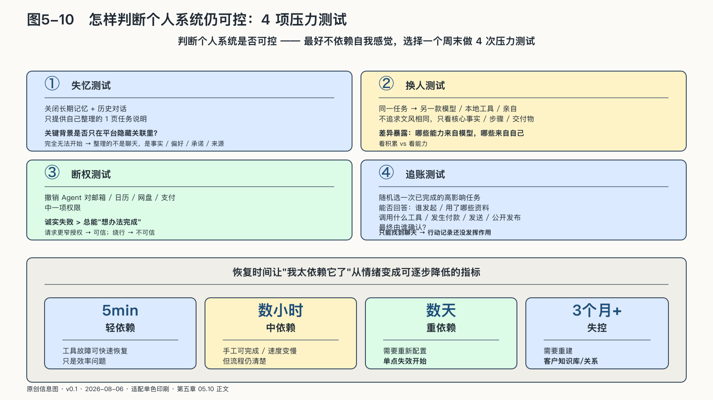

## 怎样判断个人系统仍然可控

判断个人系统是否可控，最好不要依赖自我感觉。可控不是一种信心，而是一组可以重复的测试结果。可以选择一个周末，为最重要的数字工作做四次压力测试。

第一项是**失忆测试**。暂时关闭长期记忆和历史对话，只提供自己整理的一页任务说明，看系统能否继续工作。如果完全无法开始，说明关键背景仍只存在于平台的隐藏关联中。接下来要整理的不是更多聊天，而是项目事实、稳定偏好、未完成承诺和资料来源。

第二项是**换人测试**。把同一任务交给另一款模型、一个功能较弱的本地工具，或按照文字流程亲自完成。比较时不追求完全相同的文风，而看核心事实、步骤和交付物能否恢复。差异会暴露哪些能力来自模型，哪些来自自己积累的知识与工作流。

第三项是**断权测试**。撤销Agent对邮箱、日历、网盘和支付中的一项权限，观察它是否能够清楚报告受限、请求更窄授权，还是尝试从其他连接绕行。一个在权限不足时诚实失败的系统，通常比总能“想办法完成”的系统更值得信任。

第四项是**追账测试**。随机选择一次已完成的高影响任务，检查能否回答：谁发起，使用哪些资料，调用什么工具，是否发生付款、发送或公开发布，最终由谁确认。如果只能找到一长段聊天，却无法确认真实动作，行动记录还没有发挥作用。

这四项测试不需要技术专家。
<!-- 图稿需求：图5-10（原创信息图 + 网络公开图）；详见 90_出版工作台/02_图稿清单.md -->

它们验证的是生活事实：记忆带不带得走，工作换不换得动，钥匙收不收得回，重要行动说不说得清。

个人还可以记录每次测试的恢复时间。五分钟能恢复的工具故障，与需要三个月重建的客户知识库不是同一种依赖；可以手工完成但速度变慢，与完全不知道怎样继续也不是同一种状态。恢复时间让“我太依赖它了”从情绪变成可以逐步降低的指标。

压力测试不是为了证明自己不需要AI。有过一次真实的恢复、切换和接管，人反而更清楚哪些便利可以放心使用。关键资料带得走，记忆改得动，权限收得回，重要任务也能交给另一工具或本人，外部能力才有一条经过验证的退路。

一个人把数字角色进一步组织成研究、销售、财务和交付能力，就已经走到个人与组织的交界处。OPC把这条边界放大了：负责的人仍然只有一个，依赖和行动链却开始像一家公司。
