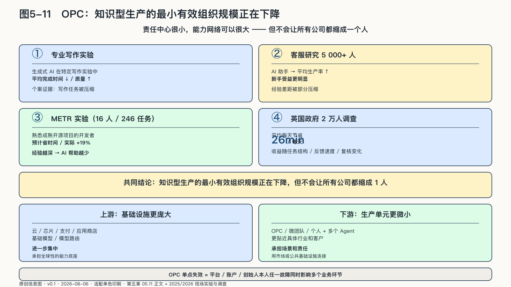
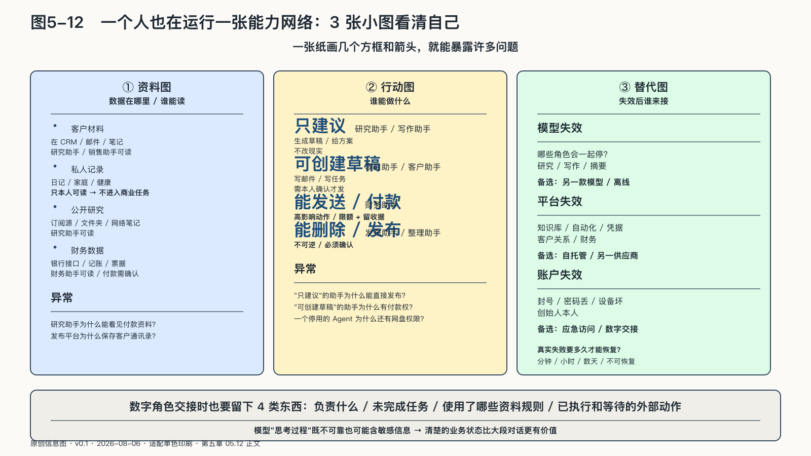

## OPC：企业的最小有效规模正在下降

一家公司为什么需要那么多人？近一个世纪前，经济学家罗纳德·科斯用交易成本解释企业边界。寻找合作者、说明需求、谈价格、签合同、检查结果和解决争议都要付出成本；当这些成本高于公司内部协调的成本，任务就被收入企业边界。AI正在改写这张成本表。[^p4-opc-mechanism]

过去，一个人很难同时完成研究、设计、销售、财务和运营。今天，创作者可以让AI整理访谈，让智能体维护选题，让自动化工具生成账单，再请专业人士复核合同。

人数没有增加，能够被组织起来的角色却增加了。OPC——One-Person Company，一人公司——描述的正是这种组织形式：它不要求一个人包办一切，也不一定对应法律上的一人有限责任公司，而是一个最终负责的人编排多个有限授权的机器角色，调用市场或公共基础设施，必要时连接会计师、律师、设计师等真人网络。

一个人可以连接很大的能力网络，最终责任却仍集中在他身上。
<!-- 图稿需求：图5-11（原创信息图 + 网络公开图）；详见 90_出版工作台/02_图稿清单.md -->

在特定专业写作实验中，生成式AI让平均完成时间下降、质量提高；在五千多名客服人员的现场研究中，AI助手提高了平均生产率，新手受益更明显。但另一项知识工作实验发现，任务一旦落在AI能力边界之外，使用AI的人反而更容易出错。AI确实能压缩部分工作时间和经验差距，却没有证明一个人可以稳定替代一家公司。[^p4-opc-mechanism]

覆盖三家企业、四千八百六十七名开发者的现场随机研究报告，代码助手组完成任务数量平均增加百分之二十六；另一项METR随机实验让十六名熟悉成熟开源项目的开发者完成二百四十六项真实任务，实际完成时间却增加百分之十九。对个人和微型团队而言，AI更像一组可临时调用的数字角色：降低起草、检索和重复实现的成本，把验证、整合和接管责任留给最终负责的人。[^p4-work-evidence]

同一种技术产生相反结果，说明部署条件本身就是变量。“用了AI”不能直接换算成“生产率提高”，还要看谁在用、做什么、错误由谁承担。[^p6-deployment-evidence-2026]

现实中的微型经营主体本来就很庞大。美国人口普查局记录，二〇二三年无雇员经营单位超过三千万，占全部经营单位约四分之三；到二〇二六年，创业服务平台Stripe Atlas观察到其新设C公司中单一创始人的比例显著上升。前者不是AI OPC的统计，后者只是平台样本——两组数据只能说明微型经营主体基础庞大、单一创始人正在增加，不能证明OPC已普遍成功。[^p4-opc-signal]

更可能持续的趋势是：**知识型生产的最小有效组织规模正在下降**，但不会让所有公司缩成一个人。过去必须固定雇用的能力，正变成按任务调用的Agent、软件服务和外部专业网络；云、芯片、支付、应用商店和基础模型则可能进一步集中。经济组织同时向两个方向发展：底层基础设施更庞大，贴近客户的生产单元更微小。

这场两极化也是个人议价位置的重新排列。基础设施层，个人不必参与竞争；市场入口层，一个人加几个数字角色已经进得去。夹在中间的个人，真正的筹码只有一种：可迁移性。模型可以换，平台可以换，前提是记忆、方法、客户关系和交付能力跟着人走，而不是留在某个账户里。前面几节花那么多篇幅在导出、边界和压力测试上，原因正在于此——它们不是洁癖，是议价能力本身。[^p4-opc-mechanism]

一个人的公司越能调用外部能力，就越可能依赖少数账户、接口和平台。一次封号、一处错误配置或一段被污染的记忆，可能同时影响销售、交付和现金流。传统公司的韧性来自冗余：员工离职有交接，系统故障有其他部门帮助恢复。OPC缺少这种天然冗余，只能有意识地把韧性设计进去。

订阅数量衡量不了OPC的成熟程度。边界清楚的OPC把客户、内容和财务资料保存在自己能够读取和迁移的位置，把关键工作流写下来，而不是只留在某个自动化平台。不同数字角色使用不同权限——研究助手不接触付款，财务助手不读取私人日记；高影响行动留下确认点；核心任务还要有一条能力稍弱、却随时能接管的替代路径。

### OPC的单点失效

下面是一段用于拆解风险的构造场景：一名独立顾问把全部业务交给一个高度集成的平台。客户邮件进入后，系统自动识别需求、读取历史项目、生成报价、安排会议、撰写方案并催收账款；一切正常时，顾问每天只需处理几个例外。

效率提高的同时，依赖路径也在增加。邮件中的一段文字可能诱导智能体忽略原有指令，让攻击者借一封普通来信影响后续行动；客户档案中的旧信息被错误调用，可能把给一家公司的价格报给另一家；平台突然调整接口，整个业务会在同一天失去多个角色。

截至二〇二六年，NIST已经把智能体的身份和授权列为专门的标准议题：当软件从“被人点击的工具”变成“代表人连续行动的代理”，系统就必须分辨它是谁、代表谁、获得什么授权，以及每次行动能否追溯。[^p4-nist-agent-id]

对一人公司来说，这些词不必变成庞大工程，可以转化成朴素的习惯：每个数字角色有单独身份；权限只覆盖当前职责；重要授权会到期；行动记录能够回看；异常时可以迅速撤销访问。公司只有一个人，也需要按角色拆分权限。

### 一个人也在运行一张能力网络

一人公司的数字同事通常不住在同一个AI里。研究助手使用云端模型、资料保存在个人知识库；财务助手通过银行接口读取账单；发布助手连接网站后台；代码Agent拥有测试环境。它们由不同公司运营、接受不同条款，却共同参与一个人的业务。OPC管理的是这张小型能力网络——订阅了多少Agent说明不了它是否可靠。

网络让一个人获得规模，也让边界变得不直观。一项客户任务可能先进邮箱，被模型总结，写入项目板，交给报价助手，最后由财务工具生成账单。原始邮件没有离开邮箱，不代表信息没有流动：摘要、分类、风险判断和报价建议都是派生数据，同样可能暴露关系和商业意图。

个人通常没有企业安全团队，却更靠近任务本身：他知道哪些材料只适合某个客户，哪些承诺必须亲自作出，哪些自动化一旦出错会损害关系。个人AgenticOps的关键，是把这种生活常识变成连接规则。可以用三张很小的图看清自己的网络。
<!-- 图稿需求：图5-12（原创信息图 + 网络公开图）；详见 90_出版工作台/02_图稿清单.md -->

第一张是**资料图**：客户材料、私人记录、公开研究和财务数据在哪里，哪些工具可以读取。第二张是**行动图**：哪些助手只能建议，哪些可以创建草稿，哪些能够发送、付款、删除或发布。第三张是**替代图**：某个模型、平台或账户失效后，哪些角色会一起停止，最低限度怎样接管。

这三张图不需要技术绘图软件，一张纸几个方框和箭头就能暴露问题：研究助手为什么能看见付款资料？发布平台为什么保存客户通讯录？停用的测试Agent为何仍有网盘权限？所谓“全部集成”的便利，常常正是权限扩散的另一种说法。

#### 数字角色也需要交接

人类员工离职时会交还钥匙、整理文件、说明未完成事项；数字角色被替换时，人们却常常只取消订阅。

一个Agent离开前，至少应留下四类东西：负责什么；哪些任务未完成；使用了哪些资料和规则；哪些外部动作已执行、哪些仍在等待。否则新助手只能重读全部历史、猜测前任做到哪里——可能重复发送信息，也可能遗漏已经答应客户的事。

数字交接不要求保存模型的每次内部推理。真正需要迁移的是任务状态、产物、关键依据和行动记录；模型的“思考过程”既可能不可靠，也可能包含敏感信息。个人AI资产包括自己定义的角色、任务、边界、评测样例和交接格式，而不只是某个Agent的名字。保留这些资产，底层模型和工具可以更新；如果全埋在平台内部，使用者就只能围绕平台的结构工作。
