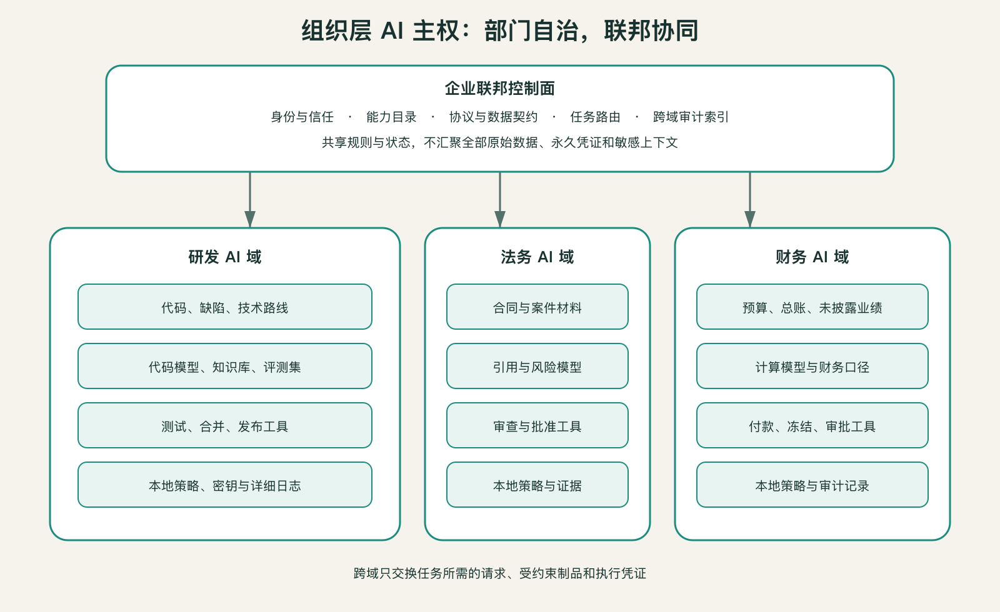

## 每个部门都应有自己的AI域

自治不等于各买各的平台。部门AI域的最低要求不是独立采购，而是独立治理——五类配置要由部门自己说了算：

1. **数据与知识**：哪些资料能被索引，哪些只能现场查询，哪些永不进入模型上下文；
2. **模型与提示**：允许使用哪些模型，专业术语、规则和评测集由谁维护；
3. **工具与行动**：可以读取什么、修改什么、提交什么，哪些动作必须由人确认；
4. **身份与策略**：谁或哪个智能体正在请求，以什么目的，在多长时间内有效；
5. **日志与证据**：发生过什么，使用了哪个版本，谁能复盘和撤销。

部门可以共用企业的算力、模型网关、身份系统和开发框架，却必须拥有自己的命名空间、密钥、知识索引、策略和审计视图。共享底座降低重复建设，独立治理面避免共享变成越权。

图中三个部门复用企业联邦层；跨域请求必须经联邦层识别、约束和记录，不能绕过边界直读另一部门的数据库。部门也可以选择不同模型：法务侧重引用与保密，研发侧重代码，财务侧重结构化计算。

### 数据、模型、行动三道边界

**数据边界**回答“它能知道什么”：原始记录、检索片段、统计结果和生成摘要的敏感程度不同。允许智能体知道某客户是否通过信用检查，不等于允许它看到客户全部财务材料。

**模型边界**回答“它用什么形成判断”。部门可能需要自己的系统提示、术语库、评测集或专用模型。即使原始数据没有外流，把部门知识长期写入共享记忆，也会让边界悄悄失效。

**行动边界**回答“它能改变什么”。读取合同、生成修订建议、发送给对方和正式签署合同，是四种完全不同的权力。很多系统严密保护输入，却让智能体拿着人的长期凭证执行高风险动作，结果守住了资料，丢掉了决定权。

三道边界必须独立配置。一个跨部门智能体可以获得某项工具的执行权而不必读取底层数据；可以读取脱敏摘要却不能触发付款；可以调用部门模型得出结论，却不能把模型、提示或完整上下文复制走。

设计跨域能力时，可以逐项列出三栏：可见数据、可用判断、可做动作。若团队只能说“这个智能体有财务权限”，权限定义仍然过于粗糙。
