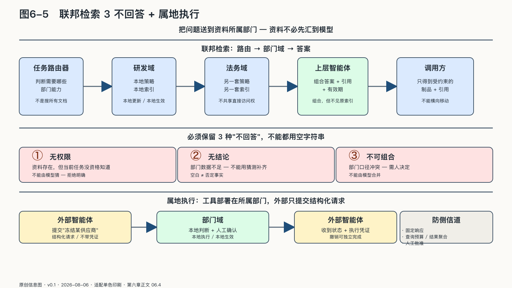

## 联邦检索与属地执行

统一知识库把资料汇到模型面前；联邦检索把问题送到资料所属的部门域。这一字之差决定权力归谁：资料离开属地域，边界就只能靠调用方自律；问题进入属地域，边界仍由负责后果的那一方把守。

请求进入后，任务路由器先判断需要哪些部门能力，而不是搜索所有文档。各部门检索器在本地验证调用者身份、用途和可见范围，从自己的索引取回片段，分别返回受约束的答案、引用和有效期；上层智能体组合这些制品，但不获得索引的直接访问权。

联邦检索需要保留三种“不回答”：一是**无权限**，资料存在，但当前任务没有资格知道；二是**无结论**，部门数据不足，不能用猜测补齐；三是**不可组合**，不同部门口径冲突，需要人决定。若系统把三者都表现为空字符串，大模型就可能把缺失当作否定事实，或用常识填充敏感空白。

它还应防止侧信道。调用者不能通过反复改变问题推断某员工、客户或项目是否存在；返回数量、延迟和错误信息也可能泄露敏感状态。高敏感域可以采用固定响应、查询预算、结果聚合和人工批准。

这种架构增加路由和接口开销，但责任清楚：数据在本地更新，本地策略立即生效。

来源：原创信息图 · 适配单色印刷 · 数据来源：第六章正文 06.4

来源：网络公开图 · Unsplash License（CC0 风格）· 出版前由编辑逐一核验版权

<!-- 图稿需求：图6-5；详见 90_出版工作台/02_图稿清单.md -->

### 工具应在拥有它的部门执行

跨部门智能体若要创建采购单、修改价格、冻结账户或发布代码，最省事的做法是取得目标系统凭证，但这等于要求部门相信调用方自律。工具留在所属部门域，外部只提交结构化请求，由本地策略判断能否执行、是否需要人确认，再返回状态与执行凭证。

截至二〇二六年八月五日，模型上下文协议的授权规范禁止把客户端令牌直接透传给下游资源，要求令牌面向预定服务；服务若调用下游API，应使用单独取得的下游令牌。[^p9-mcp-control] 这条技术规则对应一个组织原则：被允许调用法务服务，不等于继承它能访问的一切。

工具接口还应把“建议”和“执行”分开：报价智能体可以生成折扣方案，销售负责人确认后才调用价格系统；代码智能体可以准备补丁，发布工具只接受通过测试、评审和变更窗口约束的制品。越靠近不可逆结果，输入越结构化，权限越短，人工门槛越明确。

属地执行也使撤销变得现实。财务部门暂停付款工具，不必等待所有调用方更新提示；人力部门改变离职流程，可以在自己的策略点立即生效。控制留在行动发生的地方，协作才不会变成权限的永久转让。
