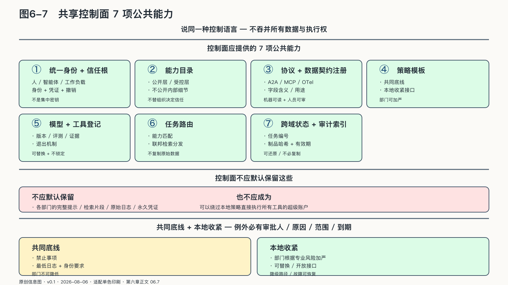

## 共享控制面怎样保持分权

火车可以共享轨道标准、信号系统和时刻表，却不需要把每节车厢里的货物都倒进调度中心。部门自治也需要企业级公共设施，关键在于公共层控制共同规则，还是顺手吞并所有数据与执行权。

共享控制面在此刻成为真问题，是因为企业AI已经越过试点期：斯坦福《二〇二六年人工智能指数报告》记录，受访组织的AI采用率已达百分之八十八。[^p1-ai-index-2026] 采用率回答不了成熟度，瓶颈转向部门间能否在不交出主权的前提下协同。控制面就是这个瓶颈的落点：建得好，协同是自治的放大器；建得不好，协同就是集权的入口。

联邦控制面可以提供七项公共能力：统一身份与信任根、能力目录、协议与数据契约注册、策略模板、模型与工具登记、任务路由、跨域状态和审计索引。

来源：原创信息图 · 适配单色印刷 · 数据来源：第六章正文 06.7

来源：网络公开图 · Unsplash License（CC0 风格）· 出版前由编辑逐一核验版权

<!-- 图稿需求：图6-7；详见 90_出版工作台/02_图稿清单.md -->

但控制面不应默认保存各部门的完整提示、检索片段、原始日志和永久凭证，也不应成为绕过本地策略直接执行所有工具的超级账户。

中央规则与本地规则冲突时，应采用“共同底线加本地收紧”：企业规定禁止事项、最低日志和身份要求；部门可以按专业风险进一步限制，不能自行降低共同底线。

共享控制面也应可替换：能力目录、任务状态、策略和执行凭证若只能存在某个平台的私有格式中，组织内部协同很快会变成企业级供应商锁定。公共层越关键，越需要开放接口、可导出配置和故障时的降级路径。

这条路两个方向都会走偏。一个是把协同做成新的中台集权：以“统一”为名，控制面一步步收走各部门的提示、索引、日志和凭证，最后长成换过名字的“企业大脑”。另一个是把自治做成数据烟囱：部门以主权为由拒绝任何契约和目录，员工绕开系统把敏感材料直接发给外部模型。前者以效率之名取消边界，后者以边界之名取消协作。

### 跨域执行凭证与分布式可观测

数据不集中，不能成为无法复盘的理由；日志集中，也不能成为第二次数据泄露。

跨域任务需要一个共同任务编号和一串执行凭证。每个部门完成自己的步骤后签发最小记录：请求摘要、契约版本、执行身份、模型或规则版本、批准状态、输出制品哈希、时间、有效期和下一责任方；详细提示、检索内容与敏感数据继续保存在本地。

中央追踪系统据此知道任务走到哪里、哪一步失败、哪些制品已经过期，却不必复制全部业务内容；获授权的调查者可以沿任务编号向各域调取更详细证据，普通运营人员只看状态和指标。

截至二〇二六年八月五日，OpenTelemetry的生成式AI语义约定已覆盖模型、智能体与工具调用等跨度，同时提醒输入输出内容可能含敏感信息，不应被默认捕获。[^p9-otel-control] 组织应把这种可观测结构延伸到跨部门边界：统一上下文标识，不统一暴露全部上下文。

执行凭证还能支持撤回：法务意见因法规变化失效时，系统可以找到引用该制品且仍在运行的任务；某模型版本出现缺陷时，可以圈定受影响的步骤，而不是停止全企业所有智能体。
