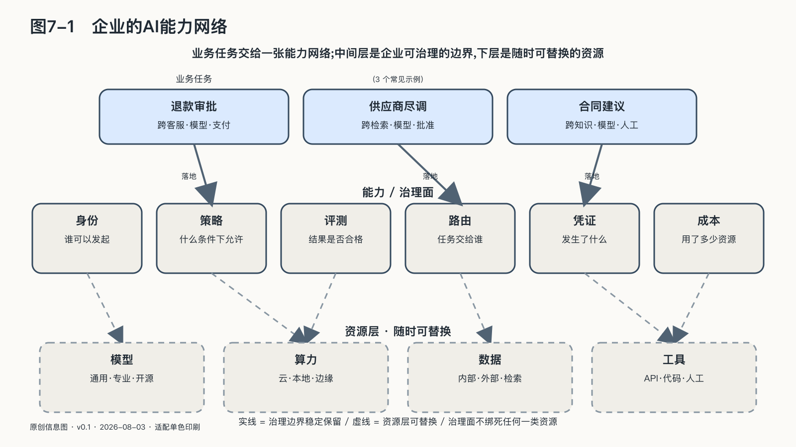

## 企业运行的是一张能力网络

"多模型"已经不足以描述企业正在建设的系统。一项真实任务可能同时用到本地小模型、云端大模型、搜索服务、知识库、传统API、代码沙箱、浏览器、外部专业Agent和拥有批准权的人。它们都能完成某种工作，却不是同一种资源。

模型负责理解和生成，数据库保存事实，确定性程序计算金额，搜索服务连接公开世界，Agent围绕目标连续选择步骤，人则承担授权、例外判断和责任。它们共同组成的是一张**能力网络**。节点可以单独采购，权力结构却只能由企业自己治理——没有哪个供应商会替企业看清所有节点连在一起之后，拼出的是谁都能走通的路。

能力网络的价值，是让不同资源在适合的位置协作；它的危险，是局部权限通过连接组合成企业从未明确授予的整体权力。员工只有查看自己客户的权限，客服Agent只有创建退款申请的权限，支付工具只有执行已批准退款的能力；若系统没有把三者的身份与任务绑定，Agent便可能拿着员工的登录状态，绕过"申请—批准—支付"的责任分离。每个组件单独看来都合规，组合路径却改变了权力结构。企业治理因此需要覆盖模型和工具之间的数据流、身份流、授权流与结果流，而非只登记模型名称或工具清单。

### 本地与云端的持续组合

按项目作选择——敏感项目留在本地，创新项目使用公有模型——边界清楚，却很难处理同时需要内部事实和外部能力的任务。

以供应商尽调为例：原始合同、付款记录和采购人员意见不能离开企业；公开工商资料、法院公告与行业信息天然位于外部世界；复杂比较需要更强模型；最终风险评级还要写回内部系统并由负责人批准。把全部材料交给云端，数据边界过宽；全部留在本地，可能牺牲搜索和复杂推理；让员工手工复制粘贴，又会丢失证据并制造新的泄露路径。

更合理的安排是按任务分工：本地程序读取原始材料，提取经过批准的结构化事实；外部能力只收到完成公开研究所需的最小信息；结果回到企业以后，由本地系统交叉验证，再进入人工批准和写回。企业要管理的由此不再是一次静态部署选择，而是每项任务怎样穿过不同环境。

物理位置不是唯一边界：分布式云可以把云厂商管理的软硬件栈放进客户数据中心或隔离环境；可信执行环境则在不完全信任基础设施运营者时，用硬件隔离、内存加密和远程证明保护正在计算的数据。[^p6-confidential-hybrid] 但机密计算不是魔法罩——它不能消除模型错误、授权过宽和输出泄密；远程证明能证明观测到的软硬件状态符合某项信任策略，不能证明代码逻辑正确或模型输出可靠。真正的主权问题仍然是：谁定义被信任的环境，谁持有密钥，证明失败时是否停止，供应商退出后能否迁移。

### 反馈也不能只替供应商学习

数据留在企业边界内，不等于企业已经拥有可用的学习资产。

高价值数据往往产生在工作完成以后：一名工程师改正了模型引用的设备编号，一位顾问删除了不应写进客户邮件的推断，一个投诉揭示某类用户总被错误分类。这些人工纠正、失败样本、业务结果和申诉记录，才说明模型输出与现实之间差了什么。

反馈若只回到外部供应商，企业可能帮助公共模型变得更好，却没有形成自己的评测集、业务规则和改进记录，换模型时同样的错误又要从头发现。反过来，若把所有对话永久保存并默认用于训练，又会把最敏感的客户经历、员工行为和商业秘密变成新的集中风险。

「Datasheets for Datasets」用结构化文档记录数据的动机、组成、收集过程和建议用途；对高影响AI项目从业者的研究则发现，被忽视的数据工作会形成层层传递的「数据级联」，直到系统后期才以性能、偏差和维护问题暴露。[^p6-data-work] 模型工程容易被看见，数据的来路、含义和责任更容易被当成杂务。

反馈进入学习闭环以前，至少要经过四道处理：确认**用途和权利**（当初为履行合同或处理内部事务收集的数据，是否可以再次用于训练；谁有权批准，何时应删除或脱敏）；确认**来源和含义**（资料从哪个系统、哪个时间和哪个版本产生，字段在当时表示什么，人工修改是否留下原因）；确认**质量和代表性**（方便收集的案例是否压过困难案例，沉默的用户和放弃申诉的人是否从数据中消失）；最后决定**以什么形式沉淀**——有些反馈适合成为评测题，有些应变成确定性业务规则，有些只需修正知识库，只有经过审查的一部分才适合训练或微调。

经验不会自动产生真理。如果销售额被当成唯一奖励，系统可能学会透支客户信任；如果只记录完成交易的人，沉默退出者的损失便不会进入反馈；如果一次行动不可逆，等结果出来再学习已经太晚。运行期学习扩大了组织适应世界的能力，也把价值选择、测量偏差和停止权带进了技术系统。

当每一次纠正都能让评测更接近真实工作、让规则更清楚、让下一个版本少犯一次同类错误，企业才形成了自己的学习闭环。否则，系统虽然每天处理企业的数据，积累能力的主体却未必是企业。

### 主权控制面的七类关系

承担这种分离工作的，可以称为主权控制面。它不是另一款大模型，也不必由一个封闭平台包办全部功能。它是一组能够互操作的控制机制：管理资产与版本，按任务选择能力，限制身份与权限，观察完整调用链，把更新送入评测和灰度发布，发生事故时暂停、降级、回滚并保留证据。"控制面"这个词来自复杂基础设施：空中交通管制不替发动机燃烧燃料，却决定不同飞机怎样共享空域、出现冲突时谁必须让行。AI 控制面具有相似作用，还要管理会解释语言、选择工具并代表不同主体行动的概率系统。

控制面维护的是几种持续变化的关系。模型能力换位越快，开放权重和蒸馏带来的选项越多，企业越需要在不同供给之间保持任务稳定。能力供给越丰富，组织越不能把自己的控制结构埋在某一次采购里。

数据与计算之间也不是只能整体搬运：原始合同可以留在企业，受批准的字段进入外部检索；设备数据可以在边缘完成异常检测，只把统计结果送往云端。身份与行动之间更不能靠一个长期账号粘在一起：员工有权查看客户，不等于 Agent 可以继承员工的一切权力，控制面把"谁代表谁、为哪项任务、在多长时间内、能对哪个对象做什么"变成短期而可撤销的关系。

模型网关、资产仓库、Agent 编排器和安全审计工具各自解决局部问题，不能单独替代控制面。底层供给变化时，任务含义要保持稳定；组件增加时，授权不能无声膨胀；需要离开时，业务知识也不能只剩原平台能够解释。这条边界决定了控制面是否真的创造主权——如果它只能管理自家模型，日志无法导出，策略依赖专有格式，替换控制面比替换模型更困难，那么它只是把锁定上移了一层。合格的控制面必须把自己的退出也纳入设计：策略、任务状态、评测、资产血缘和执行证据能够被另一种实现读取，并通过真实迁移证明。

主权控制面长期维持的是任务、资产与责任的连续性，而不是某个榜单冠军的生命周期。
