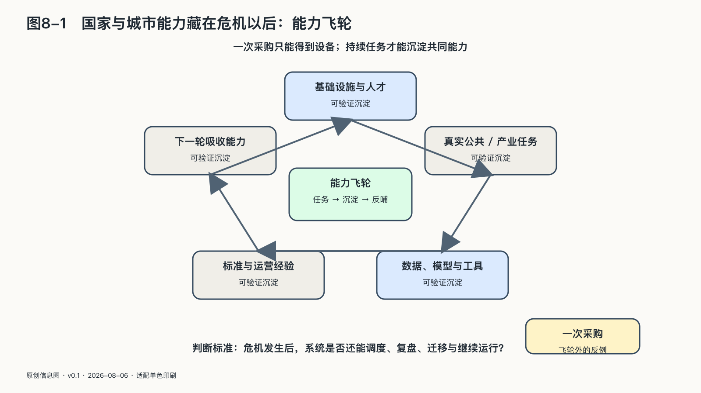

## 国家与城市主权必须同时过两道关

一套系统从“把这个人标成高风险”走到“暂停他的福利”，中间究竟隔着多少道门？在旧式信息系统里，答案往往是几张表、几名工作人员和一次正式决定；到了智能体时代，这段距离可能被压缩成一连串自动调用。

国家和城市这一级的主权，要先同时过两道关：公共权力受到约束，能力留得下。这一节先看第一道关。

早期政府信息系统主要保存记录；后来算法开始排序、匹配和预测；现在，系统不再只告诉工作人员“可能发生什么”，还能继续执行下一步：发送通知、生成文书、触发调查、安排资源。

信息系统更像一张地图，行动系统则开始拥有一双手。地图画错了，人可能走错路；系统拿到错误命令，现实状态会立即改变。

公共部门经常用“最终仍由人决定”来描述安全边界。这句话是否成立，要看工作人员有没有时间查看原始材料，反对机器是否需要额外说明甚至影响考核，界面又把模型结论和不确定性分别放在哪里。屏幕前坐着一个人，不代表判断权还在他手里。流程图里画出一个人，也不足以证明存在有效复核：复核者需要看到支持和反对结论的证据，有时间理解个案，有权限改变结果；同类错误重复出现时，还应能够推动系统停用或修改。

公共AI测试不能只覆盖模型。规则由谁写，数据从哪里来，界面如何呈现，工作人员怎样被考核，供应商怎样更新，申诉材料流向何处，都会改变最后的结果。一套在实验室中表现优秀的系统，进入糟糕的行政流程后，仍可能稳定地制造不公。

政府内部的生产率试验已经达到公共组织的规模。二〇二四年，英国政府数字服务部门把Microsoft 365 Copilot部署到十二个政府组织约二万名员工，又向中央政府提供二千五百个代码助手许可，收集实际使用数据、满意度和退出调查。这些试验不能证明政府已经完成AI转型，但能证明公共部门开始把模型当作一项需要分阶段试用、测量并保留证据的组织能力。试用规模越大，权限、数据路径和偏差越需要记录；一句“最终仍由人决定”，替代不了这些证据。[^p7-uk-government-ai]

面向公众的GOV.UK Chat试点，则把“会回答”拆成了更具体的公共指标。官方披露，首轮试点有10,136人提出23,838个问题，跨主题准确率90%，范围内问题回答率88%，73%的受访者认为有用；试点还记录了508次试图绕过安全限制的“越狱”行为，官方称均被阻止。这些仍是政府自报的试点数据，不能替代独立准确性评估；这些指标测量的也不是同一件事，不能合成一个笼统的“效果很好”。这组数据真正示范的是验收方法：公共AI至少要分别记录覆盖面、答非所问、拒答、攻击，以及用户是否真正解决了问题。[^p7-govuk-chat]

### 法律授权要走在接口前面

“减少积压”“更快发现欺诈”“把资源给最需要的人”，几乎没有人会反对这些目标。危险也往往从这里开始：复杂的公共问题被翻译成“提高识别率”，模型指标变清楚，权力边界却模糊了。目标再正当，也不能替公共权力补上缺少的授权。

一个部门依法可以收集资料，不等于它可以把全部资料交给模型寻找新的相关性；可以用系统核验事实，不等于可以让系统推断人的动机；可以发现需要复查的线索，不等于可以自动作出不利决定。技术上相邻的几个按钮，在法律上可能隔着完全不同的授权边界。

这里有三个不能合并进一次采购审批的问题：国家有没有权做这件事，AI是否适合参与，即使适合，又可以参与到哪一步。法律授权核实福利申请，并不自动授权建立跨部门的永久人物画像；AI能够预测某种风险，也不意味着这种预测具有行政决定所需的证据资格。

公共AI项目应当先写清“权力说明书”，再写功能说明书：法律依据、公共目的、处理对象、数据边界、允许采取的行动、不得越过的红线，以及权利受影响时的救济路径。

权力说明书不是法务部门上线前补的一张表，它会直接决定架构。法律要求理由能够被当事人理解，系统就要保留从证据到决定的链条；法律要求个案判断，群体概率就不能直接代替个案事实；行政机关必须对决定负责，供应商就不能以保密为由拒绝必要审查。对公共系统而言，这些法律要求从一开始就是设计输入。

公共权力的授权边界是第一道关：系统越会行动，越不能绕过法律、复核和救济。第二道关来自能力本身：规则写得再完整，如果关键接口停服后无人接管、模型更新后无法迁移，公共责任仍然只是供应商能够实现时才成立的愿望。

### 国家能力藏在危机到来以后

一个接口停止服务、一批芯片无法交付，或者核心团队离场以后，国家能力才会受到实际检验。平时显示在大屏上的算力数字不会接管故障，剪彩时发布的模型也不会自己完成迁移。

智能基础设施是一条长链。芯片依赖设计工具与制造设备；算力依赖能源、网络和冷却；模型依赖数据、软件与人才；应用依赖云、身份和支付；公共服务还依赖采购、法律、审计和基层执行。链上任何一处中断，都可能沿着任务向后传导。

面对这条长链，国家容易犯两个相反的错误。一个是假装依赖不存在，等供应中断或安全事故发生，才发现数据带不走、备用方案从未测试。另一个是把所有依赖都视为失败，在每个环节重复建设，成本巨大，却缺少持续维护和演进的人。国家首先要分清哪些依赖必须优先处理：一项娱乐服务短暂停止，与医院、支付、通信或能源调度同时中断，不是同一种风险。

公共部门需要绘制关键依赖图，避免把它变成一张用于指责采购来源的“依赖羞耻表”。图上应标出哪些功能中断后会触及基本秩序、能够承受多久、替代路线需要什么，以及谁负责定期演练。

第二条路不一定是复制一整套系统。它可以是多家供应、开放格式、可移植数据、保留人工流程，或者在危机时只能提供核心功能的降级模式。机场在系统故障时必须继续保障飞行安全；医院要能找到病历、确认身份、开出必要医嘱。降级本身不是失败，事先从未想过怎样降级才会造成脆弱。

迁移工程也要经过同样的检验：很多机构有“可以导出数据”的合同条款，却从未把数据导入另一套环境；有备用系统，却共享同一身份服务、同一网络和同一运维团队；有开源代码，却没有人能独立部署、修复和升级。没有实际演练过的选择权，仍然只写在纸上。

#### 不要用一次模型领先替代长期国家能力

模型榜单最容易吸引国家战略的注意。第一名清楚、醒目、便于传播，很容易被误当成整个AI体系的成绩单。

但模型领先具有阶段性。二〇二五年以来，来自不同公司和国家的头部模型多次交换位置；论文、开放权重、蒸馏、量化和工程经验又会把部分前沿能力快速扩散到更多模型。今天在一项基准上领先，不保证明年继续领先；今天落后几个百分点，也不等于永久失去机会。[^p2-moving-frontier]

这并不意味着先发优势无关紧要。前沿训练需要资本、芯片、能源、数据和人才密度；真实部署还需要云、渠道、评测与持续运维。容易扩散的是已经被证明的能力，较难扩散的是持续制造下一次突破并把它稳定运行起来的组织体系。

国家战略不能只追逐参数表或总分，还要建设吸收能力：理解外部进展、独立评测、合法取得并改造开放成果、把新模型接入本地语言和真实行业、在供应变化后迁移任务。具备这些能力的国家，可以不训练全球最大的通用模型，把稀缺资源投入关键算力底线、公共评测、语言数据、开放工具和高价值应用，同时购买或合作使用外部前沿能力。部分环节可以外购，理解、判断、适配和退出能力需要留在本地。

榜单可以提示短期变化，无法代表完整的工业体系；技术路线变化后，一个社会能否继续学习、比较和组合新的能力，比某个模型维持多久的第一名更能说明持续性。

#### 国家能力要在产业和公共任务中持续增值

一个国家可以有很长的技术资产清单：芯片生产线、超算中心、自主模型、政务云和专用平台。这些资产很重要，却不能单独回答两个更实际的问题。

第一个问题发生在周一早晨：一位市民申请救助，基层工作人员核验资料，部门之间交换信息，最后作出能够说明和追责的决定。这条路能不能真正走通？

第二个问题发生在周五晚上：任务完成以后，除了一次服务结果，还有什么留在本地？可能留下的是经过治理的数据集、可复用的模型和Agent、能够维护系统的团队，以及下一轮建设不必重新购买的共同资产。

国家AI能力首先是一种运行中的生产能力。它不只看仓库里放着什么，更看任务发生时，算力、数据、模型、身份、权限、行业知识和人员能否连成一条可靠生产链。任务结束以后，结果与反馈还要能够沉淀为下一次可复用的资产。

OECD把数字身份、数据交换、数字通知、支付和基础登记等视为数字公共基础设施，同时强调，部件已经存在，不代表端到端服务已经成立。只有当这些部件能够在组织之间可靠连接、受到持续治理并被真正使用，它们才会变成政府与市场共同使用的能力。[^p7-dpi-runtime]

国家AI基础设施除了供应资源，还要形成一条能力飞轮：多元资源进入统一标准和控制体系，企业与公共机构把它们用于真实场景，运行产生的数据、评测和人才经验进入资产层，资产再支持更多企业、科研和公共服务，形成新的需求、收入和投入。国家负责让这条循环跨企业、跨地区、跨技术路线持续运转，无需替所有人生产应用。

高分模型进入城市以后，仍要接上产业与公共服务。任务结束后，运行路线、事故和处置经验能否留下并被下一次建设继续使用，决定了这是一次采购，还是城市能够持续维护的能力。一套自己训练的模型，如果无法进入可靠的产业与公共流程，只是一项技术成果；一个外部模型，如果任务边界由本地主体决定，数据与密钥受自己控制，运行反馈能够沉淀，并且可以同其他模型竞争和替换，反而可能成为本地能力增长的一部分。

剪彩时可以盘点建成的资产，运行一年后才能看见供应商改变时能否继续、企业是否还在使用、开发者能否在旧成果上继续建设。
