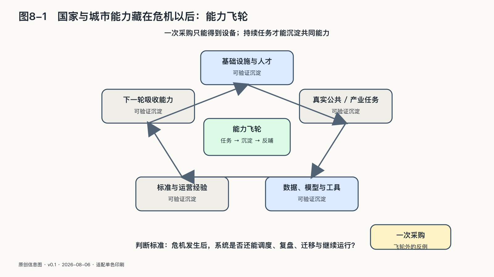

## 国家与城市主权必须同时过两道关

一套系统从「把这个人标成高风险」走到「暂停他的福利」，中间究竟隔着多少道门？在旧式信息系统里，答案是几张表、几名工作人员和一次正式决定；到了智能体时代，这段距离可能被压缩成一连串自动调用。

国家和城市这一级的主权，要先同时过两道关：公共权力受到约束，能力留得下。这一节先看第一道关。

### 法律授权要走在接口前面

信息系统更像一张地图，行动系统则开始拥有一双手。地图画错了，人可能走错路；系统拿到错误命令，现实状态会立即改变。

公共部门经常用「最终仍由人决定」描述安全边界。这句话是否成立，要看工作人员有没有时间查看原始材料，反对机器是否需要额外说明甚至影响考核，界面又把模型结论和不确定性分别放在哪里。流程图里画出一个人，也不足以证明存在有效复核：复核者需要看到支持和反对结论的证据，有时间理解个案，有权限改变结果；同类错误重复出现时，还应能够推动系统停用或修改。

这里有三个不能合并进一次采购审批的问题：国家有没有权做这件事，AI是否适合参与，即使适合，又可以参与到哪一步。法律授权核实福利申请，并不自动授权建立跨部门的永久人物画像；AI能够预测某种风险，也不意味着这种预测具有行政决定所需的证据资格。

公共AI项目应当先写清「权力说明书」，再写功能说明书：法律依据、公共目的、处理对象、数据边界、允许采取的行动、不得越过的红线，以及权利受影响时的救济路径。法律要求理由能够被当事人理解，系统就要保留从证据到决定的链条；行政机关必须对决定负责，供应商就不能以保密为由拒绝必要审查——这些要求从一开始就是设计输入。

二〇二四年，英国政府数字服务部门把 Microsoft 365 Copilot 部署到十二个政府组织约两万名员工，并提供代码助手许可，收集使用数据、满意度和退出调查。试用规模越大，权限、数据路径和偏差越需要记录；一句「最终仍由人决定」替代不了这些证据。[^p7-uk-government-ai] GOV.UK Chat 试点则把公共AI验收拆成具体指标：首轮 10,136 人提出 23,838 个问题，准确率、覆盖率、有用率、越狱尝试次数分别记录；这些仍是政府自报数据，示范的是验收方法——公共AI至少要分别记录覆盖面、答非所问、拒答、攻击与用户是否真正解决了问题。[^p7-govuk-chat]

公共权力的授权边界是第一道关：系统越会行动，越不能绕过法律、复核和救济。第二道关来自能力本身：规则写得再完整，如果关键接口停服后无人接管、模型更新后无法迁移，公共责任仍然只是供应商能够实现时才成立的愿望。

### 国家能力藏在危机到来以后

一个接口停止服务、一批芯片无法交付，或者核心团队离场以后，国家能力才会受到实际检验。平时显示在大屏上的算力数字不会接管故障，剪彩时发布的模型也不会自己完成迁移。

智能基础设施是一条长链：芯片依赖设计工具与制造设备；算力依赖能源、网络和冷却；模型依赖数据、软件与人才；应用依赖云、身份和支付；公共服务还依赖采购、法律、审计和基层执行。链上任何一处中断，都可能沿任务向后传导。

国家容易犯两个相反的错误：假装依赖不存在，等供应中断或安全事故发生，才发现数据带不走、备用方案从未测试；或者把所有依赖都视为失败，在每个环节重复建设，成本巨大却缺少持续维护和演进的人。国家要先分清哪些依赖必须优先处理：一项娱乐服务短暂停止，与医院、支付、通信或能源调度同时中断，不是同一种风险。机场在系统故障时必须继续保障飞行安全；医院要能找到病历、确认身份、开出必要医嘱。降级本身不是失败，事先从未想过怎样降级才会造成脆弱。

迁移工程也要经过同样的检验：很多机构有「可以导出数据」的合同条款，却从未把数据导入另一套环境；有备用系统，却共享同一身份服务、同一网络和同一运维团队；有开源代码，却没有人能独立部署、修复和升级。没有实际演练过的选择权，仍然只写在纸上。

### 不要用一次模型领先替代长期国家能力

模型榜单最容易吸引国家战略的注意。第一名清楚、醒目、便于传播，很容易被误当成整个AI体系的成绩单。

模型领先具有阶段性。来自不同公司和国家的头部模型多次交换位置；论文、开放权重、蒸馏、量化和工程经验又会把部分前沿能力快速扩散到更多模型。今天在一项基准上领先，不保证明年继续领先。[^p2-moving-frontier] 前沿训练需要资本、芯片、能源、数据和人才密度；真实部署还需要云、渠道、评测与持续运维。容易扩散的是已经被证明的能力，较难扩散的是持续制造下一次突破并把它稳定运行起来的组织体系。

国家战略不能只追逐参数表或总分，还要建设吸收能力：理解外部进展、独立评测、合法取得并改造开放成果、把新模型接入本地语言和真实行业、在供应变化后迁移任务。具备这些能力的国家，可以不训练全球最大的通用模型，把稀缺资源投入关键算力底线、公共评测、语言数据、开放工具和高价值应用，同时购买或合作使用外部前沿能力。部分环节可以外购，理解、判断、适配和退出能力需要留在本地。

### 国家能力要在产业和公共任务中持续增值

国家AI能力首先是一种运行中的生产能力。它不只看仓库里放着什么，更看任务发生时，算力、数据、模型、身份、权限、行业知识和人员能否连成一条可靠生产链。任务结束以后，结果与反馈还要能够沉淀为下一次可复用的资产。OECD 把数字身份、数据交换、数字通知、支付和基础登记等视为数字公共基础设施，并强调部件已经存在不代表端到端服务已经成立——只有当这些部件能在组织之间可靠连接、受到持续治理并被真正使用，它们才会变成政府与市场共同使用的能力。[^p7-dpi-runtime]

国家AI基础设施除了供应资源，还要形成一条能力飞轮：多元资源进入统一标准和控制体系，企业与公共机构把它们用于真实场景，运行产生的数据、评测和人才经验进入资产层，资产再支持更多企业、科研和公共服务，形成新的需求、收入和投入。国家负责让这条循环跨企业、跨地区、跨技术路线持续运转，无需替所有人生产应用。

剪彩时可以盘点建成的资产，运行一年后才能看见供应商改变时能否继续、企业是否还在使用、开发者能否在旧成果上继续建设。
