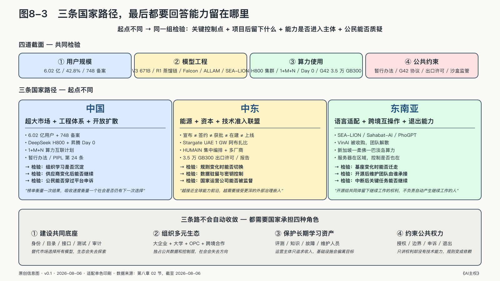

## 三条国家路径，最后都要回答能力留在哪里

资源禀赋不同，国家不会走出同一条AI路线。中国依靠超大市场、工程体系和开放模型扩散能力；中东把能源、资本与技术准入组合成联盟；东南亚更重视本地语言适配和跨国互操作。三条路起点不同，最后却要接受同一组检验：关键控制点仍在谁手里，项目结束后留下什么，能力能否进入城市里的企业、大学、开发者和公共服务。

### 中国：规模怎样变成持续能力

模型、芯片和数据来自哪里，会改变法律管辖、断供风险与维护条件，却不能单独决定系统是否可控：一套无法迁移、不能独立评测的本地系统不会因为产地就更可控，可替换的外部模型反而可能更容易治理。

评价中国的AI能力，除了统计本地零件比例，还要看机构能否理解依赖、改变路线，并在条件变化以后继续行动。

还要看竞争本身已经换了赛道。第一阶段是芯片、算力和基础模型之争；第二阶段是全栈技术体系、全球开发者和标准之争。Hugging Face二〇二六年春季生态报告显示，过去一年该平台约百分之四十一的模型下载量来自中国研发的模型，首次超过美国；斯坦福《二〇二六年人工智能指数报告》同时记录，截至二〇二六年三月，美国最强模型对中国最强模型的领先已收窄到约百分之二点七。[^p8-hf-opensource-2026]

这组变化的意义不在名次。开发者决定技术采用，技术采用形成事实标准，事实标准影响产业标准，产业标准最终组织全球产业链。中国第一次有机会不只参与讨论，而且通过全球开发者的真实采用去形成标准。下一阶段的竞争因而不只是“中国模型对美国模型”，而是“中国开放技术栈对美国开放技术栈”——谁的开放体系更完整、吸引更多开发者在其上建设，谁就更有机会影响从模型格式、算力接口到Agent协议和安全规范的走向。

但这个窗口不会自动兑现。开放权重是双向的：别人同样可以站在中国开放的成果上继续建设，模型可以被下载，生态却未必跟随。扩散的红利最后留在哪里，取决于场景能否把规模转成组织学习，算力能否走进任务，生态能否让开发者和企业持续沉淀。

#### 规模要经过组织学习

截至二〇二五年十二月，中国生成式AI用户约六点零二亿，普及率约百分之四十二点八；同期累计七百四十八款生成式AI服务完成备案，四百三十五款应用或功能完成登记。[^p7-china-scale]

这些数字说明AI已越过实验室进入超大规模社会部署，却不能证明六亿人都在深度使用，也不能证明生产率、安全和迁移能力同步提高——多个应用可能依赖相同的模型、云和分发入口，产品数量与独立道路数量不是一回事。

规模首先提供的是学习机会。制造、能源、医疗、金融等系统拥有大量真实任务，可以产生需求、反馈、评测场景、工程人才和持续收入。许多模型能在公开题目上回答工业问题，却没有见过一条生产线怎样处理异常、一个电网怎样在故障时降级；密集场景可能把这种隐性知识转成系统能力。

行业知识若只沉淀在少数平台，企业带不走评测集和反馈，供应商升级无法独立比较，事故后任务过程无从复盘，超大市场也可能形成超大锁定。规模提供原料，机构还得有能力把它加工出来。

#### 受限算力上的模型怎样进入开放生态

DeepSeek的技术路线，比“追上”或“摆脱”这两个简单标签包含更多信息。

二〇二二年至二〇二五年，美国多次调整先进计算芯片和半导体制造设备的出口管制，改变了中国团队取得前沿计算资源的条件，却没有把世界切成两个互不相连的技术盒子。DeepSeek-V3技术报告明确写明模型在NVIDIA H800集群上训练——它仍在全球硬件、开源软件和研究共同体形成的技术环境中。[^p7-bis-compute][^p7-deepseek-path]

V3总参数约六千七百一十亿，处理一个Token时只激活约三百七十亿；项目报告披露完整训练约消耗二百七十八点八万H800 GPU小时。这组数字只描述作者披露的特定训练过程，不包括架构探索、失败实验和后来R1的全部后训练成本，不能被改写成“训练前沿模型只需要这么多钱”。需要观察的是团队怎样处理约束：计算资源较难获得时，每单位计算产生的有效能力更加重要——约束不会自动产生创新，却会改变优化重点。

二〇二五年一月，DeepSeek-R1把推理训练和开放扩散接到这条线上：通过多阶段训练和强化学习发展推理能力，并发布六个从十五亿到七百亿参数的蒸馏模型，让较小模型学习R1的推理轨迹。六个蒸馏模型并非R1的六份完整复制：教师的原始数据、失败空间和持续创新团队不会随样本转移。它们还建立在Qwen与Llama基座上，技术血缘本身就跨越了国家和公司边界。

V3使用美国设计的H800，R1蒸馏借助中国Qwen与美国Meta的Llama，部署又依赖全球开源工具链。外部约束、全球依赖、工程效率、开放扩散和阶段性领先可以同时存在——主权建设可以在依赖关系中增加选择和改造空间，不必以切断全部联系为前提。

#### 算力要从机房走进模型与应用

同一个原则适用于算力。一座算力中心建成，不代表它已经形成有效计算能力：芯片架构是否适合任务，网络、框架与算子是否兼容，数据能否合法到达，开发者能否获得资源，电力和冷却能否持续，都会决定服务器是基础设施还是昂贵库存。

二〇二五年发布的《算力互联互通行动计划》把不同主体、地区与架构之间的标准化互联列为目标，并提出建设支持多种芯片架构的算子库与开发框架。[^p7-china-compute] 这是一份行动计划，不能据此认定全国算力已经互通。后续成效应看算力是否可获得、可调度、可适配并能持续完成任务，不能只看新增机房数量。

异构适配尤其关键。多种芯片可以降低单点依赖，也会让软件维护和性能调优更复杂；如果每换一种硬件应用就要重写，再多选项也很难成为可用的替代路线。编译器、算子、框架、评测和工程人才，必须先把硬件差异吸收掉。

把视角从“中国机房”提升到“全球AI工厂”，机房只是生产链的一部分。黄仁勋用“五层蛋糕”解释这条链：能源、芯片、基础设施、模型和应用，每一层都要建设并持续运营。造价预期同样要辨认口径：GTC 2026给出的指引是到二〇二七年Blackwell加Vera Rubin订单至少一万亿美元，高盛估计全球AI投资到二〇二六年底超过一万亿美元。口径不同，不能相加互证；差异指向的问题是需求能否兑现，而不只是设备能建多少。[^p7-five-layer-cake]

回到中国语境，一座机房只覆盖了前面几层。投资能否进入模型和应用，要看这些机器最后由谁使用、完成哪些真实任务、沉淀下什么数据与人才，机房规模回答不了这些问题。

机房也不是唯一的“层”。二〇二六年的推理架构同时沿两条线变化。

第一条线是“解耦推理”。大模型先理解输入（预填充），再逐词生成答案（解码），两者瓶颈不同，可以拆到不同芯片上调度。Splitwise与DistServe等研究已报告可观收益，倍数来自论文设定的硬件、模型和负载，不能无条件套用；NVIDIA Dynamo把这条路线做成产品，黄仁勋在GTC 2026给出的三十五倍加速是特定负载下的厂商演示。[^p7-prefill-decode-2026]

第二条线是多种专用芯片同时发展。Google TPU、AWS Trainium等与NVIDIA Vera Rubin在同一年竞相发布。Anthropic二〇二六年同时与Google签订约一百万颗TPU的采购合同，与AWS部署约一百万颗Trainium 2，同时仍是NVIDIA的重要客户。这比“摆脱NVIDIA”的口号更接近现实：大客户正在多条芯片路线之间分散采购，比较的不只是单芯片峰值算力，还包括每瓦电能生成多少Token、软件适配和集群利用率。[^p7-tpu-2026]

中国侧在同一年给出对应回应。二〇二六年四月二十四日DeepSeek-V4发布当天，昇腾、寒武纪、海光、平头哥、摩尔线程、沐曦、昆仑芯和天数智芯八家国产芯片，首次实现“模型Day 0全链路集体适配”——发布当天即可部署，不必等待数周的软件移植。它检验的是生态响应速度，不等于长期运行已经稳定。同一轮适配中，华为昇腾910C千卡完成V4-Pro一万六千亿参数的一千五百步全参数后训练，并报告零中断。[^p7-ascend-day0] 软件层由智源FlagOS 2.0、华为CANN开源、平头哥SAIL开源三条主线推进，以统一接口覆盖约十八家厂商的三十二款芯片。

接口统一不代表所有硬件已经互联；算力互联互通行动计划的节点名单截至二〇二六年八月仍未公示。[^p7-china-compute] 国产集体追平的是模型发布当日的全链路适配能力；训练侧的长期稳定性和跨厂商互连，仍需独立基准验证。

#### 国家能力也要接受公民质疑

中国的AI主权还包括国家与平台怎样使用AI。能力增长本身，不能替任何具体用途提供正当理由。

《生成式人工智能服务管理暂行办法》对数据合法来源、个人信息保护、服务稳定与投诉机制作出要求；生成合成内容标识制度把显式和隐式标识延伸到制作与传播链；《个人信息保护法》第二十四条为重大自动化决定规定了说明权，并允许个人在相应条件下拒绝仅由自动化决策作出决定。[^p7-china-governance]

这些制度证明正式规则存在，却不能自动证明执行一致、解释具体、申诉低成本或伤害已经下降。备案不是质量认证，内容标识不是真实性认证，“可以投诉”也不等于当事人有能力找到能够改变结果的负责人。

国家要防止社会受制于外部平台，也得防止公民受制于国家和本地平台。前一项依靠供应链、算力、模型与数据的吸收和替换能力；后一项依靠法律授权、用途边界、具体理由、独立复核和实际救济。

中国AI能力的长期指标，是本地机构理解、检验、合法吸收一项新能力并部署到真实行业所需的时间——在供应商或技术路线改变后仍能继续完成任务。榜单记录的是某一次结果，这个时间更能反映下一次技术变化到来时会发生什么。

### 中东：能源、资本与技术准入怎样结成联盟

中东的AI建设经常以巨额投资和数据中心容量来报道。数字背后还有一项制度变化：石油和天然气时代积累的资本、能源与国家组织能力，正在被用于建设Token生产能力；这一过程同时依赖美国芯片、全球云平台和跨国安全规则。

这里最需要区分五个词：宣布、签约、获批、在建、上线。宣布不等于签署，签署不等于许可，许可不等于交付，机房在建也不等于电力、网络、软件和客户任务已经运行。中东AI项目的大部分误读，都来自把这五层写成同一件事。

#### 阿联酋：越接近前沿，治理嵌入越深

阿联酋的路径并非从数据中心开始。阿布扎比技术创新研究所先后发布Falcon系列模型，并在二〇二五年推出面向现代标准阿拉伯语与地区方言的Falcon Arabic。模型性能主要来自研究机构自己的评测，不能据此宣布无争议领先；但本地研究机构、训练经验与开放权重，为阿联酋提供了一个不完全依赖外部聊天接口的起点。[^p7-uae-falcon]

另一条线由G42展开。二〇二四年四月，Microsoft宣布向这家阿布扎比AI集团投资十五亿美元，取得董事会席位，并建立一套约束双方的政府间保证协议框架，覆盖网络与物理安全、出口管制、技术转移、数据保护和客户审查。[^p7-g42-microsoft] 这笔投资同时决定了高端技术进入阿联酋的条件：资本带来云、模型和市场通道，安全与合规安排则把美国政府的技术边界嵌入这条通道。

二〇二五年五月，美阿公布先进技术合作框架；OpenAI随后宣布Stargate UAE。计划中的阿布扎比技术园区规模为五吉瓦，其中Stargate集群规划一吉瓦，首个二百兆瓦阶段预计在二〇二六年上线。[^p7-uae-stargate] “预计上线”不是“已经运行”，园区额定容量也不是实际Token产量。即使服务器位于阿布扎比，芯片、软件栈与维护链仍来自多个法域。二〇二五年十一月，美国商务部授权G42采购相当于最多三点五万颗NVIDIA GB300的先进芯片，同时附带安全、报告和持续监测条件。许可打开了通道，也显示通道的阀门并不完全位于阿联酋境内。[^p7-gulf-export]

#### 沙特：把国家数据、公共资本和多家供应商编排在一起

沙特的起点不同。在大规模AI工厂计划之前，沙特数据与人工智能管理局已经把国家数据管理办公室、国家人工智能中心和国家信息中心组织在一个公共体系中。其ALLAM阿拉伯语模型在Meta Llama 2基础上继续预训练和指令微调，随后通过IBM watsonx、政府DEEM云及其他平台部署。[^p7-saudi-allam]

ALLAM没有从零制造所有技术。它的国家属性主要体现在阿拉伯语数据、调优目标、政府应用入口、部署位置与持续组织能力。使用外部基座不妨碍这些能力留在本地；但许可、数据、评测和替换若不受自己控制，模型名称再本地化也解决不了问题。

二〇二五年五月，沙特公共投资基金成立HUMAIN，把数据中心、云、模型、应用和硬件采购集中到一家国家持有的运营公司，随后与NVIDIA、AMD、AWS、Google等多家企业建立合作。[^p7-saudi-humain]

多供应商降低了对单一公司的依赖，却没有消除共同瓶颈。截至二〇二五年十一月，美国商务部对HUMAIN明确授权的规模仍是相当于最多三点五万颗GB300，并附安全与报告条件。多年计划、当期许可、真实交付和生产上线必须分开书写。[^p7-gulf-export]

沙特的潜在优势，在于把公共资本、能源与工业体系、政府数据能力和集中采购放在同一个编排者手中。集中可以提高谈判速度，也可能形成新的单点：如果一家国家运营公司同时掌握算力、模型、云和公共应用，谁能独立评估和纠正它，地方机构和企业能否获得公平接入？PIF所有权可以证明国家拥有资产，不能自动证明公众拥有问责权。

阿联酋和沙特并未把目标设为本国制造每一颗芯片，更现实的任务是让模型服务对象、数据流向、算力调度和技术准入条件仍处在本国能够谈判和问责的范围内。第一批设备上线以后，才可以检验本地人员能否运营和改造、阿拉伯语模型是否进入真实任务、事故发生时谁拥有停止键。

### 东南亚：小国的主权来自对依赖关系的设计

如果说中国的突出条件是超大规模市场，中东的突出条件是资本与能源，东南亚面对的则是另一种现实：十多个国家和数百种语言分布在一个高度连接、资源差异明显的区域，全球模型很容易进入，本地语言、文化和制度经验却未必被充分表示。

这里的AI主权不适合从“谁训练最大模型”开始。它更接近三项任务：把被全球模型忽略的语言和场景转成可用能力，让跨境算力与数据合作不取消成员国的边界，并在全球云、芯片和基础模型中保留适配与迁移能力。

#### 从SEA-LION到印尼：适配本身就是能力

新加坡二〇二三年启动七千万新加坡元的国家多模态大模型计划。AI Singapore开发的SEA-LION不以复制世界最大通用模型为目标，而是覆盖东南亚语言、代码混用、方言与地区文化；项目后续在Llama、Gemma和Qwen等开放基座上继续训练。[^p7-sealion]

这条路线的技术意义不只是“多了一款本地模型”。全球模型常把英语和大型语种的平均表现当成通用能力，东南亚真正困难的输入却可能是一句话中混合英语、马来语和方言。谁收集语料、制定评测、决定错误类型，谁就在定义这片地区的机器可理解现实。

SEA-LION早期版本使用AWS云和NVIDIA GPU；印度尼西亚的Sahabat-AI进一步覆盖印尼语、爪哇语、巽他语、巴厘语和巴塔克语，较大的版本同样需要高端GPU和Llama许可。[^p7-sea-adapt] 使用外部基础技术并不直接等于失败，但本地语料、评测、微调、部署和退出能力要有人掌握。外部基座更新时能否换路线，云服务中断时关键版本能否运行，方言使用者受到错误影响时本地团队能否发现并修正——这些问题比模型国籍提供的信息更多。

#### 越南：权重留下以后，团队是否还在

二〇二三年，VinAI从头训练了约三十七亿参数的越南语模型PhoGPT，使用约一千零二十亿越南语Token，并以BSD-3-Clause许可发布代码和权重。[^p7-phogpt] 它没有挑战全球最大参数规模，却让越南团队实际经历了从语料处理到发布的完整过程。

二〇二五年四月，Qualcomm收购VinAI的研究与生成式AI团队；VinAI在Hugging Face的组织页面随后注明不再继续更新。公开权重仍然存在，许可仍允许别人分叉，团队与维护关系却已经变化。

这不能被写成“越南失去了AI能力”，但它提出一个更深的问题：当模型可以永久下载，训练经验、维护者和下一次迭代由谁承接？开源留下了继续工作的权利，却不能代替下一代团队的培养。

#### 新加坡—柔佛—巴淡岛：服务器在区域内，控制是否也在

算力正在把东南亚连接成更大尺度的系统。东盟二〇二五年底的数据中心发展指南记录，新加坡已有超过一点四吉瓦运行容量，土地、电力和可再生能源约束推动新增需求外溢；马来西亚柔佛已有超过五百兆瓦运行容量，超过五吉瓦处在不同开发阶段。[^p7-asean-dc]

可以把它理解为一条跨境走廊：新加坡提供云服务枢纽、资本和制度信用，柔佛与巴淡岛提供土地、电力和新增机房。物理容量区域化，却不意味着控制权自动分散——许多项目仍由全球云厂商建设，芯片、软件栈与维护链也高度集中。

东盟没有必要用一个区域超级数据库回应这种依赖。ASEAN Single Window已经让十国海关系统按共同标准交换原产地证书与申报文件，说明“保留各国系统、建立区域互操作”在制度和技术上可以运行；东盟的跨境数据示范合同条款与生成式AI治理指南，也为更复杂的合作提供自愿性工具，但目前不构成统一隐私法或超国家执法机构。[^p7-asean-rules]

东南亚的区域合作呈现出联邦式主权的可能：成员国保留数据、算力和决定权，通过共同规则扩大各自的谈判、迁移与连续运行能力。对资源有限的国家而言，承认依赖只是起点；更费力的工作，是把接口、规则和退出路径设计出来。

中国、中东和东南亚形成了三条可比较、但不能直接互换的路径。

| 路径 | 主要取得能力的方式 | 关键控制点仍在哪里 | 能力怎样留在本地社会 |
|---|---|---|---|
| 中国 | 超大用户市场、工程优化、模型开放与算力组织 | 芯片、互联效率、框架生态和公共规则执行 | 训练与部署人才、开放模型衍生、行业应用和可申诉制度 |
| 中东 | 能源、公共资本、国际联盟与先进技术准入 | 出口许可、芯片与软件栈、合作方治理要求 | 本地运营团队、数据与场景能力、多供应商编排和长期维护 |
| 东南亚 | 区域语言适配、开放底座、跨国互操作与数据中心走廊 | 外部基座模型、云与加速器、人才和持续维护组织 | 语言数据、评测集、适配器、区域协议与能够延续的团队 |
