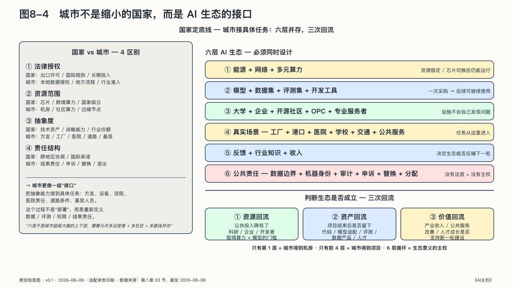

## 城市是AI生态的落地接口

一座城市不能颁发芯片出口许可，也建不起完整的全球供应链。但机房接入哪种能源，大学培养什么人才，医院和工厂开放哪些问题，公共数据怎样授权，开发者去哪里找模型，创业团队如何取得第一笔算力，行政系统出了错又由谁负责，几乎都在城市这一层发生。

城市处在国家AI能力接入真实世界的位置，承担的是本地转化任务，而非缩小版的国家任务。

这也改变了城市之间的竞争坐标。城市AI竞争的第一阶段比的是资源：机柜数量、补贴力度、招商名单。这个阶段正在过去。下一阶段的分化，在谁能把资源组织成生态——开发者愿不愿意把项目沉淀在这里，事实标准会不会在这里形成，企业离开补贴之后还留不留得下来。北京的科研与人才密度、深圳的硬件与供应链、杭州的平台与应用无法复制；但生态组织能力是每个城市都可以建设、也都可能错过的东西。

国家负责确定底线、组织跨地区资源、参与国际规则并承受长期投入；城市负责把抽象能力接到具体任务。模型在国家统计里可能是一项技术资产，进入城市以后却必须面对方言、产业设备、地方流程、医院责任、道路条件和基层工作人员。所谓“部署”，实际还包括重新定义数据、评测、权限和结果责任。

一套能够生长的城市AI生态至少有六层。

第一层是能源、网络和多元算力。它回答资源能否稳定取得，以及某一种芯片、云或调度平台变化后能否继续运行。第二层是模型、数据集、评测集和开发工具。它把一次采购变成后来者可以继续使用的技术资产。第三层是大学、企业、开源社区、OPC和专业服务者。没有这些主体，设施不会自己发现问题。第四层是真实场景：工厂、港口、医院、学校、农业、交通和公共服务。第五层是任务运行产生的反馈、行业知识和收入，它们决定生态能否反哺下一轮建设。第六层是公共责任：数据边界、机器身份、审计、申诉、替换和利益分配。

这六层不该被收进一座“城市超级大脑”。生态需要多个运营者、模型社区和技术路线共同存在。城市底座可以提供身份、目录、接口、测试环境和审计索引，但没有理由默认复制每家企业的原始数据，也不该强迫所有应用经过同一个模型或云平台。

还要说清这套生态的用途。它更像城市在AI时代的电网加市场：算力提供方接入资源，模型开发者发布和迭代模型，Agent服务商交付任务，OPC和企业提交需求，各方在同一个开放平台上工作、发任务、做交易。城市转型的真正标志，不是政府部门用了多少AI，而是有多少人开始在这个平台上以AI为生。

判断生态是否成立，可以追问三次回流。

- 资源回流：公共投入是否降低了本地科研、企业和开发者取得算力与模型的门槛，而不只是形成闲置容量。
- 资产回流：项目结束以后，是否留下本地可以维护的代码、模型适配、评测、数据产品、工作流和人才。
- 价值回流：产业收入、公共服务改善和人才成长，是否继续支持基础设施、教育科研与新的市场主体。

机房建成，只能证明第一层已经投入；场景上线，也可能随着项目结束而消失。只有资源、资产和价值持续回流，六层之间形成循环，一批AI项目才会沉淀为城市能力。
