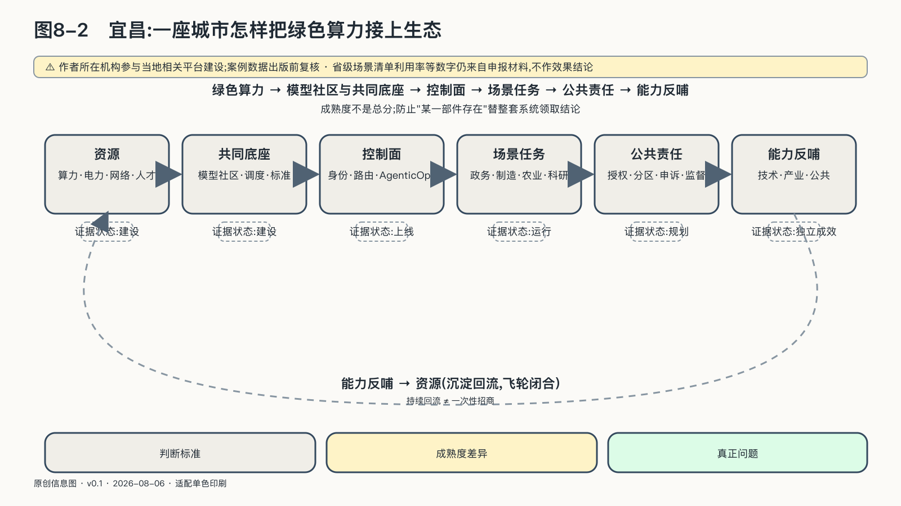

## 宜昌：一座城市怎样把绿色算力接上生态

芯片、模型和国际关系是国家层面的议题，AI设施和应用却总要落在具体城市：机房接入当地电网，公共服务由具体部门执行，产业问题发生在工厂、港口、医院和街道。

城市没有国家完整的立法与国际谈判权，也不能像企业一样只服务一组股东和客户。它负责把国家规则、地方资源、公共责任与产业运营接到一起。

宜昌的禀赋写在它的地名里。这座城市与三峡工程绑定了几十年，水电让它习惯与大规模能源基础设施打交道，"把电变成更高级的生产资料"在地方发展叙事里不是新词，而是轻车熟路的下一步。算力供应链平台落在城区内的点军区，而非某个远离人烟的产业园，这个选址透露了意图：算力要接的是城市里的大学、企业和开发者，不只是电网。

宜昌的相关建设仍在演进，这一平台的建设与运营有OpenCSG（开放传神）参与。

可以独立确认的是，截至二〇二五年八月，宜昌市科技部门公布全市已建成智算规模超过三千P，点军区建设了算力供应链平台，并开始整合模型库、数据集和AI生态专区。这里的“P”是算力规模口径；不说明计算精度、设备可用率和任务类型，就不能据此推算能够训练多少模型、服务多少用户。

二〇二六年五月，当地又启用以“数据、算力、场景、转化”为核心的OPC创新社区，面向独立开发者、小团队和数据企业。湖北省二〇二六年“数智+”场景清单还把三峡传神社区列为算力调度与生态运营能力，记录其“开源平台、产业联盟、基金会”的组织方式，以及异构算力、模型与数据资产、智能体开发等组件。[^p7-yichang-runtime]

这些材料能确认项目、资源和组织安排真实存在。至于算力利用效率、创业项目的长期存活和公共回报，还需要时间和独立评估来回答——省级场景清单中的利用率等数字来自申报材料，本书不据此推断项目效果，只把它们当作继续观察的起点。

宜昌案例与魔搭这类全国性模型社区处在不同尺度。魔搭的优势来自模型、数据集、工具和开发者形成的网络；城市平台的任务不是追求同一资产总量，而是把外部社区的可用模型、本地绿色算力、行业数据、开发空间和宜昌自己的场景接起来。前者降低“从哪里找到能力”的成本，后者解决“能力如何在这里完成任务并留下资产”的问题。

如果模型只能下载，算力不能按任务调度，生态仍是两张皮；如果算力可以调用，运行产生的模型适配、评测和行业知识却回不到本地团队，城市只是替外部平台完成计算。宜昌能否形成公共回报，关键不在模型库页面有多少条目，而在多元模型能否在当地算力上被验证、修改和替换，任务成果能否由开发者和企业继续维护。

宜昌这个样本还回答了对大多数城市更现实的问题：没有互联网大厂、没有AI明星企业的传统城市，怎样进入AI？答案不是从零培养一支前沿模型团队，而是提供一个开放的生产平台——创业者、算力提供方、模型开发者、Agent服务商都能上来工作、发布任务、互相交易。对这样的城市，AI主权的意义首先是发展而不是防御：它决定这座城市在AI时代的产业版图上有没有位置，也决定新增产值有多少留在本地的就业、税基和下一轮投入里。

值得停留的还有"社区"这个词的分量：OPC创新社区本质上是把开发者当作一种新的产业人口来组织——他们未必注册成规模以上企业，却是平台上任务的发起者和完成者。一座传统城市能招来的大企业总部有限，能吸引的个体生产者却几乎没有上限；社区运营因此不是招商的点缀，而是这套结构里专门负责"人"的那一层。

城市AI项目最容易在这里被语言提前完成。一份规划写出资源规模，报道就把它写成“正在建设”；机房通电，宣传又把它写成“平台落地”；平台出现用户，便进一步推断产业已经形成。为了不让案例跑在证据前面，可以把成熟度拆成五种不同状态。

| 状态 | 能够证明什么 | 仍不能证明什么 |
|---|---|---|
| 规划 | 目标、预算、合作意向和拟建架构存在 | 合同已经执行，资源已经到位 |
| 建设 | 设备、软件、场地或组织正在形成 | 端到端任务已经可用 |
| 上线 | 用户可以访问，基本功能能够运行 | 关键流程稳定，控制长期有效 |
| 持续运行 | 一段时间内有任务、维护、故障处理和迭代 | 公共结果优于成本，利益分配公平 |
| 独立成效 | 第三方用清楚口径评估了利用、质量、成本与影响 | 结论能自动外推到另一座城市 |

同一项目可以在不同部分处于不同状态：数据中心已经运行，模型平台刚刚上线，产业孵化仍在成形。成熟度必须按部件判断，不能用已经运行的数据中心替仍在规划的产业孵化证明成效。

把这张表应用到宜昌自己头上，读法就具体了：算力设施和供应链平台处在持续运行的早期，OPC社区刚上线不久，产业孵化和公共问责机制仍在形成之中。这也是为什么本节只把宜昌称为观察现场——它的意义不在于已经证明了什么，而在于一座传统城市把整条链路搭了起来，让这张表里的问题第一次有了可持续观察的对象。

持续运行只是第一步。城市投入还要留下本地团队、可复用资产和后续项目能力。宜昌为此把算力、模型、数据工具和运营服务放进一套可循环的生产结构，让一次任务的产出成为下一次任务的投入。这套结构是本章余下几个城市案例共用的方法，下一节单独展开。

### 城市能力怎样形成公共回报

城市不是一台只有单一目标的机器，也不是AI产业的被动容器。司机希望通行更快，行人希望街道安全，企业需要效率，居民需要安静；数据中心希望稳定电力，社区还要承担水、能源和土地成本。产业飞轮如果只计算模型调用、企业收入和招商数量而不计算这些代价，反哺就可能只是把公共资源转成少数主体的资产。

城市AI主权需要同时处理两个方向。

向内，它把多元算力、模型、数据、人才和资本组织成持续生产体系；向外，它让这些能力改善产业竞争、就业、科研、公共服务和区域连接，并把一部分新增价值投入下一轮城市发展。

两者之间需要一条公共边界。公共机构开放数据和场景，要说明合法目的与收益安排；企业贡献技术和数据，要保有合理权利；运营主体提供持续服务，要接受透明计量与绩效检查；使用AI作出高影响决定，公民仍应能够知情、获得理由、请求独立复核并得到救济。澳大利亚“机器人追债”事件的皇家委员会调查留下的教训正在这里：一次纠正只有同时改变个案结果、业务规则和系统反馈，才真正进入了城市学习循环。[^p7-robodebt]

这也是“反哺”最深的含义。城市从居民、企业和公共机构的真实活动中获得数据与问题，AI把一部分经验转化为新的能力；这些能力必须重新服务产生它们的共同体，而不能只提高中央控制室的可见性，或成为外部平台训练下一代产品的原料。

评价一座城市的AI主权，要看断供时能否继续运行、公民能否拒绝机器决定，也要看城市能否在使用全球技术的同时，把产业、技术、数据、人才和运行经验留在自己的学习体系中，并重新用于本地任务。
