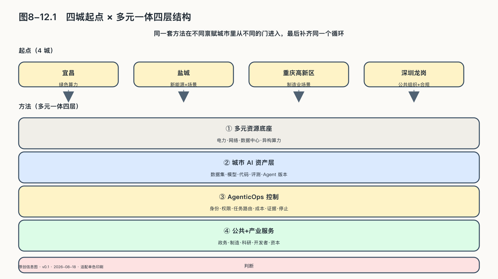
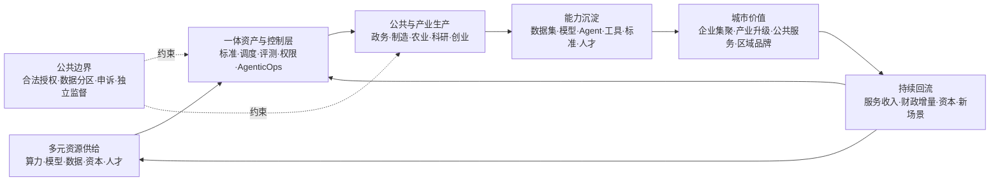

## 同一套方法，不同的城市起点

宜昌给出的是一个完整样本，但一套方法不能只靠一座城市携带。宜昌回答的是一类城市的问题：没有互联网大厂、没有AI明星企业，怎样把绿色算力接上开放生态。但不是每座城市都站在同一个起点。能源城市手里最厚的是电力，制造业城市最厚的是场景，超大城市辖区最厚的是公共组织和合规能力。禀赋不同，进入生态的门也不同；同一套方法如果成立，就应该能从不同的门进去，最后补齐同一个循环。

宜昌采用的结构可以称为“多元一体”的城市AI生产结构，它不限于宜昌。

“多元”指供给和参与者保持开放：不同GPU、CPU等芯片可以接入，开放权重与商业模型可以按任务选用，公有云、私有环境和边缘节点也可以组合；政府、企业、高校、开发者、开源社区、产业联盟和资本各自承担不同角色。

“一体”指这些资源采用相互兼容的资产标识、调度、评测、权限、计量、证据和反馈规则：统一的是协作规则，不是把资源集中到一家供应商、一个模型或一个数据库。

本地部署只解决设备放在哪里。城市还要掌握异构资源接入、模型选择与替换、数据使用规则、资产版本、Agent发布与停止、运营计量和成果归属，否则每完成一个项目，数据、经验和改进能力仍会回到外部供应商手中。这种结构可以分成四层。

第一层是**多元资源底座**。电力、网络、数据中心和异构算力经纳管、调度与计量，成为大学、中小企业、公共机构和开发者能按任务取得的生产资源。

第二层是**城市AI资产层**。数据集、模型、代码、提示词、工具、评测集、Agent和行业知识，都有明确的版本、来源、许可和访问边界。这一层保存城市投入和真实生产留下的共同技术记忆，不能只做成供人浏览的目录。

第三层是**AgenticOps生产与控制层**，也就是管理“会行动的AI”怎样交付、运行、学习和退出。它同时管理身份、权限、任务路由、成本、证据、停止和退役。反馈可以用于改进评测、知识、工具和流程，也可以经治理后进入训练数据；但原始数据不必因此集中，再训练也不是唯一的改进方式，敏感数据仍可留在企业与公共机构原有边界内。

第四层是**公共与产业服务层**。企业在自己的边界内使用模型和Agent，科研团队复用算力与数据工具，开发者在沙箱中验证应用，城市开放真实场景，运营主体提供持续服务，产业资本把经过验证的团队和项目带入更大市场。

中国关于城市全域数字化转型的政策已经把“开放兼容的共性基础、算法与模型一体部署、数字产业集群、数据服务机构、场景开放和产城融合”放在同一结构中；后续行动计划又要求建立城市数据、场景和设施的立体化运营体系，并用动态反馈连接预算与评价。国家数据局推动的城市可信数据空间，进一步把公共、企业与个人数据的融合应用、分建统管、跨域协同和数据产业生态放进长期运营机制。[^p7-city-flywheel]

欧盟AI Factories把超算、数据和人才放进同一个创新生态，连接大学、中小企业、产业与金融机构；新加坡国家AI战略把产业、政府与科研列为活动驱动者，人才、能力与空间载体列为共同体系统，算力、数据和可信环境列为基础条件。制度形式不同，评价问题相同：设备投资是否带来了持续使用、人才和本地技术资产。[^p7-city-flywheel]

城市投入形成能力，需要完成下面这组循环。

能力沉淀容易在项目验收中被忽视。一次农业Agent完成病虫害识别后，城市除了交付报告，还应在权利清楚的条件下留下可复用的评测方法、数据标准、工具组件和本地团队。制造项目优化工艺，也不要求企业把原始生产数据交给城市平台；经授权的行业数据产品、算法能力、接口标准和实施经验可以进入下一轮协作，各主体仍保有自己的原始资产。

“反哺”至少要在三条路径上看到结果：技术上，前一批任务形成的模型、Agent和工具应降低下一批项目成本；产业上，平台应帮助本地企业获得产品、订单、人才和跨区域服务；公共层面，产业增长、运营收入和技术队伍应改善公共服务，并支持下一轮基础设施投入。若只有算力消耗增加，没有任何回流，这个城市仍是AI服务的消费地。

楼宇、招商、基金和收入是产业运营的载体和资金机制，不能直接当成主权成效。有运营主体不等于运营可持续，有基金不等于孵化成功，有企业入驻不等于形成产业集群，有平台收入也不等于公共投入获得合理回报。

城市运营主体在这套结构中非常关键，也最需要权力分离。政府提供政策、公共资源与场景，并规定公共边界；市场化运营主体负责服务、计量、生态和年度运营；企业保有自己的生产数据与成果；开源基金会或中立社区维护开放资产和共同规则。任何一家机构同时掌握公共授权、全量数据、平台规则和项目收益，都会把“一体”滑向新的垄断。

城市AI项目至少需要五组运行指标：多元资源能否真实接入和切换，企业、科研和公共任务是否持续发生，多少数据集、模型、Agent和工具能够复用，本地团队、企业和产业收入是否增长，公共结果、运营收入和财政增量是否形成可解释的再投入。同时还要检查敏感数据是否留在适当边界、原供应商退出后资产和服务能否继续、受影响的人能否申诉。

方法讲完了，回到城市。接下来的三座城市与宜昌共享这套结构，但各自从最厚的一层进入。

| 城市      | 最厚的一层   | 进入方式             |
| ------- | ------- | ---------------- |
| 宜昌      | 绿色算力    | 算力调度接上开放生态与OPC社区 |
| 盐城      | 新能源与场景  | OPC社区、孵化与产业转化链条  |
| 重庆（高新区） | 制造业场景   | 链主场景开放与权属分层设计    |
| 深圳龙岗    | 公共组织与合规 | 区属国企主导建设公共AI底座   |

这张表同时标出了每种起点接下来要跨过的台阶：能源城市要让绿电不止变成算力收入，还要长出生态；场景城市要让资产随每次交付沉淀；公共底座城市要让平台在政务任务之外迎来企业与开发者。机时收入、项目数量和政务应用都只是沿途路标，共同指向那个唯一重要的问题：有多少外部主体，开始靠这座城市的平台以AI为生。

证据边界也要先交代。三个项目都有OpenCSG参与，因此下面三节只采用可公开核查的政府文件、公开报道，以及脱敏后的方案设计。项目材料里的投资规模、收益测算、定价、合作意向和进度承诺不进入本书，不能用来证明项目成效。

能力怎样留下，是本章前一条线的问题；这些能力为谁所用、受谁约束，是后一条线。三个城市案例之后，本章将从一项具体的权利开始：受到机器决定影响的人，能不能说“这个决定不对”。
