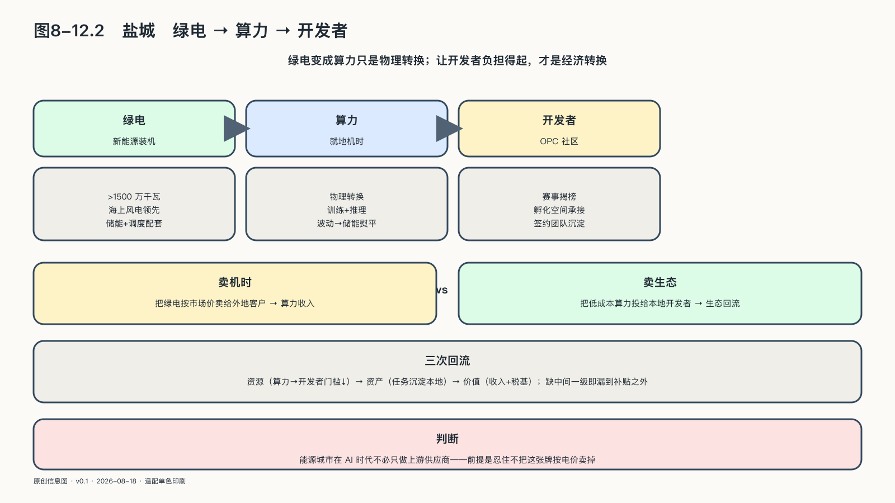

## 盐城：让绿色电力变成开发者负担得起的算力

一座能源城市进入AI时代，手里最先握住的牌往往不是人才，也不是模型，而是电。问题在于这张牌怎么打。把绿电卖给电网是一条路，把绿电就地变成算力卖给外地客户是另一条路，两条路的尽头都是收入，却都不必然长出生态。盐城这个样本值得看，因为它试图走第三条路：绿电变成算力只是物理转换，绿电变成开发者负担得起的算力，才是经济转换——前者改变的是电的用途，后者改变的是谁能在这座城市里以AI为生。

先看禀赋。截至二〇二四年九月，盐城新能源发电装机容量超过一千五百万千瓦，居江苏全省第一，海上风电规模居全国城市前列，有财经媒体称它为"海上风电第一城"。[^p8-yancheng-opc]过去这些绿电主要向外输电，盐城在能源版图上是生产者而非使用者。AI提供了另一种用途：电不必离开本地，可以就地变成算力。输电卖出的是标准化商品，价格由市场决定；算力卖出的是什么、卖给谁、留下什么，城市还有得选。

外送输电的经济账很好算：电力并网后按市场价格结算，盐城得到生产者的那一份。就地变成算力之后，账反而复杂。算力市场正在快速商品化，单纯卖机时的利润会被规模更大的竞争者压薄；数据中心要求稳定用电，风电出力却天然波动——规划文本里"绿电加冷能加储能"的并列不是修辞，而是工程前提：没有储能和调度把波动的绿电熨平，"绿色算力"就只是一句招商口号。前两笔账都不诱人，第三条路才有认真讨论的必要：算力如果不按机时出售，而按"让开发者留下来"定价，绿电换来的就不是一笔收入，而是一批生产者。

地方政策已经把这条路线写了出来。盐城市工信部门公布的《盐城市促进"人工智能+"创新发展行动计划（二〇二五至二〇二七年）》征求意见稿提出打造"东部沿海绿色算力港"，探索"绿电加冷能加储能"的算力中心建设模式和绿电直供，目标是到二〇二七年全市智算规模达到二万PFlops、新建数据中心绿电占比超过九成。[^p8-yancheng-ai-policy]按照本书前面的成熟度纪律，这段话只能证明规划存在：它是征求意见稿中的目标值，不是已经运行的设施，更不能据此推算盐城已经具备多少可用算力。

比规划更进一步的是人和场景的出现。二〇二六年七月三十一日，一场以OPC为主题的全国青年创新创业挑战赛在盐城绿色低碳科创园收官，央广网江苏频道次日报道了这场比赛：现场发布了场景清单与支持政策，获奖团队与园区签署了落地协议。[^p8-yancheng-opc]这个锚点能证明的有限但真实：盐城确实在组织开发者社区、向外部团队开放本地场景，并且至少有一部分参赛者愿意把落地承诺签到纸面上。用宜昌一节的状态表衡量，这是"上线"前后的状态——社区和场景开放已经真实发生，下一站是持续运行和独立成效。

办赛事的城市不少，成色要看赛后。区分一场赛事是机制的起点还是一次活动，可以看三件事：场景清单是否变成有人揭榜的真实任务，签署的落地协议是否有算力、空间和政策的具体承接，获奖团队第二年是否还在本地运转。盐城的这场比赛，前两件事已有开端，第三件事交给时间去生长。

真正决定盐城走哪条路的，是规划文本之外的机制设计。综合本书作者接触到的方案讨论，有几条原则值得拆开看，它们不依赖任何具体企业或合同。

第一条是转换次序。惯常的做法是先扩建机房、再拿着容量去招商，结果往往是机柜等用户。方案讨论中强调的次序相反：先把本地存量算力纳管起来，按任务供给，让早期的开发者和小团队在低成本算力上跑起来，再根据真实负载决定要不要扩容——先让生态的算力层被使用者用起来，而不是先把它建得气派。

纳管存量是这条次序里容易被忽略的一步。高校、科研机构、企业和政务机房的算力平时分散闲置，各自闲时很多，却谁也用不上谁的；把这些碎片纳入统一调度，城市不必新建一平方米机房，就先多出一批可供给的算力。先纳管、再使用、后扩容，本质上是让需求而不是规划来决定投资次序。

第二条是资源互换替代财政补贴。传统的算力招商以补贴为主，补完为止，关系也就为止。方案讨论中设想的是政、硬、软三方各出一种生产资料：地方出绿电指标、场景和载体空间，硬件方出算力设备，平台方出开源社区与运营能力——三方以资源入股生态，而不是以现金购买落地。方案中提到的开源平台方OpenCSG，其社区用户规模等说法属于企业自述口径，这里引用只用于说明"社区运营能力可以作为招商筹码"这一机制，不作为该平台能力的独立证明。[^p8-opencsg]

第三条是转化链条。开发者不会因为有电就变成企业。方案设计中，线上社区以揭榜方式发布真实任务，线下孵化空间承接跑通任务的团队，产业基金再把经过验证的项目带入下一轮——用户、团队、企业逐级沉淀，每一级都有明确的下一级可去。这条链条呼应本章前面说的三次回流：算力资源先回流为开发者门槛的降低，任务成果再回流为本地可维护的资产，最后才是收入和税基的价值回流。缺了中间一级，第一级的补贴会直接漏到最后一级之外。

第四条是承接溢出。盐城不大可能在短期内培养出大批前沿模型团队，但它可以承接一线城市溢出的超级个体：研发关系、客户关系和社区身份留在北京、上海、深圳，生产、交付和结算落在盐城。对开发者，这意味着用绿电换来的低成本算力和低成本生活；对城市，这意味着产业增量不必以"把人挖过来"为前提。这个设计承认了很多城市不愿承认的事实：人才流动在AI时代首先是工作流的流动，其次才是户籍和办公室的流动。

到这里可以看出盐城与宜昌的分工：两座城市都从绿电出发，宜昌背后是三峡的水电和一个已经在运行的平台，盐城背后是海上风电、更分散的资源和一个刚刚起步的社区。宜昌要证明的是运行能够产生回流，盐城要证明的是社区能活到产生回流的那一天。

把这几条放在一起，盐城对全书框架的独特贡献显现出来：它把能源禀赋问题改写成了定价权问题。绿电指标和低成本算力，本质上是可以定价、可以定向投放的筹码——投向卖机时的外地大客户，换来算力收入；投向本地开发者生态，换来六层生态里最难买的主体层与反哺层。能源城市在AI时代并非只能做上游供应商，前提是忍住不把这张牌按电价卖掉。

但真正的考验也在这里。绿电变成算力收入只是第一步，更难得的是让生态发生：开发者愿意留下来，任务一个接一个，资产和团队沉淀在本地。接下来的看点，是那些签约的OPC有多少在第二年还在生长、形成收入、把可复用的资产留在本地。盐城案例此刻的价值，正是把一个正确的问题摆上了台面——它值得一个认真的答案。
