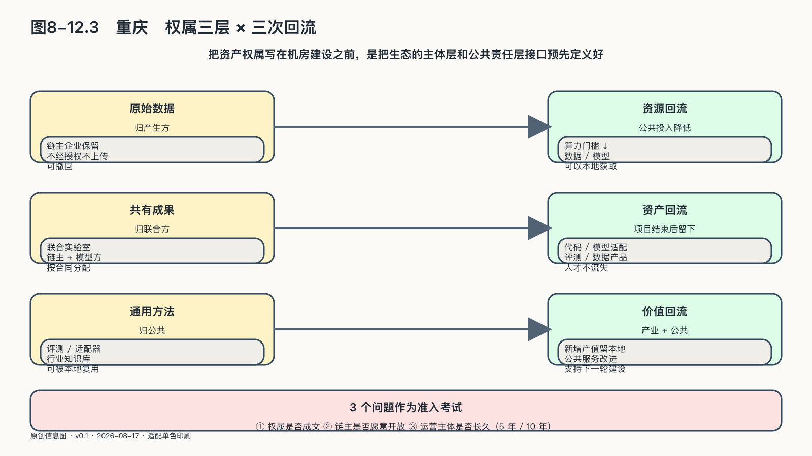

## 重庆：把资产权属写在机房建设之前

重庆的AI难题不发生在机房里。

电子信息、汽车、装备制造构成这座城市的产业底座，工厂密度在西部城市里少见。对这样的城市，算力可以采购，模型可以下载，开发工具可以从开源社区取得——供给侧的每一样东西都有市场报价。真正稀缺的是另一头的东西：企业敢不敢把产线上真实的问题交出来，交出来以后形成的能力算谁的，以及一家工厂验证过的智能体，能不能流到供应链上的下一百家工厂。

制造业密集的城市，AI生态的瓶颈从来不在供给，而在需求侧和制度侧。质检工人知道哪个缺陷最难判，排产员知道哪个约束最不能碰，这些知识躺在企业的围墙里，外部平台买不走全部。生态要转动，第一道门槛不是技术，是企业愿不愿意开门；而开门的前提，是门里的东西有清楚的归属。

这也让重庆和宜昌构成有趣的对照。宜昌要回答的是：没有互联网大厂的传统城市怎样进入AI——供给从无到有的问题。重庆要回答的几乎相反：制造业底子足够厚的城市，怎样让AI真正进入工厂——需求从围墙里走出来的问题。前者的难点是建，后者的难点是信。

政策层面对此已有回应。二〇二五年十二月十三日，重庆市政府办公厅印发《重庆市推动"人工智能+"行动方案》（渝府办发〔2025〕60号），提出推动人工智能与科技、产业、超大城市治理、民生等领域深度融合，并把算力、数据、模型、企业、人才、开源生态、金融、安全列为支撑要素。[^p8-chongqing-ai-plan]这份清单的排列值得注意：算力、数据、模型是资源，企业、人才、开源生态是主体，金融和安全是制度条件——市级政策已经把"生态"而不是"设施"当作政策对象。

政策里还有一个细节：超大城市治理列入深度融合领域，意味着AI生态的需求方不只是工厂，还有交通、管网、社区、应急等城市自身。承载这类探索的空间平台也已就位：西部（重庆）科学城是成渝地区双城经济圈框架下的国家级平台，重庆高新区是其核心承载区之一。[^p8-chongqing-science-city]

政策和平台是供给端。方案设计的重心却在另一处。本章前面讨论过，城市AI竞争正在从比资源转向比生态组织能力；第二阶段的分化，在于开发者愿不愿沉淀、企业离开补贴后留不留得下来。重庆的供给要素已经很完整，这给了它一个少见的从容：不必先把机房立起来再回头补规则，可以趁图纸还在桌上，把制度安排一次想透。

截至二〇二六年八月，重庆高新区的AI社区还处在方案设计阶段。在本章四个城市案例中，它是唯一定格在开工之前的样本——这正是它入选本书的理由：只有图纸还在桌上的项目，才能完整展示"把权属写在建设之前"长什么样。

需要先交代材料来源。本节依据的是一份项目建议书，由希望参与建设和运营的一方撰写，本书取得时它仍是讨论稿。这决定了它的证据等级：它能证明"有人这样设计"，不能证明设计会被采纳，更不能证明设计本身正确。但自利动机不妨碍把设计当作设计来检验——正因为作者希望拿到项目，他会把最可能被挑战的问题预先写圆：权属、外溢、运营、人才，一个都不敢漏。这份"不敢漏"留下一份完整的清单，外界可以逐条追问：这一条有没有写进合同，那一条有没有主体认领。

方案预先回答的第一个问题，是权属。

方案设计了一套三层安排。企业的原始数据始终归企业，不因接入平台而转移；经过脱敏和授权形成的行业数据集与模型成果，由参与方按约定共有；项目沉淀下来的通用方法，允许向更多城市复用。

这套安排值得逐层拆开看。第一层是入场券：权属不清楚，企业就不敢把真实问题带进来——质检图像、排产参数、工艺缺陷记录一旦可能流向竞争者或平台方，企业最稳妥的选择就是先拿演示数据试试水。第二层是激励机制：如果脱敏后的行业数据集和模型完全归建设方或运营方，参与企业就只是在替别人积累资产；按约定共有，企业才有理由把真问题、真数据、真人力投进来。第三层是公共外溢：通用方法允许跨城市复用，纳税人投入沉淀出的经验才不至于锁死在一个园区的围墙里。

三层安排有一个共同的时间要求：必须写在开工之前。机房开建之后再谈权属，等于在利益形成之后重新分配利益——每一家企业都会按最不利于自己的版本去猜测条款，最可能的结局是各方心照不宣地维持模糊，而模糊永远对强势方有利。

"能力留在本地"这句话，在合同层面的含义就在这里。它不是说数据物理上存放在本地机房，而是说本地企业对自己的原始资产保有完整权利，对协作产生的新资产持有成文份额，对方法的外溢保留知情和约定。这里要和一种流行说法区分开：许多城市项目把"数据不出域"当作对企业的全部承诺，服务器放在本地，便宣布安全问题已经解决。物理位置只是托管问题，权属才是利益问题：数据不出域保证数据不被搬走，权属成文保证数据产生的价值不被搬走；企业关心的一直是后者。

方案预先回答的第二个问题，是场景怎样外溢。

方案设计的路径是：在大型制造企业验证过的质检、排产等智能体，经授权后开放给供应链上的中小企业复用。需要说清楚：这是机制设计，不是既成事实，本节不点名任何企业，也不声称已有协议存在。

值得写的是这个机制瞄准的痛点。大型企业和它的供应商之间，缺的常常不只是技术标准，还有质量口径的同一把尺子。同一个缺陷，链主工厂和三级供应商的判定标准如果不一致，再智能的质检系统也只是在各自的尺度上自说自话。复用经过验证的智能体，统一的不只是模型版本，还有判定本身——这是供应链层面的"度量衡"，比单点降本更有产业意义。一个城市里如果几条主要供应链都完成这种统一，沉淀下来的就是事实标准；本章前面说过，事实标准在哪里形成，正是城市之间下一阶段竞争的分化点。

这个设计同时承认了边界。链主企业不必交出原始数据，交出的是经过脱敏和封装的能力；中小企业得到的也不是黑箱施舍，而是在统一口径下参与协作的资格——进入链主供应体系的门票本来就包含质量标准的对齐，统一口径不是额外负担，而是把原本靠验厂、靠返工、靠关系维持的对齐成本，变成一次性的技术接入。外溢的前提是授权，授权的前提是前面那套权属安排先成立。纸面闭环很完整，它能否在现实里闭合，取决于有没有链主愿意第一个开放——这是方案留给建设阶段的真问题，纸面回答不了。

方案预先回答的第三个问题，是谁来长期运营。

方案设计把建设方、长期运营方与政府的权责分开：建设有建设的队伍和验收标准，运营是独立的长期主体，政府提供政策、场景与公共边界，不兼任运动员。建设期阵容齐整只是开局，真正的考验在验收之后的五年、十年——把运营写成独立权责主体，是让"长期"两个字有专人负责，而不是靠热情维持。政府一侧同样需要边界：开放场景和数据要说明合法目的与收益安排，制定公共规则则不能同时掌握平台收益和全量数据。本章前面谈城市生态时已经立过这个规矩：任何一家机构同时掌握公共授权、数据、平台规则和项目收益，协作就会滑向新的垄断。方案把建、运、管分开，是这条规矩在一个具体项目里的落地方式——它约束的不只是企业，也包括政府自己。

人才安排回应的是西部城市更深的焦虑。方案设计了一条"培养—认证—就业—留存"的闭环：在本地培养，按统一标准认证，在本地生态里就业，靠持续的任务和职业通道留下来。值得点破的是闭环的挂接方式：留存不挂在培训补贴上，而挂在生态的任务量上；任务量又来自需求侧——企业敢不敢带真问题进来，链主愿不愿开放场景。人才闭环其实是权属和场景安排的下游：前面两道题答对了，闭环才能真正转起来。

这份方案的分量，值得单独说清。权属三层、场景外溢、建运分离、人才闭环，都已被预先想过并写成结构；更可贵的是把自己最难回答的问题提前写成了可以被公开检验的条款——愿景谁都会写，条款不是谁都敢写。

也正因为它还停在图纸上，它留下了一组任何城市都能借用的检验问题。权属是否成文——写进合同条款，而不只是写在宣传口径里。场景是否有链主愿意开放——第一个真实需求方签字才是发令枪。运营主体是否长久——有没有一个为五年、十年后平台状态负责的机构，而不只是为建设期负责的班子。把这三个问题和本章的三次回流摆在一起，对应关系是清楚的：权属成文，资产回流才有归属；链主开放，价值回流才有通道；运营长久，资源回流才有人看管。三个问题问的是纸面，三次回流看的是十年，前者是后者的准入考试。

这三个问题的用法不限于重庆：任何城市的读者都可以在本地AI项目的发布会和招商手册里把它们问一遍，能拿出合同文本、签约主体和运营方案的项目，就走在了前面。

回到本章开头的六层生态和三次回流。把资产权属写在机房建设之前，等于把生态的主体层、反哺层和公共责任层的接口预先定义好，再回头去建算力层。这个顺序一旦走对，算力层的每一分投入从一开始就知道自己为谁服务、产出归谁、经验流向哪里。在设计阶段就认真对待权属的城市，比先建机房再补制度的城市，多一次答对的机会。重庆的这份图纸已经把机会摆在了桌上——它何时从图纸走进工地，值得等，也值得看。
