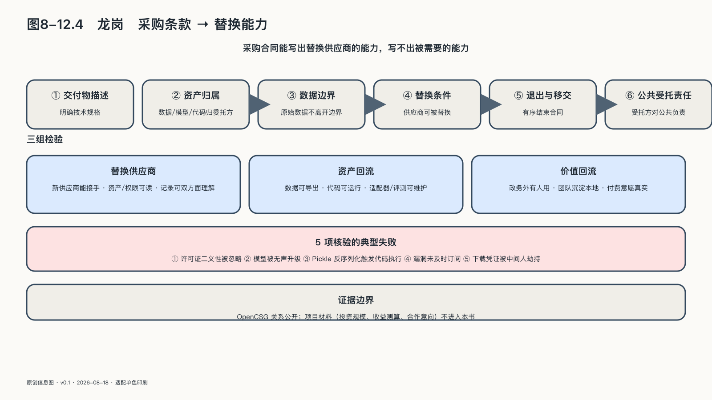

## 龙岗：把替换能力写进采购合同

深圳龙岗提出的AI主权问题，与本书前面讨论的县城和地级市都不相同。这里是超大城市的产业辖区，华为等头部企业的供应链就在区内，制造业场景密集，算力、资本和工程师都不稀缺。

它的难题首先不是“有没有资源”，而是治理形态：当政府侧动作密集、合规要求最高时，AI能力由谁主导建设，合同怎样写，供应商退出之后这套系统还能不能继续运转。龙岗的样本价值，就在于它把这三个问题都摆到了台面上。

资源不缺有资源不缺的麻烦。在这样的城区，AI项目天然容易被做成采购清单的延伸：设备是现成的，供应商是现成的，连场景都可以从部门职能里派生出来；项目越容易立项，越难分辨它是在建设公共能力，还是在消化预算。

龙岗政府侧的动作密度，在区级行政单位里少见。二〇二四年七月，龙岗区人民政府印发《深圳市龙岗区创建人工智能全域全时应用示范区的行动方案（2024—2025年）》，把全域全时场景开放写成区级行动。二〇二五年五月，龙岗区人工智能（机器人）署揭牌，这是全国首个区级人工智能专责政府机构，同一场合还发布了《龙岗区加快创建“AI龙岗”三年行动计划（2025—2027年）》。二〇二六年五月，龙岗又发布“All in AI”白皮书，把战略、订单、场景和产业数据放进同一份公开文件。[^p8-longgang-ai-district]

这组动作说明的不是某个项目的进展，而是一种组织方式：龙岗把AI当作城区级战略在经营，有专门机构、跨年度计划和公开承诺；从行动方案到专责机构再到白皮书，用了不到两年就把一个产业议题变成了常设的行政职能。

项目层面的公开锚点也已经出现：龙岗区属的深圳市龙岗区数据有限公司已就“AI大模型基础服务能力建设项目”完成采购，区级公共AI底座由此进入建设阶段。[^p8-longgang-ai-platform]

按照本章的成熟度口径，建设意味着设备、软件和组织正在成形，端到端任务、持续运行和独立成效是接下来要攀登的台阶。

与宜昌、盐城依靠社区和生态伙伴慢慢长出来的路径不同，龙岗这套底座的主导者是区属国有企业。平台首先被定位为公共基础设施：异构算力统一调度，模型资产全生命周期管理，训练和推理环境一体提供。企业在自己的边界内调用能力，原始数据不必上交。

由区属数据公司来建公共底座，这在中国区县一级正变成常见安排，它的气质由一种双重身份决定。作为公共受托人，它要对数据边界、审计要求和安全责任负责；作为市场主体，它又要按商业逻辑核算成本、争取用户，否则平台建成就开始折旧。政务场景里没人愿意承担的责任有了明确承担者；接下来的看点是真实用户能否从政府扩展到企业和开发者。

这也对应本章前面对六层结构的提醒：底座提供的是接口，不是终点。异构算力、模型资产和开发环境只是前几层，场景、反馈和公共责任要靠平台上的使用者来完成。区属国企可以把底座建得很整齐，但生态不是整齐出来的。

两条路径的起点相反：宜昌和盐城先有使用者和生态伙伴，再回头补基础设施；龙岗先有预算、机构和合同，再回头找使用者。

区级底座还有一个尺度问题。一个区不需要、也不应该复制省市两级已具备的通用能力——重复建设的机柜在区级财政上格外刺眼。区级底座的独特价值在离企业近：它知道辖区内工厂的产线是什么、医院的流程卡在哪里、政务窗口的高频问题有哪些，这种具体程度是上级平台给不了的。因此合理的分工是向上对接而不是向上对标：通用算力和基础模型可以来自更大的底座，区级平台把力气花在场景接入、数据合规和本地服务上。这个分寸把握不住，区级底座就会沦为又一层重复建设。

真正值得写进这本书的，是这类项目可以把主权能力直接变成合同语言。不同层级的行为者手里握着不同的主权工具：国家靠立法与谈判，企业靠股权与代码，而一个城区最硬的工具恰恰是采购。愿景文件里的每一句话都可以不兑现，合同条款却会被审计和追责。把主权要求写进采购条件，是城区为数不多能让供应商认真对待的承诺方式。

按方案设计，国产化在这里不是口号而是采购条件：多种国产芯片被纳入同一套调度体系，俗称“一云多芯”，某一种芯片断供、涨价或性能不达标时，任务可以迁往其他芯片继续运行。底座对芯片的态度是“欢迎竞争”，而不是“选定一家”。

更关键的是许可与交付条款：平台采用允许商业二次开发的开源协议，源码交付写进合同，城区拿到的不是一段只能调用的服务，而是可以继续修改、可以交给另一支队伍维护的资产。“供应商退出后仍能继续”由此从一句愿望变成可以验收的条款：验收时看的不是供应商的承诺书，而是代码能不能在供应商不在场的情况下编译、部署、跑起来。

同一套逻辑还延伸到可观察性。按方案设计，操作留痕、审计接口和数据权属约定同样属于交付要求：平台替城区做了什么、谁在什么时间调用了哪份数据、模型版本何时更换，都要有记录可查。公共机构把任务交给一套系统，不能只在出事当天才第一次看见系统的内部——留痕条款保证的是平时的可见性，也就是出事之前的问责能力。

把合同条款放在一起看，龙岗和重庆做的是同一件事的两个侧面。重庆把权属写在开工之前，防的是需求侧不敢进门；龙岗把替换写进采购合同，防的是供给侧不肯放手。一个针对信任，一个针对锁定，共同点是都承认事后谈判解决不了事前的结构性问题——利益一旦形成，再公平的条款也谈不动了。

本章谈降级与迁移时已经说过，没有演练过的选择权只写在纸上。源码交付了，本地团队是否读过、改过、重新部署过；多芯片可调度了，跨芯片迁移是否真实跑通过一次——这些合同回答不了，要靠运行期的演练回答。龙岗这种写法的意义在于把演练的前提造了出来。

合规在龙岗不是附加要求，而是入场券：政务、医疗、金融这类高影响场景要求数据不出域、模型完成备案、全链路可溯源，达不到的应用，技术再好也进不了场。这恰好解释了为什么公共底座要由区属主体来建：企业各自搭建合规环境，同样的成本会重复发生几十次，统一底座把这部分成本变成一次性的公共投入，再按使用量摊薄。

方案设计里还有一组试图让底座自我造血的安排：计量计费、多租户隔离，以及对辖区企业使用算力的费用返还。这些安排能否成立，不取决于设计是否精巧，而取决于企业和开发者是否持续付费使用；只有真实需求流过平台，计量才有意义，返还才有来源。用本章的回流框架说，这是资源回流能否接通价值回流的第一道闸门。

造血安排的背面是财政纪律：一套底座如果长期靠财政支持运行，真实需求就值得持续关注。计量计费的意义不只是收钱，而是持续回答一个问题——除去政务任务，还有谁在用自己的钱投票。

龙岗并非只把平台留给政务。从行动方案的全域场景开放，到白皮书里对政府订单和应用场景清单的公开承诺，区政府一直在向企业递出入场邀请。[^p8-longgang-ai-district]接下来要做的是让到场发生：场景开放要变成企业能赚到钱的机会，算力补贴要变成开发者值得押注职业生涯的底座，让平台从政府的可靠工具长成城区的公共生态。

检验龙岗的问题因此很具体。辖区里的制造企业、创业团队和OPC[^p7-opc-policy]是否真的在用这套底座训练、部署和交付自己的东西？项目结束以后，模型适配、评测集和行业工作流有没有留下来，成为下一批项目可直接取用的资产？离开政府订单之后，还有没有人愿意留下来付费？这三个问题分别对应资源、资产和价值的回流，也都只能在运行中被回答。

采购合同能写出替换供应商的能力，写不出被需要的能力。龙岗把前者做得比多数城区都认真，这已经值得记录；后者要在几年后的运行数据里才见分晓，那时再回看这份合同，才能判断它是一份主权文件，还是又一份采购档案。
