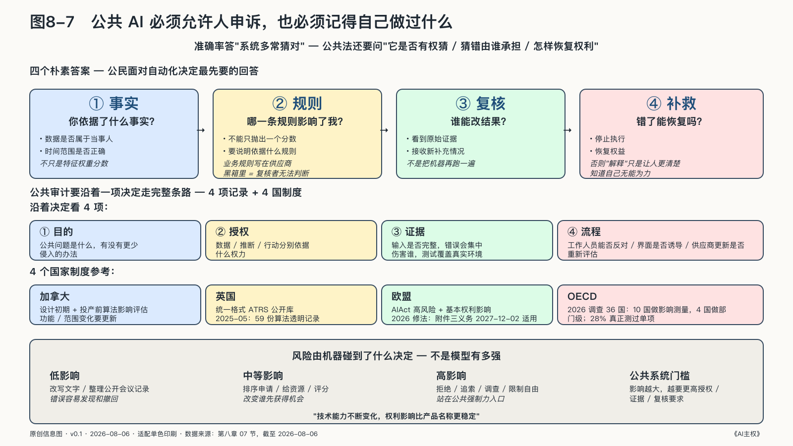

## 公共AI必须允许人申诉，也必须记得自己做过什么

二〇一五年，澳大利亚政府启动了一项自动化债务追索计划：不再靠人工逐案核查，而是让系统自动比对数据、自动认定欠款、自动发出催缴通知。公众后来称它为"机器人追债"（Robodebt）。这套系统里没有今天这样的大模型，它却完整演示了自动化一旦获得行政力量，会发生什么。

政府把税务系统记录的年度收入与福利申报进行比对，用平均数把年度收入摊到各个时期，据此推断某些人曾经多领补助。对全年工资稳定的人，平均数也许接近现实；对季节工、临时工、零工和收入波动者，它可能创造出一段从未存在的"平均收入"。

统计推断本来可以作为查找线索的工具。进入债务追索流程后，它却逐渐像事实一样行动。许多人收到通知，需要自己证明没有欠款。国家掌握数据、规则和催收能力，普通人却要解释一笔连计算过程都看不懂的债务。伤害不只来自一个公式，而来自整条责任链：有疑问的推断被赋予过高证据地位，人工判断从流程中退场，举证负担转向处境更弱的一方，异议没有及时改变系统，法律意见也没有形成有效制动。

这个计划运行了大约五年，向数十万人发出债务通知，其中超过四十七万笔后来被认定为非法提出，政府最终退还、核销并赔偿了约十八亿澳元。二〇二三年的皇家委员会报告提出，政府自动化决定需要一致的法律框架、清楚的复核路径、通俗的系统说明、可接受独立专家审查的业务规则和算法，以及持续监测和审计其技术、公平与可用性影响的机构。[^p7-robodebt]

更准确的模型仍可能执行没有充分授权的政策，仍可能使用不适合个案判断的数据，仍可能把人困在无法申诉的流程里。把希望寄托在"下一次换一个更准的模型"上，是对事件错位的理解。

准确率回答的是"系统多常猜对"。公共法还要问"它是否有权猜""猜错由谁承担""这个人如何恢复自己的权利"。

一项影响一百万人、准确率百分之九十九的系统，仍可能让一万人陷入错误。服务规模扩大，不会让其中任何一个人的权利自动变小。

### 申诉怎样改变公共决定

一个人收到不利决定后，通常先需要三个朴素答案：依据了什么事实，哪一条规则影响了我，怎样让一个有权改变结果的人重新看一遍。模型的数学解释可以随后提供。

公民首先要知道AI是否参与了处理，以及它究竟在检索、推荐、评分，还是已经触发行动。机构还要说明决定依据了什么事实、适用了哪条规则，不能只抛出一个分数。技术界谈"可解释AI"时，容易把解释理解为某个特征贡献了多少分；但特征权重图未必能回答公民的问题——它可能告诉你"收入波动"对风险分数贡献很大，却没有告诉你收入数据是否属于你、这项推断能否用于拒绝救助。

提出异议以后，材料必须到达一个能看到原始证据、也有权推翻系统结论的人，而不是让原来的程序再运行一次。错误已经造成损失时，还要能够停止执行、恢复权益并作出补救。否则，所谓解释只是让人更清楚地知道自己无能为力。

申诉机制还要对真实的人可用。一个需要稳定网络、复杂证明和专业术语的在线入口，会把老人、残障者、语言少数群体和处于危机中的人挡在门外。公共服务越关键，越需要保留电话、窗口和社区组织等多种入口。机构也不能把申诉率低当成系统表现好：人们可能不知道AI参与了决定，不知道可以反对，或者没有精力走完流程。更可靠的观察包括哪些群体更常放弃、复核后结果改变多少、错误是否集中、同一种问题是否持续出现。

申诉不是系统上线后附加的一项客服功能，而是公民面对公共权力时仍能说"这个决定不对"的制度接口。

### 公共机构必须记得自己做过什么

五年后，一名公民追问当年的资格为什么被取消，公共机构不能只拿出今天的模型版本，更不能回答"那位项目负责人已经离职"。国家行使过的权力，必须比一款软件活得更久。

公共算法审计常被理解成让专家检查一次源代码。代码可能重要，却远远不够：模型行为还受到训练数据、提示词、外部知识、权限、版本、阈值和工作流程影响。审计者即使拿到全部代码，不知道实际使用了哪个版本、不知道接口返回后发生了什么，仍然无法判断系统怎样改变现实。一次有意义的公共审计要沿着一项决定走完整条路：先看目的（系统要解决什么公共问题，有没有侵入更少的办法）；再看授权（数据、推断和行动分别依据什么权力）；然后看证据（输入是否完整，错误会集中伤害谁）；接着看流程（工作人员能否反对，供应商更新后是否重新评估）；最后看结果（除总体准确率，还要检查错误的严重程度、分布和申诉效果）。

加拿大要求相关公共项目在设计初期和投产前进行算法影响评估，系统功能或范围变化后还要更新；英国则用统一格式公开公共部门为何、如何使用会影响公众的算法工具。[^p7-canada-aia][^p7-uk-atrs] 公开记录不只写工具名称，还要交代负责人、部署阶段、模型和数据、风险、人工参与。英国的做法已经越过"发布一份模板"的阶段：二〇二五年五月，政府数字服务部门披露过去十二个月新增五十三份算法透明记录，总数达到五十九份。[^p7-uk-atrs] 这些制度不保证机器不出错，先做了一件更基础的事——让社会知道机器存在，让改变过的系统不能躲在第一次审批身后。

OECD 二〇二六年调查了三十六个成员国，只有十个国家报告对政府AI用例做过财务或非财务影响测量，只有四个做过部门层面的影响测量。[^p7-oecd-government-impact] 这揭示了一个制度缺口：政府购买AI的速度，正在快于形成公共效果证据的速度。

如果审计只由一个专家替社会宣布"安全"，社会等于把权力交给了他。技术人员要看鲁棒性，法律人员检查授权和程序，当事群体核对伤害是否被准确描述，公共管理者则要确认机构能否持续承担责任。除了结论，审计还应留下能够由第三方复核的证据链。

模型会更新，公司会更换，负责项目的人会离职。国家曾经如何对待一个公民，不能因此从记录中消失。

### 风险由权利影响决定

风险高低要看机器碰到了什么，不能只看模型有多强。把同一个模型用于整理公开会议记录，与用于判断儿童是否应离开家庭，风险完全不同。

公共部门可以用一个直观方法理解风险：先看系统触碰的权利和资源，再看它能够采取的行动。如果只是改写文字，错误通常容易发现和撤回；如果它排序申请，错误可能改变谁先获得机会；如果它给人打风险标签，标签可能流向多个部门；如果它直接拒绝、追索、调查或限制自由，系统就站在公共强制力的入口。

欧盟《人工智能法》已经把若干涉及基本公共服务和福利的用途列为高风险，并规定适用范围内的公共主体部署前应评估基本权利影响；但经二〇二六年修法，相关附件三义务要到二〇二七年十二月二日才开始适用，不能把法律生效写成义务已经全面执行。[^p7-eu-aiact] 这种设计把评估中心从"技术是不是先进"移到"人会遭遇什么后果"。

判断后果，要看错误能否撤回、是否会不断累积，也要看双方的权力差。一次低风险评分如果跨部门复制，几年后也可能变成一个人摆脱不了的数字身份。当事人越依赖这项服务、越缺少替代入口，公共机构就越不能把错误成本推给他。模型和产品名称会不断变化，权利影响相对更稳定——国家不必为每个新模型重新发明伦理，但必须不断检查机器碰到了谁、拿走了什么、还是否能还回去。
