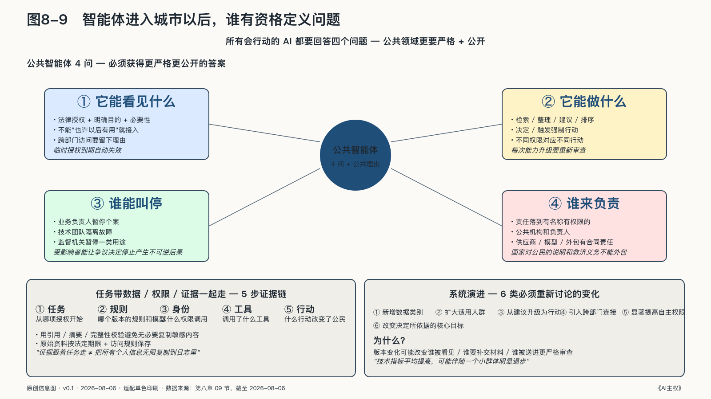

## 智能体进入城市以后，谁有资格定义问题

所有会行动的AI都要回答四个问题：它能看见什么，它能做什么，谁能叫停，出了问题谁负责。到了国家层，这四个问题必须获得更严格、更公开的答案。

**它能看见什么。** 数据访问要同时受到法律授权、明确目的和必要性限制。系统不能因为"也许以后有用"就接入一切。跨部门访问应留下理由，敏感数据应分区，临时授权到期后要自动失效。

**它能做什么。** 信息检索、材料整理、形成建议、改变排序、作出决定、触发强制行动，应当对应不同权限。智能体不能从"帮助工作人员"悄悄成长为"替机构采取行动"，每次能力升级都要重新审查。

**谁能叫停。** 叫停权不能只掌握在系统建设者手里。业务负责人需要暂停个案行动，技术团队需要隔离故障，监督机关需要暂停一类用途，受影响者需要让争议决定在复核期间停止产生不可逆后果。

**谁来负责。** 责任必须落到有名称、有权限的公共机构和负责人。供应商、模型和外包团队可以分别承担合同与专业责任，国家对公民的说明和救济义务不能外包。

到了公共领域，AgenticOps 还须接受法律授权、程序正当与公民救济的约束：高影响行动不仅要可追踪、可复核、可归责，还要让受影响的人能够改变错误结果。

### 让任务带着数据、权限和证据一起走

传统政务系统常按部门分库，而一项任务进入智能体网络后，可能在身份平台、收入数据库、住房系统、外部模型和通知服务之间连续跳转。每个单独调用都可能"已授权"，组合起来却未必仍是那项被授权的公共任务。

例如，一个智能体可以为核验住房补助读取家庭收入，另一个可以为反欺诈查看异常关联。技术平台若只看两者都属于"政府内部访问"，就容易把不同目的压成同一种权限。结果是，一项为发放救助而开放的数据，通过几次合法调用，最后可能进入原本没有说明的调查与画像。

数据除了标明"谁能读"，还要说明"为什么读"和"读了以后能做什么"。权限应随具体任务发放，在目的完成、期限届满或当事人提出异议时收回，不能成为智能体登录后长期占有的资产。NIST 对软件与AI智能体身份的研究也把识别、授权、审计和不可抵赖放在同一个问题中：只知道"谁登录了"，并不足以说明一次代理行动是否被正当授权。[^p7-agent-identity]

一条可用的证据链要能回答：任务从哪项授权开始，用了哪个版本的规则和模型，谁以什么权限调用了什么工具，证据在哪一步被摘要或改变，什么行动真正改变了公民的状态。美国政府问责局的AI问责框架把治理、数据、性能和持续监测连在一起：政府不能只证明一个模型曾经通过测试，还要能证明它在真实任务中使用了适当数据、处于已授权的位置，并在运行中持续受到检查。[^p7-gao-accountability]

这条证据链还要经得住时间。商业模型可以在后台频繁升级，公共权力却不能在一次无声更新中改变含义。同一份申请，星期一因模型版本不同被接受，星期二被拒绝，机构不能只回答"系统已优化"。它要知道什么变了、为什么允许改变、影响了哪些人，旧案件是否需要重新检查。

国家对自己的记忆，不是把每个版本永久冻结，而是在系统演进时仍能说清某一天的公共权力以什么形式运行，并在新证据出现后找回受到影响的人。

### 谁有资格定义问题

许多公共技术项目在最后阶段才出现"征求意见"——系统目标已定，合同已签，公众能讨论的只剩界面颜色和通知文字，通常已难以改变关键选择。参与最早应发生在问题被定义的时候。一个部门发现申请积压，可以把问题说成"怎样用AI更快拒绝不合格申请"，也可以追问"为什么居民很难一次提交正确材料"。前一种说法导向更强的筛选，后一种可能发现真正的瓶颈是表格、政策语言和部门协作。技术不会中立地接过问题，它会放大问题被定义的方式。

系统设计时，最容易受影响的人还掌握着测试集看不见的现实：临时工的收入怎样波动，残障者怎样使用网站，家暴受害者为什么不能提供普通住址。把这些经验带进设计，不是用个人故事代替专业判断，而是补上专业团队缺少的环境知识。

AI 带来的另一个挑战是时间。传统公共项目可能几年不变，模型和智能体却可以每周更新。公众不可能参与每一次技术调整，但机构可以预先约定哪些变化必须重新讨论：新增数据类别、扩大适用人群、从建议升级为行动、引入跨部门连接、显著提高自主权限、改变决定所依据的核心目标。系统演进不应成为绕开授权的后门。

参与不等于让所有人对每个系统投票——公开说明、试点反馈、领域代表和正式听证服务于不同情形；关键是人们能否在决定仍可改变时进入，以及机构是否必须回应。一次参与只收集意见却不说明采纳了什么、拒绝了什么以及为什么，很容易变成信任表演。

机器可以帮助政府行动，却不能替政府取得授权，也无权替公民放弃申诉。技术每次更新，机构还得记得自己此前怎样行使过权力。有了这些约束，基础设施、产业、人才、城市和国际合作才谈得上积累为长期能力。
