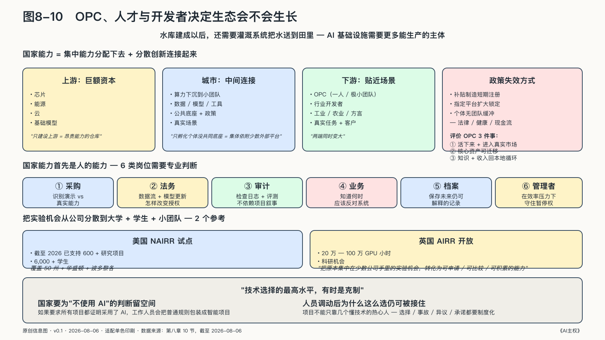

## 生产主体决定生态会不会生长

一座城市拥有算力和模型，不等于它已经拥有AI产业。AI基础设施也需要足够多能发现问题、组织任务、交付产品并承担责任的生产主体。

大型企业、大学、医院和公共机构当然是这样的主体，但AI正在增加另一种可能：一个人或极小团队借助Agent、开放软件、云服务和协作网络，也能形成完整的市场单元。OPC 的国家意义不在于"少雇几个人"，而在于它可能把原本只属于大型组织的研究、开发、运营和跨境服务能力，分配给更多个人——城市与国家不必把每件事都寄望于少数大企业，可以借助 OPC 群体接住创新密度。

截至二〇二六年八月，中国多座城市已经把这种判断写进正式政策。深圳把算力、模型、数据、开源工具、投融资和社区服务放入OPC行动计划；北京增加模型券、算力券、公共数据、登记和专业服务；广州开始尝试覆盖准入、经营与退出的沙盒监管。政策密集出现证明城市正在识别一种新组织形态，不能证明园区和补贴会自然产生高质量企业。[^p7-opc-policy]

武汉的政策把这个判断落到资源入口：对OPC算力费用按比例补助，并要求生态社区提供免费卡时。[^p8-wuhan-opc-compute] 它和上海的三类券、苏州的场景开放形成同一条政策链：让小团队先取得算力、模型和语料，再进入真实任务。链条是否有效，不能看券发了多少，而要看OPC能否产生收入、保留客户，并在补贴停止后继续运行。

如果 OPC 只是共享办公室里的新标签，它与AI主权几乎无关。如果一座城市能让个人和小团队公平取得多元算力、模型、数据空间、开发工具、身份、支付、法务和真实场景，同时保有自己的客户关系、任务数据、评测和工作流，它就在扩展本地社会参与AI生产的能力。

对这些微型组织，AgenticOps 不能只是大企业买得起的一套治理软件。城市共同底座可以提供机器身份、权限模板、测试沙箱、基础评测、行动收据和紧急停止接口，让一个人也能按组织标准管理Agent；具体业务规则、客户资产和是否发布，仍由 OPC 自己决定。公共能力降低安全与合规的固定成本，却不接管企业。

评价 OPC 生态不能只数公司、工位和活动，应当看三件事：这些主体能否活下来并进入真实市场；能否把核心资产迁移到另一套技术；它们的知识和收入是否真的回到本地能力循环。

两端会同时变大。一端是需要巨额资本的芯片、能源、云和基础模型；另一端是贴近细分问题、能够迅速试错的 OPC 和小团队。城市处在两者之间：把集中的能力分配下去，把分散的创新连接起来。它若只建设上游，会成为昂贵能力的仓库；若只孵化个体而没有共同底座，创业者又会集体依附少数外部平台。

这种政策也有自己的失效方式：补贴可能制造短期注册而不是长期收入，指定平台可能用公共资金扩大锁定，个体经营者可能承受没有团队缓冲的法律、健康和现金流风险。

### 公共机构也需要自己的专业主体

谈到国家AI能力，人们最容易看见机房、模型、实验室和投资数字；更难看见的，是有没有足够多的人理解这些系统，并在不同位置作出负责任的判断。

政府需要优秀工程师，但只招工程师还不够。采购人员要能识别演示与真实能力的差别，法务要理解数据流和模型更新怎样改变授权，审计要能检查日志与评测，业务人员要知道何时应该反对系统，法官和申诉机构要能处理自动化证据，管理者要在效率压力下守住暂停权。大模型可以解释代码、生成测试和辅助分析，降低一部分学习门槛，却不能替机构形成稳定的专业共同体——如果只有模型会解释系统而内部人员不会，所谓能力仍寄存在外部服务里。

国家能力还需要制度化的职业记忆：项目不能只靠几个懂技术的热心人维持；人员调动后，为什么选择某个阈值、发生过哪些事故、哪些群体曾经提出异议、供应商承诺过什么，都要能被后来者接住。

美国 NAIRR 试点截至二〇二六年已支持六百多个研究项目、六千名学生，覆盖五十个州、华盛顿特区和波多黎各；英国则通过 AIRR 开放过二十万至一百万GPU小时的科研机会。它们的意义不只是"买了多少卡"，而是把集中在少数公司手里的实验机会，转化为学生、大学、公共研究者和小团队可以申请、比较和积累的能力。[^p7-public-compute-2026]

国家也要为"不使用AI"的专业判断留下空间。如果机构要求所有项目都证明采用了AI，工作人员就会把普通规则、搜索和流程改造包装成智能项目。成熟的能力也包括识别何时不需要模型——技术选择的最高水平，有时是克制。

一个公共部门只有在供应商离场后仍知道系统做过什么、怎样维护、如何迁移，才拥有可延续的能力；内部能力成熟以后，国际合作才不只是接受外部方案，而是带着选择权的交换。
