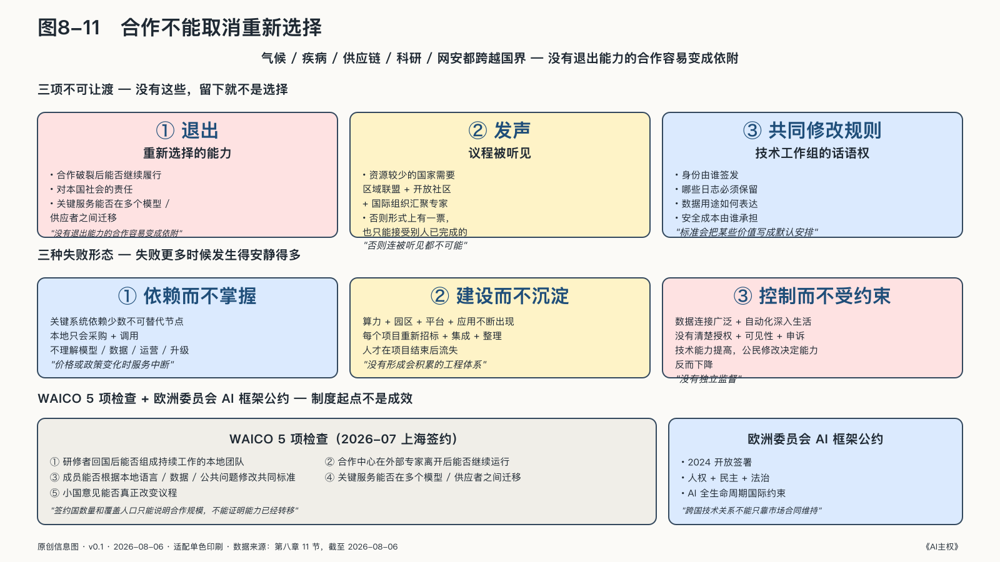

## 合作不能取消重新选择

气候、疾病、供应链、科学研究和网络安全都跨越国界。没有国家能够独自获得全部数据、人才和技术；封闭会让各方重复建设，也会让小国和资源有限地区被排除在能力增长之外。

合作本身并不削弱主权，问题仍然是合作关系怎样设计。

一项稳定的跨境合作需要知道各方贡献什么、获得什么，数据和模型受什么规则约束，争议由谁解决，环境变化时能否重新谈判，退出后怎样继续履行对本国社会的责任。

如果一个国家参加共同平台后无法带走自己的公共数据，无法检查关键规则，也不能在对方改变条件时维持基本服务，这种合作就把效率建立在单向依赖上。相反，各方使用共同标准、保留自己的治理能力、能平等参与规则变化，连接越深也可能越有韧性。

国际标准同时影响互操作和利益分配。

它们降低系统连接和替换的成本，让各国医院、研究机构、企业和公共部门不必从零开始；同时，标准会把某些价值写成默认安排。身份由谁签发，哪些日志必须保留，数据用途如何表达，安全成本由谁承担，都可能在技术工作组里被确定。

参与标准制定需要持续的技术和制度能力，不能只派代表出席会议。资源较少的国家尤其需要通过区域联盟、开放技术社区和国际组织汇聚专家，否则即使形式上拥有一票，也只能接受别人已经完成的设计。

二〇二六年世界人工智能大会开幕前一晚，二十九个国家的代表在上海签署成立世界人工智能合作组织协定。协定将其界定为总部设在上海的独立政府间国际组织，任务包括人工智能能力建设、发展战略与治理规则协调、技术标准对接和应用合作。次日，习近平宣布未来五年向发展中国家提供五千个人工智能专题研修名额，面向东盟、阿盟、非盟、拉共体、上合组织和金砖国家建设人工智能应用合作中心。[^p7-waico]

人工智能的关键资源和规则高度集中，许多国家既没有前沿训练集群，也很难长期派专家进入所有标准组织。一个政府间平台如果能让它们共同提出需求、建设本地人才、对接标准并分享可运行的公共应用，就可能把“形式上的国家主权”增加为“参与智能秩序的实际能力”。会后公布的三项工作方向把优先级放在能力建设、开源生态和落实《全球数字契约》，而不是另造一套排他的技术体系。[^p7-waico]

签约国数量和覆盖人口只能说明合作规模，不能证明能力已经转移。还要看研修者回国后能否组成持续工作的本地团队，合作中心能否在外部专家离开后继续运行，成员能否按自己的语言、数据和公共问题修改共同标准。对全球南方而言，这些定义、部署、纠错和退出能力，比被统计为某阵营的覆盖人口更有实际意义。

WAICO与联合国人工智能科学小组、全球人工智能治理对话等机制不处在同一层级：后者提供科学评估与多边对话场域，前者更可能靠培训、联合研究、标准对接和应用项目把共识变成能力。成立协定只是制度起点，不是成效证明。仍要观察秘书处与资金怎样运行，项目是否留下本地能力，以及小国的意见能否真正改变议程。

二〇二四年开放签署的欧洲委员会AI框架公约，把人权、民主和法治带入AI全生命周期的国际约束讨论。[^p7-coe] 它不提供一套可复制到所有地方的系统图，却说明了一个事实：跨国技术关系不能只靠市场合同维持，还需要共同承认一些不应被效率交换掉的底线。

共同接口不要求各方放弃自己的法律、利益和文化。只要这些差异能够在规则中表达，并保留必要时重新选择的能力，合作就不会自动变成依附；只有退出、发声和共同修改规则都真实存在，留下才是一种选择。

### 从供应安全到能力积累

国家AI主权并不只会败在“被断供”这种戏剧性时刻。更多时候失败安静得多：项目还在运行，预算还在增加，能力却没有留在本地；系统越来越强，普通人改变错误决定的入口却越来越窄。这些失败大致有三种形态。

第一种是**依赖而不掌握**。关键系统依赖少数不可替代节点，本地机构只会采购和调用，不理解模型、数据、运营与升级。价格、政策或供应变化时，服务中断，过去运行产生的经验也随供应商一起离开。

第二种是**建设而不沉淀**。算力、园区、模型平台和示范应用不断出现，每个项目却重新招标、重新集成、重新整理数据。企业没有可复用的技术资产，人才在项目结束后流失，平台靠下一笔建设预算维持。这种失败在城市层有一个更常见的版本：把生态做成一个新的政府信息化项目，成败不看建成多少页面和机房，而看能否持续吸引外部贡献、产生商业价值。

第三种是**控制而不受约束**。公共机构连接广泛数据，自动化深入生活各处，却没有清楚授权、可见性、申诉和独立监督。国家的技术能力提高了，公民和组织修改机器决定的能力反而下降。

成熟的国家AI主权必须同时跨过这三道门槛。

它首先是一个开放的吸收体系：国家不包办全部技术，而是让全球与本地、开放与商业、大型与小型、多种芯片与云服务进入可比较的供给结构。多元供给降低单点依赖，也让本地企业站在世界已有成果上继续创新。

它还需要一体化的生产体系：标准、资产、身份、评测、调度、证据和反馈能够贯通，但不要求技术单一。企业在一个城市形成的模型、数据产品、Agent或行业方法，经授权和验证后，可以进入另一个组织和地区；公共部门不必反复购买同一种基础能力。

这套体系还要持续学习。应用运行会暴露模型缺陷、产生行业知识和评测、训练人员理解技术边界。AgenticOps把反馈带回资产层，数据空间让多主体在保留原始数据边界的情况下协作，开源生态把一部分成果变成后来者可以继续使用的共同底座。

最后，它必须是一个受公共规则约束的价值循环。产业增长、服务收入、财政增量和人才集聚应当反哺基础设施、教育科研与公共服务；公共数据产生的收益不能只流向运营商和供应商，风险也不能只留给被记录的人。国家既要有能力组织生产，也要有制度说明收益如何分配、哪些数据不可交换、哪些行动必须由人决定。

国家在这里同时承担四种角色：建设共同底座，组织多元生态，保护长期学习资产，约束公共权力。任何一种角色吞并其他角色都会失衡。国家若替代市场选择所有模型，生态会失去探索；市场若独占公共数据和控制层，社会会失去方向；运营主体若只追求平台收入，基础设施会偏离公共目标；公共机构若只讲权利却没有技术和产业能力，规则也会变成依赖供应商执行的愿望。

评价国家AI能力时，除了算力、模型、专利和投资，还要检查资源能否切换、企业是否形成可复用资产、本地团队能否独立维护、运行数据是否在合法边界内产生新能力、产业收入与人才是否持续增长、公共服务是否改善、外部合作结束后飞轮能否继续转动。

这就把本书推向最后一个问题。到这里，每一级主权的答案都不是“切断依赖、独自拥有一切”——芯片、云、模型和协议的相互依赖无法消除，也不应被消除。那么，承认依赖之后，自由还能剩下什么？个人、组织和国家怎样在依赖之中仍然保有选择？这是第三部要回答的问题。
