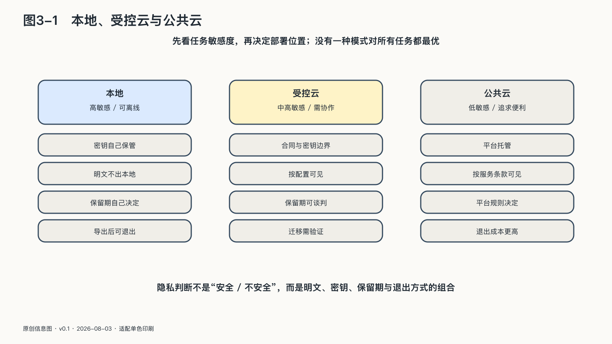

## 本地、受控云与公共云

个人选择AI时，常被迫在两个口号之间摇摆：全部放在本地，或者放心交给云端。

实际生活更适合三种模式并存。

**公开协作模式**处理本来就准备公开或低敏感的材料。整理新闻、修改公开文章、生成旅行候选路线，可以利用云端模型的强能力和便利。重点是核验结果，而不是把所有计算留在设备上。

**受控云端模式**处理需要强能力、但可以在最小化以后交给外部系统的任务。合同原文留在本地，程序只提取不含身份的条款结构；医疗记录不整体上传，只把经过本人确认的问题交给专业服务。这里的关键是知道送出了什么、服务怎样保存、任务完成后如何删除或撤回授权。

**本地私密模式**处理不适合离开设备或个人控制环境的内容：未公开创作、私人日记、身份材料、密钥、敏感客户资料，以及事故取证中的真实攻击载荷。模型能力可能较弱，维护成本也更高，但数据路径更短、更容易在断网时继续。

三种模式不是安全等级排行榜。

本地运行无法自动阻止恶意模型文件、错误权限和设备丢失；云端服务也不必然意味着数据会被滥用。选择取决于资料敏感度、任务需要、提供者承诺、实际控制和替代能力。

一个任务还可以跨模式协作。

例如，个人先在本地从报税资料中提取必要数字，用确定性程序核对合计，再把不含身份的税务问题交给云端模型解释，最后由本人和专业人员确认。最敏感的原始资料没有离开，外部能力仍然得到利用。

这是一种面向任务的隐私观：不问“我使用的AI究竟是本地还是云端”，而问“这一项资料在这一项任务里为什么需要移动，移动到哪里，产生什么新结果”。

### 派生数据也属于你的生活

平台容易把“用户提供的数据”与“系统生成的数据”分开。对个人而言，这种区分并不充分。

一段日记是用户提供的，系统对它生成的情绪标签、性格推断和关系摘要却同样影响未来推荐。客户邮件属于原始资料，AI形成的“价格敏感”“可能流失”标签也会影响沟通方式。原文可以删除，派生标签仍可能继续存在。

所以，个人主权不仅要求带走自己上传的文件，也要能够看见、纠正和删除那些持续影响自己的重要推断。并非所有临时中间结果都要保存；越能改变长期记忆、权限和决策的派生数据，越需要被当作个人智能资产管理。

对OPC尤其如此。客户画像、项目风险、写作风格、定价建议和优先级看似只是机器辅助，日积月累后却构成公司的经营记忆。若这些只能在一个平台里存在，迁移时带走了文件，仍可能失去业务判断的连续性。
