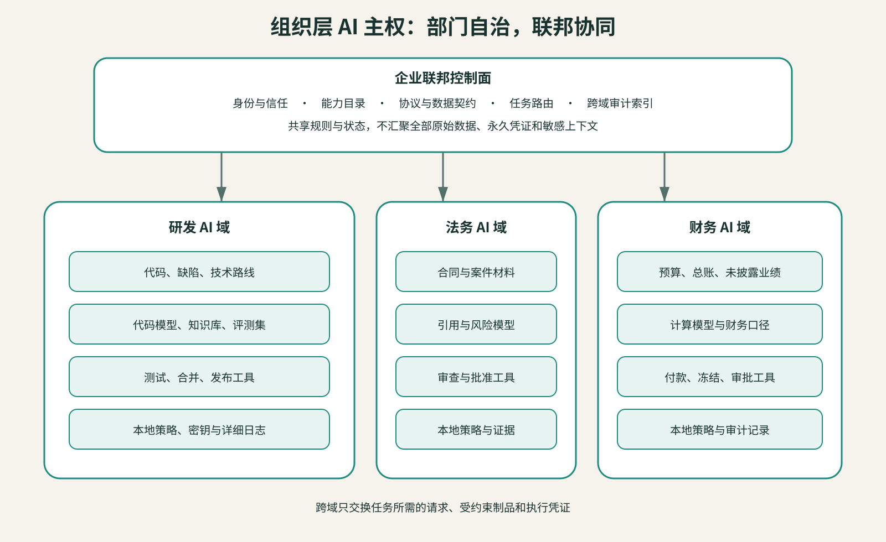

## 每个部门都应有自己的AI域

部门AI域不要求每个部门采购一套独立平台，也不要求重复训练基础模型。最低要求是以下五类配置能够由部门独立治理。

一个完整的部门域包含五部分：

1. **数据与知识**：哪些资料能被索引，哪些只能现场查询，哪些永不进入模型上下文；
2. **模型与提示**：允许使用哪些模型，专业术语、规则和评测集由谁维护；
3. **工具与行动**：可以读取什么、修改什么、提交什么，哪些动作必须由人确认；
4. **身份与策略**：谁或哪个智能体正在请求，以什么目的，在多长时间内有效；
5. **日志与证据**：发生过什么，使用了哪个版本，谁能复盘和撤销。

部门可以共用企业提供的算力、模型网关、身份系统和智能体开发框架，却必须拥有自己的命名空间、密钥、知识索引、策略和审计视图。共享底座降低重复建设，独立治理面避免共享变成越权。

图中三个部门复用企业联邦层。跨域请求必须经过联邦层识别、约束和记录，不能绕过边界直接读取另一部门的数据库。部门也可以选择不同模型：法务侧重引用与保密，研发侧重代码与工具调用，财务侧重结构化计算。负责结果的部门需要保留相应的技术选择权。
