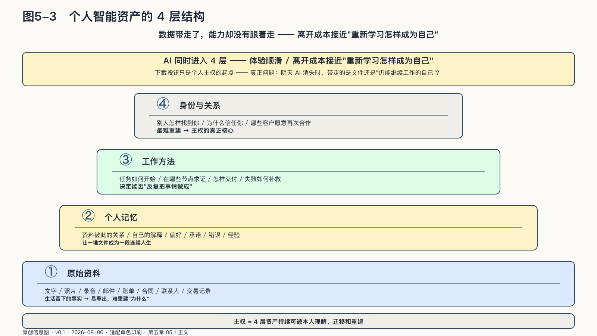
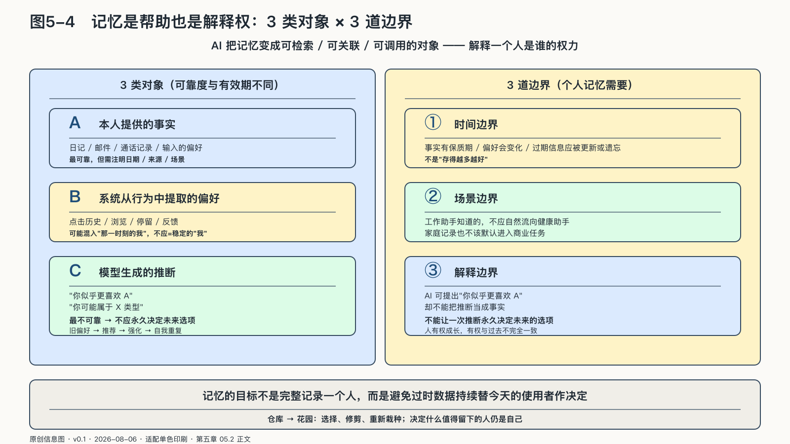

## 个人智能资产怎样形成

把一个AI账户完整导出，通常并不难。压缩包里可能有几千段对话、附件和时间戳，文件一份不少。可当这些材料被放进另一套系统，原来的工作往往并不会自动恢复：它不知道哪位客户不能在周五打扰，不知道哪版报价已经作废，也不知道一句简短批注背后藏着怎样的判断标准。

数据带走了，能力却没有跟着走。我们过去习惯用物品理解所有权：电脑放在书桌上，所以电脑是我的；照片存在硬盘里，所以照片是我的。进入AI时代以后，这种直觉开始失效。

一份文档当然是资产，但文档为什么重要、它与哪位客户有关、从哪个版本演化而来、哪些观点已经被作者放弃，这些关系也具有价值。一段提示词可以复制，长期形成的判断标准却很难一键导出。一个人越来越多的能力已经散落在平台设置、聊天历史、自动化规则和模型对他的隐含理解里，很难再以“文件”为单位搬走。

个人智能资产大致可以分成四层。
<!-- 图稿需求：图5-3（原创信息图 + 网络公开图）；详见 90_出版工作台/02_图稿清单.md -->

最底层是**原始资料**：文字、照片、录音、邮件、账单、合同、联系人和交易记录。它们是生活留下的事实。事实之上，是资料彼此的关系，是自己的解释、偏好、承诺、错误和经验——也就是让一堆文件成为一段连续人生的**个人记忆**。

再往上，是一件事如何开始、经过哪些判断、在哪些节点需要求证、怎样交付、出了问题如何补救。这些**工作方法**决定了一个人能否反复把事情做成。最难重建的则是**身份与关系**：别人怎样找到你、为什么信任你，哪些客户愿意再次合作，你在什么共同体里拥有声誉。

AI能够同时进入这四层。它读取原始资料，整理个人记忆，参与工作流程，还可能代表我们维系关系。当这些层全部收进同一个产品时，体验会非常顺滑：不用反复解释，也不用到处寻找。代价是，离开的成本不再等于“换一个软件”，而接近于“重新学习怎样成为自己”。

下载按钮能解决文件搬家，解决不了人的搬家。熟悉的AI如果明天消失，那些客户习惯、判断标准和做事方法还能不能在别处接着用，才决定一个人究竟带走了多少。

四层资产里，最先把“方便”变成“依赖”的往往不是文件，而是记忆。文件还能按名称导出；模型替人形成的偏好、关系和解释，常常没有清楚边界。

### 记忆是帮助，也是解释权

记忆型AI很容易令人着迷。它记得你不吃香菜，记得母亲上次检查的日期，记得某位客户不喜欢过于热情的措辞，也记得你半年前说过想写一本书。每次使用时少说几句话，日积月累便形成一种“它懂我”的感觉，但机器的记忆与人的记忆并不相同。

人的记忆会遗忘，会因新的经验而改变，也会在不同关系中保留不同边界。我们对医生讲身体，对朋友讲脆弱，对同事讲计划，对家人讲牵挂。这些内容共同属于一个人，却不意味着它们应该被放进同一个房间。

机器倾向于把记忆变成可检索、可关联、可调用的对象。一条信息被保存后，原本的场景可能消失了。深夜情绪低落时的一句话，几年后可能被当成稳定偏好；为某个客户临时采用的语气，可能被误认为个人风格；已经改变的价值判断，也可能持续影响系统对“你想要什么”的预测。系统由此获得了解释一个人是谁的权力。
<!-- 图稿需求：图5-4（原创信息图 + 网络公开图）；详见 90_出版工作台/02_图稿清单.md -->

这并不是遥远的伦理假设。Replika允许用户生成可以扮演知己、治疗师、恋爱伴侣或导师的虚拟角色，关系越深入，用户越可能交出情绪、健康、亲密关系等高敏感信息。二〇二五年，意大利数据保护机构对运营方Luka处以五百万欧元罚款：监管机构认定，截至二〇二三年二月二日，公司没有为相关数据处理确定合法依据，隐私说明存在多项不足，而且当时没有真正的年龄验证机制。监管机构还另行调查支撑服务的生成式AI模型如何处理个人数据。[^p4-replika]

这个案件不足以证明所有陪伴型AI都会伤害用户，也没有给出理想记忆系统的设计方案。它显示的现实落差是：产品可以用“它懂你”建立亲密感，后台却可能连最基本的处理依据、告知和未成年人保护都没有完成。机器记得越多，用户越需要知道记住了什么、为什么可以记、会被拿去做什么。

如果个人记忆只能增加，不能查看、修改和删除，AI了解的就不再是今天的你，而是一个由旧痕迹拼成的你。如果系统能够跨越工作、健康、消费和社交场景调用这些痕迹，它得到的也许不是更完整的人，只是更容易被预测的人。

个人记忆需要三种边界。第一种是时间边界。事实有保质期，偏好会变化，过期信息应当被更新或遗忘。
第二种是场景边界。工作助手知道的事情，不应自然流向健康助手；家庭记录也不该默认进入商业任务。
第三种是解释边界。AI可以提出“你似乎更喜欢A”，却不能把推断当成事实，更不能让一次推断永久决定未来的选项。

人有权成长，也有权与过去不完全一致。一个尊重个人主权的记忆系统，应该允许这种不一致存在。

在前述个人记忆这一层，还要区分三类对象：本人提供的事实，系统从行为中提取的偏好，以及模型进一步生成的推断。三者的可靠性和有效期不同，不应混成一份持续累积的“用户画像”。否则，旧偏好会继续影响推荐，推荐又会强化原有行为，最终形成自我重复的反馈回路。

个人记忆不能只提供导出。事实从哪里来，哪些内容只是模型推断，记录是什么时候形成的、准备用在哪个场景，都应该分得出来；本人还要能纠正和删除。否则，一份越来越完整的记录，反而会让过去替今天的人作决定。

#### 保存之后还要整理

许多人已经积累了成千上万条对话，却很少回看。保存所有内容容易产生一种安全感：以后总能找到。实际情况常常相反，数量越大，重要的承诺和经验越难出现。

个人知识库不能只追求装得更多。资料进入时要标明来源和日期，事实与个人判断分开，已经过时的内容定期清除；影响长期行动的原则，则由本人重新写成自己的话。AI可以帮助分类、找重复、提醒冲突，但决定什么值得留下的人仍然是自己。

整理当然比一键保存麻烦。但如果一个人从不参与筛选和改写，最后替他解释一生的，就会是平台留下的记录。AI越熟悉过去，今天的使用者越需要给自己留下改口的余地。
