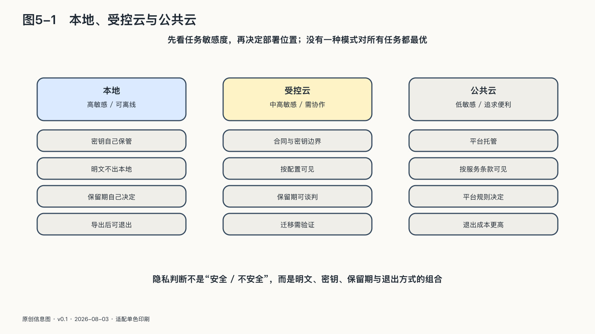

## 本地、受控云与公共云

个人选择AI时，常被迫在两个口号之间摇摆：全部放在本地，或者放心交给云端。

实际生活通常需要三种模式并存。

**公开协作模式**处理本来就准备公开或低敏感的材料。整理新闻、修改公开文章、生成旅行候选路线，可以利用云端模型的强能力和便利。重点是核验结果，而不是把所有计算留在设备上。

**受控云端模式**处理需要强能力、但可以在最小化以后交给外部系统的任务。合同原文留在本地，程序只提取不含身份的条款结构；医疗记录不整体上传，只把经过本人确认的问题交给专业服务。这里的关键是知道送出了什么、服务怎样保存、任务完成后如何删除或撤回授权。

**本地私密模式**处理不适合离开设备或个人控制环境的内容：未公开创作、私人日记、身份材料、密钥、敏感客户资料，以及事故取证中的真实攻击载荷。模型能力可能较弱，维护成本也更高，但数据路径更短、更容易在断网时继续。

这三种模式不能直接排成安全等级。本地运行挡不住恶意模型文件、错误权限和设备丢失，云端服务也不必然滥用数据。选择取决于资料敏感度、任务需要、提供者承诺、实际控制和替代能力，同一项任务还可以跨模式协作。

以一个解释性的报税流程为例：个人先在本地从资料中提取必要数字，用确定性程序核对合计，再把不含身份的税务问题交给云端模型解释，最后由本人和专业人员确认。它不是某个产品的真实客户案例，而是在说明一种可验证的分工：最敏感的原始资料没有离开，外部能力仍然得到利用。

这是一种面向任务的隐私观：不问“我使用的AI究竟是本地还是云端”，而问“这一项资料在这一项任务里为什么需要移动，移动到哪里，产生什么新结果”。

### 派生数据也属于你的生活

平台容易把“用户提供的数据”与“系统生成的数据”分开。对个人而言，这种区分并不充分。

美国联邦贸易委员会处理Everalbum照片应用时，遇到的正是这条缝隙。FTC指控该公司曾向部分用户表示，只有主动开启才会对照片使用人脸识别，同时承诺账户停用后删除照片；监管材料称，实际上一些用户的人脸识别默认开启，已停用账户的照片和视频也曾被长期保留。更关键的是，公司已经从用户照片中提取人脸特征并用于开发识别技术。二〇二一年最终和解不仅要求删除相关照片和人脸特征，还要求删除由这些材料开发的模型与算法。原始照片、派生特征和训练成果第一次在同一项删除义务中被连了起来。[^p4-derived-data]

Everalbum不是生成式AI案例，也不能直接决定今天大模型记忆的法律归属。它揭示的控制问题却完全相同：如果平台只删除用户看得见的原文，却继续保留由原文形成、仍会影响未来判断的模型资产，“删除”就只完成了最表面的一层。

一段日记是用户提供的，系统对它生成的情绪标签、性格推断和关系摘要却同样影响未来推荐。客户邮件属于原始资料，AI形成的“价格敏感”“可能流失”标签也会影响沟通方式。原文可以删除，派生标签仍可能继续存在。

个人除了带走自己上传的文件，还需要看见、纠正和删除那些会持续影响自己的重要推断。临时中间结果没有必要全部保存；越能改变长期记忆、权限和决定的派生数据，越需要有清楚的管理方式。

派生数据不仅记录过去，也会决定系统下一次把什么放到眼前、推荐哪条路径。个人因而不仅要管资料存在哪里，还要管这些推断怎样塑造自己的注意力与判断。
