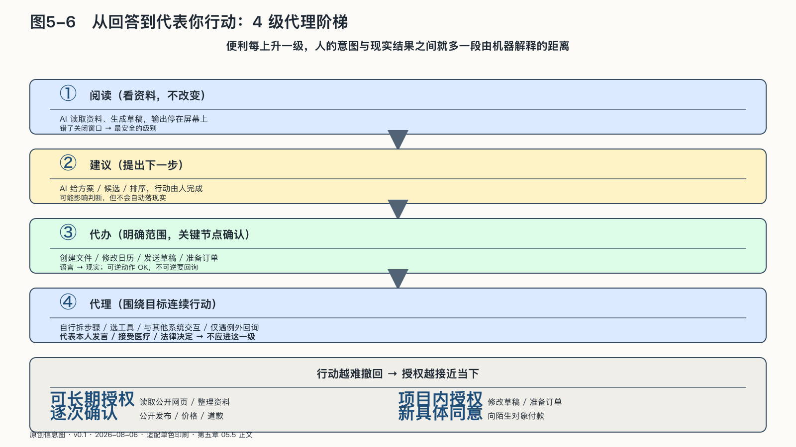
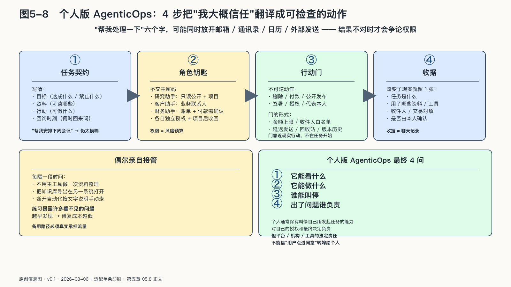
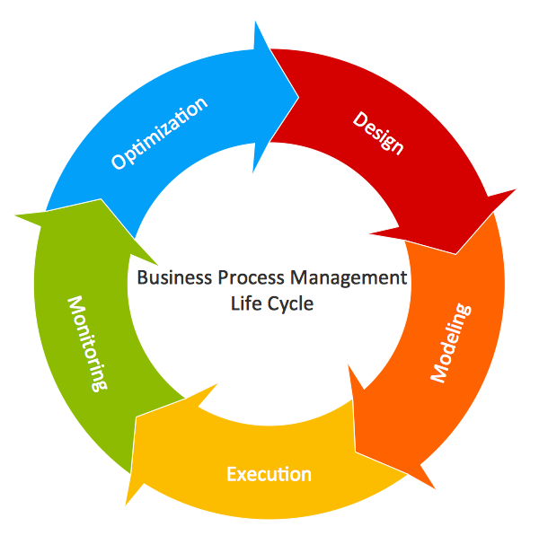

## 从回答问题到代表你行动

一句“帮我把下周安排好”，放在聊天框里只是一个请求；交给连着日历、邮箱、票务和支付账户的智能体，就可能变成十几项真实动作。会议被挪动，邀请被发出，机票被预订——每一步都合乎某种解释，却未必合乎说话者原本的意思。

个人使用AI，正沿着一条不易察觉的代理阶梯向上移动。最初，AI只回答问题，输出停留在屏幕上，错了可以关闭窗口；随后，它开始阅读资料并给出建议，错误可能影响判断，但行动仍由人完成；再往上，它获得创建文件、修改日历、发送消息和下单购买等工具权限，语言由此变成现实动作；到了连续代理阶段，人只给出目标，智能体自行拆解步骤、选择工具并与其他系统交互，遇到例外才回来询问。

便利每上升一级，人的意图与现实结果之间就多一段由机器解释的距离。一个模糊目标在问答阶段只会得到一段不理想的文字；在代理阶段，却可能成为一封发出的邮件、一笔付掉的钱，或者一段受损的关系。

授权因此要跟着任务走，而不能一次性授予整个产品。同一个AI可以获准整理公开资料，但不能因此读取所有私人文件；可以在限定金额内购买办公用品，却不能自动接受新的商业条款；可以起草给客户的回复，但涉及价格、承诺和道歉时，应回到本人确认。

在最低一级，系统只是**阅读**：它看资料，却不改变任何东西。向上一层是**建议**：它提出下一步，由人决定。再向上是**代办**：系统在明确范围内行动，并在关键节点回来确认。最高一级才是**代理**：它围绕目标连续行动，只在识别出异常时停下。

这四级区分的是责任强度，不是技术成熟度。
<!-- 图稿需求：图5-6（原创信息图 + 网络公开图）；详见 90_出版工作台/02_图稿清单.md -->

一项任务即使技术上可以全自动，也可能应该永远停在“建议”。代表个人表达立场、处理亲密关系、同意医疗方案，都属于这一类。

这条阶梯可以压缩成一个实用原则：**行动越难撤回，授权越接近当下。**

读取公开网页可以长期授权；修改草稿可以在一个项目内授权；发出公开声明应当逐次确认；向陌生对象付款则需要新的、具体的同意。这样设计会牺牲一点流畅，却保住了“这一行动确实来自我”的证据。

### 个人版AgenticOps：让代理有边界地工作

最危险的授权，往往看起来不像授权。“帮我处理一下”只有六个字，却可能同时放开邮箱、通讯录、日历和外部发送权限。等到结果不对，人们才会回头争论：系统究竟被允许做到哪一步？

个人不需要建设一套沉重的AgenticOps平台。个人版AgenticOps要做的，只是把企业级控制问题翻译成四个日常动作：先写清任务，给数字角色单独钥匙，把不可逆行动放在确认门后，再保留本人能够理解的行动收据。
<!-- 图稿需求：图5-8（原创信息图 + 网络公开图）；详见 90_出版工作台/02_图稿清单.md -->

“我大概信任这个工具”翻译成几项能被检查的日常动作。

#### 先写一份任务契约

例如，“帮我安排下周会议”仍然太模糊。更清楚的任务契约是：读取工作日历和三位参会者提供的空闲时间，只建议两个工作日内的时段，不取消既有会议，不向外发送邀请，等我确认后再执行。短短几句话同时写清了目标、资料、行动和返回询问的时刻，也迫使委托者发现自己是否真的想清楚了任务。

#### 给数字角色单独的钥匙

一个万能智能体连通邮箱、网盘、通讯录、支付和社交账号，看起来最方便，也最危险。一处错误便能沿着全部连接扩散。

更稳妥的办法是按角色拆分权限。研究助手读取公开资料和指定项目文件；客户助手访问业务联系人，却看不到私人通讯；财务助手读取账单，但付款另需确认。每个角色使用独立授权，完成项目后收回。

个人最容易忽略的是权限颗粒度：读取日历忙闲状态，不等于读取每场会议的标题和附件；查找一个指定文件，不等于浏览全部网盘；准备邮件草稿，也不等于直接发送。日程助手若还会调用地图、票务、支付和邮箱，更要看清权限是否继续交给了别的服务，哪些步骤仍会回来确认。

落到日常习惯，可以优先使用能显示范围和到期时间的授权，不向智能体交出主密码；不同角色使用不同连接；每月查看仍然有效的第三方访问，不用的立即撤销。权限的本质是风险预算：让系统触碰多少现实，就要准备承担多大后果。

#### 把不可逆行动放在门后

删除、付款、公开发布、签署、授权和代表本人发言，具有共同特点：它们很难彻底撤回。

个人可以为这些动作设置一道“行动门”。智能体在门前准备材料、检查条件、生成预览；人看见将要发生的具体结果后，再决定是否放行。门的位置应该靠近现实行动，而不是早在任务开始时用一句“你可以帮我处理”概括授权。

金额上限、收件人白名单、延迟发送、回收站和版本历史，都是行动门的不同形式。它们并不聪明，却比一句“请谨慎”可靠。

#### 保留能理解的行动记录

个人不需要为每次摘要生成复杂审计报告，但只要智能体改变了现实，就应该留下一张容易理解的“行动收据”。它可以很短：任务是什么，使用了哪些资料，调用了哪个工具，谁是收件人或交易对象，发生了什么结果，是否由本人确认。

收据与聊天记录不同。聊天记录保存语言过程，行动收据保存责任事实。

一个旅行Agent讨论过十几家酒店并不重要；最后替你预订了哪一家、使用什么价格和取消条款、付款由谁确认，才是未来处理纠纷需要的内容。写作Agent生成过多少版本也不重要；公开发布的是哪一版、用了哪些来源、谁按下发布，才决定作者责任。

个人行动收据还应让人一眼看见异常：系统使用了未授权资料，收件人不在原任务中，支付金额超过预算，或者某个动作发生在本人离线期间。日志若只能由工程师解读，就无法帮助普通人行使停止和申诉权。

收据也有隐私边界。把每封私人邮件和每段提示永久保存，会建立一座更危险的行为档案。记录应围绕高影响动作保留必要事实，低风险草稿则可以只保存最终产物。治理不是记录一切，而是让重要行动可理解。

#### 偶尔亲手接管

备用方案需要定期实际运行，才能确认资料格式、账号权限和操作步骤仍然可用。

每隔一段时间，可以选择一个核心任务，暂时关闭主工具：不用常用模型完成一次资料整理；把知识库导出后在另一套系统中打开；断开自动化，按照文字说明手动走完整个流程。

这种练习会暴露许多平时看不见的问题：导出的文件缺少关联，提示词没有保存，密码只存在浏览器里，手工步骤已经被遗忘。发现得越早，修复成本越低。

个人版AgenticOps最终只回答四个问题：它能看什么，它能做什么，谁能叫停，出了问题谁负责。个人通常应当保有叫停自己所发起任务的能力，也要对自己的授权和最终决定负责；但平台、专业机构和工具提供者依法或依职责承担的安全、说明与补救责任，不能借“用户点击过同意”转嫁给个人。责任沿委托链分配，边界才不会只约束最弱的一端。
