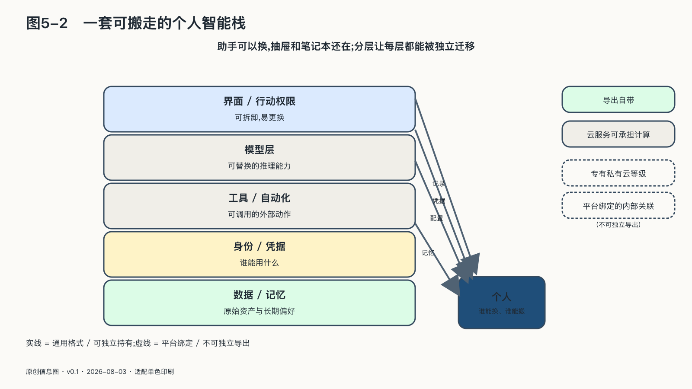
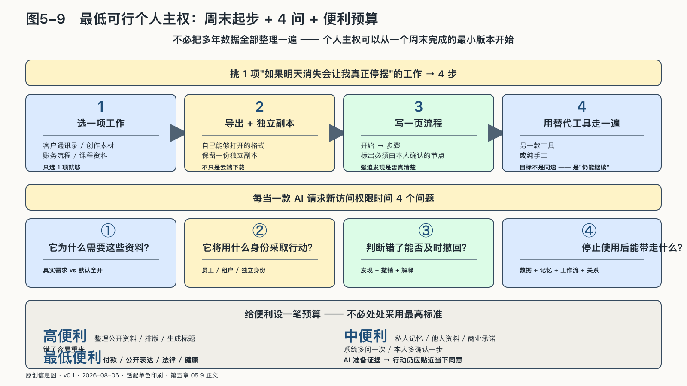
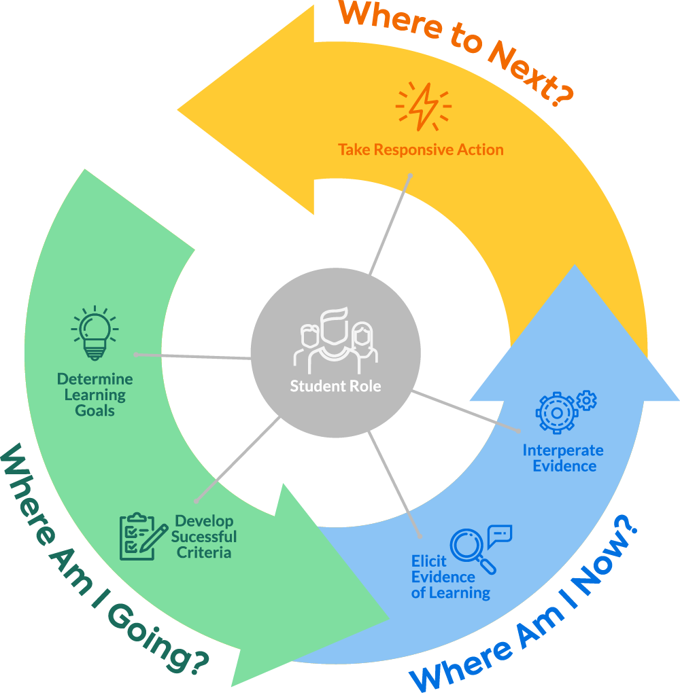

## 一套可搬走的个人智能栈

个人智能栈把原始资产、知识与记忆、工作流、模型和行动权限分开管理。原始资产尽量保存为通用格式，并有独立备份。知识与记忆则保留来源、日期和人的解释，不只依赖平台内部不可见的关联。

模型通过清楚接口读取必要内容，不成为资料的唯一保管者。工作流被写成可以交接的步骤和规则，另一款模型或人工流程因而能够接管。行动权限放在最外层独立管理，更换模型时不必全部重建。

这样做并不要求所有资料都放在本地，也不要求每个人维护服务器。云服务可以承担存储和计算，只要使用者拥有清楚的导出路径、独立副本和替换能力。

部署位置只是其中一个变量。访问密钥由谁控制，数据能否导出，流程能否迁移，系统怎样使用资料本人是否清楚，对实际控制程度的影响更直接。

### 迁移记忆还要重建上下文

个人第一次导出AI对话时，常会得到一大批按日期排列的文件。内容似乎都在，原来的使用体验却没有跟着回来。哪些是长期偏好，哪些是已经完成的任务，哪些结论后来被推翻，另一套系统并不知道。

记忆迁移因此包含两个层次。第一层是搬走原始记录，保证历史没有被平台扣住；第二层是提炼能够继续使用的上下文，包括重要人物与项目、稳定偏好、正在履行的承诺、已经确认的事实，以及明确不希望系统保留的内容。

可以把这份上下文写成一套小型“个人说明书”，而不是把全部聊天交给下一个模型自行猜测。

说明书不必包含人生所有细节。它只需围绕具体场景。例如，写作助手需要知道常用术语、读者对象、已经形成的观点和引用要求；项目助手需要知道工作时间、任务状态和承诺；健康助手需要的是经过核验的记录，而不是工作邮件中的情绪推断。

迁移也是一次清理。旧对话中可能含有临时密码、他人隐私、过期价格和冲动表达。原封不动地搬入新系统，会把历史风险一起复制。使用者应有机会决定哪些内容继续，哪些到此为止。

测试迁移是否成功，可以先让新系统完成一项熟悉的任务：它缺少什么资料，误解了哪些偏好，能不能指出信息来源。发现缺口以后再补，不必一开始就把全部历史灌进去。

这样建立的记忆更小，却更清楚。一个人也会重新发现，自己需要机器记住的东西，远少于平台愿意保存的东西。

### 端、云与人，各自做擅长的事

云端模型适合需要强推理、广泛知识和弹性计算的任务；个人设备适合处理高度敏感、需要离线或要求低延迟的内容；普通程序适合计算、校验和严格执行规则；人则负责价值冲突、例外情境和后果承担。

成熟的个人系统不会让一个模型包办所有层。一份差旅计划可以由云端模型生成，身份证件只在本地提取必要字段，报销金额由确定性程序计算，是否参加这次旅行仍由人决定。不同能力组合起来，比“把全部资料交给最强模型”更可靠，也更容易迁移。

这样的组合给人留下了按任务改变配置的余地，不必把全部生活资料和决定押在同一个模型上。

### 最低可行的个人主权

把多年数据一次整理完，学会权限系统，再搭建本地模型，既不现实，也没有必要。可以先用一个周末处理最容易让自己停摆的那项工作。
<!-- 图稿需求：图5-9（原创信息图 + 网络公开图）；详见 90_出版工作台/02_图稿清单.md -->

先选择一项“如果明天消失，会让我停摆”的工作。也许是客户通讯录，也许是创作素材，也许是账务流程。把相关资料导出成自己能够打开的格式，保留一份独立副本。随后，用一页纸写下这件事从开始到结束的步骤，并标出必须由本人确认的节点。最后，让另一款工具或纯手工方式走一遍。

这次实验不追求得到同样快的结果，只需证明工作仍能继续。完成第一项，再处理第二项。隔一段时间整理、导出、限权和切换一次，比试图建成一套永不变化的个人系统更实际。

还可以给自己留下四个问题，每当一款AI请求新的访问权限时就问一遍：

它为什么需要这些资料？
它将用什么身份采取行动？
如果判断错了，我能否及时看见和撤回？
停止使用之后，我能带走什么？

如果答案含糊，最好的动作往往不是永久拒绝，而是把授权缩小到一次任务，观察它如何工作，再决定是否扩大。

#### 给便利设一笔预算

主权不要求人对每次调用都保持警惕。那样的生活既疲惫，也无法持续。更实际的方式，是给不同任务分配一笔“便利预算”。

低风险、可撤回的事情，可以用更高便利换取时间。整理公开资料、调整排版、生成几个标题，即使结果不理想，也容易重来。

涉及私人记忆、他人资料或商业承诺时，预算要收紧。系统多问一次、本人多确认一步，看起来降低效率，却避免把一次模糊理解变成长期后果。

付款、公开表达、法律与健康决定属于预算最少的区域。AI可以准备证据和候选方案，行动仍应贴近人的当下同意。

所有任务都按最高标准处理，人很快就会疲惫，也会绕开规则。注意力应该留给后果最大的边界；普通便利照常使用，少数重要决定多花一点时间。

这种分级授权比对所有任务采用同一安全标准更可执行，也便于定期检查。

#### 给未来的自己留一份交接

个人系统还有一个很少被讨论的时刻：当今天的自己无法继续管理它。

突发疾病、设备损坏、长期离线，甚至只是几年后忘记当初怎样搭建，都可能让重要资料和关系失去入口。一人公司的客户、合同与未完成承诺尤其不能只存在于创始人的记忆里。

一份简短的数字交接可以包括：核心资产放在哪里，哪些账户承担关键业务，哪些自动化会持续行动，谁在紧急情况下可以暂停，哪些资料应当被销毁而不是继承。

这里需要克制。把所有密码写进一个文件会制造新的风险；让他人永久拥有全部访问也没有必要。更合理的方式是使用独立的密码管理和应急访问机制，把业务连续性与私人边界分开，并定期确认被指定的人仍愿意承担责任。

这份交接的价值，不只在紧急情况。写它的过程会逼迫一个人看见，自己的系统是否已经复杂到连本人都无法解释。

如果未来的自己或可信的人能读懂这份交接，并把工作接下去，这套系统才算没有只活在今天的使用习惯里。
