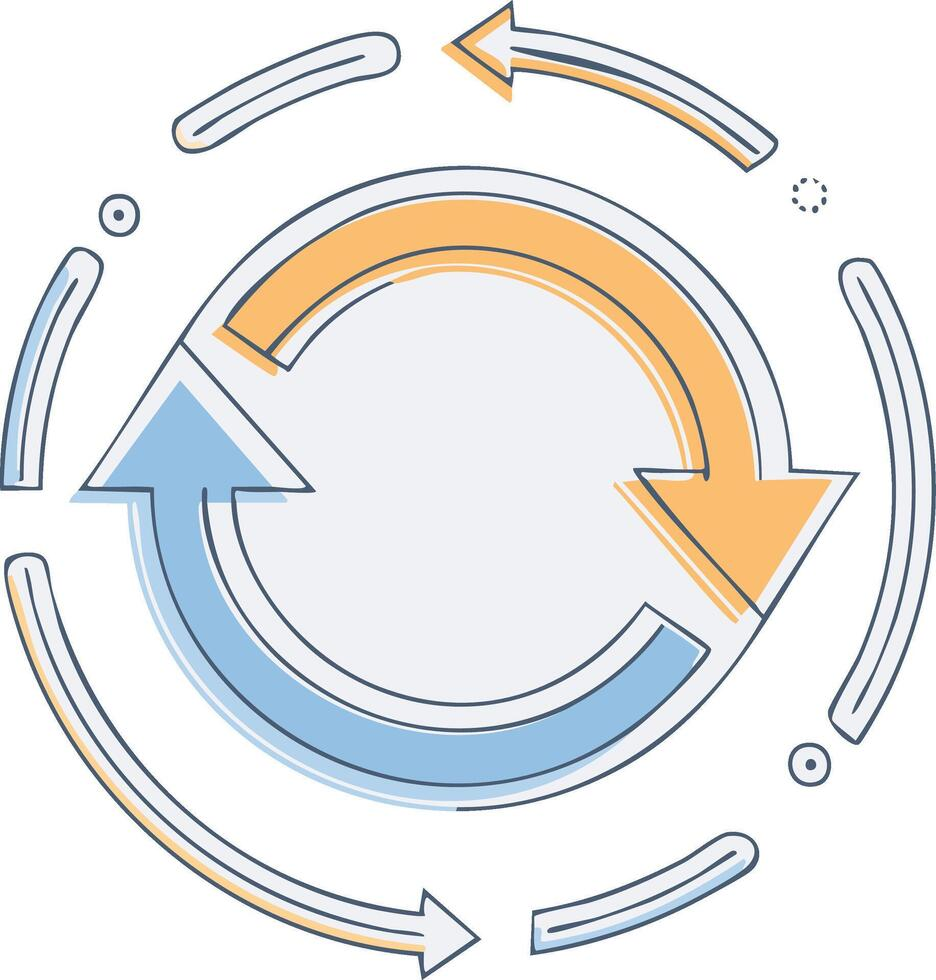

## OPC：企业的最小有效规模正在下降

一家公司为什么需要那么多人？近一个世纪前，经济学家罗纳德·科斯用交易成本解释企业边界。寻找合作者、说明需求、谈价格、签合同、检查结果和解决争议，都要付出时间与组织成本。当这些成本高于公司内部协调的成本，任务就会被收入企业边界，岗位和部门也随之出现。AI正在改变其中一部分成本。[^p4-opc-mechanism]

过去，一个人很难同时完成研究、产品、设计、销售、客服、财务和运营。今天，一个创作者可以让AI整理访谈，让另一个智能体维护选题，让自动化工具生成账单，再让专业人士复核合同。一名独立开发者也可以指挥数字助手写测试、回答用户、分析故障和准备发布说明。

人数没有增加，能够被组织起来的角色却增加了。OPC——One-Person Company，一人公司——描述的就是这种组织形式。它不要求一个人包办一切，也不一定对应法律上的一人有限责任公司：一个最终负责的人编排多个有限授权的机器角色，调用市场或公共基础设施，并在需要时连接会计师、律师、设计师、制造商等真人网络。

一个人可以连接很大的能力网络，最终责任却仍集中在他身上。已有实验给出了这种变化的局部证据。
<!-- 图稿需求：图5-11（原创信息图 + 网络公开图）；详见 90_出版工作台/02_图稿清单.md -->

在特定专业写作实验中，生成式AI让平均完成时间下降、质量提高；在五千多名客服人员的现场研究中，AI助手提高了平均生产率，新手受益更明显。但另一项知识工作实验也发现，任务一旦落在AI能力边界之外，使用AI的人反而更容易出错。AI确实能够压缩一部分工作时间和经验差距，却没有证明一个人已经可以稳定替代一家公司。[^p4-opc-mechanism]

最近的企业开发研究把这个边界继续往前推进，也把它画得更不平整。覆盖三家企业、四千八百六十七名开发者的现场随机研究报告，代码助手组完成任务数量平均增加百分之二十六；但这不是代码质量、缺陷率或长期研发产出的同义词。另一项METR随机实验让十六名熟悉成熟开源项目的开发者完成二百四十六项真实任务，参与者原本预计节省时间，实际完成时间却增加百分之十九。对个人和微型团队而言，AI更像一组可临时调用的数字角色：它能降低起草、检索和重复实现的成本，却会把验证、整合和接管责任留在那个最终负责的人身上。[^p4-work-evidence]

同一种技术产生相反结果，说明部署条件本身就是变量。英国政府对约两万人的使用调查报告平均每天节省二十六分钟；医疗、教育和创业实验则显示，收益会随任务结构、专业熟练度、反馈速度和人工复核而改变。“用了AI”不能直接换算成“生产率提高”，还要看谁在用、做什么、错误由谁承担，以及节省的时间是否转化成更高质量的结果。[^p6-deployment-evidence-2026]

现实中的微型经营主体本来就很庞大。美国人口普查局记录，二〇二三年无雇员经营单位超过三千万，占全部经营单位约四分之三；它们多数由自雇者经营，却并不都是高成长科技公司。到二〇二六年，创业服务平台Stripe Atlas观察到其新设C公司中单一创始人的比例显著上升，同时也发现头部与普通单人创业者之间的收入差距扩大。前者不是AI OPC的统计，后者也只是一个平台样本。两组数据只能说明微型经营主体已有庞大基础、单一创始人正在增加，不能证明OPC已经普遍成功。[^p4-opc-signal]

具体交易提供了另一组参照。二〇二五年六月，以色列开发者Maor Shlomo创办的AI应用生成工具Base44被Wix以约八千万美元现金收购：公司成立约六个月，未接受外部融资，收购前一个月报告约十八万九千美元净利润，被收购时团队为创始人加八名员工。它不是严格意义上的“一个人”，却显示了单人拥有的主体借助AI工具能走到的市场位置；Shlomo本人出售的理由同样值得记录——他判断下一步所需的资源和体量“已不是自然增长所能承载”。一笔收购不能外推为普遍规律，截至二〇二六年八月，它也仍是Vibe Coding领域被反复引用的少数可查样本之一。[^p4-opc-base44]

更可能持续的趋势是，知识型生产的最小有效组织规模正在下降，但不会让所有公司都缩成一个人。越来越多过去必须固定雇用的能力，会变成按任务调用的Agent、软件服务和外部专业网络；与此同时，云、芯片、支付、应用商店和基础模型又可能进一步集中。经济组织可能同时向两个方向发展：底层基础设施更庞大，贴近客户和场景的生产单元更微小。

一个人的公司越能调用外部能力，就越可能依赖少数账户、接口和平台。一次封号、一处错误配置，或者一段被污染的记忆，可能同时影响销售、交付和现金流。生产能力集中在一个人手中，单点故障也会集中到这个人身上。

传统公司的韧性来自冗余。一个员工离职，团队可以交接；一个系统故障，其他部门能够帮助恢复。OPC缺少这种天然冗余，只能有意识地把韧性设计进去。

订阅数量不能衡量OPC的成熟程度。边界清楚的OPC会把客户、内容和财务资料保存在自己能够读取和迁移的位置，并把关键工作流写下来，避免它们只存在于某个自动化平台。

不同数字角色使用不同权限——研究助手不接触付款，财务助手不读取私人日记；高影响行动留下确认点，任何代理都不能因为“方便”自动越过；核心任务还要有一条能力稍弱、却随时能够接管的替代路径。

这些控制用于降低平台、账户和创始人本人的单点风险。

### OPC的单点失效

下面是一段用于拆解风险的构造场景，而非某家公司的真实案例：一名独立顾问把全部业务交给一个高度集成的平台。客户邮件进入后，系统自动识别需求，读取历史项目，生成报价，安排会议，撰写方案并催收账款。只要一切正常，顾问每天只需要处理几个例外。

日常效率提高的同时，系统之间的依赖路径也增加了。如果邮件中的一段文字能够诱导智能体忽略原有指令，攻击者可能借一封普通来信影响后续行动；如果客户档案中的旧信息被错误调用，系统可能把一家公司允许的价格给了另一家公司；如果平台突然调整接口，整个业务会在同一天失去多个角色。

截至二〇二六年，NIST已经把智能体的身份和授权列为专门的标准议题。原因并不神秘：当软件从“被人点击的工具”变成“代表人连续行动的代理”，系统就必须分辨它是谁、代表谁、获得了什么授权，以及每一次行动能否追溯。[^p4-nist-agent-id]

对一人公司来说，这些词不必变成庞大工程。它们可以转化成非常朴素的习惯：每个数字角色有单独身份；权限只覆盖当前职责；重要授权会到期；行动记录能够回看；一旦异常，可以迅速撤销访问。

公司只有一个人，也需要按数字角色拆分权限。

### 一个人也在运行一张能力网络

一人公司的数字同事通常不住在同一个AI里。研究助手可能使用云端模型，资料保存在个人知识库；财务助手通过银行接口读取账单；发布助手连接网站后台；代码Agent拥有测试环境；会议工具又依赖日历和邮件。它们由不同公司运营，接受不同条款，使用不同账户，却共同参与一个人的业务。OPC管理的是这张小型能力网络，订阅了多少Agent说明不了它是否可靠。

网络让一个人获得规模，也让边界变得不直观。一项客户任务可能先进入邮箱，被模型总结，再写入项目板，接着交给报价助手，最后通过财务工具生成账单。原始邮件没有离开邮箱，不代表其中的信息没有流动。摘要、分类、风险判断和报价建议都是派生数据，同样可能暴露关系和商业意图。

个人通常没有企业安全团队，却有一个优势：他更接近任务本身。他知道哪些材料只适合某个客户，哪些承诺必须亲自作出，哪些自动化一旦出错会损害关系。个人AgenticOps的关键，是把这种生活常识变成连接规则。

可以用三张很小的图看清自己的网络。
<!-- 图稿需求：图5-12（原创信息图 + 网络公开图）；详见 90_出版工作台/02_图稿清单.md -->

第一张是**资料图**：客户材料、私人记录、公开研究和财务数据分别在哪里，哪些工具可以读取。

第二张是**行动图**：哪些助手只能建议，哪些可以创建草稿，哪些能够发送、付款、删除或发布。

第三张是**替代图**：某个模型、平台或账户失效后，哪些角色会一起停止，最低限度怎样接管。

这三张图不需要技术绘图软件。一张纸上画几个方框和箭头，就能暴露许多问题：研究助手为什么能看见付款资料？发布平台为什么保存客户通讯录？一个停用的测试Agent为何仍有网盘权限？所谓“全部集成”的便利，常常正是权限扩散的另一种说法。

#### 数字角色也需要交接

人类员工离开公司时会交还钥匙、整理文件和说明未完成事项。数字角色被替换时，人们却常常只取消订阅。

一个Agent离开之前，至少应留下四类东西：它负责什么；当前有哪些未完成任务；使用了哪些资料和规则；哪些外部动作已经执行、哪些仍在等待。

否则，新的助手只能重新阅读全部历史，再猜测前任做到哪里。它可能重复发送信息，也可能遗漏已经答应客户的事情。

数字交接不要求保存模型的每次内部推理。真正需要迁移的是任务状态、形成的产物、关键依据和行动记录。模型的“思考过程”既可能不可靠，也可能包含不必要的敏感信息；清楚的业务状态比大段对话更有价值。

个人AI资产包括自己定义的角色、任务、边界、评测样例和交接格式，而不只是某个Agent的名字。保留这些资产以后，底层模型和工具可以更新；如果它们全埋在平台内部，使用者就只能围绕平台的内部结构工作。
