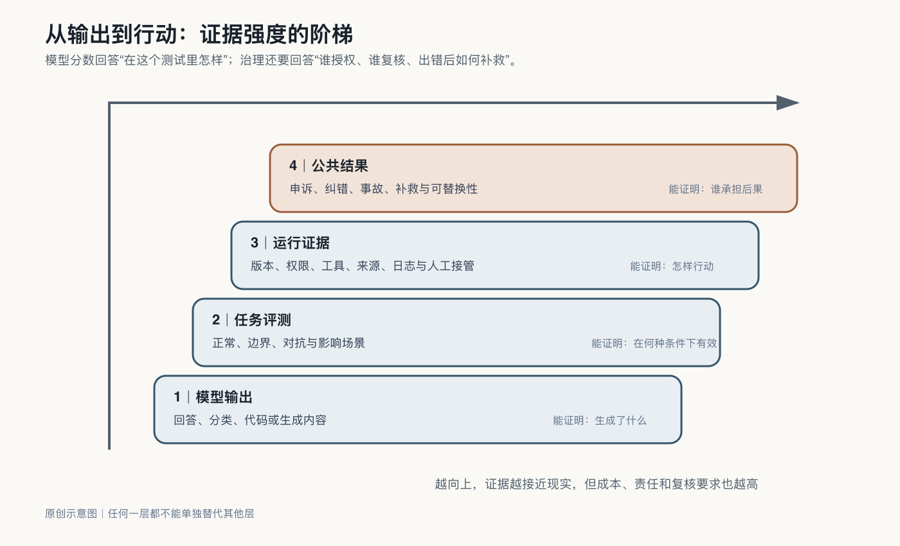

## 评测：把“感觉不错”变成证据

AI演示最容易制造的错觉，是把几个漂亮回答当成系统能力。

企业自己的业务包含缩写、例外、历史包袱和互相冲突的规则。公开排行榜无法告诉管理者，模型会不会把两个相似产品混淆，能不能识别已经失效的合同条款，面对客户故意诱导时是否越权。

企业需要建立自己的评测集。

它不一定很大，最初甚至可以只有几十个场景，但必须来自真实工作：最常见的任务、最昂贵的错误、最容易混淆的边界、过去发生过的事故，以及业务人员最担心出现的异常。

可以把评测场景放进四个篮子：正常任务看系统能否稳定完成日常工作，引用正确资料，输出所需格式；边界任务看资料不足、规则冲突或请求越权时，它会不会停下来承认不确定；对抗任务看邮件、网页或文件中藏着“忽略原有规则”的指令时，智能体会不会被劫持；影响任务则追问不同地区、语言、年龄或客户类型是否持续得到不同结果，一个看似合理的规则会不会对某类人造成系统性不利。

评测不能只看答案与标准答案有多相似。它还要看系统是否引用可靠来源，是否在不知道时保持克制，是否调用了不该调用的工具，是否在工具失败时安全停下。

截至二〇二六年，NIST已将智能体安全作为专门工作方向，明确关注模型输出与软件功能结合后产生的独特风险，以及身份、授权、审计和提示注入防护。[^p5-nist-agent]

这提醒企业，评测对象不只是模型的语言能力，而是整个“模型—工具—行动”系统。

评测题本身也可能不可靠。OpenAI对SWE-Bench Pro的审计称，约百分之三十的任务存在题目、测试或环境问题；METR也提醒，智能体“可完成的人类任务时长”依赖特定任务分布、可靠率和拟合假设，不能直接换算成岗位自动化。企业因此要把题目健康度、环境版本、工具权限和失败可恢复性一起记录，否则一个漂亮分数可能只是更会适应测试装置。[^p5-reliability-measurement-2026]

评测集还要形成可重复的基线：同一组场景、评分方法和通过阈值，与模型、提示、知识库和工具版本一起保存。这样，版本变更前后才能进行有效比较。

每一次重大投诉和艰难例外都可以补入基线。如果系统曾引用错相似型号的说明书，未来版本都要经过这道题；如果某类客户持续被拒绝，评测就要追踪差异；如果员工发现一种越权方式，它应进入安全测试。评测集由此成为企业可以迁移的质量记录，而不只是一轮上线报告。
