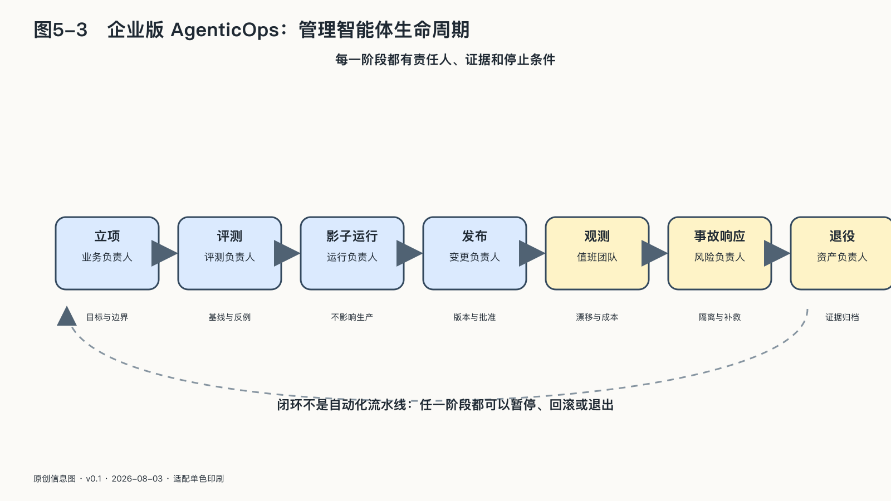

## 企业版AgenticOps：管理智能体生命周期

传统软件通常先写清规则，再按规则运行。智能体会根据环境选择步骤、调用工具，还会随模型、数据和提示变化而改变行为。

一次验收无法覆盖后续的模型更新、数据变化、权限扩大和事故。企业版AgenticOps负责立项、测试、发布、监控、变更、事故处理和退役。

### 一张订单怎样穿过一家工厂

下面用一个构造案例说明这些环节。一家零部件工厂收到客户的加急改型订单。过去，邮件会在销售、工程、采购、排产和财务之间传递；现在，企业希望让一组Agent准备报价、检查产能、生成工艺变更草案，并在确认后建立订单。

邮件到达后，系统先创建一个有编号的任务，记录客户、要求、截止时间、允许读取的项目资料，以及可以产生的行动。客户附件可能包含尺寸、图纸和目标价格，也可能夹带与订单无关的指令。原始材料进入隔离区，经过解析、查毒和来源标记；邮件正文中的一句“请忽略以前规则”不能改变Agent权限。

销售Agent读取客户关系与历史报价，工程Agent读取指定型号的图纸和质量记录，采购Agent查询已批准供应商与公开市场信息。三者分别使用自己的受限身份，不共享万能账号。工程Agent看不到全部客户利润，采购Agent也不能读取员工私人邮箱。订单的任务契约规定了它们各自可以取得的信息范围。

接着，模型发现客户的新尺寸可能超出当前工艺窗口。它可以提出两个候选方案：修改夹具，或者把一道工序交给外部伙伴。此时系统需要分清事实与判断。设备能力来自哪份手册，库存来自哪个时点，供应商交期是正式承诺还是公开网页上的宣传，都应随建议一起出现。没有来源的数字不能因为进入一张漂亮的报价表就变成企业事实。

财务程序根据确定性规则计算材料、工时、税费和最低毛利，语言模型只负责解释差异与准备沟通。若报价低于授权底线，系统不能用“赢得客户”作为理由绕过规则；它只能暂停，请有相应权限的人重新授权。销售负责人看到的也不应只有一个确认按钮，而要看见关键假设、偏离历史的地方和无法验证的部分。

客户接受报价以后，Agent可以在ERP里创建订单草稿，但不会同时取得付款、修改主数据和下发设备参数的权力。工程变更先进入仿真和测试，工艺人员核对材料、设备与安全联锁；到达PLC之前，概率性建议必须穿过确定性的控制网关。模型可以生成代码，机器是否执行仍由经过验证的工程状态决定。

生产开始后，任务也没有结束。批次、设备状态、模型与知识版本、人工批准和实际产出要连接到同一份执行凭证。质检发现异常时，企业才能判断问题来自客户图纸、检索到的旧工艺、模型建议、人工修改还是设备漂移。若只能看到“AI生成成功”，这条生产线事实上没有获得解释能力。

最后，产品发出、发票生成、客户收到通知，任务进入结束状态。临时权限被撤回，未采用的附件和中间推断按期限处理，实际成本与质量结果返回评测集。若客户后来投诉，企业可以从现实结果回到当时依据，而不必让员工在多个聊天窗口里拼凑记忆。

这项任务从外部材料进入企业开始，经过模型建议、权限确认和工具执行，最后还要连接现实结果。立项、影子运行、发布、监控、事故和退出分别控制其中不同阶段。

### 立项：先定义失败

项目开始时，人们喜欢写成功指标：节省多少时间，提高多少转化。

团队还要先写一页“失败说明”：

系统最不能做错什么；一次错误最多影响多少对象；哪些资料绝不能进入模型；哪些决定必须复核；外部服务不可用时业务能承受多久。

先定义失败，才能决定权限、评测、监控和降级方案。

如果失败边界说不清，项目可以停留在辅助工具阶段，还不适合获得行动权。

项目获准以后，需要先确定资产归属，再选择模型。

提示与规则、知识结构、评测集、反馈数据、流程定义、运行日志，哪些由供应商保管，哪些企业可以随时导出？接口和数据格式是否足以让另一支团队理解？业务规则有没有被埋在专有配置中？

企业积累的能力通常不在模型参数里，而在这些围绕业务形成的材料中。它们应当像代码和客户资料一样被认真管理。

资产边界清楚以后，系统才进入测试。测试既要覆盖正常任务，也要主动寻找失败边界。

团队先让系统离线重做历史任务，用过去发生过的错误寻找它的边界，而不是急着证明它比人更好。

每一次扩权都需要测试证据和回退条件，不能沿用供应商对产品的笼统承诺。

### 影子模式：让系统先学会旁观

智能体从实验环境进入真实业务时，最安全的第一份工作往往是旁观。

在影子模式中，它读取与正式系统相同的任务，生成判断和行动计划，却不能改变现实。团队把它的结果与人工流程比较：哪些日常情况已经稳定，哪些例外总被误解，哪些工具调用超出预期。

影子模式的价值来自真实环境。离线测试很难重现客户突然改变说法、资料缺失、系统超时和多个规则冲突。让智能体先旁观，可以在不把风险交给客户的前提下收集这些差异。

旁观模式也会接触真实数据，仍需权限、保存期限和访问控制。没有行动权的系统同样可能造成隐私风险。

通过影子阶段后，企业可以开放一小部分低风险流量。这通常被称为灰度或金丝雀发布：新版本只处理有限对象，旧流程仍然存在，关键指标和投诉被单独观察。范围扩大必须对应新的证据，而不能只因为“暂时没有出事”。

人工复核也应在这个阶段被评测。团队要看复核者是否有时间和材料发现错误，还是仅仅习惯点击同意。如果一百条建议中九十九条都正确，人的注意力会在第一百条到来前下降。系统可以主动把低置信、规则冲突和高影响案例交给人，而不要求人机械检查全部输出。

人工复核要能改变结果，不能只在机器动作之后承担名义责任。

一旦系统获得行动权，模型、提示、知识库、工具权限和评测结果就需要绑定成一个版本。

“我们使用某个模型”远远不够。同一个模型配上不同系统提示、资料和工具，就是不同系统。只有版本完整，事故发生后才能知道哪个变化导致行为改变。

高风险发布可以采用分批流量，让新版本先服务少量对象，与旧版本比较。异常一旦超过阈值，流量自动退回上一个可信版本。

进入生产以后，除了速度、成本和可用性，企业还要观察工具调用、拒绝、人工修改、投诉和检索来源等运行信号。

它是否突然更频繁地调用工具；拒绝率是否改变；人工修改幅度是否上升；某类客户的投诉是否集中；知识检索是否总落在少数旧文件；行动门被触发的频率是否异常。

单个指标很难说明全部问题。企业需要把技术信号与业务结果放在一起看。调用量下降可能是系统更高效，也可能是智能体跳过了必要检查；处理时间缩短可能是流程改善，也可能是人工复核被悄悄绕过。

监控最终要通向行动。每个重要警报都要对应负责人、响应时限和可执行措施。骑士资本那九十七封邮件已经说明，发出信号与建立制动之间相隔多远。

模型升级、提示修改、知识库扩展和新工具接入都会改变系统。旧版本的测试结果不能自动覆盖这些变化。

变更不必每次从零审批，但要根据影响分级。修正一处文字提示与开放付款权限，风险层级相差很大。影响数据范围、行动能力和受影响人群的变更，需要重新经过评测和责任人批准。

供应商在后台更新模型，也属于变更。合同与技术架构应尽可能提供版本通知、回退窗口或稳定版本选择。无法获得这些能力时，企业就要用更密集的外部评测发现行为漂移。

### 事故：先止住行动，再寻找解释

智能体异常时，第一目标是限制影响，而不是立即寻找完整解释。

企业需要预先准备几级制动：暂停单个工具，收回高风险权限，把系统降到只读或建议模式，切换备用模型，最后完全停止并由人工接管。

停止开关必须独立于出问题的智能体，也必须有人有权按下。完成遏制和证据保全后，再通过版本、日志和业务记录区分模型错误、知识错误、工具错误、权限错误和人为配置错误，随后恢复可信服务并补救已经产生的业务结果。

对客户已经造成影响时，通知不能等到所有技术原因都查清。企业可以先说明发生了什么、哪些服务受影响、客户需要采取什么动作，以及何时得到下一次更新。

止住行动以后还要回滚。AI系统的回滚不能只切回旧模型。

一个智能体的行为由多个版本共同决定：模型、系统提示、知识库、工具接口、权限策略和业务规则。只切回模型，新的知识和权限仍可能让结果与过去不同。系统已经发出的邮件、完成的退款和写入的标签，也不会因为技术版本后退而自动消失。

回滚分成两条路径。

第一条是系统回退。企业能够恢复最后一个可信的模型与配置组合，确认依赖服务仍兼容，并让流量逐步切回。

第二条是业务补救。找出已经受到影响的订单、客户和数据，停止后续动作，纠正错误结果，必要时通知并补偿。技术回退不会自动撤销已经发生的业务动作。

发布前要给每个版本保留回退条件：完整配置、兼容的数据结构、备用服务和经过演练的切换步骤。发布后还要在一段时间内保留对照，避免旧版本立即消失。

停止开关也应分层。企业可能只需关闭对外发送，保留内部建议；暂停付款工具，继续读取订单；收回自主行动，让系统退到影子模式。细分的制动能在控制伤害的同时保留部分业务，比只有“全部运行”和“全部关闭”两种状态更实用。

模型替换、项目退役和供应商停止服务，都属于生命周期管理范围。

退役时，企业要撤销接口和身份，处理剩余数据，保存法律与审计所需记录，并确认下游系统不再依赖。更重要的是，把提示、流程、评测、事故经验和人工反馈带回企业。

如果合作多年后，企业只得到一批无法迁移的账号，那么全部经验都在为供应商增值。

这些下线条件需要在采购和建设阶段确定。等到决定更换供应商时才讨论退出，谈判力量通常已经消失。

企业在合作开始前就应明确几件事：可以导出哪些原始与衍生资产，使用什么格式，供应商提供多长迁移支持；模型或服务重大变化如何通知；事故责任怎样分配；合作结束后数据、备份和为客户形成的专用模型如何处理。

还要警惕“理论可导出”。一个包含数百万条记录却没有字段说明的文件，不能支持迁移；提示词能够复制，依赖平台特有工具的工作流仍然无法运行；供应商承诺删除数据，如果没有过程和证据，企业也难以向客户解释。

退出测试可以在合作早期进行一次。导出一个小项目，让另一套环境读取，记录缺少的字段、关系和配置。供应商若在客户尚未深度依赖时就无法支持，企业还有机会调整架构和条款。

退出条款和迁移测试是连续性控制，合作正常时也需要准备。

一个企业AI应用背后往往有多家供应商。

模型服务可能调用内容过滤组件，知识检索依赖向量数据库，语音来自另一家接口，运行日志又进入外部监控平台。任何一层改变，都可能影响数据去向、系统行为和可用性。

企业需要知道关键链条，却不必试图掌握每个微小依赖。可以从三类对象开始：能接触敏感数据的，能改变现实行动的，以及停止后会让核心业务中断的。

对这些关键依赖，企业应了解其作用、替代路径、重大事件通知和下游合作安排。供应商增加新的分包方或改变数据处理位置时，也需要触发重新评估。

供应链治理最容易犯的错误，是收集大量认证与问卷，却没有验证服务真正中断时会发生什么。证书说明某套管理体系存在，无法替代企业自己的切换演练和数据导出测试。

供应商地图至少应让事故负责人迅速回答：哪个服务受影响，哪些数据经过它，能够关闭哪条连接，备用路径在哪里。若这些问题仍要临时询问供应商，再复杂的图表也没有完成事故准备。
