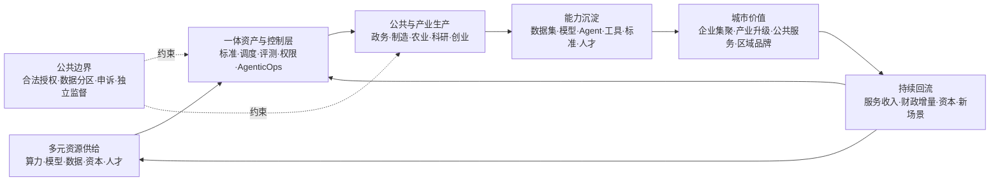

# 第六章　政府与国家：让智能沉淀为共同能力

澳大利亚的“机器人追债”计划曾把年度收入平均分配到各个福利申报期，再据此推断一些领取者欠下政府债务。对季节工、临时工和收入波动者，这种平均可能创造出从未真实存在的两周收入。统计推断进入行政流程后，却被赋予了追债能力。

皇家委员会后来认定，伤害不能归结为一个公式。法律意见、政策设计、自动化流程、举证负担和复核机制共同组成了一条失灵的公共权力链。委员会要求建立一致的政府自动化决策法律框架、清楚的复核路径、通俗说明，以及对业务规则和算法的独立审查。[^p6-robodebt]

这件事发生在生成式AI和通用智能体大规模进入政府之前，却已经证明：国家使用自动化系统，关键问题从来不只是模型准不准，而是技术怎样取得了公共权力。

政府使用AI，和企业使用AI有一个根本差别。消费者通常可以离开一家企业，公民却不能为了躲开一套错误的福利系统，临时更换自己的政府。企业可以用服务条款界定关系，公共权力必须说明自己凭什么行动。企业犯错可能失去客户，政府犯错可能让一个人失去收入、教育、医疗，甚至自由。

所以，国家层的AI主权不能用设备或模型数量概括。分析重点是控制结构：当AI进入公共权力，谁决定用途，谁能检查运行，谁能纠正错误？

一个国家需要足够的技术能力，才能不受单一节点摆布；也需要足够的制度能力，才能不让强大的技术反过来摆布公民。

这两种能力少了任何一种，主权都不完整。

但只写到这里，国家AI主权仍然过于防守。国家和城市建设AI，不只是为了在供应中断时有第二条路，也不只是为了给公共权力安装护栏。更积极的目标，是把全球不断流动的模型、算力和知识引入本地生产，让企业、科研机构、开发者和公共部门在真实任务中形成自己的数据、模型、Agent、工具、标准、人才和运营经验，再用这些资产反过来提升产业与城市。

这是一种能够积累的主权。

它所说的“自主可控”，不是所有芯片、模型和软件都由自己制造，也不是排斥外部技术。它允许全球主流与本地算力、开放与封闭模型、公有云与私有环境、公共机构与市场主体共同进入一个多元体系；关键是由城市或国家掌握统一接入、调度、评测、数据边界、资产沉淀和持续运营的规则。供给可以来自多方，学习闭环不能只留在供应商那里。

## 公共权力多了一双手

早期的政府信息系统主要保存记录。后来，算法开始排序、匹配和预测。到了智能体时代，系统不再只告诉工作人员“可能发生什么”，它还能继续执行下一步：发送通知、调取资料、生成文书、触发调查、安排资源，甚至在多个部门之间推动一件事向前。

信息系统像一张地图，行动系统更像一双手。

地图画错了，人可能走错路；手拿到了错误命令，现实会立刻改变。模型把一个人标记为高风险，与系统据此冻结一项服务，属于不同程度的权力。一个推荐被工作人员忽略，与一万个推荐在繁忙窗口中几乎自动获得采纳，也不能算同一种“辅助”。

公共部门经常用“最终仍由人决定”来描述安全边界。这句话听上去可靠，实际可能很空。

如果工作人员一天要处理数百个系统建议，没有时间查看原始材料；如果反对机器需要填写额外说明，还可能拖累考核；如果界面把模型结论放在最醒目的位置，把不确定性藏在二级菜单里，那么屏幕前虽然坐着一个人，判断权已经被工作流程悄悄拿走了。

真正的人类复核，不是流程图里画着一个人。它至少意味着：复核者能看到支持和反对结论的证据；有时间理解个案；有权限改变结果；改变结果不会被视为给系统添麻烦；当同类错误重复出现时，还能推动系统停用或修改。

这也是为什么公共AI不能只做模型测试。模型只是行动链中的一环。规则由谁写，数据从哪里来，界面如何呈现，工作人员怎样被考核，供应商怎样更新，申诉材料流向何处，都会改变最后的结果。

一套在实验室中表现优秀的系统，进入糟糕的行政流程后，仍可能稳定地制造不公。

## 法律授权要走在接口前面

公共机构常从一个善意目标开始：减少积压、更快发现欺诈、把资源给最需要的人。技术团队接到的任务于是变成“提高识别率”或“缩短办理时间”。

问题在于，公共权力不能仅凭目标善良就扩张。

一个部门依法可以收集资料，不等于它可以把全部资料交给模型寻找新的相关性；可以用系统核验事实，不等于可以让系统推断人的动机；可以发现需要复查的线索，不等于可以自动作出不利决定。技术上相邻的几个按钮，在法律上可能隔着完全不同的授权边界。

这里需要区分三个问题。

第一，国家有没有权做这件事。第二，AI是否适合参与这件事。第三，即使适合，AI可以参与到哪一步。

这三个问题不能合并成一次采购审批。

举例说，法律授权某机构核实福利申请，并不自动授权它建立一个跨部门的永久人物画像；AI能够预测某种风险，也不意味着这种预测具有行政决定所需的证据资格；系统可以帮助工作人员整理材料，也不意味着它可以在没有人工判断的情况下停止发放基本生活保障。

公共AI项目应当先写清“权力说明书”，再写功能说明书。它要说明法律依据、公共目的、处理对象、数据边界、允许采取的行动、不得越过的红线，以及权利受影响时的救济路径。

这不是法务部门在上线前补的一张表。它决定整个架构应该长什么样。

如果法律要求理由可以被当事人理解，系统就必须保留从证据到决定的链条；如果法律要求个案判断，就不能用一个群体概率直接代替；如果行政机关必须对决定负责，合同就不能允许供应商以保密为由拒绝必要审查；如果某种强制行动必须由有资格的人批准，权限系统就不应给智能体留下绕开的接口。

法律不是技术完成以后套上的护栏。对公共系统来说，它本来就应该是设计输入。

## 一个平均数怎样变成债务

澳大利亚的“机器人追债”事件并没有用到今天这样的大模型，却说明了自动化一旦获得行政力量，会发生什么。

政府为了核查社会福利领取者是否多领补助，把税务系统记录的年度收入与福利申报进行比对。问题是，年度总收入只能说明一个人在一年里赚了多少钱，不能证明收入具体落在哪两周。系统却用平均数把年度收入摊到各个时期，并据此推断某些人曾经多领补助。

对全年工资稳定的人，平均数也许接近现实。对季节工、临时工、零工和收入波动者，它可能创造出一段从未存在的“平均收入”。

统计推断本来可以作为查找线索的工具。进入债务追索流程后，它却逐渐像事实一样行动。许多人收到通知，需要自己证明没有欠款。国家掌握数据、规则和催收能力，普通人却要解释一笔连计算过程都看不懂的债务。

伤害不只来自一个公式。它来自整条责任链：有疑问的推断被赋予过高证据地位，人工判断从流程中退场，举证负担转向处境更弱的一方，异议没有及时改变系统，管理层和法律意见也没有形成有效制动。

事件最终引发调查、诉讼和皇家委员会审查。二〇二三年的皇家委员会报告提出，政府自动化决定需要一致的法律框架；受影响者应有清楚的复核路径；部门应以通俗语言说明系统怎样工作；业务规则和算法要能够接受独立专家审查；还应有机构监测和审计其技术、公平与可用性影响。[^p6-robodebt]

这些要求没有把希望寄托在“下一次换一个更准的模型”上。因为更准确的模型仍可能执行一项没有充分授权的政策，仍可能使用不适合个案判断的数据，仍可能把人困在无法申诉的流程里。

准确率回答的是“系统多常猜对”。公共法还要问“它是否有权猜”“猜错由谁承担”“这个人如何恢复自己的权利”。

一项影响一百万人、准确率百分之九十九的系统，仍可能让一万人陷入错误。对产品经理来说，这是一个需要优化的尾部；对公共机构来说，那是一万件必须能够被听见、被解释、被纠正的个案。

规模不会让个体权利自动变小。

## 公民申诉不是客服功能

一个人收到不利决定后，最先需要的往往不是模型的数学解释，而是三个朴素答案：

你依据了什么事实？哪一条规则影响了我？我怎样让一个有权改变结果的人重新看一遍？

技术界谈“可解释AI”时，容易把解释理解为某个特征贡献了多少分。但一个特征权重图未必能回答公民的问题。它可能告诉你“收入波动”对风险分数贡献很大，却没有告诉你收入数据是否属于你、时间范围是否正确、这项推断是否可以用于拒绝救助、工作人员是否考虑了你照顾重病家人的特殊情况。

公民首先要知道AI是否参与了处理，它是在检索、推荐、评分，还是已经触发行动。机构还要说明决定依据了什么事实、适用了哪条规则，不能只抛出一个分数。提出异议以后，材料必须到达一个能看到原始证据、也有权推翻系统结论的人，而不是让原来的程序再运行一次。错误已经造成损失时，还要能够停止执行、恢复权益并作出补救。否则，所谓解释只是让人更清楚地知道自己无能为力。

申诉机制还要对真实的人可用。一个需要稳定网络、复杂证明和专业术语的在线入口，会把老人、残障者、语言少数群体和处于危机中的人挡在门外。公共服务越关键，越需要保留电话、窗口、代理人和社区组织等多种入口。

机构也不能把申诉率低当成系统表现好。人们可能不知道AI参与了决定，不知道可以反对，或者没有精力走完流程。更可靠的观察包括：哪些群体更常放弃，复核后结果改变多少，错误是否集中在某类数据或场景，平均纠正时间多长，以及同一种问题是否持续出现。

申诉不是系统上线后的客服功能。

它是公民面对公共权力时仍能说“这个决定不对”的制度接口。

### 复核不能只把机器再跑一遍

假设一位市民的补助申请被拒绝。系统给出了一个风险分数，窗口工作人员看到红色提示，点击确认，通知随后自动发出。他提出异议后，系统又用同一份数据、同一条规则和同一个模型重新计算，得到同样的结果。技术上发生了“二次处理”，制度上却没有发生复核。

真正的复核需要换一条路。复核者要能看到原始资料，而不只是模型加工过的摘要；要能接收当事人新补充的情况，而不是只能在既有选项中勾选；要能检查数据、规则和授权是否都合法适用；更要有权暂停执行、改变结果和促使同类案件重新审查。

这对技术架构有直接影响。如果原始证据已被模型摘要覆盖，异议就无法重建事实；如果业务规则只写在供应商的黑箱中，复核者就无法判断适用是否正确；如果通知、扣款和资格变更已与分数自动绑定，一名有权复核的工作人员也可能没有技术上的停止键。

申诉权因此不只存在于行政法和窗口流程里。它还必须被数据保留、版本管理、权限配置和执行接口真实支持。法律给了一扇门，系统却没有通往那扇门的路，权利仍然只会留在纸上。

## 国家必须记得自己做过什么

公共算法审计常被误解成让专家检查一次源代码。源代码当然可能重要，但它远远不够。

模型的行为受训练数据、提示词、外部知识、权限、版本、阈值和工作流程共同影响。即使代码完全公开，审计者不知道实际使用了哪个版本、不知道接口返回后发生了什么，也无法判断系统怎样影响现实。

一次有意义的公共审计，要沿着一项决定走完整条路。

审计者先看目的：系统要解决的公共问题是什么，有没有更少侵入的办法。再看授权：数据、推断和行动分别依据什么权力。然后看证据：输入是否完整，错误会集中伤害谁，测试是否覆盖真实使用环境。接着看流程：工作人员能否反对，界面是否诱导盲从，供应商更新是否重新评估。最后看结果：不只是总体准确率，还包括错误的严重程度、分布、可逆性和申诉效果。

加拿大要求相关公共项目在设计初期和投产前进行算法影响评估，系统功能或范围变化后还要更新；英国则用统一格式公开公共部门为何、如何使用会影响公众的算法工具。[^p6-canada-aia][^p6-uk-atrs] 这些制度都不保证机器不出错。它们先做了一件更基础的事：让社会知道机器存在，让改变过的系统不能躲在第一次审批身后。

如果没有系统清单，议会、审计机关、媒体和公众连该问谁都不知道；如果没有版本和变更记录，一次上线前评估很快就会失效；如果没有事故与申诉数据，监督只能依赖供应商展示的平均指标；如果审计报告不公开，经验也无法跨机构积累。

理想的审计不是一个神秘专家替社会宣布“安全”。它让不同主体能够基于证据提出不同问题：技术人员看鲁棒性，法律人员看授权和程序，领域专家看业务含义，当事群体看伤害是否被准确描述，公共管理者看机构有没有能力持续承担责任。

审计最重要的产物也不只是结论，而是一条能够被第三方复核的证据链。

模型会更新，公司会更换，负责项目的人会离职。国家曾经如何对待一个公民，不能因此从记录中消失。

风险高低，最终要看机器碰到了什么。

一套AI系统是否危险，不能只看模型有多强。把同一个模型用于整理公开会议记录，与用于判断儿童是否应离开家庭，风险完全不同。

公共部门可以用一个直观方法理解风险：先看系统触碰的权利和资源，再看它能够采取的行动。

如果只是改写文字，错误通常容易发现和撤回；如果它排序申请，错误可能改变谁先获得机会；如果它给人打风险标签，标签可能流向多个部门；如果它直接拒绝、追索、调查或限制自由，系统就站在公共强制力的入口。

欧盟《人工智能法》已经把若干涉及基本公共服务和福利的用途列为高风险，并规定适用范围内的公共主体部署前应评估基本权利影响；但经二〇二六年修法，相关附件三义务要到二〇二七年十二月二日才开始适用，不能把法律生效写成义务已经全面执行。[^p6-eu-aiact] 这种制度设计的重要之处，是把评估中心从“技术是不是先进”移到“人会遭遇什么后果”。

影响评估也不能停在上线前。部署前需要建立错误率、群体差异、人工推翻率和处理时间等基线；运行中观察这些指标是否偏移；模型、数据源、权限或使用范围变化时重新评估。这样，评估才是持续控制过程，而不是一次性的合规文件。

影响评估与审计作用不同：前者在设计和变更时分析“可能发生什么”，后者依据运行记录检查“实际发生了什么”。两者通过系统清单、版本记录、事故数据和申诉结果连接；缺少这些证据，评估无法校准，审计也无法复现决定。

判断后果，要看错误能否撤回、是否会不断累积，也要看双方的权力差。推荐错一条公交路线，与取消一项救命治疗不同；一次低风险评分如果跨部门复制，几年后也可能变成一个人摆脱不了的数字身份。当事人越依赖这项服务，越缺少替代入口，公共机构就越不能把错误成本推给他。

于是，公共系统应当有不同的行动门槛。低影响任务可以较多自动化；涉及重要权益的建议需要真实人工判断；限制权利、追索财产或触发强制行动的系统，应满足更高授权、证据和复核要求；某些用途即使技术可行，也可能不值得交给机器。

技术能力不断变化，权利影响比产品名称更稳定。

国家不必为每个新模型重新发明伦理，但必须不断检查机器碰到了谁、拿走了什么、还是否能还回去。

## 当国家能够拼出一个人

政府掌握交通、医疗、教育、能源、税务、住房和公共空间中的大量数据。把这些资料连接起来，可能更早发现疫情、更好调度救护车、更准确了解城市热岛，也可能让原本分散的生活痕迹拼成一个近乎完整的人。

公共机构容易认为：数据既然已经依法收集，内部再利用只是提高效率。

但收集的正当理由不会自动延伸到新目的。为了发放补贴而提交的家庭资料，不应默认为犯罪预测服务；为了公共卫生建立的记录，也不能因为技术上可以连接，就变成永久行为画像。

数据治理至少要区分五件事：谁有权收集，允许用于什么目的，谁可以再次访问，保存多长时间，个人怎样查看和纠正。

其中最难的是“推断数据”。姓名、住址和收入是直接记录，模型根据行为生成的风险、倾向和关系标签则是推断。机构可能认为标签只是内部分析，不属于个人提供的数据；可现实中，真正改变待遇的往往正是这些推断。

公民有必要知道哪些推断在影响自己，并能纠正作为基础的事实。对于重大决定，机构还应说明推断的用途和局限，不能因为它是概率就把它包装成客观身份。

公共数据的价值也不只属于当前行政部门。医疗记录包含患者经历，教育数据来自学生和教师，交通数据由全体城市生活共同产生。国家可以依法管理这些数据，但这种管理更接近受托，而不是占有。

受托意味着数据使用要回应公共目的，收益不能只回到平台和承包商，风险不能只留给被记录的人，未来用途不能在没有新讨论的情况下无限扩张。

保护公共数据也并非把一切封存。过度封闭会阻碍科学研究、跨部门协作和更好的服务。真正困难的工作，是让必要的价值流动，同时让目的、权限、来源和责任跟着数据一起移动。

数据离开原数据库时，权利不应蒸发。

## 国家能力藏在危机到来以后

智能基础设施不是一台机器，而是一条长链。

芯片依赖设计工具、制造设备和材料；算力依赖能源、网络和冷却；模型依赖数据、软件与人才；应用依赖云、接口、身份和支付；公共服务还依赖采购、法律、档案、审计和基层执行。

面对这条长链，国家最容易犯两个相反错误。

一个错误是假装依赖不存在，只看最终系统能不能运行。平时一切顺利，合同到期、价格变化、供应中断或安全事故发生时，才发现数据带不走、接口无人理解、备用方案从未测试。

另一个错误是把所有依赖都当成失败，试图在每一个环节重复建设。这不仅成本巨大，还可能让资源从真正关键的能力上分散，最终得到许多项目，却缺少持续维护和演进的人。

国家能力首先表现为分得清轻重。

一项娱乐服务短暂停止，与医院、支付、通信或能源调度同时中断，不是同一种风险；办公辅助依赖一家模型，与公共身份、档案和核心决策依赖一个不可替代接口，也不是同一种风险。

公共部门要画的不是“依赖羞耻表”，而是关键依赖图。图上标出哪些功能一旦中断会触及基本秩序，依赖经过哪些组织和技术节点，能够承受多久，替代路线需要什么，以及谁负责定期演练。

第二条路不一定是复制一整套系统。它可以是多家供应、开放格式、自持关键密钥、可移植数据、保留人工流程、区域互助，或者在危机时只能提供核心功能的降级模式。

机场在系统故障时不需要立刻恢复所有商业服务，但必须继续保障飞行安全；医院不需要让每个智能功能都在线，但要能找到病历、确认身份、开出必要医嘱；政府服务门户无法使用时，必须让急需救助的人还有入口。

降级不是失败。没有想过怎样降级，才是脆弱。

真正的国家能力也藏在迁移工程里。很多机构有“可以导出数据”的合同条款，却从未把数据导入另一套环境；有备用系统，却共享同一身份服务、同一网络和同一运维团队；有开源代码，却没有人能独立部署、修复和升级。

选择权只有经过演练才算存在。

### 不要用一次模型领先替代长期国家能力

模型榜单最容易吸引国家战略的注意。第一名清楚、醒目、便于传播，也很容易被误当成整个AI体系的成绩单。

但模型领先具有阶段性。二〇二五年以来，来自不同公司和国家的头部模型多次交换位置；论文、开放权重、蒸馏、量化和工程经验又会把部分前沿能力快速扩散到更多模型。今天在一项基准上领先，不保证明年继续领先；今天落后三个百分点，也不等于整个产业永久失去机会。[^p1-moving-frontier]

这并不意味着先发优势无关紧要。前沿训练需要资本、芯片、能源、高质量数据、人才密度和大量失败实验；真实部署还需要云、渠道、安全、评测与持续运维。容易扩散的是已经被证明的能力，较难扩散的是持续制造下一次突破并把它稳定运行起来的组织体系。

国家战略因此不能只追一张参数表或一个总分。更重要的是建立吸收能力：能否理解外部进展，独立评测，合法取得并改造开放成果，把新模型接入本地语言和真实行业，在供应变化后迁移任务，并让大学、企业、公共机构与开发者共同积累经验。

这种能力甚至允许国家在某些阶段不训练全球最大的通用模型。它可以选择把稀缺资源用于关键算力底线、公共评测、语言数据、开放工具、科研设施、人才和高价值应用，同时购买或合作使用外部前沿能力。关键不是所有东西都自己制造，而是不能把理解、判断、适配和退出一起外包。

榜单像温度计，可以提示变化，却不是工业体系本身。真正可持续的领先，不是某个模型永远第一，而是当技术路线变化时，一个社会仍能学习、比较、组合并走向下一条路线。

## 中国：规模怎样变成持续能力

讨论中国的AI主权，最容易犯的错误，是把它缩写成一张本地供应商清单。

模型、芯片和数据来自哪里，当然会改变法律管辖、断供风险与维护条件，却不能单独决定系统是否可控。一套由本地企业提供、却只能由一家平台解释、无法迁移、不能独立评测的系统，不会因为产地而自动获得主权；一套来自外部、但权重可得、接口稳定、数据边界清楚并能够替换的模型，反而可能处在更可治理的关系中。

中国真正需要回答的，不是谁生产了每一个零件，而是谁能够理解依赖、改变路线，并在条件变化以后继续行动。

### 六亿用户不是六亿份能力

截至二〇二五年十二月，中国生成式AI用户达到约六点零二亿，普及率约百分之四十二点八；同期累计有七百四十八款生成式AI服务完成备案，四百三十五款调用已备案模型的应用或功能完成登记。[^p6-china-scale]

这些数字说明AI已经越过实验室，进入超大规模社会部署。它们却不能证明六亿人都在深度使用，也不能证明生产率、安全、竞争和迁移能力同步提高。用户可能集中在搜索、问答、图像与办公；多个应用也可能依赖相同的模型、云和分发入口。产品数量与独立道路数量不是一回事。

规模首先提供的是学习机会。制造、能源、通信、交通、医疗、金融与消费系统拥有大量真实任务；这些任务可以产生需求、反馈、评测场景、工程人才和持续收入，让模型从聊天能力进入生产过程。世界许多模型能在公开题目上回答工业问题，却没有见过一条生产线怎样处理异常、一家医院怎样完成交接、一个电网怎样在故障时降级。密集场景可能把这种隐性知识转成系统能力。

但市场规模只有经过组织学习，才会成为国家能力。

如果行业知识只沉淀在少数平台，企业无法带走评测集、流程和反馈；如果供应商说模型“已经升级”，使用者却不能独立比较；如果事故发生后没有可复盘的任务证据，超大市场也可能形成超大锁定。规模是原料，吸收能力才是加工过程。

### 一张H800集群上的模型怎样进入开放生态

DeepSeek提供了一条比“追上”或“摆脱”更有解释力的技术线索。

二〇二二年至二〇二五年，美国商务部工业与安全局多次调整对先进计算芯片、高带宽内存和半导体制造设备的出口管制。规则改变了中国团队取得前沿计算资源的条件，却没有把世界切成两个互不相连的技术盒子。DeepSeek-V3技术报告明确写明，模型在NVIDIA H800集群上训练；它仍在全球硬件、开源软件和研究共同体形成的技术环境中。[^p6-bis-compute][^p6-deepseek-path]

V3总参数约六千七百一十亿，每个Token激活约三百七十亿参数，预训练使用约十四点八万亿Token。项目报告完整训练约消耗二百七十八点八万H800 GPU小时，并使用混合专家、潜在注意力和多Token预测等设计提高计算效率。这一数字是作者披露的特定训练计算量，不包括架构探索、失败实验、数据处理、人员、硬件资本和后来R1的全部后训练成本，不能被改写成“训练前沿模型只需要这么多钱”。

真正与本书相关的，是团队怎样处理约束。计算资源较难获得时，提高每单位计算所产生的有效能力就更重要：哪些参数在一次推理中真正激活，注意力状态怎样压缩，通信和负载怎样平衡，训练稳定性怎样维持。约束没有自动产生创新，却改变了值得优化的问题。

二〇二五年一月，DeepSeek-R1又把推理训练和开放扩散接到这条线上。项目通过多阶段训练和强化学习发展推理能力，发布R1、R1-Zero及六个从十五亿到七百亿参数的蒸馏模型。较小模型因此可以学习R1在大量题目上表现出的推理轨迹，把部分能力带到更低成本的部署环境。

但这仍然不是把一个模型完整复制六次。学生能够学到的，是教师已经表现、训练样本覆盖、学生容量容纳且评测能够识别的行为；教师的原始数据、失败空间、长尾能力、安全设计和持续创新团队不会随样本自动转移。六个学生还建立在Qwen与Llama基座上，而不是一套封闭于单一国家和公司的血缘。

这一事实非常重要。V3使用美国设计的H800，R1蒸馏同时借助中国Qwen与美国Meta的Llama，部署又依赖全球开源推理框架、算子和开发工具。DeepSeek最值得写进AI主权的地方，不是它证明了谁能够摆脱谁，而是它展示了约束、全球依赖、工程效率、开放扩散和阶段性领先可以同时存在。

主权化不是切断相互依赖，而是使依赖不再只有一条不可修改的道路。

### 从“建了多少机房”到“算力能否被使用”

同一个原则也适用于算力。

一座算力中心建成，不代表它已经形成有效计算能力。芯片架构是否适合任务，网络能否把设备连接起来，训练框架和算子是否兼容，数据能否合法到达，开发者能否获得资源，电力和冷却能否持续，都会决定服务器是基础设施还是昂贵库存。

二〇二五年发布的《算力互联互通行动计划》把不同主体、地区与架构之间的标准化互联列为目标，并提出建设支持多种芯片架构的算子库与开发框架。[^p6-china-compute] 它是一份行动计划，不是全国算力已经互通的证明，却指出了正确的衡量单位：不是机房数量，而是算力是否可获得、可调度、可适配并能持续完成任务。

异构适配尤其关键。多种芯片可以降低单点依赖，也会让软件维护、性能调优和故障定位变得更复杂。如果每种硬件都要求应用重新编写，大量名义上的选择仍然无法成为现实替代。真正的选择需要编译器、算子、框架、评测和工程人才把硬件差异吸收掉。

### 国家既要让AI可用，也要让公民可质疑

中国的AI主权还有另一半：国家与平台如何使用AI，不能只由国家能力增长来辩护。

《生成式人工智能服务管理暂行办法》对数据合法来源、个人信息保护、服务稳定与投诉机制作出要求；生成合成内容标识制度把显式和隐式标识延伸到制作与传播链；《个人信息保护法》第二十四条还为对个人权益有重大影响的自动化决定规定了说明权，并在相应条件下允许个人拒绝仅由自动化决策作出决定。[^p6-china-governance]

这些制度证明正式规则存在，却不能自动证明执行一致、解释具体、申诉低成本或伤害已经下降。备案不是质量认证，内容标识不是真实性认证，“可以投诉”也不等于一个人有能力穿过平台与部门找到能够改变结果的负责人。

国家既要防止社会受制于外部平台，也要防止公民受制于国家和本地平台。前者要求供应链、算力、模型与数据的吸收和替换能力；后者要求法律授权、用途边界、具体理由、独立复核和实际救济。只有第一部分，得到的是更强的行政与产业能力；两部分同时存在，才接近公共主权。

所以，中国AI主权的长期指标不应是某一周有多少模型进入榜单，而应是：一种新能力在世界任何地方出现后，中国的大学、企业和公共机构需要多久才能理解它、检验它、合法吸收它、把它部署进真实行业，并在供应商或技术路线改变时继续完成任务。

榜单衡量一次结果，吸收速度衡量一个社会是否仍有下一次选择。

## 中东：能源、资本与技术准入怎样结成联盟

中东的AI建设常被压缩成一串巨额投资和数据中心容量。这样写很醒目，却会掩盖本区真正重要的制度实验：石油和天然气时代积累的资本、能源与国家组织能力，正在尝试转化为Token生产能力；转化过程又深深嵌入美国芯片、全球云平台和跨国安全规则。

这里最需要区分五个词：宣布、签约、获批、在建、上线。

一家企业宣布五年计划，不等于合作协议已经签署；签署多年采购，不等于出口许可已经获得；获得许可，不等于设备已经交付；机房在建，也不等于电力、网络、软件和客户任务已经投入运行。中东AI项目的大部分误读，都来自把这五层写成同一件事。

### 阿联酋：越接近前沿，治理嵌入越深

阿联酋的路径不是从数据中心开始。

阿布扎比技术创新研究所先后发布Falcon系列模型，并在二〇二五年推出面向现代标准阿拉伯语与地区方言的Falcon Arabic。模型性能主要来自研究机构自己的评测，不能据此宣布它在阿拉伯语上拥有无争议领先；但本地研究机构、训练经验与开放权重，为阿联酋提供了一个不完全依赖外部聊天接口的起点。[^p6-uae-falcon]

另一条线由G42展开。二〇二四年四月，Microsoft宣布向这家阿布扎比AI集团投资十五亿美元，取得董事会席位，并与G42建立一套约束双方的政府间保证协议框架。框架覆盖网络与物理安全、出口管制、技术转移、数据保护和客户审查。[^p6-g42-microsoft]

它表面上是一笔企业投资，实质上也决定高端技术可以在什么条件下进入阿联酋。资本带来云、模型和市场通道，安全与合规安排则把美国政府的技术边界嵌入这条通道。

二〇二五年五月，美阿公布先进技术合作框架；OpenAI随后宣布Stargate UAE，由G42、Oracle、NVIDIA、Cisco与SoftBank等参与。计划中的阿布扎比技术园区规模为五吉瓦，其中Stargate集群规划一吉瓦，首个二百兆瓦阶段预计在二〇二六年上线。阿联酋还承诺对美国境内的Stargate基础设施进行对应投资。[^p6-uae-stargate]

“预计上线”不是“已经运行”，园区额定容量也不是实际Token产量。即使服务器位于阿布扎比，先进芯片、固件、CUDA、云平台、模型与维护链仍来自多个法域。二〇二五年十一月，美国商务部授权G42采购相当于最多三点五万颗NVIDIA GB300的先进芯片，同时附带安全、报告和持续监测条件。许可打开了通道，也显示通道的阀门并不完全位于阿联酋境内。[^p6-gulf-export]

这构成一个看似矛盾却十分现实的结果：越接近全球能力前沿，阿联酋越需要接受更深的外部治理嵌入。

它获得的主权，不是独自制造全部技术，而是通过本地研究机构、国家资本、G42的运营能力、双边规则和超大基础设施，取得更强的议价与组织位置。它仍需回答：规则变化时能否切换供应，公共机构能否独立评测，数据驻留是否伴随密钥和管理员控制，以及社会能否监督这些集中的基础设施权力。

### 沙特：把国家数据、公共资本和多家供应商编排在一起

沙特走的是另一条线。

在大规模AI工厂计划之前，沙特数据与人工智能管理局已经把国家数据管理办公室、国家人工智能中心和国家信息中心组织在一个公共体系中。其ALLAM阿拉伯语模型在Meta Llama 2基础上继续预训练和指令微调，随后通过IBM watsonx、政府DEEM云及其他平台部署。[^p6-saudi-allam]

ALLAM是“主权化不等于从零制造”的清楚案例。底层模型和部分工具来自外部，国家属性主要体现在阿拉伯语数据、调优目标、政府应用入口、部署位置与持续组织能力。使用外部基座并没有自动取消主权；如果许可、数据、评测和替换不受自己控制，模型名称带有本地标签也不会自动产生主权。

二〇二五年五月，沙特公共投资基金成立HUMAIN，把数据中心、云、模型、应用和硬件采购集中到一家国家持有的运营公司。它随后同时与NVIDIA、AMD、AWS、Google Cloud、Microsoft、Qualcomm和Groq等企业建立合作。[^p6-saudi-humain]

多供应商降低了对单一公司的依赖，却没有消除共同瓶颈。这些合作首先是企业计划和协议；截至二〇二五年十一月，美国商务部对HUMAIN明确授权的规模仍是相当于最多三点五万颗GB300，并附安全与报告条件。多年计划、当期许可、真实交付和生产上线必须分开书写。[^p6-gulf-export]

沙特的潜在优势，在于把公共资本、能源与工业体系、政府数据能力和集中采购放在同一个编排者手中。集中可以提高谈判速度，让多家厂商围绕共同基础设施工作，也可能形成新的单点：如果一家国家运营公司同时掌握算力入口、模型、云和公共应用，谁能独立评估它，谁能纠正错误，地方机构和企业能否获得公平接入？

PIF所有权可以证明国家拥有资产，不能自动证明公众拥有问责权。多厂商可以增加技术选择，不能自动消除共同的出口管制与软件栈依赖。中东的主权实验因此同时发生在两个方向：对外争取技术准入，对内建立对集中技术权力的责任边界。

阿联酋和沙特追求的，都不是把每一颗芯片都变成本国制造，而是把决定模型为谁服务、数据在哪里流动、算力由谁调度、依赖在何种规则下被允许的权力，留在国家可以谈判和问责的范围内。

真正的检验不在发布会，而在第一批设备上线以后：本地人员是否能运营和改造，阿拉伯语模型是否进入真实任务，供应变化时是否有替代路径，能源与水的成本是否透明，公共和中小企业是否能够获得算力，以及事故发生时谁拥有停止键。

## 东南亚：小国的主权来自对依赖关系的设计

如果说中国的突出条件是超大规模市场，中东的突出条件是资本与能源，东南亚面对的则是另一种现实：十多个国家和数百种语言分布在一个高度连接、资源差异明显的区域，全球模型很容易进入，本地语言、文化和制度经验却未必被充分表示。

这里的AI主权不适合从“谁训练最大模型”开始。它更接近三项任务：把被全球模型忽略的语言和场景转成可用能力，让跨境算力与数据合作不取消成员国的边界，并在全球云、芯片和基础模型中保留适配与迁移能力。

### 从SEA-LION到印尼：适配本身就是能力

新加坡二〇二三年启动七千万新加坡元的国家多模态大模型计划。AI Singapore开发的SEA-LION，不以复制世界最大通用模型为目标，而是覆盖东南亚语言、代码混用、方言与地区文化；项目后续在Llama、Gemma和Qwen等开放基座上继续训练，并形成面向泰语和印度尼西亚语言的衍生模型。[^p6-sealion]

这条路线的技术意义不只是“多了一款本地模型”。全球模型常把英语和大型语种的平均表现当成通用能力，东南亚真正困难的输入却可能是一句话中混合英语、马来语和方言，或者同一个词在不同社会关系中具有不同礼貌程度。谁收集语料、制定评测、决定错误类型，谁就在定义这片地区的机器可理解现实。

SEA-LION早期版本使用AWS云和NVIDIA GPU；后续版本还建立在Llama等外部基座上。印度尼西亚的Sahabat-AI进一步覆盖印尼语、爪哇语、巽他语、巴厘语和巴塔克语，但较大的版本同样需要高端GPU和Llama许可。[^p6-sea-adapt]

这不是主权失败，而是主权问题的真实形态。一个国家不必从零制造全部技术，却需要掌握本地语料、评测、微调、部署和退出。外部基座更新或许可变化时，它能否迁到另一条路线；云服务中断时，关键版本能否继续运行；错误伤害某种方言使用者时，本地团队能否识别并修正？这些问题比模型国籍更有信息。

### 越南：权重留下以后，团队是否还在

越南PhoGPT提供了另一个反例。

二〇二三年，VinAI从头训练了约三十七亿参数的越南语模型，使用约一千零二十亿越南语Token，并以BSD-3-Clause许可发布代码和权重。[^p6-phogpt] 它没有挑战全球最大参数规模，却让越南团队实际经历语料处理、分词、训练、评测和发布的完整过程。

二〇二五年四月，Qualcomm收购VinAI的研究与生成式AI团队；VinAI在Hugging Face的组织页面随后注明不再继续更新模型与数据集。公开权重仍然存在，许可仍允许别人分叉，团队与维护关系却已经变化。

这不能被写成“越南失去了AI能力”。越南的其他大学、企业和公共机构仍然存在，PhoGPT资产也没有消失。它提出的是一个更深的问题：当模型可以永久下载，训练经验、维护者、人才梯队和下一次迭代由谁承接？

开源给共同体留下继续工作的权利，不负责自动产生继续工作的人。

### 新加坡—柔佛—巴淡岛：服务器在区域内，控制是否也在

算力正在把东南亚连接成另一个尺度的系统。

东盟二〇二五年底的数据中心发展指南记录，新加坡已有超过一点四吉瓦运行容量，土地、电力和可再生能源约束推动新增需求外溢；马来西亚柔佛已有超过五百兆瓦运行容量，超过五吉瓦处在不同开发阶段，印度尼西亚也在承接新的区域节点。[^p6-asean-dc]

可以把它理解为一条跨境走廊：新加坡提供云服务枢纽、资本、研发和制度信用，柔佛与巴淡岛提供土地、电力、网络节点和新增机房。物理容量区域化，却不意味着控制权自动分散。许多项目仍由AWS、Microsoft、Google、Oracle等全球云厂商建设，芯片、软件栈与维护链也高度集中。

东盟没有必要用一个区域超级数据库回应这种依赖。它可以建立另一种能力：共同接口、跨境合同、安全协作和互操作标准，让各国系统在保留法律责任和退出路径的同时协作。

这种安排并非完全抽象。ASEAN Single Window已经让十国海关系统按共同标准交换原产地证书与申报文件。海关单证高度结构化，不能证明病历、个人信息和训练数据也能照搬同一模式；它至少说明，“保留各国系统、建立区域互操作”在制度和技术上可以运行。东盟的跨境数据示范合同条款与生成式AI治理指南，也为更复杂的合作提供自愿性工具，但目前不构成统一隐私法或超国家执法机构。[^p6-asean-rules]

东南亚由此提出一种联邦式主权：成员国不把全部数据、算力和决定权交给一个中心，却通过共同规则扩大每个成员的谈判、迁移与连续运行能力。

小国的主权，不来自对依赖的否认，而来自对依赖关系的设计。

三个地区由此形成了可以比较、却不能互相替代的路径。

| 路径 | 主要取得能力的方式 | 关键控制点仍在哪里 | 能力怎样留在本地社会 |
|---|---|---|---|
| 中国 | 超大用户市场、工程优化、模型开放与算力组织 | 芯片、互联效率、框架生态和公共规则执行 | 训练与部署人才、开放模型衍生、行业应用和可申诉制度 |
| 中东 | 能源、公共资本、国际联盟与先进技术准入 | 出口许可、芯片与软件栈、合作方治理要求 | 本地运营团队、数据与场景能力、多供应商编排和长期维护 |
| 东南亚 | 区域语言适配、开放底座、跨国互操作与数据中心走廊 | 外部基座模型、云与加速器、人才和持续维护组织 | 语言数据、评测集、适配器、区域协议与能够延续的团队 |

这张表不为三个地区打分。它只强迫分析使用同一把尺子：靠什么取得能力，谁仍握有关键阀门，项目结束以后什么真正留了下来。服务器数量、模型排名或一纸合作协议，都只能回答其中一部分。

## 国家能力要在产业和公共任务中持续增值

一个国家可以有很长的技术资产清单：芯片生产线、超算中心、数据中心、自主模型、政务云和若干专用平台。这些资产很重要，却不能单独回答两个更实际的问题。

第一个问题是，周一早晨，一位市民申请救助，一名基层工作人员需要核验资料，部门之间需要交换信息，最后还要做出能被说明和追责的决定——这条路能不能真正走通？第二个问题是，周五晚上任务完成以后，除了一次服务结果，还有什么留在了本地：有没有形成经过治理的数据集、可复用的模型和Agent、能够维护系统的团队、可以进入下一个行业的工具，以及下一轮建设不必重新购买的共同资产？

国家AI能力首先是一种运行中的生产能力。它不只看没有任务时仓库里放着什么，更看任务发生时，算力、数据、模型、身份、权限、行业知识和人员能否连成一条可靠生产链；任务结束以后，结果与反馈又能否沉淀为下一次可复用的资产。OECD把数字身份、数据交换、数字通知、支付和基础登记等视为数字公共基础设施，同时强调，部件已经存在，不代表端到端服务已经成立；它们只有在组织之间可靠连接、被持续治理和真正使用时，才会变成政府与市场共同使用的能力。[^p6-dpi-runtime]

因此，国家AI基础设施不能只有“资源供给”，还要形成一条能力飞轮：多元资源进入统一标准和控制体系，企业与公共机构把它们用于真实场景，运行产生的数据、评测、模型改进和人才经验进入资产层，资产再支持更多企业、科研和公共服务，形成新的需求、收入、税基和投入。国家的角色不是替所有人生产应用，而是让这条循环能够跨企业、跨地区、跨技术路线持续运转。

这和一座城市的消防能力很像。拥有消防车，不等于有能力救火。车要能发动，水压要足够，道路要通，通信不能断，队员要训练过，到达现场后还要知道谁指挥。AI也一样。一个高分模型只是一辆性能出色的车；能不能在正确任务上接入产业和公共服务，任务结束后能否把路线、事故和处置经验变成下一次更好的能力，才决定基础设施是否真正属于这座城市。

这也解释了为什么国家能力不能按“自己拥有多少模型”排名。一套自己训练的模型，如果无法进入可靠的产业与公共流程，也不能产生可复用资产，只是一项技术成果；一个外部模型，如果任务边界由本地主体决定，数据与密钥受自己控制，运行反馈能够沉淀，并且可以同其他模型竞争和替换，反而可能成为本地能力增长的一部分。

资产展示建设成果，运行才暴露真实能力。评估一项国家或城市AI工程，最有信息的时刻不只是剪彩，也包括运行一年以后：供应商改变时能否继续，企业是否还在使用，数据是否形成合法可用的资产，开发者能否在旧成果上继续建设，公共服务是否改善，运营收入与人才是否能够支持下一轮投入。

### 宜昌：一座城市怎样从资源投入走向能力反哺

国家AI主权经常从芯片、模型和国际关系展开，真正落地时却总要经过城市。电力和机房有具体位置，大学和企业在具体地方培养人才，公共服务由具体部门执行，产业问题也发生在具体工厂、港口、医院和街道。

城市因此不是缩小的国家，也不是放大的企业。它既没有国家完整的立法与国际谈判权，也不能像企业一样只服务一组股东和客户。它要把国家规则、地方资源、公共责任与产业运营接在同一片现实中。

宜昌提供了一个尚在演进、但值得观察的切面。作者所在机构参与了当地相关平台建设，因此这个案例不能由项目方材料自证成功。可以独立确认的是：截至二〇二五年八月，宜昌市科技部门公布全市已建成智算规模超过三千P，点军区建设了算力供应链平台，并开始整合模型库、数据集和AI生态专区；二〇二六年五月，当地又启用以“数据、算力、场景、转化”为核心的OPC创新社区，面向独立开发者、小团队和数据企业。湖北省二〇二六年“数智+”场景清单还把三峡传神社区列为算力调度与生态运营能力，记录其“开源平台、产业联盟、基金会”的组织方式以及异构算力、模型与数据资产、智能体开发等组件。[^p6-yichang-runtime]

这些材料能够证明项目、资源和组织安排存在，不能单独证明算力已经高效利用、创业项目能够长期存活、公共价值超过成本，或者这一模式可以无条件复制到其他城市。省级场景清单中的利用率等数字仍来自申报材料，不是独立绩效审计；本书不把它们用作效果结论。

城市AI项目最容易在这里被语言提前完成。一份规划写出资源规模，报道就把它写成“正在建设”；机房通电，宣传又把它写成“平台落地”；平台出现用户，便进一步推断产业已经形成。为了不让案例跑在证据前面，可以把成熟度拆成五种不同状态。

| 状态 | 能够证明什么 | 仍不能证明什么 |
|---|---|---|
| 规划 | 目标、预算、合作意向和拟建架构存在 | 合同已经执行，资源已经到位 |
| 建设 | 设备、软件、场地或组织正在形成 | 端到端任务已经可用 |
| 上线 | 用户可以访问，基本功能能够运行 | 关键流程稳定，控制长期有效 |
| 持续运行 | 一段时间内有任务、维护、故障处理和迭代 | 公共结果优于成本，利益分配公平 |
| 独立成效 | 第三方用清楚口径评估了利用、质量、成本与影响 | 结论能自动外推到另一座城市 |

同一项目可以在不同部分处于不同状态：数据中心已经运行，模型平台刚刚上线，产业孵化仍在规划，公共问责机制甚至尚未公开。成熟度不是给城市贴一个总分，而是防止“某一部件存在”替整套系统领取结论。

前面这种成熟度区分仍然必要，但如果只用它防止项目夸大，也会漏掉城市方案真正要解决的问题：平台不只是应当持续运行，还应当持续产生新的本地能力。

宜昌方案的核心不是建设一个模型门户，也不是把几类算力摆进同一目录。它试图形成一种“多元一体”的城市AI生产结构。

“多元”指供给和参与者保持开放：全球主流GPU、CPU与其他异构芯片可以共同接入，开放权重与商业模型可以按任务选用，公有云、私有环境和边缘节点可以组合；政府、企业、高校、开发者、开源社区、产业联盟和资本也承担不同角色。“一体”不是把它们变成一家供应商、一个模型或一个数据库，而是让资源使用同一套可理解的资产标识、调度、评测、权限、计量、证据和反馈规则。

自主可控由此获得了比“本地部署”更完整的含义：城市不必制造所有技术，却要掌握异构资源的接入权、模型的选择与替换权、数据的使用规则、资产目录和版本、Agent的发布与停止、运营计量以及学习成果的归属。外部能力可以不断进入，城市不能每完成一个项目就把数据、经验和下一轮改进能力重新交还给外部供应商。

这种结构可以分成四层。

第一层是**多元资源底座**。电力、网络、数据中心和异构算力经过纳管、调度与计量，成为大学、中小企业、公共机构和开发者能够按任务取得的生产资源。

第二层是**城市AI资产层**。数据集、模型、代码、Prompt、工具、评测集、Agent和行业知识都有版本、来源、许可和访问边界。它不是一个只供浏览的目录，而是城市过去投入和真实生产留下的共同技术记忆。

第三层是**AgenticOps生产与控制层**。它把资产发现、构建、评测、发布、运行、反馈和再训练连成生命周期，同时管理身份、权限、路由、成本、审计和停止。这里的“一体化”主要发生在标准和生命周期上，不要求敏感数据离开企业与公共机构原有边界。

第四层是**公共与产业服务层**。企业在自己的边界内使用模型和Agent，科研团队复用算力与数据工具，开发者在沙箱中验证应用，城市开放真实场景，运营主体提供持续服务，产业资本把经过验证的团队和项目带入更大市场。

中国关于城市全域数字化转型的政策已经把“开放兼容的共性基础、算法与模型一体部署、数字产业集群、数据服务机构、场景开放和产城融合”放在同一结构中；后续行动计划又明确要求建立城市数据、场景和设施的立体化运营体系，并用动态反馈连接预算与评价。国家数据局推动的城市可信数据空间，则进一步把公共、企业与个人数据的融合应用、分建统管、跨域协同和数据产业生态放进长期运营机制。[^p6-city-flywheel]

这种思路也不是中国城市的特殊想象。欧盟AI Factories把超算、数据和人才放进同一个创新生态，连接大学、中小企业、产业与金融机构；新加坡国家AI战略把产业、政府与科研列为活动驱动者，把人才、能力与空间载体列为共同体系统，又把算力、数据和可信环境列为基础条件。它们的制度形式不同，却都说明一件事：AI基础设施只有同企业、人才、数据和持续应用组织在一起，才可能从设备投资变成地区能力。[^p6-city-flywheel]

城市AI主权真正需要建立的，是下面这条飞轮。

飞轮中最容易被忽视的是“沉淀”。一次农业Agent完成了病虫害识别，城市不应只得到一份交付报告；还应在权利清楚的条件下留下可复用的评测方法、数据标准、工具组件和本地团队。一个制造项目优化了工艺，也不等于企业必须把原始生产数据交给城市平台；可以沉淀的是经过授权的行业数据产品、算法能力、接口标准和实施经验。沉淀不是集中收走，而是让每个主体保有自己的资产，同时让可共享部分进入下一轮协作。

“反哺”也不能只写成宏大愿景。它至少有三种可观察路径。技术反哺，是前一批任务形成的模型、Agent和工具降低下一批项目成本；产业反哺，是平台帮助本地企业形成产品、订单、人才和跨区域服务；公共反哺，是产业增长、运营收入和更成熟的技术队伍改善公共服务，并支持下一轮基础设施投入。只有算力消耗不断增加，却没有任何一种回流，城市建设的只是消费中心，不是AI主权。

楼宇、招商、基金和收入因此不能被直接当成主权成效，却也不应从理论中删除。它们是产业飞轮可能运转的载体和资金机制。科学写法不是假装这些因素不存在，而是把“机制存在”与“成效已经发生”分开：有运营主体不等于运营可持续，有基金不等于孵化成功，有企业入驻不等于形成产业集群，有平台收入也不等于公共投入获得合理回报。

城市运营主体在这套结构中非常关键，也最需要权力分离。政府提供政策、公共资源与场景，并规定公共边界；市场化运营主体负责服务、计量、生态和年度运营；企业保有自己的生产数据与成果；开源基金会或中立社区维护开放资产和共同规则；产业联盟协调需求与标准；资本承担项目筛选和扩大风险。任何一家机构同时掌握公共授权、全量数据、平台规则和项目收益，都会把“一体”滑向新的垄断。

因此，城市AI项目的评价需要从建设指标扩展到五组运行指标：多元资源是否真实接入和切换；企业、科研和公共任务是否持续发生；多少数据集、模型、Agent和工具能够复用；本地团队、企业和产业收入是否增长；公共结果、运营收入和财政增量是否形成可解释的再投入。与此同时，还要检查敏感数据是否留在适当边界，原供应商退出后资产和服务能否继续，受影响的人能否申诉。

宜昌不能替全世界证明这套飞轮已经成功。它提供的是一个正在形成的现场：一座拥有能源、算力、产业和社区资源的城市，是否能够把多元技术组织成一体化生产体系，让运行产生资产，让资产形成产业，让产业与人才再反哺城市。这个问题，比“建成多少P算力”更接近城市AI主权的本质。

### OPC不是招商名词，而是国家能力的最小生产单元

一座城市拥有算力和模型，不等于它已经拥有AI产业。水库建成以后，还需要灌溉系统把水送到田里；AI基础设施也需要足够多能够发现问题、组织任务、交付产品并承担责任的生产主体。

大型企业当然是这样的主体，大学、医院和公共机构也是。但AI正在增加另一种可能：一个人或极小团队借助Agent、开放软件、云服务和专业协作网络，也能形成完整的市场单元。OPC的国家意义不在于“少雇几个人”，而在于它可能把原本只属于大型组织的研究、开发、运营和跨境服务能力，分配给更多个人。

截至二〇二六年八月，中国多座城市已经把这种判断写进正式政策。深圳把算力、模型、数据、开源工具、投融资和社区服务放入OPC行动计划；北京的市区两级措施增加模型券、算力券、公共数据、登记和专业服务；广州则开始尝试覆盖准入、经营与退出的沙盒监管。政策密集出现能够证明城市正在识别一种新组织形态，不能证明目标已经实现，更不能证明建园区、发补贴就会自然产生高质量企业。[^p6-opc-policy]

如果OPC只是共享办公室里的新标签，它与AI主权几乎无关。如果一座城市能让个人和小团队公平取得多元算力、模型、数据空间、开发工具、身份、支付、法务和真实场景，同时保有自己的客户关系、任务数据、评测和工作流，它就在扩展本地社会参与AI生产的能力。

对这些微型组织来说，AgenticOps不能只是大企业买得起的一套治理软件。城市共同底座可以提供机器身份、权限模板、测试沙箱、基础评测、行动收据和紧急停止接口，让一个人也能按组织标准管理Agent；具体业务规则、客户资产和是否发布，仍由OPC自己决定。公共能力降低安全与合规的固定成本，却不接管企业。

这些微小单元还可能成为城市能力飞轮的毛细血管。一个工业OPC把现场经验做成检测Agent，一个语言团队为方言建立评测集，一个农业开发者把病虫害知识做成可复用工具。成果不应被城市平台集中收走；企业拥有自己的资产，经过授权的接口、标准、评测方法和公共组件则可以进入地区生态，降低下一个团队的起步成本。

这会形成一种与超级企业不同的国家能力：不是由一个中心包办全部创新，而是由共同基础设施放大大量分散主体，再用开放标准、市场、公共采购和资产规则把它们连接起来。国家AI主权的基本单元因而不只会是AI工厂，也会是被公共基础设施放大的个人生产者。

两端会同时变大。一端是需要巨额资本的芯片、能源、云和基础模型；另一端是贴近细分问题、能够迅速试错的OPC和小团队。城市处在两者之间：把集中的能力分配下去，把分散的创新连接起来。它若只建设上游，会成为昂贵能力的仓库；若只孵化个体而没有共同底座，创业者又会集体依附少数外部平台。

这种政策也有自己的失效方式。补贴可能制造短期注册而不是长期收入，指定平台可能用公共资金扩大锁定，个体经营者可能承受没有团队缓冲的法律、健康和现金流风险。评价OPC生态不能只数公司、工位和活动，应当继续看三件事：这些主体能否活下来并进入真实市场；能否把核心资产迁移到另一套技术；它们的知识和收入是否真的回到本地能力循环。

### 共同底座不是国家超级大脑

公共服务要顺畅运行，确实需要一些共同能力。身份不必在每个部门重新证明，地址不必在每张表格重复填写，通知应当能找到当事人，已批准的款项也需要可靠支付。如果每个机构都建一套不相认的身份、数据和通知系统，市民就会成为部门之间的人工接口。

但共同能力有一种诱人的变形：既然数据可以连接，为什么不把所有资料放进一个中心？既然多个部门都要用AI，为什么不让一个超级智能体看见一切，再统一调度？

这种设计会把“政府需要协同”偷换成“一个系统需要知道一切”。一旦身份、数据、决策和执行集中在同一处，便利与危险会同时放大。一个错误标签可能横穿多项服务，一次凭据泄露可能打开多个部门，一次越权调用也更难被局部隔离。当事人还可能遇到一个奇怪局面：所有部门都使用同一个结果，却没有一个部门承认自己有权改掉它。

更成熟的公共底座，应像城市的道路、门牌和交通规则。它让不同机构找得到对方、看得懂必要信息、能把任务安全送达，却不要求全城的家庭都把钥匙交给同一个控制室。共同的应当是身份验证、安全交换、语义、授权和记录方式；具体数据由谁保管，哪个部门能为什么目的使用，什么决定必须由谁作出，仍然要保持区分。

这种区分会牺牲一些表面效率。智能体不能一次获得全部背景，跨部门任务要多做授权，某些数据也需要等待。但这些摩擦并不都是浪费。它们让目的重新被说明，让越权不能只靠一个方便的接口完成，也让错误在扩散前有机会停下。

可以把一个孩子出生后的服务想象成检验。医院确认出生事实，户籍或民事机构建立身份记录，医疗保障开始生效，家庭可能获得相应支持。对父母来说，这应当是一段连续的公共服务；对每个机构来说，却仍然是不同法律目的下的不同行动。连续不意味着某个智能体应读取母亲的全部病历、家庭的税务记录和日后的教育资料。它只需要让“已验证的出生事实”、“有权申请某项服务”等必要信息，在受限目的下通过。

如果日后某个记录出错，家长还应知道错在哪个环节，由谁改正，更正怎样通知已经使用过该记录的机构。这种能力既需要连接，也需要局部责任；既需要数据流动，也需要更正信息沿原路返回。智能化若只让申请跑得更快，却不让错误的更正跑得同样快，它扩张的仍然只是行政能力的一半。

运行时国家能力因此不是一颗看见一切的大脑。它更像一组能够协作、又能互相制动的公共机构：需要时能连上，越界时能断开，出错时能找到具体责任，并让受影响的人有一个不被同一套自动逻辑吞没的入口。

### 写在合同里的公共边界

国家的技术边界，常常不是写在法律里，而是写在一份普通采购合同里。

合同决定机构能否取得日志，能否让独立人员测试，供应商怎样通知更新，数据和工作流如何导出，服务结束后模型生成的记录归谁，事故发生时谁必须配合，以及政府能否在紧急情况下暂停某项功能。

如果这些权利没有在采购时谈清，系统上线后再要求透明，往往已经太晚。供应商会说没有相应接口，技术团队会说改变架构成本太高，业务部门则因积累了大量流程而不敢迁移。

公共采购还要比较一段关系的长期质量。

这个系统是否使用公开、稳定的格式？身份和权限能否由机构自己控制？关键记录是否完整？更换底层模型会不会牵动全部应用？供应商退出后，公共服务能否继续？机构有没有培养自己的技术和业务人员，还是把理解能力也一起外包？

最低价可能买到最高的离开成本。

同时，政府也不能把全部风险转嫁给供应商。公共机构选择了目的、建立了制度并对公民采取行动，就必须承担最终责任。它可以要求供应商赔偿、整改或配合调查，却不能对公民说：“这是算法公司的决定。”

国家与企业之间健康的分工是：企业提供创新和专业能力，政府保留理解、监督、替换和承担责任的能力。

如果公共部门只剩签合同的能力，它拥有的就不是智能基础设施，而是一份无法独立执行的租约。

今天签下的合同可能塑造一代人的公共生活。一座数据中心会改变能源安排，一套教育平台会改变教师怎样看学生，一项身份系统会成为后来许多服务的入口。预算因此不能只覆盖“上船”：维护、迁移、人工接管和有秩序地结束，都属于公共成本。今天的人有权建设基础设施，却不能把下一代锁在今天的技术判断里。

### 替换公共AI，不是换一个模型

一套政务助手运行五年后，国家真正需要搬走的往往不是几个模型文件。它还包括政策规则怎样被表达，历史材料怎样索引，哪些部门和岗位拥有什么权限，过去的决定怎样与当时的证据相连，异常怎样告警，工作人员又如何在界面中理解一个案件。

只替换底层模型，就像给一座火车站换了机车。轨道、信号、时刻表、售票系统和调度规则仍然决定列车能否运行。如果新机车无法识别信号，或者车站已把调度知识完全交给旧供应商，所谓“换模型”只是拆下一个零件。

所以，公共AI的可替换性必须在真实任务上成立。新系统要能完成一小部分已有案件，正确读取资产和权限，产生能被旧与新两边理解的记录，并在结果不一致时显示差异。英国政府的技术规范把开放标准、整合适应、采购策略和全生命周期放在同一组要求中，并明确要求为软件互操作以及数据、文档格式形成退出管理计划。[^p6-open-standards] 重点不是某一个国家的采购流程，而是它承认了一个工程事实：退出不能在关系结束时才开始设计。

可替换还必须保护公民的连续权利。一项案件在旧系统中提出异议，不能因为平台更换就重新变成一项没有历史的申请。已经提交的证据、当时适用的规则、系统使用的版本、工作人员的处理和当事人的异议，都要穿过迁移保存意义。否则，政府技术上成功离开了供应商，公民却因此丢掉了向国家追问的证据。

迁移过程本身也会产生新风险。旧与新两套系统并行时，同一个人可能拥有两个不一致的状态；一个已在旧系统被暂停的动作，可能被新系统当成未处理任务重新执行。所以，迁移不能只校验“文件数量是否一致”，还要核对哪一个系统在什么时间段有权采取行动，已生效的停止、申诉和人工修正是否一起带到了新环境。

最能证明可替换的，不是一次演示会上的完美切换，而是在小规模真实任务中，新旧系统能暴露差异，人能看懂差异，机构也能在不伤害当事人的前提下决定怎样继续。

公共AI最深的锁定，不是政府不能买另一款产品，而是离开旧系统时，无法继续履行同一项公共责任。

## 智能体进入公共流程以后

本书用四个问题理解所有会行动的AI：它能看见什么，它能做什么，谁能叫停，出了问题谁负责。

到了国家层，这四个问题必须获得更严格、更公开的答案。

**它能看见什么。** 数据访问要同时受到法律授权、明确目的和必要性限制。系统不能因为“也许以后有用”就接入一切。跨部门访问应留下理由，敏感数据应分区，临时授权到期后要自动失效。

**它能做什么。** 信息检索、材料整理、形成建议、改变排序、作出决定、触发强制行动，应当对应不同权限。智能体不能从“帮助工作人员”悄悄成长为“替机构采取行动”，每一次能力升级都要重新审查。

**谁能叫停。** 叫停权不能只掌握在系统建设者手里。业务负责人需要暂停个案行动，技术团队需要隔离故障，监督机关需要暂停一类用途，受影响者则需要让争议决定在复核期间停止产生不可逆后果。

**谁来负责。** 责任必须落到有名称、有权限的公共机构和负责人。供应商、模型和外包团队可以分别承担合同与专业责任，国家对公民的说明和救济义务不能外包。

这里的AgenticOps，是对智能体的身份、权限、工具调用、状态变化和事故响应进行持续运行治理。到了公共领域，它汇到同一条要求：高影响行动必须可追踪、可复核、可归责。

系统读取了哪些数据，调用了什么工具，使用哪个模型和规则版本，谁批准了高影响行动，人工在哪一步改变或接受建议，之后又怎样通知当事人，都应按影响程度保存。

日志也不是越多越好。无边界记录会反过来形成监控。公共机构要保存足以追责的行动证据，同时限制无关的个人细节；规定保存期限；把日志本身纳入访问控制；确保记录能被未来审计者读懂，而不是一堆只有原供应商才能解释的技术代码。

过去，一份盖章文件让人知道谁在何时作出决定。智能体时代，决定可能经过几十次调用和自动转交。国家不能因为流程更快、更复杂，就失去对自己行动的记忆。

### 让任务带着数据、权限和证据一起走

传统政务系统常按部门分库。一项任务进入智能体网络后，却可能在身份平台、收入数据库、住房系统、外部模型和通知服务之间连续跳转。每个单独调用都可能“已授权”，组合起来却未必仍是原来那项被授权的公共任务。

例如，一个智能体可以为核验住房补助读取家庭收入，另一个智能体可以为反欺诈查看异常关联。技术平台若只看两者都属于“政府内部访问”，就容易把不同目的压成同一种权限。结果是，一项为了发放救助而开放的数据，通过几次合法调用，最后可能进入了原本没有说明的调查与画像。

因此，数据不能只带着“谁能读”的标签，还要带着“为什么读”和“读了以后能做什么”。任务也不能只有一个流程编号，还要能连回法律依据、处理对象和允许的结果。权限不能是智能体一登录就获得的长期资产，而应随具体任务发放，在目的完成、期限届满或当事人异议触发时收回。NIST对软件与AI智能体身份的研究，也把识别、授权、审计和不可抵赖放在同一个问题中：只知道“谁登录了”，并不足以说明一次代理行动是否被正当授权。[^p6-agent-identity]

证据必须跟着任务走，但它不等于把所有个人信息无限复制到日志里。一条可用的证据链要能回答：任务从哪项授权开始，用了哪个版本的规则和模型，哪个身份以什么权限调用了什么工具，证据在哪一步被摘要或改变，什么行动真正改变了公民的状态。记录中可以使用引用、摘要和完整性校验，避免无必要复制敏感内容；原始资料则按法定期限和访问规则保存。

美国政府问责局的AI问责框架把治理、数据、性能和持续监测连在一起，原因也在这里：政府不能只证明一个模型曾经通过测试，还要能证明它在一项真实任务中使用了适当数据，处于已授权的位置，并在运行中持续受到检查。[^p6-gao-accountability]

对公民来说，这条技术链最终要变回可理解的公共理由。机构不必向每个人展示几千条工具调用，却必须能从这些记录中重建：国家依据什么事实和规则，由哪个有权主体，做出了哪一个可被质疑的决定。

这条证据链还要经得住时间。商业模型可以在后台频繁升级，政共权力却不能在一次无声更新中改变含义。同一份申请，星期一因模型版本不同被接受，星期二被拒绝，机构不能只回答“系统已优化”。它要知道什么变了，为什么允许改变，改变影响了哪些人，旧案件是否需要重新检查。

供应商当然需要修复漏洞、降低成本、提升效果。问题不在更新，而在把更新当成纯技术事件。只要模型参与了权利相关的分类、排序或建议，版本变化就可能改变谁被看见、谁要补交材料、谁被送进更严格的审查。技术指标平均提高，也可能伴随一个小群体的明显退步。

因此，公共系统要能让新旧版本在一组真实、去身份化或受严格控制的历史案件上并行比较。差异不必然证明新版本错了，却会迫使机构回答：这些差异是预期政策效果，还是没有被意识到的副作用？没有版本化的任务、规则与证据，这个问题根本无法提出。

国家对自己的记忆，不是把每个版本永久冻结。它是在系统演进时，仍然能说清某一天的公共权力以什么形式运行，并在新证据出现后找回受到影响的人。

## 谁有资格定义问题

许多公共技术项目在最后阶段才出现“征求意见”。系统目标已经确定，合同已经签署，数据接口已经接好，公众能讨论的只剩界面颜色和通知文字。

这时再谈参与，通常很难改变真正重要的选择。

参与最早应发生在问题被定义的时候。一个部门发现申请积压，可以把问题说成“怎样用AI更快拒绝不合格申请”，也可以追问“为什么居民很难一次提交正确材料”。前一种说法自然导向更强的筛选，后一种可能发现，真正的瓶颈是表格、政策语言和部门协作。技术不会中立地接过问题，它会放大问题被定义的方式。

系统设计时，最容易受影响的人还掌握着测试集看不见的现实：临时工的收入怎样波动，残障者怎样使用网站，少数语言中的姓名怎样被错误匹配，家暴受害者为什么不能提供普通住址。把这些经验带进设计，不是用个人故事代替专业判断，而是补上专业团队缺少的环境知识。

系统运行以后，参与也不能在发布会上结束。社区组织、研究者和当事人需要看到运行留下的证据，并有机会推动系统扩大、修改或停止。

有人担心公众不懂模型，无法参与复杂技术决策。

公众确实不需要讨论每个参数。但一位居民完全有能力回答：什么错误最难承受，什么资料不应跨部门使用，怎样的理由才看得懂，哪个申诉入口在现实中根本无法到达。技术人员负责把这些要求变成架构，公共机构负责在冲突中作出有法律依据的选择。

专业与参与不是二选一。真正危险的是技术专业垄断了价值判断，或者公共讨论完全无视技术约束。

参与不等于让所有人对每个系统投票。公开说明、试点反馈、领域代表和正式听证可以服务于不同情形。关键是人们能否在决定仍可改变时进入，以及机构是否必须回应他们提出的问题。

如果一次参与只收集意见，却不说明采纳了什么、拒绝了什么以及为什么，它很容易变成信任表演。

AI带来的另一个挑战是时间。传统公共项目可能几年不变，模型和智能体却可以每周更新。公众不可能参与每一次技术调整，但机构可以预先约定哪些变化必须重新讨论：新增数据类别、扩大适用人群、从建议升级为行动、引入跨部门连接、显著提高自主权限，或者改变决定所依据的核心目标。

系统演进不应成为绕开授权的后门。

公共参与不要求每个人都成为工程师。它为系统设计补充两类专业团队难以独自确定的信息：公共目标怎样排序，以及哪些错误和代价不可接受。

## 国家能力首先是人的能力

谈到国家AI能力，人们最容易看见机房、模型、实验室和投资数字。更难看见的，是一个国家有没有足够多的人理解这些系统，并在不同位置作出负责任的判断。

政府需要优秀工程师，但只招工程师还不够。

采购人员要能识别演示与真实能力的差别，法务人员要理解数据流和模型更新怎样改变授权，审计人员要能检查日志与评测，业务人员要知道何时应该反对系统，档案人员要保存未来仍可解释的记录，法官和申诉机构要能处理自动化证据，管理者则要在效率压力下守住暂停权。

这些能力不会随着采购自动交付。

如果公共机构无法提出好问题，它拿到再详尽的供应商报告也只能照单全收；如果基层人员不知道模型的适用边界，人类复核会退化成点击确认；如果高级管理者把AI当成信息部门的项目，系统的公共后果就没有真正负责人。

国家能力还需要制度化的职业记忆。项目不能只靠几个懂技术的热心人维持。人员调动后，为什么选择某个阈值、发生过哪些事故、哪些群体曾经提出异议、供应商承诺过什么，都要能够被后来者接住。

这意味着公共机构要保留内部团队，建立跨部门专业网络，让工程、法律、公共管理、社会科学和一线经验持续合作。对高影响系统，还需要能够与建设团队保持距离的评测和审计能力。

独立并不意味着审计者从不与技术团队交流，而是他的任务、经费和结论不依赖被审计项目的成功叙事。

国家也要为“不使用AI”的专业判断留下空间。一个机构如果要求所有项目都证明采用了AI，工作人员就会把普通规则、搜索和流程改造包装成智能项目。真正成熟的能力包括识别何时不需要模型，何时简单系统更透明、更稳定、更便宜。

技术选择的最高水平，有时是克制。

对人才的投资还关系到时间尺度。模型产品可能一年更换几次，理解公共问题、法律传统、领域知识和组织运作的人却需要多年成长。国家不能让短期采购周期吞掉长期能力建设。

一个公共部门只有在供应商离场之后仍然知道系统做过什么、怎样维护、如何迁移，才算真正拥有这项能力。

## 合作不能取消重新选择

气候、疾病、供应链、科学研究和网络安全都跨越国界。没有国家能够独自获得全部数据、人才和技术，封闭会让各方重复建设，也会让小国和资源有限地区被排除在能力增长之外。

合作本身并不削弱主权。问题仍然是合作关系怎样设计。

一项稳定的跨境合作需要知道各方贡献什么、获得什么，数据和模型受什么规则约束，争议由谁解决，环境变化时能否重新谈判，以及退出后怎样继续履行对本国社会的责任。

如果一个国家参加共同平台后无法带走自己的公共数据，无法检查关键规则，也不能在对方改变条件时维持基本服务，这种合作就把效率建立在单向依赖上。相反，各方使用共同标准、保留自己的治理能力，又能平等参与规则变化，连接越深也可能越有韧性。

国际标准因此有双重作用。

它们降低系统连接和替换的成本，让不同国家的医院、研究机构、企业和公共部门不必从零开始；同时，标准会把某些价值写成默认安排。身份由谁签发，哪些日志必须保留，数据用途如何表达，安全成本由谁承担，都可能在技术工作组里被确定。

因此，参与标准制定不是礼仪性的国际活动，而是国家能力的一部分。资源较少的国家尤其需要通过区域联盟、开放技术社区和国际组织汇聚专家，否则它们虽然形式上拥有一票，实际上只能接受别人已经完成的设计。

二〇二六年世界人工智能大会开幕前一晚，二十九个国家的代表在上海签署成立世界人工智能合作组织协定，外交部长王毅代表中国政府签署。协定把它界定为总部设在上海的独立政府间国际组织，任务包括人工智能能力建设、发展战略与治理规则协调、技术标准对接和应用合作。次日，习近平宣布未来五年向发展中国家提供五千个人工智能专题研修名额，面向东盟、阿盟、非盟、拉共体、上合组织和金砖国家建设人工智能应用合作中心，并表示“妈祖”气象预警系统已经覆盖三十个国家。[^p6-waico]

它的意义不在于为世界宣布一套统一模型。人工智能的关键资源和规则高度集中，许多国家既没有前沿训练集群，也很难长期派专家进入所有标准组织。一个政府间平台如果能够让它们共同提出需求、建设本地人才、对接标准并分享可运行的公共应用，就可能把“形式上的国家主权”增加为“参与智能秩序的实际能力”。会后公布的三项工作方向也把优先级放在能力建设、供需对接与“人工智能+”、开源生态，以及落实《全球数字契约》并同联合国等机构合作，而不是另造一套排他的技术体系。[^p6-waico]

这也改变了国际人工智能竞争的尺度。签约国数量和覆盖人口容易传播，却只是制度的输入，不能证明能力已经发生转移。更有解释力的问题是：研修者回国后能否组成持续工作的本地团队，合作中心能否在外部专家离开后继续运行，成员能否带着自己的语言、数据和公共问题修改共同标准，关键服务又能否在多个模型与供应者之间迁移。全球南方需要的不是被统计为某个阵营的人口，而是参与定义、部署、纠错和退出的真实能力。

这同时说明，WAICO与联合国人工智能科学小组、全球人工智能治理对话等机制不处在同一层级：后者提供更广泛的科学评估与多边对话场域，前者若要形成独特价值，更可能靠培训、联合研究、标准对接和应用项目把共识变成能力。两者可以互补，也可能产生重复。成立协定只是制度起点，不是成效证明。未来仍要观察成员能否持续参与，秘书处与资金怎样运行，项目是否留下本地能力，标准协调是否允许不同技术路线，以及小国的意见能否真正改变议程。

二〇二四年开放签署的欧洲委员会AI框架公约，把人权、民主和法治带入AI全生命周期的国际约束讨论。[^p6-coe] 它不提供一套可以复制到所有地方的系统图，却体现了一个重要事实：跨国技术关系不能只靠市场合同维持，还需要共同承认一些不应被效率交换掉的底线。

合作中的主权不是每一方都坚持特殊接口，而是各方有能力在共同接口中表达自己的法律、利益和文化，并在必要时重新选择。

没有退出能力的合作容易变成依附。只有退出、发声和共同修改规则都真实存在，留下才是一种选择。

## 国家主权的终点不是防守，而是能力增殖

国家AI主权可能以三种方式失败。

第一种是**依赖而不掌握**。关键系统依赖少数不可替代节点，本地机构只会采购和调用，不理解模型、数据、运营与升级。价格、政策或供应变化时，服务中断，过去运行产生的经验也随供应商一起离开。

第二种是**建设而不沉淀**。算力、园区、模型平台和示范应用不断出现，每个项目却重新招标、重新集成、重新整理数据。企业没有得到可复用的技术资产，人才在项目结束后流失，平台依靠下一笔建设预算维持。国家拥有很多工程，却没有形成会积累的工程体系。

第三种是**控制而不受约束**。公共机构连接广泛数据，自动化深入生活各处，却没有清楚授权、可见性、申诉和独立监督。国家的技术能力提高了，公民和组织修改机器决定的能力反而下降。

成熟的国家AI主权必须同时跨过这三道门槛。

它首先是一个开放的吸收体系。国家不包办全部技术，而是让全球与本地、开放与商业、大型与小型、多种芯片与云服务进入可比较的供给结构。多元供给降低单点依赖，也让本地企业能够站在世界已有成果上继续创新。

它又是一个一体化的生产体系。一体不是技术单一，而是标准、资产、身份、评测、调度、证据和反馈能够贯通。企业在一个城市形成的模型、数据产品、Agent或行业方法，经过授权和验证后，可以进入另一个组织和地区；公共部门不必反复购买同一种基础能力。

它还是一个持续学习体系。应用不是产业链的终点，而是新数据和新问题的起点。真实运行暴露模型缺陷，产生行业知识和评测，训练人员理解技术边界，也让平台知道哪些资源真正有价值。AgenticOps把这些反馈带回资产层，数据空间让多主体在不交出全部原始数据的情况下协作，开源生态把一部分成果变成后来者可以继续使用的共同底座。

最后，它必须是一个受公共规则约束的价值循环。产业增长、服务收入、财政增量和人才集聚应当反哺基础设施、教育科研与公共服务；公共数据产生的收益不能只流向运营商和供应商，风险也不能只留给被记录的人。国家既要有能力组织生产，也要有制度说明收益如何分配、哪些数据不可交换、哪些行动必须由人决定。

国家在这里同时承担四种角色：建设共同底座，组织多元生态，保护长期学习资产，约束公共权力。任何一种角色吞并其他角色都会失衡。国家若替代市场选择所有模型，生态会失去探索；市场若独占公共数据和控制层，社会会失去方向；运营主体若只追求平台收入，基础设施会偏离公共目标；公共机构若只讲权利却没有技术和产业能力，规则也会变成依赖供应商执行的愿望。

因此，国家AI主权的评价指标要发生变化。除了算力、模型、专利和投资，还要看多种资源是否可以切换，企业是否形成可复用资产，本地团队是否能独立维护，运行数据是否在合法边界内产生新能力，产业收入与人才是否持续增长，公共服务是否改善，外部合作结束以后飞轮是否仍能转动。

## 城市飞轮最终必须回到城市

城市不是一台只有单一目标的机器，也不是AI产业的被动容器。

它既是生产发生的地方，也是公共生活发生的地方。司机希望通行更快，行人希望街道安全，企业需要效率，居民需要安静；数据中心希望稳定电力，社区还要承担水、能源和土地成本。产业飞轮如果只计算模型调用、企业收入和招商数量，却不计算这些代价，反哺就可能只是把公共资源转成少数主体的资产。

所以，城市AI主权有两个同样重要的方向。

向内，它把多元算力、模型、数据、人才和资本组织成持续生产体系，让一次任务沉淀为下一次可以使用的能力。向外，它让这些能力改善产业竞争、就业、科研、公共服务和区域连接，并把一部分新增价值投入下一轮城市发展。

两者之间需要一条公共边界。公共机构开放数据和场景，要说明合法目的与收益安排；企业贡献技术和数据，要保有合理权利；运营主体提供持续服务，要接受透明计量与绩效检查；使用AI作出高影响决定，公民仍应能够知情、获得理由、请求独立复核并得到救济。Robodebt皇家委员会留下的教训正在这里：一次纠正只有同时改变个案结果、业务规则和系统反馈，才真正进入了城市学习循环。[^p6-robodebt]

这也是“反哺”最深的含义。城市从居民、企业和公共机构的真实活动中获得数据与问题，AI把一部分经验转化为新的能力；这些能力必须重新服务产生它们的共同体，而不能只提高中央控制室的可见性，或成为外部平台训练下一代产品的原料。

一个城市是否拥有AI主权，最终不只看它能否在断供时继续运行，也不只看公民能否对机器说不。还要看它能否在开放使用世界技术的同时，把产业、技术、数据、人才和运行经验持续留在自己的学习体系中，并让积累起来的智能一次次回到城市。
