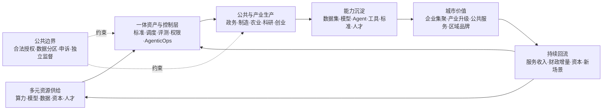

## 宜昌：一座城市怎样从资源投入走向能力反哺
<!-- 图稿需求：图6-2；具体形式、位置、构图、版权与交付要求见 90_出版工作台/02_图稿清单.md。此注释不进入排版正文。 -->

国家AI主权经常从芯片、模型和国际关系展开，真正落地时却总要经过城市。电力和机房有具体位置，大学和企业在具体地方培养人才，公共服务由具体部门执行，产业问题也发生在具体工厂、港口、医院和街道。

城市因此不是缩小的国家，也不是放大的企业。它既没有国家完整的立法与国际谈判权，也不能像企业一样只服务一组股东和客户。它要把国家规则、地方资源、公共责任与产业运营接在同一片现实中。

宜昌提供了一个尚在演进、但值得观察的切面。作者所在机构参与了当地相关平台建设，因此这个案例不能由项目方材料自证成功。可以独立确认的是：截至二〇二五年八月，宜昌市科技部门公布全市已建成智算规模超过三千P，点军区建设了算力供应链平台，并开始整合模型库、数据集和AI生态专区；二〇二六年五月，当地又启用以“数据、算力、场景、转化”为核心的OPC创新社区，面向独立开发者、小团队和数据企业。湖北省二〇二六年“数智+”场景清单还把三峡传神社区列为算力调度与生态运营能力，记录其“开源平台、产业联盟、基金会”的组织方式以及异构算力、模型与数据资产、智能体开发等组件。[^p6-yichang-runtime]

这些材料能够证明项目、资源和组织安排存在，不能单独证明算力已经高效利用、创业项目能够长期存活、公共价值超过成本，或者这一模式可以无条件复制到其他城市。省级场景清单中的利用率等数字仍来自申报材料，不是独立绩效审计；本书不把它们用作效果结论。

城市AI项目最容易在这里被语言提前完成。一份规划写出资源规模，报道就把它写成“正在建设”；机房通电，宣传又把它写成“平台落地”；平台出现用户，便进一步推断产业已经形成。为了不让案例跑在证据前面，可以把成熟度拆成五种不同状态。

| 状态 | 能够证明什么 | 仍不能证明什么 |
|---|---|---|
| 规划 | 目标、预算、合作意向和拟建架构存在 | 合同已经执行，资源已经到位 |
| 建设 | 设备、软件、场地或组织正在形成 | 端到端任务已经可用 |
| 上线 | 用户可以访问，基本功能能够运行 | 关键流程稳定，控制长期有效 |
| 持续运行 | 一段时间内有任务、维护、故障处理和迭代 | 公共结果优于成本，利益分配公平 |
| 独立成效 | 第三方用清楚口径评估了利用、质量、成本与影响 | 结论能自动外推到另一座城市 |

同一项目可以在不同部分处于不同状态：数据中心已经运行，模型平台刚刚上线，产业孵化仍在规划，公共问责机制甚至尚未公开。成熟度不是给城市贴一个总分，而是防止“某一部件存在”替整套系统领取结论。

前面这种成熟度区分仍然必要，但如果只用它防止项目夸大，也会漏掉城市方案真正要解决的问题：平台不只是应当持续运行，还应当持续产生新的本地能力。

宜昌方案的核心不是建设一个模型门户，也不是把几类算力摆进同一目录。它试图形成一种“多元一体”的城市AI生产结构。

“多元”指供给和参与者保持开放：全球主流GPU、CPU与其他异构芯片可以共同接入，开放权重与商业模型可以按任务选用，公有云、私有环境和边缘节点可以组合；政府、企业、高校、开发者、开源社区、产业联盟和资本也承担不同角色。“一体”不是把它们变成一家供应商、一个模型或一个数据库，而是让资源使用同一套可理解的资产标识、调度、评测、权限、计量、证据和反馈规则。

自主可控由此获得了比“本地部署”更完整的含义：城市不必制造所有技术，却要掌握异构资源的接入权、模型的选择与替换权、数据的使用规则、资产目录和版本、Agent的发布与停止、运营计量以及学习成果的归属。外部能力可以不断进入，城市不能每完成一个项目就把数据、经验和下一轮改进能力重新交还给外部供应商。

这种结构可以分成四层。

第一层是**多元资源底座**。电力、网络、数据中心和异构算力经过纳管、调度与计量，成为大学、中小企业、公共机构和开发者能够按任务取得的生产资源。

第二层是**城市AI资产层**。数据集、模型、代码、Prompt、工具、评测集、Agent和行业知识都有版本、来源、许可和访问边界。它不是一个只供浏览的目录，而是城市过去投入和真实生产留下的共同技术记忆。

第三层是**AgenticOps生产与控制层**。它把资产发现、构建、评测、发布、运行、反馈和再训练连成生命周期，同时管理身份、权限、路由、成本、审计和停止。这里的“一体化”主要发生在标准和生命周期上，不要求敏感数据离开企业与公共机构原有边界。

第四层是**公共与产业服务层**。企业在自己的边界内使用模型和Agent，科研团队复用算力与数据工具，开发者在沙箱中验证应用，城市开放真实场景，运营主体提供持续服务，产业资本把经过验证的团队和项目带入更大市场。

中国关于城市全域数字化转型的政策已经把“开放兼容的共性基础、算法与模型一体部署、数字产业集群、数据服务机构、场景开放和产城融合”放在同一结构中；后续行动计划又明确要求建立城市数据、场景和设施的立体化运营体系，并用动态反馈连接预算与评价。国家数据局推动的城市可信数据空间，则进一步把公共、企业与个人数据的融合应用、分建统管、跨域协同和数据产业生态放进长期运营机制。[^p6-city-flywheel]

这种思路也不是中国城市的特殊想象。欧盟AI Factories把超算、数据和人才放进同一个创新生态，连接大学、中小企业、产业与金融机构；新加坡国家AI战略把产业、政府与科研列为活动驱动者，把人才、能力与空间载体列为共同体系统，又把算力、数据和可信环境列为基础条件。它们的制度形式不同，却都说明一件事：AI基础设施只有同企业、人才、数据和持续应用组织在一起，才可能从设备投资变成地区能力。[^p6-city-flywheel]

城市AI主权真正需要建立的，是下面这条飞轮。

飞轮中最容易被忽视的是“沉淀”。一次农业Agent完成了病虫害识别，城市不应只得到一份交付报告；还应在权利清楚的条件下留下可复用的评测方法、数据标准、工具组件和本地团队。一个制造项目优化了工艺，也不等于企业必须把原始生产数据交给城市平台；可以沉淀的是经过授权的行业数据产品、算法能力、接口标准和实施经验。沉淀不是集中收走，而是让每个主体保有自己的资产，同时让可共享部分进入下一轮协作。

“反哺”也不能只写成宏大愿景。它至少有三种可观察路径。技术反哺，是前一批任务形成的模型、Agent和工具降低下一批项目成本；产业反哺，是平台帮助本地企业形成产品、订单、人才和跨区域服务；公共反哺，是产业增长、运营收入和更成熟的技术队伍改善公共服务，并支持下一轮基础设施投入。只有算力消耗不断增加，却没有任何一种回流，城市建设的只是消费中心，不是AI主权。

楼宇、招商、基金和收入因此不能被直接当成主权成效，却也不应从理论中删除。它们是产业飞轮可能运转的载体和资金机制。科学写法不是假装这些因素不存在，而是把“机制存在”与“成效已经发生”分开：有运营主体不等于运营可持续，有基金不等于孵化成功，有企业入驻不等于形成产业集群，有平台收入也不等于公共投入获得合理回报。

城市运营主体在这套结构中非常关键，也最需要权力分离。政府提供政策、公共资源与场景，并规定公共边界；市场化运营主体负责服务、计量、生态和年度运营；企业保有自己的生产数据与成果；开源基金会或中立社区维护开放资产和共同规则；产业联盟协调需求与标准；资本承担项目筛选和扩大风险。任何一家机构同时掌握公共授权、全量数据、平台规则和项目收益，都会把“一体”滑向新的垄断。

因此，城市AI项目的评价需要从建设指标扩展到五组运行指标：多元资源是否真实接入和切换；企业、科研和公共任务是否持续发生；多少数据集、模型、Agent和工具能够复用；本地团队、企业和产业收入是否增长；公共结果、运营收入和财政增量是否形成可解释的再投入。与此同时，还要检查敏感数据是否留在适当边界，原供应商退出后资产和服务能否继续，受影响的人能否申诉。

宜昌不能替全世界证明这套飞轮已经成功。它提供的是一个正在形成的现场：一座拥有能源、算力、产业和社区资源的城市，是否能够把多元技术组织成一体化生产体系，让运行产生资产，让资产形成产业，让产业与人才再反哺城市。这个问题，比“建成多少P算力”更接近城市AI主权的本质。
