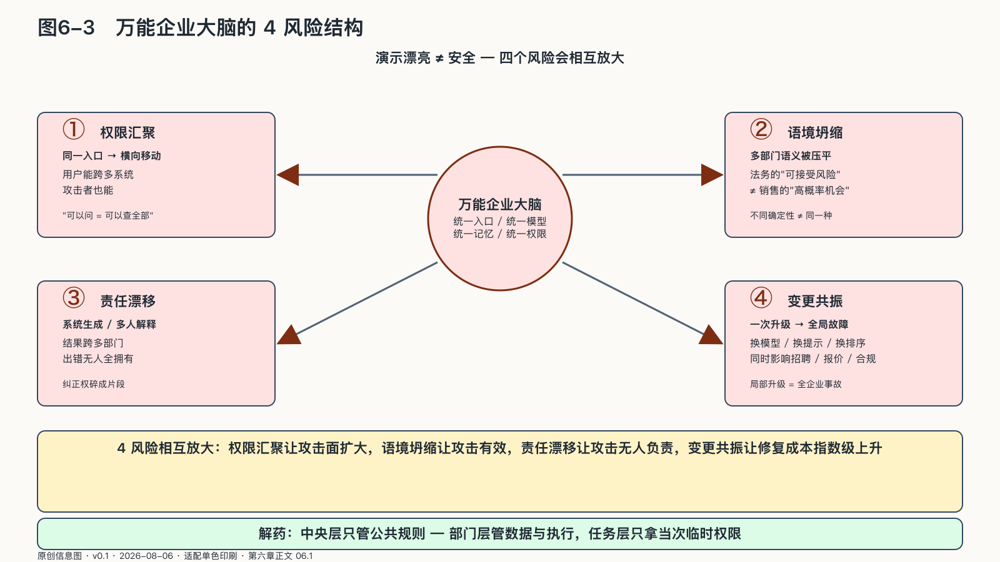

## 企业内部也有主权边界

“都是公司的数据，为什么不能让AI一起读？”这是建设企业知识库时最容易出现、也最容易被忽略的一句话。

因为公司是一个法律主体，却不是一个没有隔墙的房间。企业的数据和决策责任分散在不同部门。

研发部门对源代码、缺陷和技术路线负责；财务部门掌握现金、预算与未披露业绩；人力部门保存薪酬、绩效和健康资料；法务部门处理诉讼策略、合同风险与调查材料；销售部门最接近客户关系。部门边界来自不同的责任、专业要求和风险，并非纯粹的行政分隔。

传统系统通常用应用、数据库和角色权限守住这些边界。AI改变之处在于，它会把“查一条记录”扩展成连续动作：检索资料、归纳判断、生成方案、调用工具，再把结果转交给下一个智能体。一项请求可能在几秒内穿过原来由多次申请、会议和人工交接组成的边界。

同属一家企业，不等于可以相互开放全部资料。零信任架构保护的是具体资源，不因网络位置或组织归属自动授予信任；每次访问都应按身份、资源、目的和当时状态单独判断。[^p5-zero-trust]

Google早在大模型进入企业之前，就把这件事做成了一套真实运行的工程。二〇一四年公开的BeyondCorp不再把“连上公司内网”当作信任凭证，而是逐步把内部应用放到互联网可访问的环境中，再根据用户身份、设备状态与请求情境决定能否进入。它解决的不是生成式AI问题，却提供了一个重要先例：即使员工、设备和应用都属于同一家公司，访问权也必须在每一次请求中重新成立。[^p5-beyondcorp]

到了智能体时代，这个原则更难执行，也更不能省略。过去，一个员工通常要打开多个系统、经历多次确认，才可能把研发资料和财务数据拼在一起；现在，一个获得过宽权限的智能体可以在几秒钟内完成检索、推断、写入和转发。BeyondCorp把“内网”拆成了具体的人、设备和应用，企业AI还要继续把“部门”拆成具体的数据、任务和行动权限。

负责某项数据或行动结果的部门，需要能够界定使用范围、批准用途、撤销权限并解释结果。边界不是部门保护地盘的借口，而是“谁有资格作出这一判断、谁要为后果负责”的组织答案。

企业仍有共同目标，董事会与管理层也有权制定组织规则；这并不要求每个智能体都看见全部上下文。自动协作增加以后，原来依靠口头纪律维持的部门边界，需要落实为机器可以执行的访问策略。

### 万能企业大脑为何危险

面对部门割裂，最诱人的答案是建设一个“企业大脑”：把全部邮件、文档、数据库和会议记录汇进同一套系统，让员工从一个聊天框里询问整家公司。

演示现场通常非常漂亮。销售人员问一句“这个客户值不值得给折扣”，系统便同时引用往来邮件、历史订单、产品毛利和合同风险。但也正是在这一刻，四堵原本各自有门禁的墙，被改造成了一个入口。

集中方案省掉了一部分申请和交接，也把权限汇聚到同一个入口。它带来的风险不止是“可能泄密”，而是四种会相互放大的结构性问题。

第一，**权限汇聚**。一个入口一旦能够替用户访问多个系统，攻击者或错误指令也获得同样的横向移动路径。

第二，**语境坍缩**。法务标注的“可接受风险”、财务定义的“已承诺收入”和销售口中的“高概率机会”并不是同一种确定性。把它们放进一个向量空间，不会自动得到共同语言。

第三，**责任漂移**。结果由统一系统生成，数据却来自多个部门；出错时，每个部门都只能解释自己的一段，没人拥有完整的纠正权。

第四，**变更共振**。更换一个模型、提示模板或检索排序，可能同时改变招聘、报价、采购与合规判断。原本局部的升级变成全企业的共同故障。

来源：原创信息图 · 适配单色印刷 · 数据来源：第六章正文 06.1

来源：网络公开图 · Unsplash License（CC0 风格）· 出版前由编辑逐一核验版权

<!-- 图稿需求：图6-3；详见 90_出版工作台/02_图稿清单.md -->

企业仍需要公共能力，但中央智能体不应拥有无限上下文和永久权限。可以把公共层限制在身份、服务发现、协议、策略模板和跨域追踪，具体执行权留在部门。

中央层负责企业共同规则，部门层管理专业数据与工具，任务层只取得当次执行所需的临时权限。控制范围与责任范围这样逐层对齐，局部错误才不容易扩散成全局越权。
