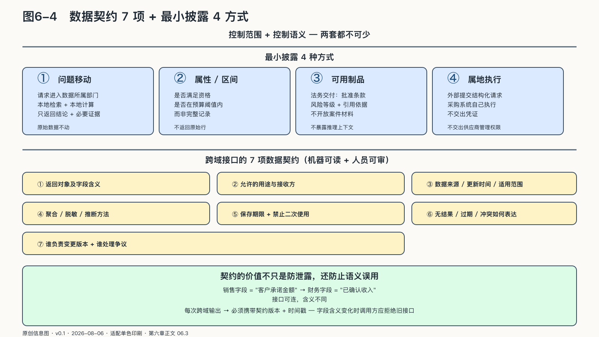
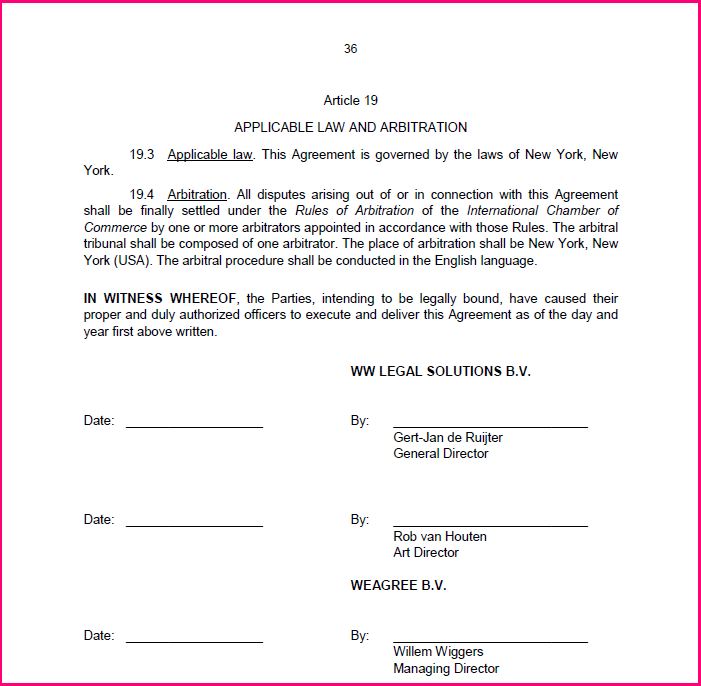

## 最小披露必须写成数据契约

销售智能体发出一个请求：“这个客户能不能给八五折？”财务要回答它，需要交出什么——整张利润表，还是一个“在预算阈值内”的判断？

跨部门任务需要披露足够的信息，但披露范围应限定在完成任务所需的最小集合。信息太少，员工会绕过系统；以“以后也许有用”为由多给信息，又会把临时协作变成永久扩权。

最小披露有四种常见方式。

第一，让**问题移动**，不让原始数据移动。请求进入数据所属部门，在本地完成检索和计算，只返回结论与必要证据。

第二，返回**属性或区间**，不返回完整记录。招聘系统可能只需要知道候选人是否满足某项资格，无需取得完整人事档案；销售系统只需知道某折扣是否在预算阈值内，无需读取全部利润表。

第三，返回**可用制品**，不返回全部推理上下文。法务可以交付批准条款、风险等级与引用依据，而不是开放整套案件材料和内部讨论。

第四，让**动作在属地域内执行**。采购部门可以接受“冻结某供应商”的受控请求，由自己的工具执行并返回结果，而不是把供应商管理系统的凭证交给外部智能体。

来源：原创信息图 · 适配单色印刷 · 数据来源：第六章正文 06.3

来源：网络公开图 · Unsplash License（CC0 风格）· 出版前由编辑逐一核验版权

<!-- 图稿需求：图6-4；详见 90_出版工作台/02_图稿清单.md -->

“最小”不是固定字段清单，而要随任务、对象和时间变化。季度结账时的授权不应自动延续到日常；一次并购项目的共享范围不应变成人员的永久权限；任务结束后，临时令牌、缓存上下文和中间制品都应到期。

原始事实仍由所属部门保管。跨部门任务通过答案、属性、制品和属地动作组合结果，无需先把所有原始数据汇入一处。

但“只返回必要内容”仍然少了一个问题：调用方怎样知道这份答案究竟代表什么？最小披露控制数量，数据契约控制含义；前者防止看得过多，后者防止把有限信息解释错。

### 数据契约先于数据流动

销售系统里的“客户”可能包括还在跟进的线索，财务系统里的“客户”却可能只指已经形成交易的主体。两个字段都叫customer，把它们连起来只需要几行接口；把两种含义混在一起，足以让一份经营报告从第一行就开始撒谎。

字段可以传过去，含义却未必一致。数据规模只有几张表时，口径冲突还能靠熟悉业务的同事临时解释；到了平台规模，它会变成日常事故。Uber在二〇一八年披露，其分析平台已经管理超过一百PB数据。后来，项目团队把问题描述得更具体：数百个服务和机器学习模型依赖数以万计的数据集，数据质量平台优先覆盖二千多个关键数据集，并称能够发现约九成数据质量事件。这个比例来自Uber团队自己的运行统计，不是独立审计；但它至少说明了一件事——数据越多，企业越不能靠“大家应该都懂这个字段”的默契运行。[^p5-uber-data-quality]

Uber随后把原则写得很直白：数据像代码一样必须有人负责。生产数据的团队要说明所有者、用途、服务水平、事件处置和退役路径；统一平台提供规则和工具，本地团队仍对自己产生的数据承担责任。共同底座并没有取消本地责任。

“客户”“收入”“上线”“高风险”在不同部门可能有不同口径。智能体能够轻易抹平语言差异，生成流畅答案，也更容易把不同定义拼成一项不存在的事实。

跨域接口因此需要一份机器可读、人员也能审查的数据契约。它不是接口文档的附件，而是部门之间对“这句话究竟算什么”的正式约定，至少说明：

- 返回对象及字段含义；
- 允许的用途与接收方；
- 数据来源、更新时间和适用范围；
- 聚合、脱敏或推断方法；
- 保存期限与禁止二次使用条件；
- 无结果、过期、冲突和权限不足怎样表达；
- 谁负责变更版本，谁处理争议。

契约的价值不只是防泄露，还防止语义误用。财务部门返回“本季度已确认收入”，销售智能体就不能把它改写为“客户承诺金额”；法务返回“需升级审查”，项目智能体也不能把它解释为“项目被否决”。

每次跨域输出都应携带契约版本和时间戳。字段含义变化时，调用方可以拒绝旧接口或进入人工复核，避免在不知情中继续运行。数据所属部门既要决定哪些内容可以输出，也要注明这些内容的适用口径。
