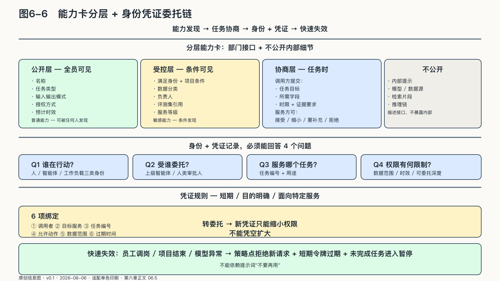
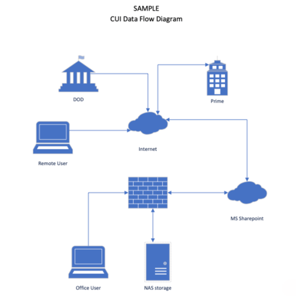

## 智能体怎样发现彼此并获得委托

跨部门协同首先要知道“谁能做什么”，但能力发现本身也可能泄露组织秘密。目录本身就是一种敏感资产：并购审查智能体、裁员测算工具或安全事件响应接口是否存在，都不应向全员公开。

部门可以发布分层能力卡：名称、任务类型、输入输出模式、授权方式、数据分类、预计时效和负责人。公开目录只显示普通能力；敏感能力只有满足身份和项目条件后才可发现。能力卡描述接口，不公开内部提示、模型、数据源和推理链。

来源：原创信息图 · 适配单色印刷 · 数据来源：第六章正文 06.5

来源：网络公开图 · 政府公共领域 / CISA Data Flow 标识 · 出版前由编辑逐一核验版权

<!-- 图稿需求：图6-6；详见 90_出版工作台/02_图稿清单.md -->

截至二〇二六年八月五日，A2A规范以Agent Card描述智能体身份、能力、技能和认证要求，并用有状态任务承载协作过程。[^p3-a2a-task] 这类协议提供的是跨域语言，不替组织决定谁可以发现、调用和信任谁。

发现之后仍需协商。调用方提出任务目标、所需字段、时限与证据要求；服务方可以接受、缩小范围、要求补充授权或拒绝。高风险任务不能因为接口格式匹配就自动建立信任。

协议规定智能体怎样交换任务和结果，企业规则决定哪些身份可以发现和调用哪些能力。部门可以使用不同平台和模型，只要共同遵守任务、身份、错误和证据契约。接口保持稳定时，替换一个部门的AI平台不必带动全企业重建。

这已经成为正在成形的标准问题。NIST在二〇二六年先发布智能体身份与授权概念文件，随后启动AI Agent标准倡议；五月公布的征求意见汇总显示，回应者普遍认为智能体带来了新的安全威胁，传统网络安全原则仍然有效，却必须适配模型输出与软件行动结合后的系统。概念文件把识别、授权、审计、不可抵赖和提示注入放进同一问题中。它们还不是成熟强制标准，却说明“大模型能否完成任务”已经不足以定义生产级智能体；组织还要证明它以谁的身份、在什么委托下完成。[^p4-nist-agent-id][^p4-agent-security-2026]

### 身份、凭证与委托链

跨域系统不能只知道“这是财务来的请求”，还要知道哪个人发起、哪个智能体承接、经过哪些转委托、准备访问哪个资源。

人、智能体和运行它的工作负载应有不同身份。员工登录证明“谁发起”；智能体身份说明“哪个受管服务在行动”；工作负载身份证明“当前运行实例是否可信”。三者连接成委托链，却不能用一个员工的长期令牌冒充到底。

每次跨域调用应取得短期、目的明确、面向特定服务的凭证。凭证至少绑定调用者、目标服务、任务编号、允许动作、数据范围和过期时间。智能体把任务再委托出去时，新凭证只能缩小权限，不能凭空扩大。

SPIFFE把工作负载身份组织为独立信任域，并支持不同信任域交换信任包后验证彼此身份；官方概念文档也把“部门”列为信任域的可能边界。[^p5-workload-federation] 各域可以独立签发和撤销身份，跨域时建立有限联合，无需共享根密钥。

凭证还必须能够快速失效。员工调岗、项目结束、模型异常或部门进入应急状态时，组织不能依赖提示词要求智能体“不要再用”。策略点应拒绝新请求，短期令牌自然过期，未完成任务进入暂停或人工接管。

身份和凭证记录应能回答四个问题：谁在行动、受谁委托、服务于哪个任务、权限受到哪些限制。
