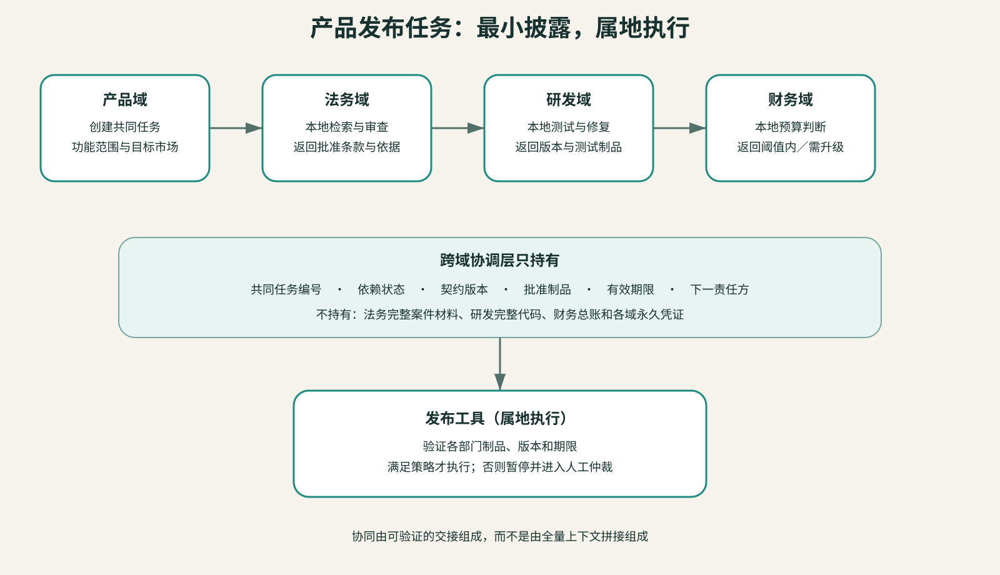

## 一次产品发布怎样穿过五个部门

下面用一个构造案例把前面的机制串起来，它不对应某家企业的真实发布：企业准备上线一项带有AI功能的新产品。任务涉及产品、研发、法务、财务和销售，但没有一个部门需要看见其他部门的全部资料。协同成立的标志，恰恰是没有一个协调者拥有完整上下文。

产品域先生成发布任务，给出功能范围、目标市场和发布日期。它只把待审功能说明交给法务，不发送完整源代码与所有客户访谈。

法务域在本地检索适用条款和历史意见，返回“可发布、需修改、需升级”之一，同时附上批准条款、适用地区、依据版本和有效期。内部调查材料与律师讨论不离开法务域。

研发域接收需要验证的控制项，在本地运行测试，只返回测试制品、代码版本和是否通过。财务域根据结构化成本与销量区间计算预算门槛，返回是否在授权范围；销售域取得获批卖点和地区限制，不读取成本模型或未公开法律意见。

若法务要求修改，任务回到产品域，而不是让法务智能体直接改代码；若预算超限，财务工具冻结发布批准，而不是把总账权限交给产品智能体。最终发布工具只接受五个域签发的有效制品，并在执行前再次验证版本和期限。

协调者只掌握任务状态、依赖关系和已批准制品，不需要取得五个部门的全部上下文。专业事实留在产生它的域内，各部门通过带有版本、期限和签发者的制品完成交接。
