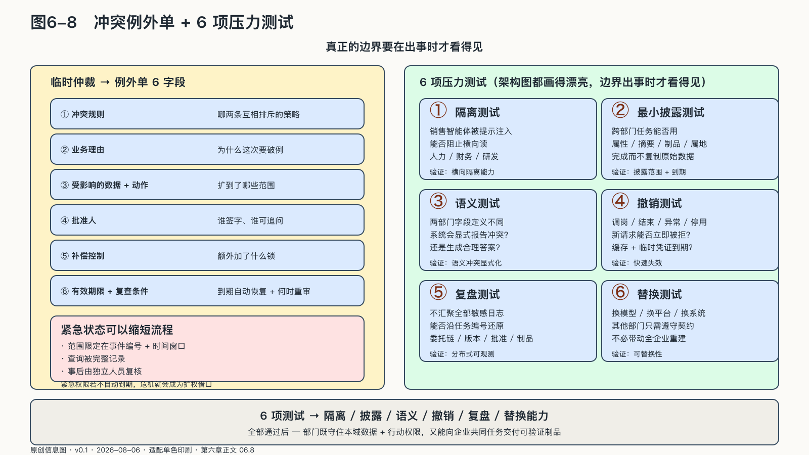

## 冲突、例外与六项压力测试

部门协同不会因为接口完善就没有冲突。产品要速度，安全要停止；销售要客户细节，法务要限制披露；总部要统一口径，本地团队面对不同法规与市场现实。接口决定请求怎样送达，冲突决定谁来拍板——后者永远不能由接口代答。

智能体可以识别冲突、收集证据和模拟方案，却不应偷偷把价值选择伪装成技术路由。以下情况应进入人工仲裁：两个有效策略互相排斥；数据契约没有覆盖新用途；请求要求扩大原定目的；高风险动作缺少责任人；部门对事实口径或证据充分性无法达成一致。

临时仲裁应形成一份例外单，记录冲突规则、业务理由、受影响的数据和动作、批准人、补偿控制、有效期限与复查条件。例外到期后自动恢复原策略，避免临时决定沉淀成隐藏的永久通道。

紧急状态可以缩短流程，但不能消灭证据。安全事件中，响应团队可能临时取得跨域查询权；其范围应限定于事件编号和时间窗口，查询被完整记录，事后由独立人员复核。紧急权限若不自动到期，危机就会成为扩权的借口。

管理层可以在明确责任的前提下作出企业级取舍，部门并不拥有对企业行动的无限否决权。系统必须保留谁覆盖了哪条规则、覆盖理由和影响范围，不能把管理决定隐藏在“系统自动决定”之后。

### 组织单元层主权的六项压力测试

架构图永远可以画得边界分明。边界往往要在出事时才看得见：一个销售智能体遭到提示注入，一名员工突然调岗，一份法务意见当天失效，系统还能不能把错误关在原来的房间里？

可以用六个故障场景检查部门AI架构的控制能力。

**隔离测试。** 销售智能体遭到提示注入或凭证泄露时，能否阻止它横向读取人力、财务和研发资料？

**最小披露测试。** 跨部门任务能否用属性、摘要、制品或属地执行完成，而不复制原始数据？每一项披露是否有用途和到期时间？

**语义测试。** 两个部门对同一字段定义不同时，系统会显式报告冲突，还是生成一个听起来合理的统一答案？

**撤销测试。** 员工调岗、项目结束、模型异常或工具停用后，新请求能否立即被拒绝，未完成任务能否暂停，缓存和临时凭证能否到期？

**复盘测试。** 不汇聚全部敏感日志，企业仍能否沿共同任务编号还原委托链、版本、批准和制品？

**替换测试。** 某部门更换模型、智能体平台或知识系统时，其他部门是否只需继续遵守协议和契约，还是整个协作网络都被迫重建？

六项测试分别验证隔离、披露、语义、撤销、复盘和替换能力。

来源：原创信息图 · 适配单色印刷 · 数据来源：第六章正文 06.8

来源：网络公开图 · Unsplash License（CC0 风格）· 出版前由编辑逐一核验版权

<!-- 图稿需求：图6-8；详见 90_出版工作台/02_图稿清单.md -->

测试通过以后，部门既能守住本域的数据与行动权限，也能向企业共同任务交付可验证的制品。自治与协同在组织单元这一级不再矛盾。

但答案停在这里是不完整的。部门边界守住了，部门之上还有一个更大的问题：企业面对的并不只是自己的部门，还有外部的模型公司、云平台、工具服务和智能体供应商。内部的墙可以靠自己砌，外部的依赖却要穿过这些墙才能进入生产。整个企业怎样把智能变成可治理、可审计、可替换的生产能力，而不是一组各自完好的部门孤岛？这是下一章要回答的。
