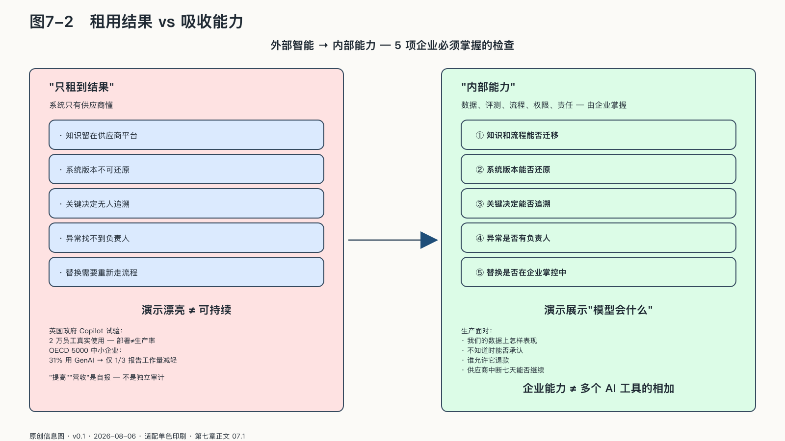
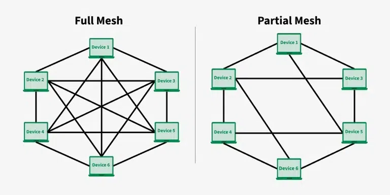

## 租用结果，还是吸收能力

企业一直在使用外部能力。电力来自电网，计算来自云服务，物流由合作伙伴完成，法律与咨询也常由外部专业机构提供。没有企业需要生产自己使用的一切，现代商业的效率本来就建立在分工和相互依赖之上，AI也没有改变这一点。

AI改变的是分工之后能力沉淀的位置。底层模型来自外部，不意味着企业失去主动；模型运行在自有机房，也不意味着主动权已经获得。真正的分界只有一条：外部智能有没有被转化成企业能够理解、约束、评估和替换的内部能力。

如果系统只有供应商懂，企业租到的只是结果；如果数据、评测、流程、权限和责任都能由企业掌握，外部模型也可以成为内部能力的一部分。

来源：原创信息图 · 适配单色印刷 · 数据来源：第七章正文 07.1

来源：网络公开图 · 维基百科 CC（教学示意图风格）· 出版前由编辑逐一核验版权

<!-- 图稿需求：图7-2；详见 90_出版工作台/02_图稿清单.md -->

企业AI主权不要求所有东西自己建。它要求采购不会掏空自身判断，合作不会取消退出权，规模不会让一次错误变成无法解释的灾难。

这条路有一种常见的走偏值得先说清：把“吸收能力”理解成“全部自研”。一家制造企业自建大模型团队，一家银行复刻自己的云平台，两年后模型追不上公开供给，团队被成本和人才流失拖垮，原先要守住的业务知识反而没人维护。重复造轮子不是主权，是把稀缺的工程资源从治理能力上抽走。主权的方向相反：外部能买到的不自己造，省下来的人力和注意力全部投向买不到的东西——自己的评测、权限、证据和替换能力。

监管正在要求通用大模型供应商提供更多上游证据。欧盟通用大模型规则已经要求相关提供者准备技术文档、实施版权政策并公开训练内容摘要；对具有系统性风险的模型，还增加风险评估、严重事故报告和网络安全义务。二〇二五年发布、二〇二六年继续运行的自愿性实践准则，进一步把透明度、版权、安全与防护拆成可执行承诺。[^p6-gpai-code] 这些材料能提高企业理解供应商的起点，却不能代替企业自己的任务评测、权限记录和事故证据。上游证明“模型怎样建、采取过哪些措施”，企业仍要证明“它在我的数据和流程里实际做了什么”。

漂亮的产品演示很容易遮住这条边界。英国政府的一次试验把“产品演示”和“组织吸收”分开了。二〇二四年九月至十二月，政府数字服务部门让十二个政府组织、约二万名员工使用Microsoft 365 Copilot，任务覆盖Word、Excel、PowerPoint、Outlook和Teams；之后又对代码助手进行跨政府试用，提供二千五百个许可，并同时收集遥测、满意度和退出反馈。部署人数本身不能证明生产率已经提高，却说明评估对象不是模型会不会写一封邮件，而是不同岗位能否在数据边界、权限、培训和反馈机制下稳定使用它。[^p7-uk-government-ai]

小企业的扩散数据也说明，买到工具和形成能力之间隔着一段距离。OECD对七国五千多家中小企业的调查显示，约31%已经使用生成式AI；使用者中65%自报员工或业主表现提高，26%自报营收增加，但只有约三分之一说工作量减轻，未采用者最常见的障碍是“不适合业务”、版权与法规、输入信息风险和技能不足。这里的“提高”和“增加”是自报，不是随机对照的因果效果；它揭示的是，模型已经进入普通企业，却还没有自动变成可复用、可衡量、可问责的生产流程。[^p6-oecd-sme]

演示展示“模型会什么”，生产系统面对的却是另一组问题：它在我们的数据上怎样表现？不知道时会不会承认？能接触哪些客户？谁允许它退款？模型更新后行为是否改变？供应商中断七天，业务还能不能继续？

模型能力回答“可能做到什么”。企业能力回答“我们能否长期、稳定、负责地做到”。

企业能力不是多个AI工具的简单相加。工具要进入稳定的业务体系，还需要明确的数据来源、流程所有者、权限策略、评测基线和故障接管方式。模型或供应商变化后，这些要素仍应由企业保存和维护。

因此，判断AI是否已经成为企业能力，可以检查几个具体对象：知识和流程能否迁移，系统版本能否还原，关键决定能否追溯，异常是否有负责人处理。如果答案只存在于供应商平台或个别员工的经验里，企业获得的仍是分散工具，而不是可持续运行的系统。
