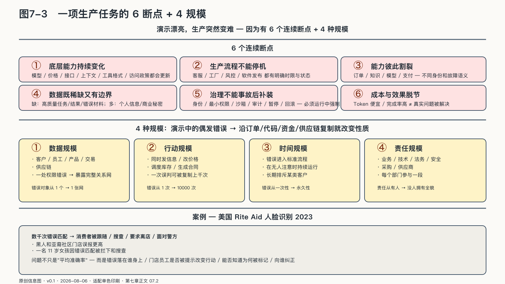

## 一项生产任务会在哪里断裂

为什么一个在演示中表现很好的AI，一进入企业生产就会突然变难？

可以跟着一项售后任务走一遍。智能体收到客户来信，查询订单和保修政策，判断是否符合条件，拟定处理方案，必要时创建退款申请，并把结果写回客户系统。模型回答是否流畅，只是这条路最容易看见的一小段；真正让系统停下来的，往往是六个连续断点。

第一个断点是**底层能力持续变化**。模型、价格、接口、上下文窗口、工具格式和访问政策都会更新。升级可能提高平均能力，也可能改变拒答方式、结构化输出和工具选择。企业若没有自己的版本记录、评测基线和替代路线，供应商每一次更新都可能成为一次未经企业批准的流程变更。

第二个断点是**生产流程不能跟着模型停机**。客服可以暂时改用人工，工厂、风控和软件发布却常有明确的时限与状态。切换模型以后，未完成任务是否继续，已经发出的动作是否重复，人工接管能否看懂中间状态，比“备用模型能不能回答同一道题”更重要。

第三个断点是**能力彼此割裂**。订单系统知道交易事实，知识库保存政策，模型理解语言，支付工具改变资金状态，员工承担最终责任。它们由不同团队和供应商运营，使用不同身份、日志和故障语义。每个组件单独可用，不代表组合起来仍然安全；局部授权还可能在连接之后拼成一条从未被整体批准的行动路径。

第四个断点是**数据既稀缺，又有边界**。企业并不缺文件和日志，缺的是能够说明任务、结果和错误的高质量材料：哪个回复真正解决了问题，哪条规则已经过期，哪次人工修改纠正了模型，某类客户为何总在同一步失败。这些信息往往散落在业务系统、员工经验和投诉记录里；其中又包含个人信息、商业秘密和受合同限制的内容，不能因为“训练需要”就无边界集中或外传。

第五个断点是**治理不能在事故之后补装**。身份、最小权限、数据用途、人工确认、沙箱、审计、暂停和回滚，必须在任务运行时真实改变系统能做什么。上线前签过一份原则文件，却允许智能体长期持有人类账号和组织密钥，治理仍然没有进入生产。

第六个断点是**成本与效果失去联系**。Token、GPU时间和工具调用容易计量，客户问题是否解决、员工是否减少返工、错误是否被更早发现却更难观察。只优化调用单价，可能得到一个反复重试、依赖人工补救的廉价模型；只追求完成率，也可能用更高成本自动完成了本不值得自动化的任务。

这六项是企业现场反复出现的故障症状，不构成第二套主权框架。可以用选择、替换、迁移、审计、组合和演进六种能力检查它们是否解决，再把任务契约、执行凭证和AgenticOps落实到企业生产。NIST的AI风险管理框架同样把第三方依赖、持续监测、变更、事故恢复和安全退役放在完整生命周期中；OpenTelemetry开始统一记录模型、Agent与工具调用，也只解决了“看得见”的一部分，不能替企业定义任务是否值得、结果是否正确。[^p6-production-frictions]

| 生产现场看到的症状 | 看似直接、实际不充分的办法 | 真正要接受的主权检验 |
|---|---|---|
| 模型和接口持续变化 | 押注一家永远领先的供应商 | 能否比较、替换并随技术演进 |
| 关键流程不能中断 | 准备一个从未运行过的备用模型 | 任务、状态和责任能否迁移并降级继续 |
| 模型、工具与算力割裂 | 把所有组件接进同一张工具清单 | 不同能力能否在清楚身份和边界下组合 |
| 任务数据稀缺且敏感 | 汇集全部日志，默认用于训练 | 数据能否按目的使用、追溯并沉淀为可迁移资产 |
| 治理停在原则和合同 | 增加提示词或上线前审批 | 权限、证据、停止和恢复能否在运行中强制 |
| 成本与效果脱节 | 只降低Token单价或提高完成率 | 能否把资源、完整任务和现实结果放进同一套账 |

六个断点共同提出了一项架构要求：模型、算力和工具可以变化，企业自己的任务规则、身份边界、评测、证据和结果账不能随之消失。

但在讨论这层架构之前，还要先看清断点怎样随着规模进入现实。演示里的偶发错误，一旦沿订单、代码、资金和供应链复制，就会改变性质。

### 规模改变了错误的性质

一份错误文稿可以被删掉；一个被写进标准流程的错误，却会按时上班、从不请假，还可能在几分钟内复制到上万名客户身上。

一个人使用AI出错，影响可能停留在一份文稿。企业使用AI出错，结果会沿着组织结构扩散。

这种扩散至少来自四种规模。

第一是数据规模。系统接触的不再是几份文件，而是客户、员工、产品、交易和供应链。一处权限错误，可能暴露完整关系网。

第二是行动规模。智能体可以同时发送信息、修改价格、调度库存、生成合同、调用其他系统。一次误判可能被复制成千上万次。

第三是时间规模。错误进入标准流程后，会在没有人注意时持续运行。它未必制造一次轰动事故，却可能长期排斥某类客户、累积错误账目或损害产品质量。

第四是责任规模。AI跨越业务、技术、法务、安全、采购和供应商。每个部门参与一段，最终容易没人拥有全貌。

企业的困难在于，AI规模化以后仍要能够被理解、限制和制动。

来源：原创信息图 · 适配单色印刷 · 数据来源：第七章正文 07.2

来源：网络公开图 · 维基百科 CC（建筑制图风格）· 出版前由编辑逐一核验版权

<!-- 图稿需求：图7-3；详见 90_出版工作台/02_图稿清单.md -->

智能体会把一个业务动作拆到多个组件中：模型提出方案，规则引擎检查条件，工具执行操作，业务部门承担结果。处理速度提高了，问题定位却可能更困难，因为错误不再对应单一人员或单一程序。

二〇二三年，美国联邦贸易委员会公布了对Rite Aid使用人脸识别监控的指控和拟议命令。监管材料称，这家连锁药店的系统产生了数以千计的错误匹配，有消费者因此被跟随、搜查、要求离店或面对警方；一些黑人和亚裔社区门店更容易产生误报，甚至有一名十一岁女孩因错误匹配被拦下和搜查。[^p6-rite-aid]

这个案例把“规模”变成了具体后果。问题不只是平均准确率，而是错误落在谁身上，提示怎样改变门店员工的行动，受影响者能否知道自己为何被标记、向谁纠正。模型、低质量图片、员工培训、监控和申诉共同构成了结果，企业不能把供应商的准确率声明当成尽责证明。
