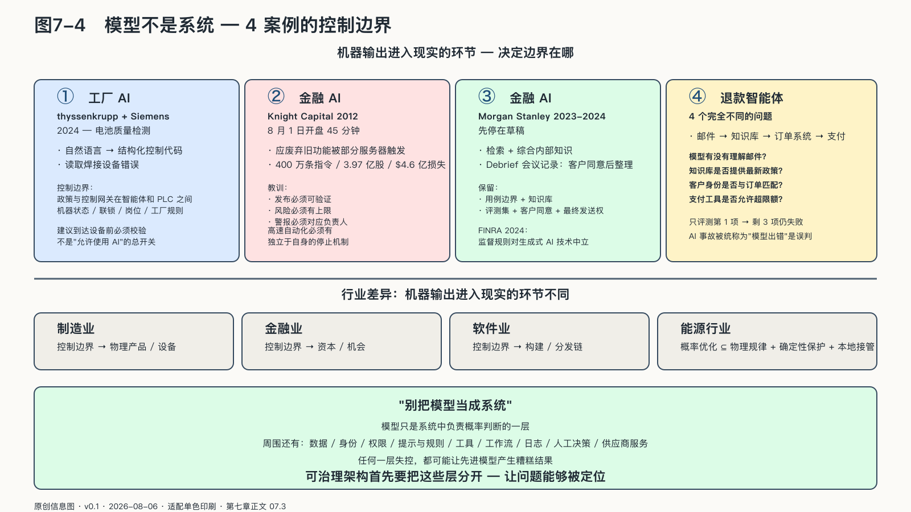
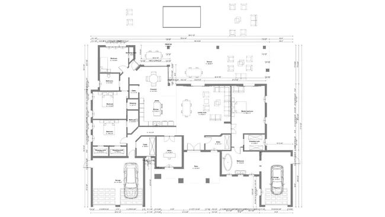

## 错误怎样进入行业现场

行业不同，错误落地的方式不同，控制问题的结构却是同一个。无论进入哪个行业，企业都要检查业务目标、知识、权限、证据和替代能力是否仍掌握在自己手中。差异主要出现在机器输出变成现实的环节：制造业落在物理产品和设备，金融业落在资本与机会，软件业落在构建和分发链，能源行业还要求概率优化服从物理规律、确定性保护和本地接管。这里分析的是这些行业共有的控制边界，不把它们展开成四份行业报告。

企业需要控制机器输出进入现实的路径：它越过哪一道门、影响多大范围、留下什么证据、由谁停止，又怎样恢复。模型所有权无法单独回答这些问题。下面的案例沿这条后果链展开。

### 工厂里的AI应该停在哪一步

thyssenkrupp与Siemens的工业Copilot提供了一条正在形成的边界。

二〇二四年公开的合作中，Copilot被用于电动车电池质量检测设备。工程师可以用自然语言提出要求，系统生成结构化控制语言代码，进入Siemens的工程软件并辅助形成机器可视化。另一类现场Copilot读取焊接设备的错误信息，帮助维修人员寻找原因和处理步骤。[^p6-industrial-copilot]

这不是“模型接管工厂”。它把过去需要查手册、写代码和配置界面的部分工作缩短，却仍需要工程工具、测试环境和人员把关。系统还包含多层外部依赖：自动化栈来自Siemens，自然语言能力使用Microsoft Azure OpenAI，规划中的本地方案又使用NVIDIA的软件与推理组件。

这种组合没有天然问题。生产配方、设备历史和故障数据可以留在车间或企业边缘环境，通用语言能力可以从外部采购，代码草稿也可以由模型生成。真正的控制边界出现在代码准备触碰机器时。

工业控制器要求同样输入在明确条件下产生可重复结果，安全联锁必须先于优化目标。语言模型输出则具有概率性，也可能受不完整资料和恶意上下文影响。Siemens提出的工业AI编排设计因此把政策与控制网关放在智能体和PLC之间：建议到达设备前，要根据机器状态、联锁、岗位权限和工厂规则校验；模型或策略更新先在虚拟环境调试，并保留版本与回退。

厂商架构说明不能证明防护绝不失效，也不能证明所有功能已经全面投入生产。它却清楚展示了制造业AgenticOps应怎样提问：读手册、解释错误、生成代码、写入工程项目、下发控制器和改变生产参数，是六种后果完全不同的动作。企业不能只有一个“允许使用AI”的总开关。

在工厂里，主权不是拒绝云端或坚持所有模型在车间运行。它是让敏感知识在哪里处理、通用能力从哪里取得、模型在哪一步必须停下、确定性系统何时接管，都由企业根据物理后果决定。

这要求企业建立端到端的可观测性，把调用者身份、模型与提示版本、检索资料、工具调用、人工批准和最终业务结果关联起来，不能只保存聊天记录。发生异常时，团队才能判断问题来自模型、数据、权限还是流程，并按预案暂停工具、回滚版本或转由人工接管。

### 四十五分钟

生成式AI普及之前，高速自动化已经给企业上过一堂昂贵的课。

二〇一二年八月一日，美国骑士资本在部署新的股票交易代码时出现问题。一个应当废弃的旧功能在部分服务器上被重新触发，程序无法正确识别订单已经完成。开盘后的四十五分钟里，系统为了执行二百一十二笔客户订单，向市场发送了四百多万条指令，交易了三亿九千七百多万股，最终给公司造成超过四点六亿美元损失。[^p6-knight]

美国证券交易委员会后来的调查指出，问题远超“一段代码写错了”。新版本没有一致部署到全部服务器，旧代码没有清理，风险控制没有覆盖公司总体敞口。系统在开盘前甚至发出了九十七封错误邮件，却没有被设计成正式警报，也没有触发行动。

这起事故预演了智能体时代最危险的组合：机器能够高速行动，异常已经留下痕迹，组织却没有及时理解和停止它。

如果程序只能生成一份错误报告，损失不会在四十五分钟内扩散。改变风险性质的是它与现实市场之间缺少一道有效的门。

今天的智能体比当年的交易程序灵活得多。它们能够解释目标、选择步骤、调用工具，也更难用传统测试覆盖全部行为。骑士资本留下的教训反而更加重要：发布必须可验证，风险必须有上限，警报必须对应负责人，高速自动化必须拥有独立于自身的停止机制。

### 为什么金融AI先停在草稿

十一年后，Morgan Stanley采用生成式AI时选择了另一种起点。

二〇二三年公布的首个工具供理财顾问检索和综合公司内部知识，没有充当自动交易员或直接面对客户的投资顾问。二〇二四年的Debrief进一步处理会议记录：只有客户同意后，系统才整理笔记、行动项和邮件草稿；邮件由持牌顾问编辑并决定是否发送，笔记才进入客户关系系统。[^p6-morgan-stanley]

这个设计没有消除外部依赖。底层模型来自OpenAI，服务更新、中断和长期替换仍需要治理。企业真正保留的是用例边界、自己的知识库、评测集、客户同意、最终发送权和法律责任。

金融业的难题也不止数据是否被拿去训练。一段客户会议录音能否产生，取决于当事人是否同意；生成的摘要进入哪一套档案、保存多久、谁能调阅，会影响未来建议和争议证据。即使合同采用零数据留存，企业仍要处理知识版本、模型漂移、服务连续和顾问信义义务。

Morgan Stanley与OpenAI公开材料称，每个用例上线前都由专业人员评测，并对会议类型建立测试集和日常回归测试。这些数据和采用效果来自公司与供应商，不能当成独立安全审计；公开材料也不能证明系统从未出错。材料至少展示了一种责任设计：模型扩大了检索与整理能力，却没有取得代表客户或顾问作出高风险决定的身份。

美国金融业监管机构FINRA随后明确，现有监督规则对生成式AI保持技术中立，企业使用第三方或嵌入式模型，也不能把模型风险、数据完整性、可靠性和准确性责任交给供应商。[^p6-finra-genai]

在这个案例中，金融AI停在草稿阶段，是因为企业尚未为更深行动建立与后果相称的证据和控制。权限可以随能力逐步增加，责任不能随着自动化逐步消失。

来源：原创信息图 · 适配单色印刷 · 数据来源：第七章正文 07.3

来源：网络公开图 · 维基百科 CC（建筑制图风格）· 出版前由编辑逐一核验版权

<!-- 图稿需求：图7-4；详见 90_出版工作台/02_图稿清单.md -->

### 把故障定位到完整系统

前面的案例共同指向一个误解：企业容易把模型能力等同于AI系统能力。

模型只是系统中负责概率判断的一层。它周围还有数据、身份、权限、提示与规则、工具、工作流、日志、人工决策和供应商服务。任何一层失控，都可能让先进模型产生糟糕结果。

想象一个退款智能体。

它先读取客户邮件，再从知识库检索政策，判断是否符合条件，调用订单系统查金额，最后向支付系统发起退款。这里至少有四个完全不同的问题：

模型有没有理解邮件；知识库是否提供了最新政策；客户身份是否与订单匹配；支付工具是否允许超过限额。

如果企业只评测第一项，剩下三项仍可能让系统失败。AI事故往往被统称为“模型出错”，实际原因可能是旧资料、过宽权限、错误工具参数，或者业务规则本身没有说清。

可治理架构需要保留各层的版本、权限和运行记录，事故发生后才能定位问题落在哪一层。
