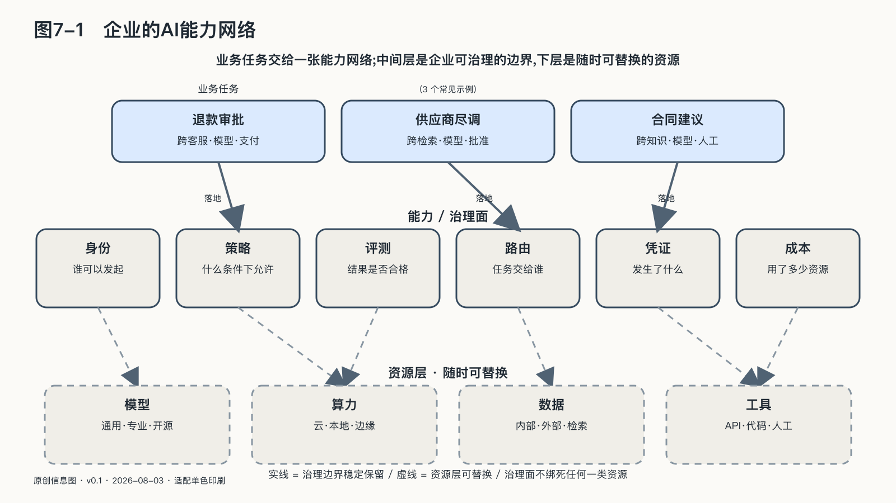

## 企业运行的是一张能力网络

“多模型”已经不足以描述企业正在建设的系统。一项真实任务可能同时用到本地小模型、云端大模型、搜索服务、知识库、传统API、代码沙箱、浏览器、外部专业Agent和拥有批准权的人。它们都能完成某种工作，却不是同一种资源。

模型负责理解和生成，数据库保存事实，确定性程序计算金额，搜索服务连接公开世界，Agent围绕目标连续选择步骤，人则承担授权、例外判断和责任。它们共同组成的是一张**能力网络**。

网络中的每个节点，都至少有六种差异。

第一是输入输出。模型接收Token，工具可能要求严格字段，人工审批需要能够理解的证据。

第二是运营者。能力可能由企业自己、云厂商、开源社区、合作伙伴或个人提供。

第三是数据条件。某些服务会保留输入，某些允许关闭训练使用，某些只能在特定地域处理。

第四是身份机制。一个API Key可能代表整个应用，一个用户令牌代表具体人员，一个工作负载身份则代表正在运行的程序。

第五是副作用。搜索通常只读，支付、发布、删除和部署会改变现实。

第六是可靠性。一个节点可能速度快但偶尔失败，另一个速度慢却能够解释和申诉。

企业不能因为两个节点都“可以调用”，就认为它们可以互换。一个能够总结合同的模型，不一定有资格读取原始合同；一个能查询公开工商资料的Agent，不应自动获得内部付款记录；一个声称支持安全审计的供应商，也不等于企业已经取得足以还原行动的证据。

能力网络的价值，是让不同资源在适合的位置协作。它的危险，是局部权限通过连接组合成企业从未明确授予的整体权力。

一名员工可能只有查看自己客户的权限，一个客服Agent只有创建退款申请的权限，一个支付工具只有执行已批准退款的能力。若系统没有把三者的身份与任务绑定，Agent便可能拿着员工的广泛登录状态，绕过“申请—批准—支付”的责任分离。每个组件单独看来都合规，组合路径却改变了权力结构。

企业治理需要覆盖模型和工具之间的数据流、身份流、授权流与结果流。只登记模型名称或工具清单，会漏掉风险实际传播的路径。

### 本地与云端的持续组合

能力网络也改变了“本地还是云端”这个问题。许多企业仍按项目作选择：敏感项目留在本地，创新项目使用公有模型。这种做法边界清楚，却很难处理同时需要内部事实和外部能力的任务。

以供应商尽调为例。原始合同、付款记录和采购人员意见可能不能离开企业；公开工商资料、法院公告与行业信息又天然位于外部世界；复杂比较可能需要更强模型；最终风险评级还要写回内部采购系统并由负责人批准。

把全部材料交给云端，数据边界过宽；全部留在本地，可能牺牲搜索、知识更新和复杂推理；让员工手工复制粘贴，又会丢失证据并制造新的泄露路径。

更合理的安排是按任务分工，而不是给整个项目贴一个部署标签：本地程序读取原始材料，提取经过批准的结构化事实；外部能力只收到完成公开研究所需的最小信息；结果回到企业以后，由本地系统交叉验证，再进入人工批准和写回。

本地模型也会犯错，企业环境也可能被攻陷；云服务可能拥有更成熟的安全团队，本地部署则提供更直接的控制。选择部署方式时，应逐项检查数据去了哪里、能力获得什么权限，以及哪些步骤可以验证和停止。

企业要管理的由此不再是一次静态部署选择，而是每项任务怎样穿过不同环境。物理位置也不是唯一边界。分布式云已经可以把云厂商管理的软硬件栈放进客户数据中心或隔离环境；可信执行环境则尝试在并不完全信任基础设施运营者时，用硬件隔离、内存加密和远程证明保护正在计算的数据。远程证明可以理解为：密钥发放前，数据拥有者先用密码学证据检查“这次任务是否真的运行在批准的环境里”。[^p6-confidential-hybrid]

这些技术可以把算力所有权与智能控制权分开。一家企业即使不拥有全部GPU，也可能保留密钥、数据用途、任务路由和停止权；模型提供者把权重部署到客户现场，也可能不向客户管理员暴露模型知识产权。公有与私有可以在同一项任务中组成不同的信任区域。

但机密计算不是魔法罩。它依赖处理器、固件、证明服务、密钥策略和正确配置，不自动保证系统可用，也不能消除模型错误、授权过宽和输出泄密。远程证明能够证明观测到的软硬件状态符合某项信任策略，不能证明代码逻辑正确、模型输出可靠，更不能证明硬件供应链没有缺陷。真正的主权问题仍然是：谁定义被信任的环境，谁持有密钥，证明失败时是否停止，供应商退出后能否迁移。把服务器搬到本地却把这些权力全部留给外部运营者，只是改变了机器的位置。

### 反馈也不能只替供应商学习

数据留在企业边界内，不等于企业已经拥有可用的学习资产。

客服记录、设备日志、合同、会议和代码仓库每天都在增长，但原始记录很少天然适合训练或评测。它们可能没有清楚的任务边界，同一个字段在两个部门含义不同，成功案例比失败案例更容易留下，员工的临时补救也可能从未写回系统。直接用这些材料训练模型，会把组织里尚未解决的歧义一并放大。

高价值数据往往产生在工作完成以后。一名工程师改正了模型引用的设备编号，一位顾问删除了不应写进客户邮件的推断，一个投诉揭示某类用户总被错误分类，一次事故说明备用流程并没有真正接管。这些人工纠正、失败样本、业务结果和申诉记录，才说明模型输出与现实之间差了什么。

如果反馈只回到外部供应商，企业可能帮助公共模型变得更好，却没有形成自己的评测集、业务规则和改进记录。下一次更换模型，同样的错误又要从头发现。反过来，如果企业把所有对话永久保存并默认用于训练，又会把最敏感的客户经历、员工行为和商业秘密变成新的集中风险。

反馈进入学习闭环以前，至少要经过四道处理。

先确认**用途和权利**：当初为履行合同、提供医疗或处理员工事务收集的数据，是否可以再次用于训练；谁有权批准，何时应删除或脱敏。再确认**来源和含义**：资料从哪个系统、哪个时间和哪个版本产生，字段在当时表示什么，人工修改是否留下原因。然后确认**质量和代表性**：方便收集的案例是否压过困难案例，沉默的用户和放弃申诉的人是否从数据中消失。最后决定**以什么形式沉淀**：有些反馈适合成为评测题，有些应变成确定性业务规则，有些只需修正知识库，只有经过审查的一部分才适合训练或微调。

“Datasheets for Datasets”提出用结构化文档记录数据的动机、组成、收集过程、建议用途和限制；对高影响AI项目从业者的研究则发现，被忽视的数据工作会形成层层传递的“数据级联”，直到系统后期才以性能、偏差和维护问题暴露。[^p6-data-work] 两项研究都没有提供一键式数据治理方案，却揭示了同一个事实：模型工程容易被看见，数据的来路、含义和责任更容易被当成杂务。

企业需要的是能够连接任务、依据、行动与结果的可信反馈。它应当可以随企业迁移，在不同模型上重复使用，也应当受到比普通日志更清楚的目的和访问限制。

David Silver和Richard Sutton把人工智能下一阶段概括为“经验时代”：系统减少对既有书面答案的单纯模仿，更多地从持续行动、观察和反馈中学习。[^p6-era-experience] 对企业而言，这种经验是一项任务在数周或数月里留下的完整链条：系统依据什么作出判断，采取了什么行动，客户和员工怎样回应，真实结果是否出现，后来又由谁纠正。

模型可以被替换，通用知识可以扩散，组织在具体制度、客户关系和物理流程中形成的反馈却不容易从互联网上获得。能否保有并治理这些运行经验，会成为企业差异的一部分。AgenticOps除了监控工具调用，还要规定什么算作观察，什么可以成为奖励，谁有权纠正记录，何时必须停止学习并回到人工判断。

经验也不会自动产生真理。如果销售额被当成唯一奖励，系统可能学会透支客户信任；如果只记录完成交易的人，沉默退出者的损失便不会进入反馈；如果一次行动不可逆，等结果出来再学习已经太晚。运行期学习扩大了组织适应世界的能力，也把价值选择、测量偏差和停止权带进了技术系统。

当每一次纠正都能让评测更接近真实工作，让规则更清楚，让下一个版本少犯一次同类错误，企业才形成了自己的学习闭环。否则，系统虽然每天处理企业的数据，积累能力的主体却未必是企业。

### 主权控制面的七类关系

前面的六个断点共同要求一种分离：模型、算力和工具可以变化，企业自己的任务规则、身份边界、评测、证据和结果账不能随之消失。

承担这种分离工作的，可以称为主权控制面。它不是另一款大模型，也不必由一个封闭平台包办全部功能。它是一组能够互操作的控制机制：管理资产与版本，按任务选择能力，限制身份与权限，观察完整调用链，把更新送入评测和灰度发布，发生事故时暂停、降级、回滚并保留证据。AgenticOps是这套控制面持续运行的方法；第九章还会讨论，为什么它只有保持开放接缝，才不会自己变成新的锁定。

“控制面”这个词来自复杂基础设施。飞机的发动机提供推力，空中交通管制不替发动机燃烧燃料，却决定不同飞机怎样共享空域、何时改变路线、出现冲突时谁必须让行。云计算中的控制面也不直接处理每一笔业务数据，而是配置资源、身份、策略和状态。

AI控制面具有相似作用，还要管理会解释语言、选择工具并代表不同主体行动的概率系统，而非只有确定性设备。

控制面维护的是几种持续变化的关系。模型与任务不会永久绑定。今天适合合同分析的模型，明天可能因价格、许可、性能或地区可用性改变而失去优势；同一个模型也不应自动获得所有任务。控制面保存任务需要的质量、时延、数据和权限条件，再让不同能力接受这些条件，避免业务流程迁就某一家模型的接口。

数据与计算之间也不是只能整体搬运。原始合同可以留在企业，受批准的字段进入外部检索；设备数据可以在边缘完成异常检测，只把统计结果送往云端；高度敏感任务可以使用本地模型，公开研究则调用外部服务。控制面要保存这条分工的目的、位置和版本，使数据边界不会在多次调用中逐步蒸发。

身份与行动之间更不能靠一个长期账号粘在一起。员工有权查看客户，不等于Agent可以继承员工的一切权力；主Agent能够创建退款申请，也不等于下游模型可以支付。控制面把“谁代表谁、为哪项任务、在多长时间内、能对哪个对象做什么”变成短期而可撤销的关系。

运行记录与责任结论同样需要分开。日志可以显示某个工具返回成功，不能单独证明客户已收到退款；评测可以显示平均完成率提高，不能证明某类错误没有集中伤害特定人群。控制面负责收集和关联证据，业务、法律和受影响的人仍要决定证据意味着什么。

模型网关、资产仓库、Agent编排器和安全审计工具各自解决局部问题，任何一个都不能单独替代控制面。底层供给变化时，任务含义要保持稳定；组件增加时，授权不能无声膨胀；系统更新后，过去证据仍要可读；需要离开时，业务知识也不能只剩原平台能够解释。

控制面也不要求一个中央平台掌握一切。身份可以由企业现有系统提供，模型由多个服务商和本地环境运行，评测由独立工具完成，日志进入组织自己的观测系统。各部分需要共同标识、可读接口和贯穿任务的策略，但不必由同一家公司出售。

这条边界决定了控制面是否真的创造主权。如果它只能管理自家模型，日志无法导出，策略依赖专有格式，替换控制面比替换模型更困难，那么它只是把锁定上移了一层。合格的控制面必须把自己的退出也纳入设计：策略、任务状态、评测、资产血缘和执行证据能够被另一种实现读取，并通过真实迁移证明。

主权控制面是一层用于吸收外部变化、保存主体意图并维持责任连续性的基础设施，不等于在界面上增加更多按钮。模型越多、Agent越能行动、供应关系越频繁变化，这一层越不能只靠员工记忆和采购合同临时拼接。

控制面的需求不以某一家模型长期领先为前提。模型能力换位越快，开放权重和蒸馏带来的选项越多，企业越需要在不同供给之间保持任务稳定。更便宜的小模型让更多流程值得自动化，更强的大模型让机器取得更深的行动权，两条趋势都会增加身份、评测、证据和切换的工作。

模型逐渐商品化，不会让这一类基础设施自动消失。数据库普及多年，数据治理至今仍是独立学科；云资源早已可以按需购买，身份、调度和可观测性反而长成了独立系统。AI也可能遵循同一规律：能力供给越丰富，组织越不能把自己的控制结构埋在某一次采购里。主权控制面长期维持的是任务、资产与责任的连续性，而不是某个榜单冠军的生命周期。
