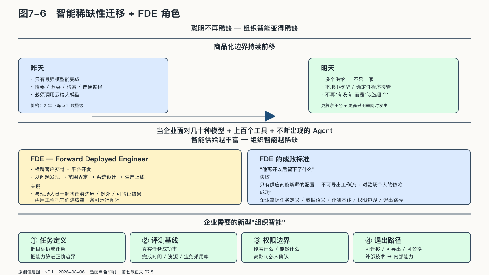
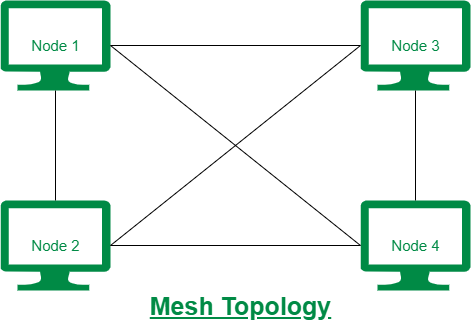

## 当“聪明”不再是唯一稀缺品

说智能正在变便宜，不等于说智能已经不再稀缺。

前沿模型仍在科学推理、复杂软件工程和长链任务上争夺能力上限，不同语言、行业和人群得到的服务也远不均等。正在发生的变化，是商品化的边界持续向前移动：昨天只有最强模型能完成的摘要、分类、检索和普通编程，今天可能已有多个供给；昨天必须调用云端大模型的步骤，明天可能由本地小模型或确定性程序接管。

第一章已经看到两组同时存在的证据。达到特定能力门槛的公开推理价格曾在不到两年里下降两个数量级以上；头部模型在部分榜单上逐渐聚拢，开放权重与封闭前沿的差距却也可能重新扩大。[^p1-inference-cost][^p2-moving-frontier] 变化发生在企业提问的内容上：任务的难点正在从“有没有模型能做”，移向“该选哪个、怎样验证、出了问题如何切换”。

二〇二六年七月三十一日，DeepSeek更新V4-Flash API，提供了一个很新的截面。官方说明，V4-Flash-0731沿用预览版二千八百四十亿总参数、每Token激活一百三十亿参数的架构，只重新进行了后训练。到八月七日，官方API仍按每百万Token零点一四美元的未命中输入、零点零零二八美元的缓存命中输入和零点二八美元的输出计价；同一价格页也预告，整体价格近期可能显著上调。[^p6-deepseek-pareto-2026]

Artificial Analysis在当天可见的v4.1.1指数中，用九项推理、知识、科学、编程与Agent评测给这个版本打出五十二分。该机构为整套指数评测生成约二点一亿输出Token，按当时价格计算总费用约七十二美元。它在“智能指数—单任务成本”图上把最优边界称为**帕累托线**：若一个模型在同一测量中既更贵、得分又更低，就在这两个维度上被另一模型支配。中文开发者把这种边界叫作“斩杀线”，形象，但也容易说过头。

这条线只能说明特定日期、特定价格和特定评测下的成本—能力位置，不能宣布右下方模型已经“商业死亡”。指数五十二不是百分之五十二的生产成功率；低价缓存也不是自动获得百分之九十八命中率——官方数字只是“命中后的输入价格比未命中低百分之九十八”，实际命中取决于上下文前缀能否复用。DeepSeek公布的Terminal-Bench 2.1成绩还使用了尚待发布的自家最简harness与指定推理参数，属于厂商条件下的结果，不能直接替代企业自己的任务评测。[^p6-deepseek-pareto-2026]

采用信号同样需要边界。OpenRouter在七月十三日披露，DeepSeek模型占该平台作者Token份额的百分之十六点七，V4-Flash和V4-Pro分别位列模型用量第三和第六。这说明低价开放权重模型确实吸引了平台内开发者，却早于0731更新，也不能代表全球企业采购、收入或关键生产负载。[^p6-deepseek-pareto-2026]

这条边界改变的，是企业提问的顺序：一项普通任务若已有足够好且便宜得多的供给，继续为最高综合分支付溢价就需要给出任务证据；但把生产系统押在一时最低价格上，同样不是主权。价格、harness、版本和服务条款都会移动，企业仍要保有评测、路由、迁移与替换能力。

成本下降通常会把过去不值得自动化的任务带进系统。一次设备记录不再每天汇总，而是每分钟检查；一个小额客服请求也可能经过分类、检索、判断和回访；原来只在重大项目上使用的研究能力，开始进入普通岗位。

现实已经出现这种相反力量同时增长的局面。国际能源署二〇二六年的测算认为，近年来单项AI任务的能耗至少以每年一个数量级下降；与此同时，推理、视频和Agent任务的单次能耗可能是简单文本生成的数百至数千倍，面向AI的数据中心用电在二〇二五年增长了约百分之五十。[^p6-ai-demand] 这不能直接证明“杰文斯悖论”已经支配AI，也不能从用电量反推出生产率，却说明效率提升会和更复杂的任务、更高的采用率一起发生。总需求是否增长，仍取决于任务价值、组织吸收能力、能源约束和治理成本。但只要调用次数和行动范围扩大，错误、权限、评测与责任就会随之放大。

稀缺性正在转移。模型解决一个点上的“会不会”，组织还要解决一条链上的“谁来做、在哪里做、能看见什么、怎样验收、失败如何收回”。只有一个模型可选时，决定反而简单；面对几十种模型、上百个工具和不断出现的Agent，企业缺少的往往是把这些供给排成一套可靠生产系统的能力。

这也是FDE在这个时点走红的原因。FDE是Forward Deployed Engineer的缩写，通常译作“前线部署工程师”。这个名称并不新，Palantir长期用前线部署工程接近客户的真实问题，再把现场反馈送回核心工程团队。截至二〇二六年八月，OpenAI也已把FDE定义为横跨客户交付与平台开发的角色，工作从问题发现、技术范围界定、系统设计一直延伸到生产上线，成功与否要看实际采用、工作流影响和评测反馈，不是演示时那一次流畅回答。[^p6-fde]

大模型让做出原型变得很快，却没有让客户系统里的历史数据、例外规则、权限关系和责任冲突随之消失。传统信息化项目往往假定客户能够先把需求写清楚；AI项目里，业务团队常常只知道自己想缩短客诉、减少返工或加快报价，却不知道哪一步适合模型，哪一步必须由确定性程序和人守住。FDE的核心工作是与现场人员一起找出任务边界、例外和可验证结果，再用工程把它们连成第一条可运行的闭环；在客户办公室里多写几段代码，只是这个过程的附带动作。

但FDE也可能只是一块昂贵的人工补丁。如果每个客户都要永久依赖少数高手驻场，才能让系统继续运转，那么交付并没有变成可复制的产品，客户也没有形成自己的能力。这种模式能否持续，要看现场经验能否沉淀为通用组件、评测集、流程模板和业务规则，也要看客户团队最后能否自己运行、修改和更换其中的模型与工具。Palantir把这种现场反馈比作人类版的反向传播，OpenAI的职位说明也要求把有效做法固化成工具、手册和可复用组件。[^p6-fde]

判断FDE做得好不好，不妨等他离开以后再看。只有供应商能解释的配置、无法导出的工作流，以及对某位驻场高手的长期依赖，只是把锁定包装成服务。任务定义、数据语义、评测基线、权限边界、运行证据和退出路径如果能留在企业手里，这次外部交付才开始变成内部能力。

来源：原创信息图 · 适配单色印刷 · 数据来源：第七章正文 07.5

来源：网络公开图 · 维基百科 CC（教学示意图风格）· 出版前由编辑逐一核验版权

<!-- 图稿需求：图7-6；详见 90_出版工作台/02_图稿清单.md -->

这里的“组织智能”指把目标拆成任务，把不同能力放进正确边界，把结果送回现实，并让成本、证据和责任能够对上。到了企业层，这些方法还要接上采购、生产、成本、客户结果和长期资产，才能超出局部的技术控制。
