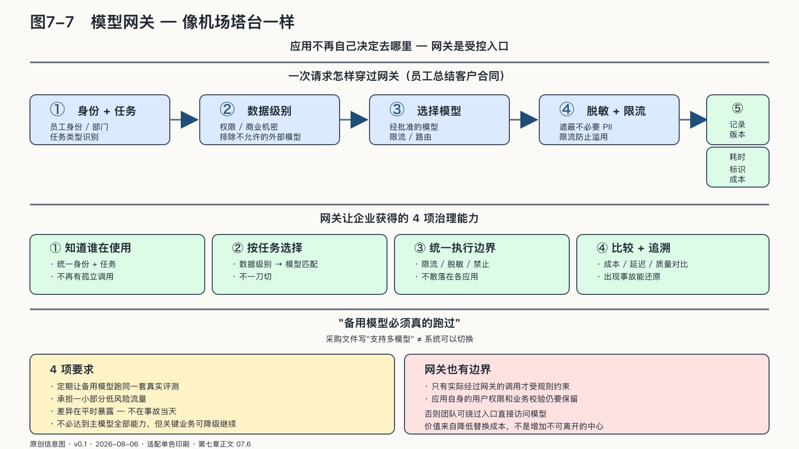

## 模型网关：把选择留在应用之外

企业早期的AI应用常常直接连接一个模型。开发很快，依赖也在第一天被写进系统。

随着应用增加，不同团队各自保存密钥、选择模型、记录日志。供应商更新接口时，许多应用同时修改；成本突然上升时，企业甚至不知道哪些业务在调用；某个模型不适合敏感数据，也缺少统一位置进行拦截。

模型网关可以把这种直接连接变成一个受控入口。它的本质不是又一件基础设施，而是把“用哪个模型”的决定从应用代码里拿出来，放回企业手里——决定在哪一层做出，选择权就留在哪一层。

应用不再自己决定去哪里，而是把请求交给网关。网关识别调用者和任务类型，检查数据级别，选择允许的模型，执行限流与脱敏，记录版本、成本和延迟，再把结果送回应用。

网关不替模型完成任务，它负责确认谁可以调用、请求应去往哪个模型，以及何时切换备用路径；发生事故时，也要能还原调用者、路由规则和实际使用的模型版本。

### 一次请求怎样穿过网关

一名员工请求AI总结一份客户合同。

请求首先携带员工身份、所在部门和任务信息进入网关。网关检查他是否有权读取这份合同，识别其中包含商业机密，并根据企业规则排除不允许处理此类资料的外部模型。随后，它可以遮蔽不必要的个人信息，把内容发送给经过批准的模型。

模型返回结果后，网关记录使用的版本、主要配置、输入资料标识和耗时。系统还会检查输出是否包含不应泄露的信息，最后才把摘要交给员工。

这个过程没有让模型更聪明，却让企业获得几项关键能力：知道谁在使用，按任务选择，统一执行边界，比较不同模型，出现问题时追溯。

网关也不该成为新的黑箱。路由规则、日志格式和应用接口需要尽量清楚，避免企业只是把对模型的依赖换成对网关产品的依赖。它的价值来自降低替换成本，而不是增加一个无法离开的中心。

来源：原创信息图 · 适配单色印刷 · 数据来源：第七章正文 07.6

来源：网络公开图 · 维基百科 CC（数据中心示意图风格）· 出版前由编辑逐一核验版权

<!-- 图稿需求：图7-7；详见 90_出版工作台/02_图稿清单.md -->

研究已经表明，按请求难度在大小模型之间路由并非纯粹构想。一项混合模型实验在特定数据集上减少了最多约百分之四十的大模型调用而没有降低总体质量；后续研究则发现，能否获得成本—质量收益，关键取决于质量估计是否可靠，路由并不存在脱离任务的普遍最优解。[^p6-model-routing] 因此，模型网关不应按品牌或价格机械分流，而要用企业自己的评测数据持续校准：哪些请求适合小模型，哪些必须升级，哪些根本不该交给生成模型。

网关也有边界。只有实际经过网关的调用才受这些规则约束，应用自身的用户权限和业务校验仍要保留。否则，团队可以绕过入口直接访问模型，或者让通过身份检查的请求执行不符合业务规则的动作。

### 备用模型必须真的跑过

采购文件里写着“支持多模型”，并不等于系统真的可以切换。

不同模型对提示格式、工具调用、上下文长度和安全策略的处理不同。主模型生成的输出结构，备用模型未必稳定遵守；某些工作流依赖供应商特有功能，一旦切换就会断裂。

企业需要定期让备用模型跑同一套真实评测，甚至承担一小部分低风险流量。这样，差异会在平时暴露，而不是在事故当天首次出现。

替代方案不必达到主模型的全部能力。它需要保证关键业务可以降级继续：回答变慢一些，人工参与增加一些，非核心功能暂时关闭，但公司不会失去服务客户的基本能力。
