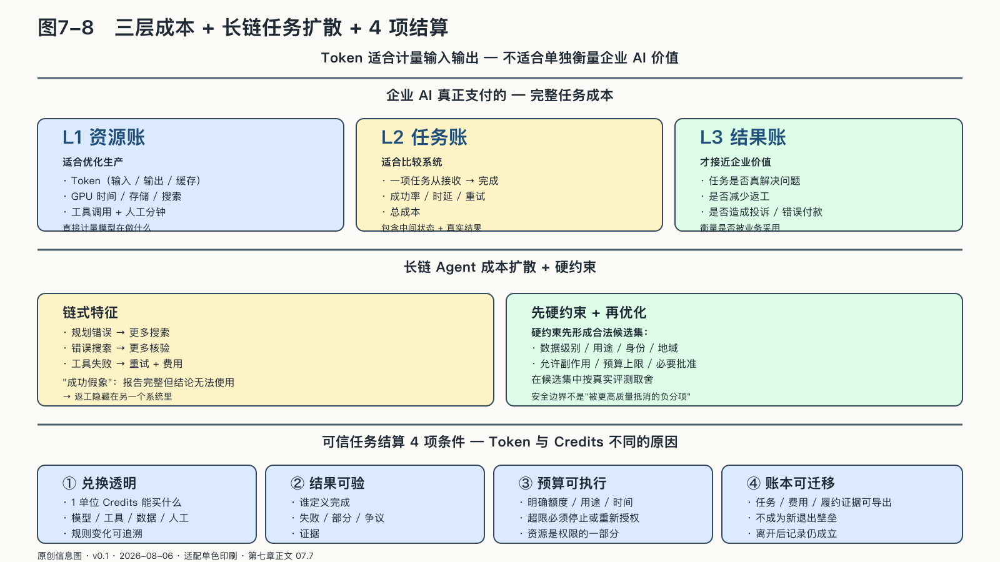

## 从Token成本到任务经济学

一项客服任务可能只生成三百个Token，却调用五次知识检索、两次订单查询和一次支付接口，还需要人工复核。另一项研究任务生成上万Token，却完全停留在草稿中。哪一项更贵、哪一项更有价值，Token价格都回答不了。

Token适合计量模型输入输出，却不适合单独衡量企业AI的经济价值。只比较Token价格，会把前者的行动风险和后者的知识价值一起遮住。

企业实际支付的是完整任务成本，其中至少包括模型推理、检索与存储、工具和外部服务、网络等待、失败重试、人工审批、日志与安全控制，以及错误发生后的返工和补救。

二〇二六年的模型服务让这笔账更容易被误算。一次调用可能同时产生输入Token、缓存命中Token、输出Token和额外的推理Token；如果Agent继续读取文件、调用工具、等待结果并重试，屏幕上看到的最终答案只是成本链的末端。MoE的激活参数、长上下文的KV Cache、量化格式和模型路由还会改变显存、等待时间与服务价格。除了比较每百万Token价格，企业还要记录一次通过验证的任务用了多少上下文、思考、工具调用、人工分钟和返工。[^p6-model-runtime-2026]

有时，最便宜的模型会产生更高总成本。它需要更长提示，调用更多次，工具参数错误更多，人工修改幅度更大。也有时，强模型处理简单分类反而浪费；一个小模型或普通规则程序已经足够稳定。

企业需要从三个层面核算成本。

**资源账**记录Token、GPU时间、存储、搜索、工具调用和人工分钟分别消耗多少，适合优化生产。**任务账**跟踪一项任务从接收到完成的成功率、时延、重试和总成本，适合比较系统。**结果账**追问任务是否解决了问题，是否减少返工，是否造成投诉、错误付款或机会损失，这才接近企业价值。

### 长链任务的成本会怎样扩散

Agent的成本会沿任务链扩散。一个规划错误增加后续搜索，错误的搜索结果引发更多核验，工具失败触发重试，重试又产生新的Token和外部费用。系统最后可能完成任务，过程却远比人工方案昂贵。

长链还会出现“成功假象”。Agent返回一份格式完整的报告，技术指标把任务记为完成，业务人员却发现引用错误、结论无法使用，只能重新开始。如果评测只看是否到达终止状态，返工会被隐藏在另一个系统里。

任务核算需要同时记录中间状态与真实结果：系统走了多少步，调用多少能力，在哪里等待，人工改了多少，最终产物是否被采用，错误是否进入现实。

成本优化的顺序也要跟着调整。企业通常应先减少没有价值的步骤，避免把完整资料反复送入上下文，选择合适大小的模型，让确定性工具承担精确计算，在明显无解时提前停止，并避免一次失败产生重复副作用。每百万Token便宜几分钱，影响可能排在这些因素之后；错误生成得再便宜，返工跑得再快，也不会变成生产率。

### 先满足边界，再优化质量与成本

能力网络需要路由。一个任务节点可能有多个模型、Agent或工具可以完成，系统希望在质量、价格、速度和可靠性之间选择。

这些指标不能与安全和授权放进同一个加权平均分。

如果某个模型质量更高，却不允许处理当前数据；某个外部Agent速度更快，却没有获得写入权限；某条路径成本更低，却会让敏感资料越过约定地域，那么它们不应因为综合得分优秀而被选择。

合理顺序是：先用硬约束形成合法候选集，再在候选集中优化。

硬约束包括数据级别、用途、身份、地域、允许副作用、预算上限和必须经过的批准。只有满足这些条件的能力才进入比较。随后，路由器再根据真实评测，在质量、成本、时延和可靠性之间取舍。

“智能路由”容易把这个朴素区别遮住。机器学习路由器可以预测哪个模型更适合当前任务，却没有修改企业政策的权力。它可以建议经过脱敏后使用云端能力，不能自行宣布机密资料已经变成公开；可以在已批准的备用模型间切换，不能为了完成率临时接入未经评估的服务。更高的质量分数也不能抵消一条已经越过的安全边界。

### 降级不能变成绕过

系统故障时，人们自然希望自动寻找替代路径。降级的陷阱也在这里：主路径被政策拒绝以后，Agent把任务交给权限更宽、记录更少的旧接口；本地模型容量不足，系统静默把原始资料送往公有模型；正式支付工具失败，流程退回一个没有额度控制的人工账号。业务看似恢复，原有边界却在“应急”名义下消失了。

有效的降级路径要提前批准，并且保留原来的数据、用途和权限条件。可以降低质量、速度和自动化程度，不能静默降低安全边界。

如果没有合法替代，系统就应该暂停、转人工或只完成任务的一部分。明确报告无法继续，也是一项安全能力；为了维持高完成率而绕过限制，只会把失败藏起来。

这条原则同样适用于预算。任务接近成本上限时，Agent可以请求追加资源、缩小目标或交付部分结果，不能自行无限循环。时间、资金和工具次数都是权限的一部分。

从Token成本走向任务经济学，企业才会看见AI的完整生产函数：不仅看模型生产了多少内容，还看整个系统怎样使用资源、承担风险并形成可验证结果。

### Token与Credits为什么不能是一回事

当平台开始用Credits计价，最容易发生的误会，是把它理解成一种更高级的Token。

如果一百Credits只是兑换固定数量的模型调用，它仍是一张充值卡。Token降价，Credits的真实购买力也跟着变化；平台只是在资源账外面换了一层包装。只有当Credits能够购买模型推理、Agent执行、行业数据、工具、人工复核和责任保障，并且交付结果可以核验时，它才可能从资源代金券走向服务结算单位。

两者记录的是不同事情。Token大致反映模型处理了多少符号，不能直接说明任务有没有完成。Credits可以表达一项服务能兑换什么，却不能靠改名创造价值。一个尽调Agent消耗很少Token，却购买了昂贵数据库并由专家签字；另一个Agent生成很长报告，却因事实错误被全部弃用。前者的价值不在字数，后者的低成本也没有形成产出。

可信的任务结算至少需要四个条件。

- **兑换透明**：一单位Credits能购买什么，模型、工具、数据和人工费用怎样组成，规则变化能否追溯。
- **结果可验**：谁定义完成，采用什么证据，失败、部分交付和争议怎样处理。
- **预算可执行**：Agent只能在明确额度、用途和时间内采购能力，超限必须停止或重新授权。
- **账本可迁移**：任务记录、费用明细和履约证据能够导出，平台积分不能成为又一道退出壁垒。

任务交易涉及四种权力：谁调度任务，谁决定数据可见范围，谁判断任务完成，谁制定结算与分配规则。调度需要选择和组合，评价需要审计，结算记录需要迁移，规则改变还要允许替换与演进。

未来Agent也许会在授权范围内带着预算寻找外部能力。二〇二五年发布的Agent Payments Protocol已经尝试用签名的购买授权、支付授权和收据，把人的意图、Agent生成的订单和最后付款连接起来；在无人实时确认的模式下，用户先签署包含额度、对象和有效期等约束的开放授权，Agent只能据此生成具体交易。协议还明确要求关键验证由确定性代码完成。国际货币基金组织据此把Agent支付分成意图与编排、控制与授权、确定性结算三层：概率模型可以寻找方案，不能自行改变授权与最终结算规则。[^p6-agent-payments]

这证明机器预算正在从概念进入标准化试验，也揭示了Credits的边界。余额只回答“还能花多少”，授权凭证回答“可以为谁、在什么条件下花”，履约证据回答“买到了什么”，责任规则才回答“失败由谁承担”。而现有协议仍把Agent间转委托、争议材料的保存与调取等问题留在范围之外。在身份、评测、责任和争议解决成熟之前，“Agent之间自动交易”仍是一项工程与制度假说，不是已经到来的经济秩序。A2A等协议可以帮助不同Agent交换任务和状态，却不会替企业判断一项工作值多少钱，更不会替任何人承担损失。

Token向下成为生产要素，Credits向上承载服务价值，可以作为一种待检验的产业假说。判断它是否成立，要看客户能否用同一套证据回答：钱花在了哪里，任务是否完成，谁应当负责，以及离开这个平台以后记录是否仍然成立。平台发行积分本身不能证明这一点。

来源：原创信息图 · 适配单色印刷 · 数据来源：第七章正文 07.7

来源：网络公开图 · Unsplash License（CC0 风格）· 出版前由编辑逐一核验版权

<!-- 图稿需求：图7-8；详见 90_出版工作台/02_图稿清单.md -->

资源账、任务账和结果账只有在同一项真实任务里同时核对，才会暴露成本、价值与控制之间的错位。一次七天演练，已经足以让这些错位显形。
