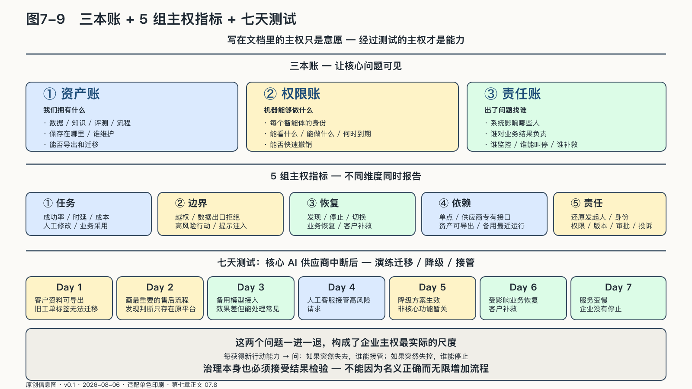

## 七天测试：让三本账对上现实

企业AI越多，治理越容易变成一堆没人阅读的制度。三本简单的账可以让核心问题保持可见。

第一本是**资产账**：哪些数据、知识、评测和流程具有长期价值，保存在哪里，谁维护，能否导出和迁移。

第二本是**权限账**：每个智能体以什么身份运行，能看什么、能做什么，谁批准，何时到期，能否快速撤销。

第三本是**责任账**：系统影响哪些人，谁对业务结果负责，谁监控，谁能够叫停，事故怎样通知和补救。

三本账不取代技术平台。它们防止企业在平台越来越复杂之后，忘记最简单的问题：我们拥有什么，机器能够做什么，出了问题找谁。

账也必须定期对得上现实。资产账写着可以导出，就真的导出一次；权限账写着项目结束收回，就检查过期账号；责任账写着某人能叫停，就做一次演练，看他是否拥有实际按钮和组织授权。

账上的内容要经过这些操作，才能证明它们不只是制度意愿。

来源：原创信息图 · 适配单色印刷 · 数据来源：第七章正文 07.8

来源：网络公开图 · Unsplash License（CC0 风格）· 出版前由编辑逐一核验版权

<!-- 图稿需求：图7-9；详见 90_出版工作台/02_图稿清单.md -->

### 中小企业不需要复制巨头

中小企业容易被两种想象困住：认为AI主权需要昂贵算力和庞大团队，与自己无关；或者认为购买“一站式平台”以后，复杂问题都可以交给供应商。这两种判断都会低估企业自己的责任。

中小企业没有必要建设大模型，却更需要避免单点依赖，因为它恢复一次中断的资源更少。它可以从几项低成本动作开始：

统一保存关键业务资料；让核心流程有文字说明；给智能体单独账号和最小权限；高影响行动保留人工确认；建立一小套真实评测；每季度做一次导出与切换；确认客户关系和业务知识不会因平台离开而消失。

技术上可以使用成熟云服务和托管工具，企业自己至少要保住客户关系、业务记忆和继续经营的办法。为此付出的导出、演练和权限维护成本，会在供应中断或系统失控时决定业务能否继续。

对任何规模的企业，账本最终都要接受停机演练。与此同时，企业还需要一组长期可比较的主权指标。

它们不应被压缩成一个总分。安全、质量、成本和替换能力之间存在真实冲突，一个漂亮分数会掩盖企业究竟在哪个维度承担风险。

第一组是**任务指标**：真实任务成功率、完成时间、总资源成本、人工修改幅度和业务采用率。它防止团队把模型回答流畅当成任务完成。

第二组是**边界指标**：越权请求、数据出口拒绝、高风险行动确认、权限过期和提示注入测试结果。拒绝率突然下降不一定是改进，也可能意味着边界被绕过。

第三组是**恢复指标**：发现异常需要多久，停止行动需要多久，切换备用能力需要多久，受影响业务恢复和客户补救需要多久。系统是否会出错很难绝对预测，恢复时间却可以通过演练持续改善。

第四组是**依赖指标**：关键任务依赖多少单点，多少工作流使用供应商专有接口，哪些智能资产无法完整导出，备用路径最近一次运行在什么时候。它让锁定在危机之前变得可见。

第五组是**责任指标**：多少重要行动能够还原发起人、Agent身份、权限、版本与审批；警报是否有明确负责人；投诉能否关联到具体任务并进入评测。

这些指标要同时报告成功和失败。系统完成率很高，却频繁触发人工补救，不能只公布完成率；模型成本下降，却让切换难度和专有依赖上升，节省也要与未来成本一起展示；一个Agent很少被叫停，可能表现稳定，也可能是停止机制从未真正进入一线流程。

主权指标让不同版本、供应商和架构接受同一组检查，同时显示治理能力是否随着任务的数据范围和行动权一起增长。指标通过并不能证明企业已经绝对安全。

如果控制投入长期没有降低错误影响、缩短恢复、改善证据或增加替换能力，它就应该被简化或重做。治理本身也必须接受结果检验，不能因为名义正确而无限增加流程。

这条路有一种常见的走偏：把可治理做成层层审批。每个新用例过五道评审，每次模型更新等季度委员会，每个智能体的权限申请排队数周。结果是业务团队绕过治理直接调用外部服务——治理部门手里的清单越来越完整，真实运行的系统却越来越多地不在清单上。审批挡住了多少风险不容易看见，它拖慢了多少采用、逼出了多少影子系统，却看得见。好的控制面让合规路径成为最快的路径，而不是最慢的一条；治理一旦成为采用的反义词，它治理的就只剩自己的流程。

可以把这些指标放进一次说明性的制造企业演练：管理层假设核心AI供应商中断七天，在同一条时间线上测试迁移、降级与接管能力。这个场景是压力测试，并非某家企业事故的新闻复述。

第一天，团队发现客户资料可以导出，但旧工单中的标签无法直接迁移。第二天，业务人员把最重要的售后流程重新画出来，才意识到几个判断只存在原平台的设置中。第三天，备用模型接入，效果不如原系统，却能处理常见问题。第四天，人工客服接管高风险请求。到第七天，服务变慢了，企业却没有停止。

演练会暴露许多问题，也会让公司第一次看清这套系统。

演练之后，企业不必抛弃原供应商。合作反而可以变得更稳：企业通过模型网关管理调用，版本更新先经过自己的评测，重要流程设有行动门，备用模型承担少量日常流量，知识与工作流使用可迁移格式，权限变化由明确责任人批准。

“七天测试”不该只做一次。每当智能体获得新的行动能力，团队都要重新问：这项能力突然失去时谁能接管，突然失控时谁能停止。答案必须能在系统和组织里实际执行。

### 把智能变成企业自己的能力

演练之后，企业仍然可以继续使用原来的云、模型和供应商。不同的是，业务知识不再只埋在平台里，智能体的行动不再只靠信任，事故也不再只能等待外部解释。外部技术开始成为企业能够测试、限制、替换和恢复的内部能力。

到这里，企业这一级的问题有了着落：智能可以被治理，前提是任务、身份、证据和三本账留在企业手里。但企业并不悬空存在。它调用的算力来自某个园区和电网，使用的模型来自某个平台和社区，遵守的规则来自某个司法辖区，依赖的供应链穿过多个国家。治理能力再强的企业，也无法独自回答这些比它更大的资源由谁组织、为谁沉淀、在谁的规则下运行。这是下一章要回答的问题。
