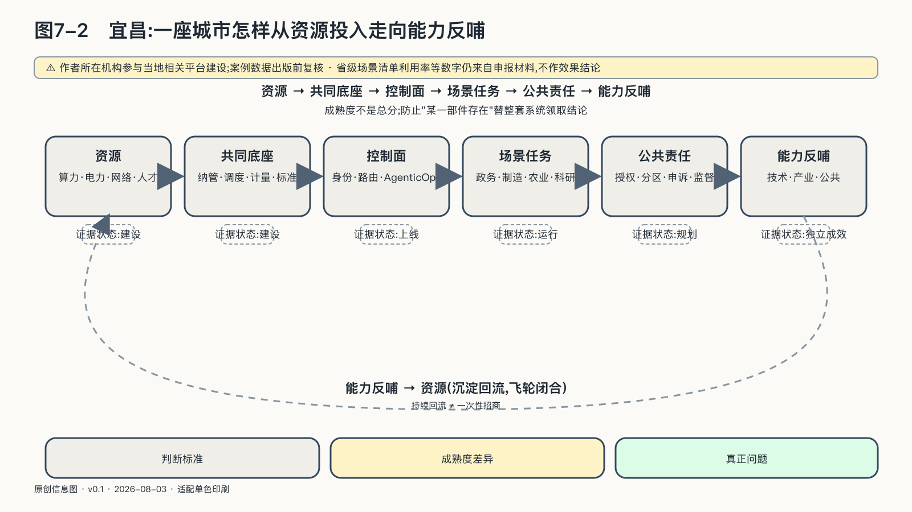
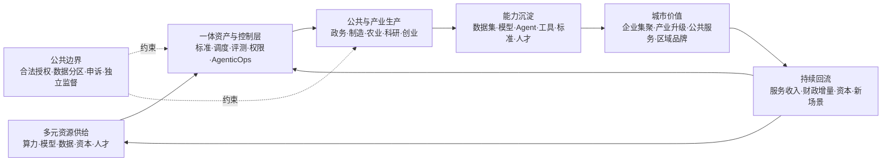

## 宜昌：一座城市怎样从资源投入走向能力反哺

芯片、模型和国际关系是国家层面的议题，AI设施和应用却总要落在具体城市。机房接入当地电网，大学和企业培养人才，公共服务由具体部门执行，产业问题也发生在工厂、港口、医院和街道。

城市没有国家完整的立法与国际谈判权，也不能像企业一样只服务一组股东和客户。它负责把国家规则、地方资源、公共责任与产业运营接到一起。

宜昌的相关建设仍在演进。作者所在机构参与了当地相关平台建设，因此项目方材料不能单独证明项目成功。可以独立确认的是：截至二〇二五年八月，宜昌市科技部门公布全市已建成智算规模超过三千P，点军区建设了算力供应链平台，并开始整合模型库、数据集和AI生态专区；二〇二六年五月，当地又启用以“数据、算力、场景、转化”为核心的OPC创新社区，面向独立开发者、小团队和数据企业。湖北省二〇二六年“数智+”场景清单还把三峡传神社区列为算力调度与生态运营能力，记录其“开源平台、产业联盟、基金会”的组织方式以及异构算力、模型与数据资产、智能体开发等组件。[^p6-yichang-runtime]

这些材料能够证明项目、资源和组织安排存在，不能单独证明算力已经高效利用、创业项目能够长期存活、公共价值超过成本，或者这一模式可以无条件复制到其他城市。省级场景清单中的利用率等数字仍来自申报材料，不是独立绩效审计，因而不用于证明项目效果。

城市AI项目最容易在这里被语言提前完成。一份规划写出资源规模，报道就把它写成“正在建设”；机房通电，宣传又把它写成“平台落地”；平台出现用户，便进一步推断产业已经形成。为了不让案例跑在证据前面，可以把成熟度拆成五种不同状态。

| 状态 | 能够证明什么 | 仍不能证明什么 |
|---|---|---|
| 规划 | 目标、预算、合作意向和拟建架构存在 | 合同已经执行，资源已经到位 |
| 建设 | 设备、软件、场地或组织正在形成 | 端到端任务已经可用 |
| 上线 | 用户可以访问，基本功能能够运行 | 关键流程稳定，控制长期有效 |
| 持续运行 | 一段时间内有任务、维护、故障处理和迭代 | 公共结果优于成本，利益分配公平 |
| 独立成效 | 第三方用清楚口径评估了利用、质量、成本与影响 | 结论能自动外推到另一座城市 |

同一项目可以在不同部分处于不同状态：数据中心已经运行，模型平台刚刚上线，产业孵化仍在规划，公共问责机制甚至尚未公开。成熟度必须按部件判断，不能用已经运行的数据中心替仍在规划的产业孵化证明成效。

持续运行只是第一步。城市投入还要留下本地团队、可复用资产和后续项目能力。

宜昌方案把几类算力、模型、数据工具和运营服务放进一套“多元一体”的城市AI生产结构。

“多元”指供给和参与者保持开放：全球主流GPU、CPU与其他异构芯片可以共同接入，开放权重与商业模型可以按任务选用，公有云、私有环境和边缘节点可以组合；政府、企业、高校、开发者、开源社区、产业联盟和资本承担不同角色。“一体”指这些资源采用相互兼容的资产标识、调度、评测、权限、计量、证据和反馈规则，不要求集中到一家供应商、一个模型或一个数据库。

本地部署只解决设备放在哪里。城市还要掌握异构资源接入、模型选择与替换、数据使用规则、资产版本、Agent发布与停止、运营计量和成果归属。否则每完成一个项目，数据、经验和下一轮改进能力仍会回到外部供应商手中。

这种结构可以分成四层。

第一层是**多元资源底座**。电力、网络、数据中心和异构算力经过纳管、调度与计量，成为大学、中小企业、公共机构和开发者能够按任务取得的生产资源。

第二层是**城市AI资产层**。数据集、模型、代码、Prompt、工具、评测集、Agent和行业知识都有版本、来源、许可和访问边界。这一层保存城市投入和真实生产留下的共同技术记忆，并用于后续任务，不能只做成供人浏览的目录。

第三层是**AgenticOps生产与控制层**。它把资产发现、构建、评测、发布、运行、反馈和再训练连成生命周期，同时管理身份、权限、路由、成本、审计和停止。这里的“一体化”主要发生在标准和生命周期上，不要求敏感数据离开企业与公共机构原有边界。

第四层是**公共与产业服务层**。企业在自己的边界内使用模型和Agent，科研团队复用算力与数据工具，开发者在沙箱中验证应用，城市开放真实场景，运营主体提供持续服务，产业资本把经过验证的团队和项目带入更大市场。

中国关于城市全域数字化转型的政策已经把“开放兼容的共性基础、算法与模型一体部署、数字产业集群、数据服务机构、场景开放和产城融合”放在同一结构中；后续行动计划又明确要求建立城市数据、场景和设施的立体化运营体系，并用动态反馈连接预算与评价。国家数据局推动的城市可信数据空间，则进一步把公共、企业与个人数据的融合应用、分建统管、跨域协同和数据产业生态放进长期运营机制。[^p6-city-flywheel]

欧盟AI Factories把超算、数据和人才放进同一个创新生态，连接大学、中小企业、产业与金融机构；新加坡国家AI战略把产业、政府与科研列为活动驱动者，把人才、能力与空间载体列为共同体系统，又把算力、数据和可信环境列为基础条件。制度形式虽然不同，评价问题相同：设备投资是否带来了持续使用、人才和本地技术资产。[^p6-city-flywheel]

城市投入形成能力，需要完成下面这组循环。

能力沉淀容易在项目验收中被忽视。一次农业Agent完成病虫害识别后，城市除了取得交付报告，还应在权利清楚的条件下留下可复用的评测方法、数据标准、工具组件和本地团队。制造项目优化工艺，也不要求企业把原始生产数据交给城市平台；经过授权的行业数据产品、算法能力、接口标准和实施经验可以进入下一轮协作，各主体仍保有自己的原始资产。

“反哺”至少要在三条路径上看到结果。技术上，前一批任务形成的模型、Agent和工具应降低下一批项目成本；产业上，平台应帮助本地企业获得产品、订单、人才和跨区域服务；公共层面，产业增长、运营收入和技术队伍应改善公共服务，并支持下一轮基础设施投入。若只有算力消耗增加，没有任何回流，这个城市仍是AI服务的消费地。

楼宇、招商、基金和收入是产业运营的载体和资金机制，不能直接当成主权成效。有运营主体不等于运营可持续，有基金不等于孵化成功，有企业入驻不等于形成产业集群，有平台收入也不等于公共投入获得合理回报。

城市运营主体在这套结构中非常关键，也最需要权力分离。政府提供政策、公共资源与场景，并规定公共边界；市场化运营主体负责服务、计量、生态和年度运营；企业保有自己的生产数据与成果；开源基金会或中立社区维护开放资产和共同规则；产业联盟协调需求与标准；资本承担项目筛选和扩大风险。任何一家机构同时掌握公共授权、全量数据、平台规则和项目收益，都会把“一体”滑向新的垄断。

城市AI项目至少需要五组运行指标：多元资源能否真实接入和切换；企业、科研和公共任务是否持续发生；多少数据集、模型、Agent和工具能够复用；本地团队、企业和产业收入是否增长；公共结果、运营收入和财政增量是否形成可解释的再投入。同时还要检查敏感数据是否留在适当边界，原供应商退出后资产和服务能否继续，受影响的人能否申诉。

宜昌目前只能提供一个观察现场，不能证明这套循环已经成功。后续要看多元技术是否形成稳定生产，运行是否留下可复用资产，这些资产是否带来本地企业、人才和公共回报。单独公布“建成多少P算力”回答不了这些问题。
